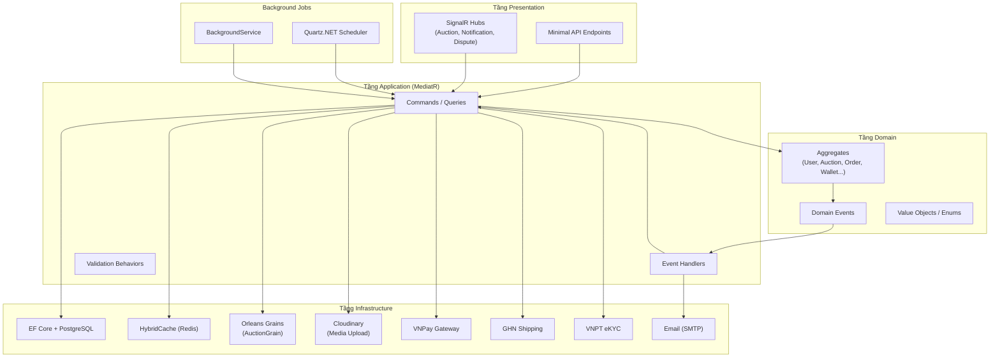

# OIO Auction Platform

Nền tảng đấu giá trực tuyến với hệ thống realtime bidding, thanh toán VNPay, quản lý kho vận GHN, và xác minh danh tính eKYC.

**Tổng hợp:** 151 tài liệu, 17 Postman collections, 464 requests.

---

## Kiến trúc tổng quan



---

## Cấu trúc dự án

```
src/
├── core/
│   ├── OIO.Domain/          # Domain model, aggregate, enum, value object
│   └── OIO.Application/     # Command/query, DTO, service, event handler
├── infrastructure/
│   └── OIO.Infrastructure/  # Persistence, provider, settings, integration
└── presentation/
    └── OIO.Api/             # HTTP API, SignalR hub, OpenAPI/Scalar
```

---

## Danh mục Flow nghiệp vụ

| # | Flow | Tài liệu | Postman | Requests | Mô tả |
|---|------|----------|---------|----------|-------|
| 01 | [Đăng ký & Xác thực](./docs/flows/01-registration-auth/README.md) | 11 | [Flow1](./postman/Flow1_Registration_Auth.postman_collection.json) | 24 | Đăng ký, xác thực email, đăng nhập, refresh token, 2FA TOTP, quản lý session |
| 02 | [Hồ sơ người dùng](./docs/flows/02-user-profile/README.md) | 5 | [Flow2](./postman/Flow2_User_Profile.postman_collection.json) | 17 | Cập nhật profile, xác thực SĐT, quản lý địa chỉ |
| 03 | [Xác minh người bán (eKYC)](./docs/flows/03-seller-verification/README.md) | 8 | [Flow3](./postman/Flow3_Seller_Verification.postman_collection.json) | 40 | eKYC VNPT, hồ sơ seller, admin duyệt, khiếu nại |
| 04 | [Upload media](./docs/flows/04-media-upload/README.md) | 6 | [Flow4](./postman/Flow4_Media_Upload.postman_collection.json) | 16 | Signed upload Cloudinary, xác nhận, relocation, cleanup |
| 05 | [Quản lý sản phẩm](./docs/flows/05-item-management/README.md) | 9 | [Flow5](./postman/Flow5_Item_Management.postman_collection.json) | 35 | CRUD item, gắn media, gửi duyệt, kiểm tra kho, Q&A |
| 06 | [Vòng đời đấu giá](./docs/flows/06-auction-lifecycle/README.md) | 13 | [Flow6](./postman/Flow6_Auction_Lifecycle.postman_collection.json) | 40 | Tạo, submit, timing, publish, kích hoạt, kết thúc, hủy, relist |
| 07 | [Đặt giá thầu](./docs/flows/07-bidding/README.md) | 9 | [Flow7](./postman/Flow7_Bidding.postman_collection.json) | 24 | Bid thủ công, auto-bid, sealed bid, runner-up, SignalR realtime |
| 08 | [Mua ngay](./docs/flows/08-buy-now/README.md) | 10 | [Flow8](./postman/Flow8_Buy_Now.postman_collection.json) | 22 | Đặt chỗ 15 phút, thanh toán VNPay, finalize, late payment |
| 09 | [Thanh toán & VNPay](./docs/flows/09-payment/README.md) | 10 | [Flow9](./postman/Flow09_Payment_VNPay.postman_collection.json) | 30 | 4 mục đích thanh toán, 3 token flow, IPN/Return, refund, reconciliation |
| 10 | [Vòng đời đơn hàng](./docs/flows/10-order-lifecycle/README.md) | 11 | [Flow10](./postman/Flow10_Order_Lifecycle.postman_collection.json) | 32 | Tự tạo từ auction, checkout (VNPay/wallet/hybrid), giao hàng, trả hàng, escrow |
| 11 | [Kho vận & Giao hàng](./docs/flows/11-warehouse-shipping/README.md) | 10 | [Flow11](./postman/Flow11_Warehouse_Shipping.postman_collection.json) | 34 | Nhập kho, kiểm tra, lưu kho, xuất kho, GHN webhook tracking |
| 12 | [Tranh chấp & Kiểm duyệt](./docs/flows/12-dispute-moderation/README.md) | 9 | [Flow12](./postman/Flow12_Dispute_Moderation.postman_collection.json) | 28 | Báo cáo, tranh chấp, chat realtime, giải quyết, cảnh báo |
| 13 | [Thông báo](./docs/flows/13-notification/README.md) | 6 | [Flow13](./postman/Flow13_Notification.postman_collection.json) | 14 | 3 kênh (InApp/Email/SignalR), tùy chọn kênh, job gửi 10s |
| 14 | [Ví & Rút tiền](./docs/flows/14-wallet-withdrawal/README.md) | 7 | [Flow14](./postman/Flow14_Wallet_Withdrawal.postman_collection.json) | 18 | Nạp tiền VNPay, hold/unhold, rút tiền, admin duyệt, ví hệ thống |
| 15 | [Quản trị hệ thống](./docs/flows/15-admin-operations/README.md) | 12 | [Flow15](./postman/Flow15_Admin_Operations.postman_collection.json) | 56 | Quản lý user/role, duyệt item/auction, thanh toán, cảnh báo, khẩn cấp |
| 16 | [Công khai / Chia sẻ](./docs/flows/16-public-shared/README.md) | 7 | [Flow16](./postman/Flow16_Public_Shared.postman_collection.json) | 18 | Danh mục, duyệt auction/item, hồ sơ seller, điều khoản, Q&A |
| 17 | [Hoạt động cá nhân](./docs/flows/17-activity-views/README.md) | 8 | [Flow17](./postman/Flow17_Activity_Views.postman_collection.json) | 16 | Đấu giá/bid/watchlist/đơn hàng/ví của tôi |
| | **TỔNG CỘNG** | **151** | **17 collections** | **464** | |

---

## Chạy local

1. Cập nhật `.env` nếu cần.
2. Khởi động dependency bằng `compose.yaml` và `compose.override.yaml`.
3. Chạy API từ `src/presentation/OIO.Api`.
4. Trong development, OpenAPI được map tại `/openapi/v1.json` và Scalar tại `/docs`.

---

## Xác thực & Phân quyền

- API mặc định dùng **Bearer JWT**.
- Route `api/admin/*` dành cho admin.
- Một số route POST được bảo vệ bởi `Idempotency-Key`.
- SignalR hubs đều cần auth và có thêm permission check ở từng method.

### Two-Factor Authentication (TOTP)

Hệ thống hỗ trợ 2FA bằng TOTP, tương thích Google Authenticator / Authy.

**Flow:**
1. `POST /api/me/two-factor/setup` — Tạo TOTP secret + QR code
2. `POST /api/me/two-factor/confirm` — Xác nhận bằng mã 6 số → nhận 8 recovery codes
3. Login: `POST /api/auth/login` trả về limited JWT (3 phút) khi 2FA bật
4. `POST /api/auth/two-factor/verify` — Xác thực TOTP/recovery code → nhận full JWT

---

## Postman Setup

### Biến môi trường

Import `postman/OIO_Environment.postman_environment.json` hoặc tạo mới với các biến:

| Biến | Mô tả | Ví dụ |
|------|-------|-------|
| `baseUrl` | URL gốc API | `http://localhost:8080` |
| `accessToken` | JWT token (user) | Từ login response |
| `adminAccessToken` | JWT token (admin) | Từ admin login response |
| `auctionId` | ID phiên đấu giá đang test | Tự trích xuất |
| `itemId` | ID sản phẩm đang test | Tự trích xuất |
| `orderId` | ID đơn hàng | Tự trích xuất |
| `mediaUploadId` | ID media upload | Tự trích xuất |

### Thứ tự chạy

1. **Flow 1** — Đăng ký + Đăng nhập → lấy `accessToken`
2. **Flow 1** — Admin đăng nhập → lấy `adminAccessToken`
3. **Flow 2-5** — Hồ sơ, Xác minh, Media, Sản phẩm
4. **Flow 6-8** — Đấu giá, Đặt giá thầu, Mua ngay
5. **Flow 9-10** — Thanh toán, Đơn hàng
6. **Flow 11-12** — Kho vận, Tranh chấp
7. **Flow 13-17** — Thông báo, Ví, Quản trị, Công khai, Hoạt động

---

## Quy ước tài liệu

| Ký hiệu | Ý nghĩa |
|----------|---------|
| `Auth: Required` | Cần đăng nhập (Bearer JWT) |
| `Auth: Anonymous` | Không cần đăng nhập |
| `Auth: Admin` | Cần admin JWT (`{{adminAccessToken}}`) |
| `Permission: X` | Cần quyền X |
| `Idempotent` | Có `Idempotency-Key` header |

---

## SignalR Hubs

| Hub | URL | Mô tả |
|-----|-----|-------|
| AuctionHub | `/hubs/auctions` | Đấu giá realtime, auto-bid, buy-now events |
| NotificationHub | `/hubs/notifications` | Push thông báo, số chưa đọc |
| DisputeHub | `/hubs/disputes` | Chat tranh chấp realtime |

---

## Background Jobs

| Job | Loại | Chu kỳ | Flow |
|-----|------|--------|------|
| ExpiredSessionCleanupJob | Quartz | 6 giờ | 01 |
| PendingUploadRelocationJob | Quartz | 15 phút | 04 |
| PendingUploadCleanupJob | Quartz | 15 phút | 04 |
| AuctionActivationJob | Quartz | theo phiên | 06 |
| EndAuctionJob | Quartz | theo phiên | 06 |
| AuctionPollingFallbackJob | Quartz | 1 phút | 06 |
| ExpireBuyNowReservationsJob | BackgroundService | 1 phút | 08 |
| ProcessGatewayWebhooksJob | Quartz | 10 giây | 09 |
| GatewayReconciliationJob | Quartz | 15 phút | 09 |
| CancelExpiredOrdersJob | Quartz | 5 phút | 10 |
| ReleaseExpiredDecisionWindowJob | BackgroundService | 10 phút | 10 |
| AuctionAutoCompleteJob | Quartz | theo đơn | 10 |
| ProcessNotificationDeliveriesJob | Quartz | 10 giây | 13 |
| ScanActiveAuctionsForCollusionJob | Quartz | cấu hình | 15 |

---

## Tài liệu API

- [Tài liệu chi tiết tất cả flows](./docs/README.md)
- [API index](./docs/api/README.md)
