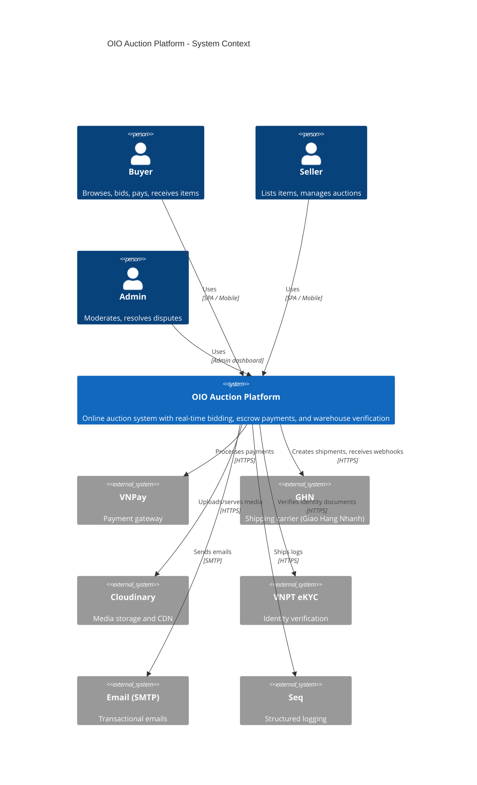
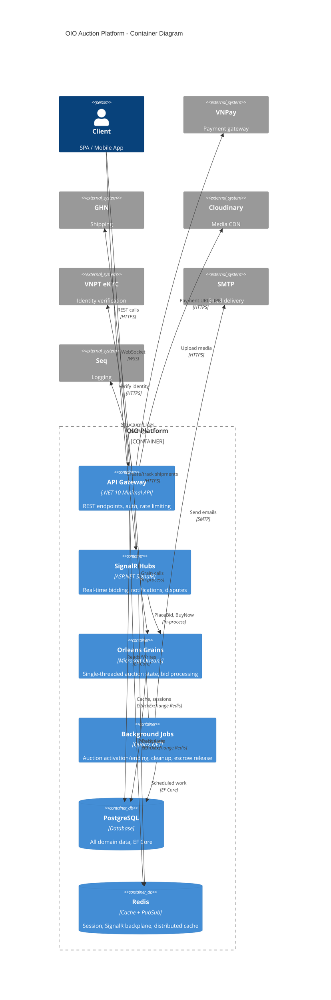
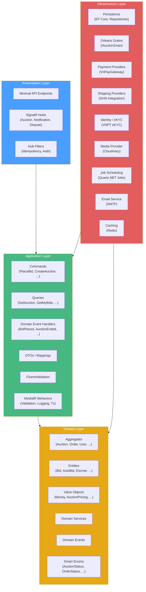
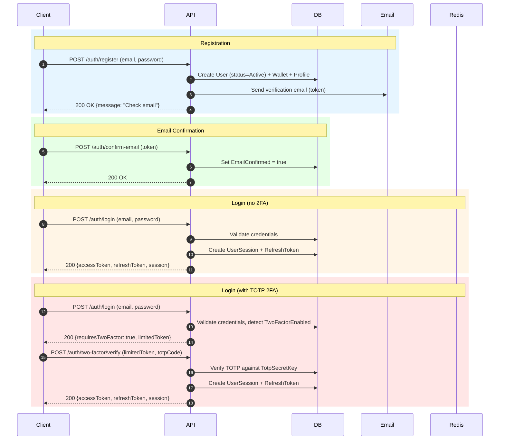
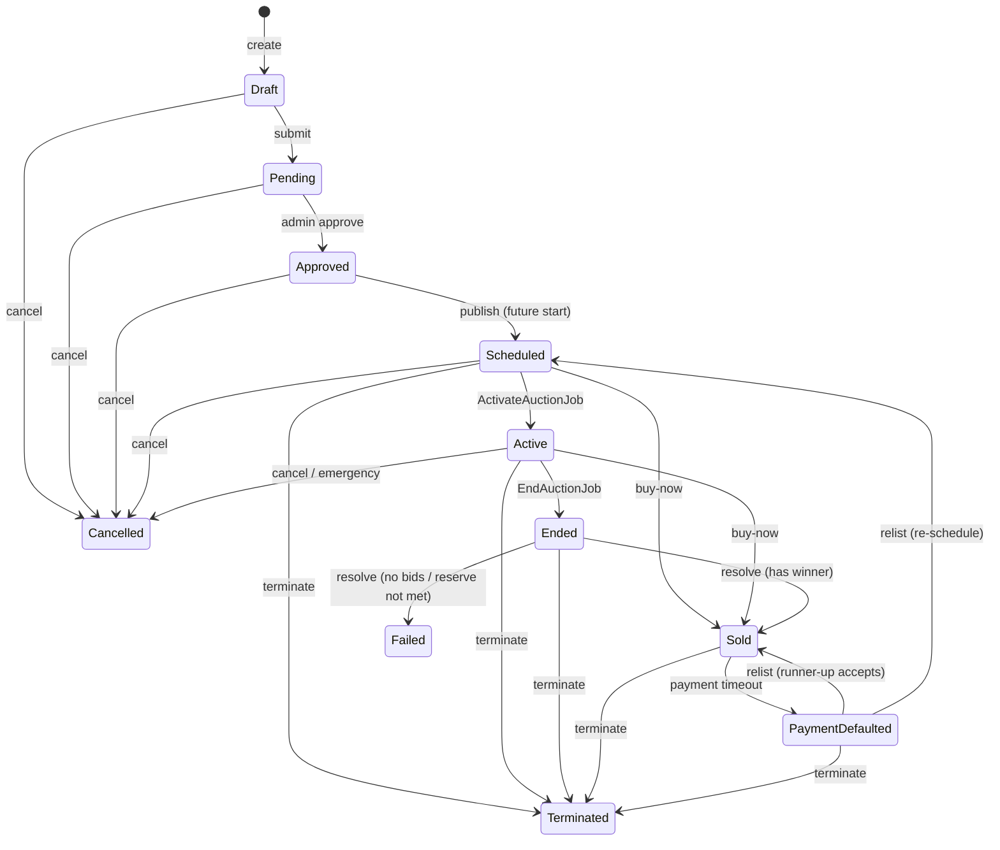
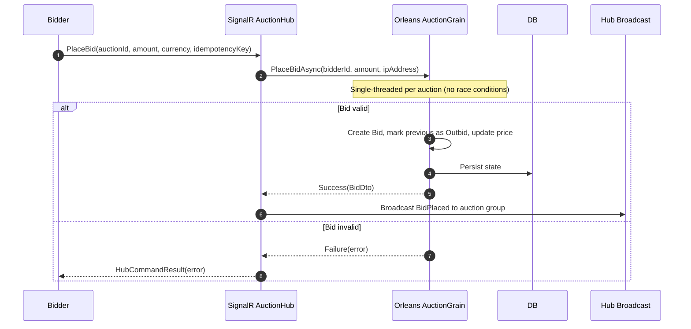
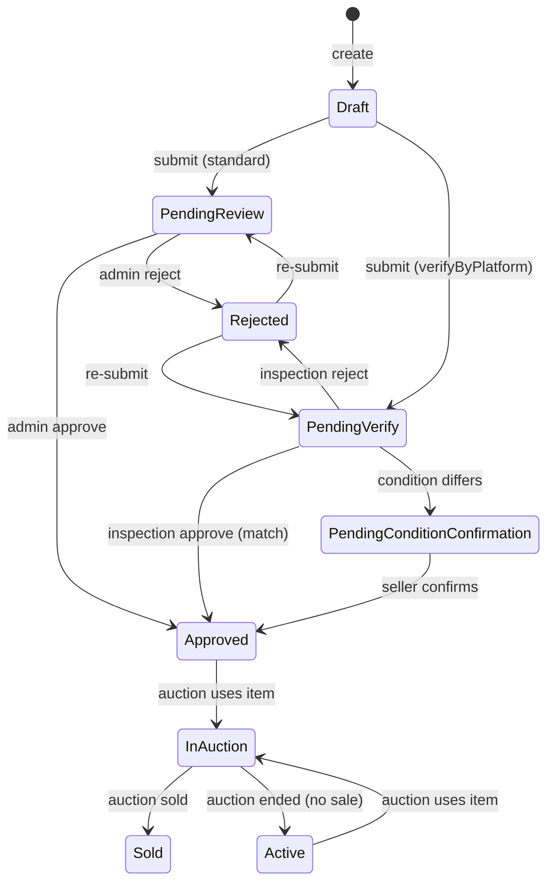
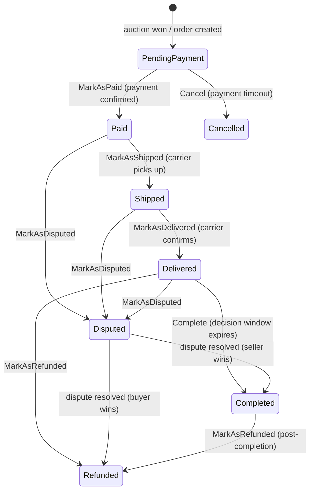
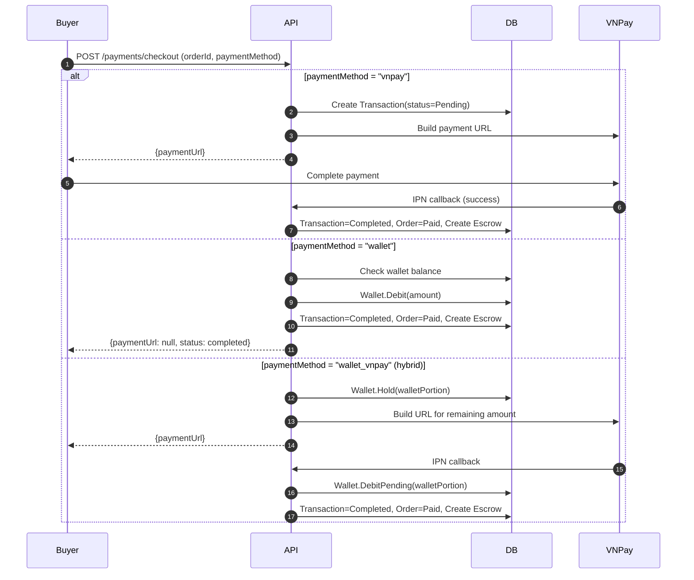
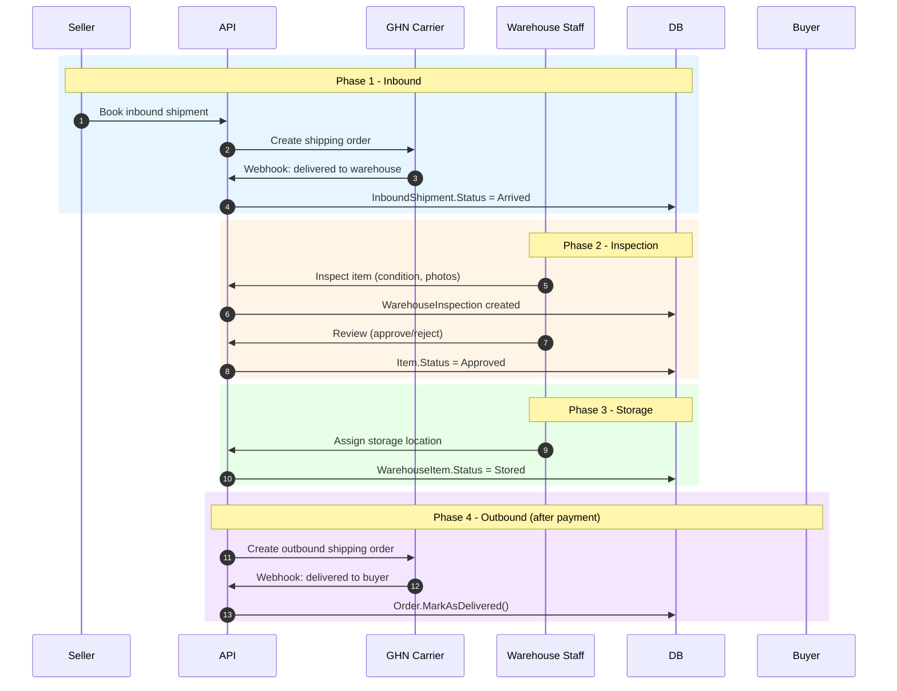

# OIO Auction Platform

OIO la backend cho nen tang dau gia truc tuyen, gom cac module lon: user/auth, catalog item, auction realtime, payment-wallet-order, moderation/dispute/report, warehouse va notification.

---

## System Architecture

### C4 Context Diagram



### Container Diagram



### Component Diagram (Clean Architecture)



---

## Core Flow Diagrams

### Authentication Flow



### Auction State Machine



### Bidding Flow (SignalR + Orleans)



### Item State Machine



### Order State Machine



### Payment Flow (VNPay + Wallet)



### Warehouse Flow (Inbound → Inspect → Store → Outbound)



---

## Kien truc code

```
src/
├── core/
│   ├── OIO.Domain          # Domain model, aggregate, enum, value object
│   └── OIO.Application     # Command/query, DTO, service, event handler
├── infrastructure/
│   └── OIO.Infrastructure   # Persistence, provider, settings, integration
└── presentation/
    └── OIO.Api              # HTTP API, SignalR hub, OpenAPI/Scalar
```

## Chay local

1. Cap nhat .env neu can.
2. Khoi dong dependency bang `compose.yaml` va `compose.override.yaml`.
3. Chay API tu `src/presentation/OIO.Api`.
4. Trong development, OpenAPI tai `/openapi/v1.json` va Scalar tai `/docs`.

## Auth conventions

- API mac dinh dung Bearer JWT.
- Route `api/admin/*` danh cho admin.
- Mot so route POST duoc gate boi Idempotency-Key.
- SignalR hubs deu can auth.

### Two-Factor Authentication (TOTP)

1. `POST /api/me/two-factor/setup` — Tao TOTP secret + QR code
2. `POST /api/me/two-factor/confirm` — Xac nhan → nhan 8 recovery codes
3. `POST /api/auth/login` tra ve limited JWT (3 phut) khi 2FA bat
4. `POST /api/auth/two-factor/verify` — Xac thuc TOTP → nhan full JWT

## Tai lieu

### API Documentation
- [API index](./docs/api/README.md) | [User + Auth](./docs/api/user.md) | [Auction + Catalog](./docs/api/auction.md) | [Payment + Order](./docs/api/payment-order.md) | [Moderation + Warehouse](./docs/api/moderation-warehouse.md) | [SignalR](./docs/api/signalr.md) | [Schemas](./docs/api/schemas.md)

### Business Flows (15 modules, 130+ docs)
- [Flow index](./docs/flows/README.md)

| # | Module | Docs |
|---|--------|------|
| 01 | [Registration & Auth](./docs/flows/01-registration-auth/README.md) | Register, login, 2FA, sessions |
| 02 | [User Profile](./docs/flows/02-user-profile/README.md) | Profile, phone, addresses, notification prefs |
| 03 | [Seller Verification](./docs/flows/03-seller-verification/README.md) | eKYC, documents, admin review |
| 04 | [Media Upload](./docs/flows/04-media-upload/README.md) | Cloudinary signed upload |
| 05 | [Item Management](./docs/flows/05-item-management/README.md) | Create, submit, review, QA |
| 06 | [Auction Lifecycle](./docs/flows/06-auction-lifecycle/README.md) | Draft → Publish → Active → Sold |
| 07 | [Bidding](./docs/flows/07-bidding/README.md) | Manual, auto-bid, sealed bid |
| 08 | [Buy Now](./docs/flows/08-buy-now/README.md) | Reserve → pay → finalize |
| 09 | [Payment](./docs/flows/09-payment/README.md) | VNPay, token, wallet, refund |
| 10 | [Order Lifecycle](./docs/flows/10-order-lifecycle/README.md) | Pay → ship → deliver → complete |
| 11 | [Warehouse](./docs/flows/11-warehouse-shipping/README.md) | Inbound, inspect, store, outbound |
| 12 | [Dispute](./docs/flows/12-dispute-moderation/README.md) | Reports, disputes, emergency |
| 13 | [Notification](./docs/flows/13-notification/README.md) | Email, SignalR, preferences |
| 14 | [Wallet](./docs/flows/14-wallet-withdrawal/README.md) | Topup, hold, withdraw |
| 15 | [Admin](./docs/flows/15-admin-operations/README.md) | Users, roles, review, monitoring |

### UML Diagrams
- [System Architecture](./docs/diagrams/system-architecture.md)
- [Entity Relationships](./docs/diagrams/entity-relationships.md)
- [Auth Flow](./docs/diagrams/flows/01-auth.md) | [Item](./docs/diagrams/flows/05-item.md) | [Auction](./docs/diagrams/flows/06-auction.md) | [Bidding](./docs/diagrams/flows/07-bidding.md) | [Payment](./docs/diagrams/flows/09-payment.md) | [Order](./docs/diagrams/flows/10-order.md) | [Warehouse](./docs/diagrams/flows/11-warehouse.md)

### Postman Collections (15 collections, 176+ requests)
Located in [`postman/`](./postman/) directory — import into Postman to test all flows.

## Regenerate docs

- Chay `scripts/generate-api-docs.ps1` de regenerate docs tu source hien tai.
- Lan dau: `scripts/generate-api-docs.ps1 -BootstrapDescriptions`.
