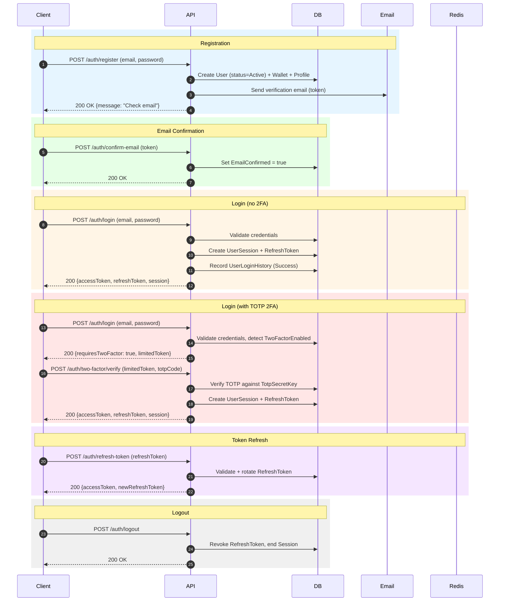
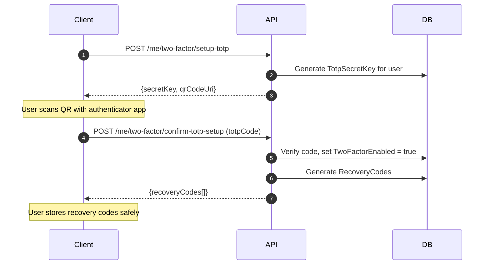
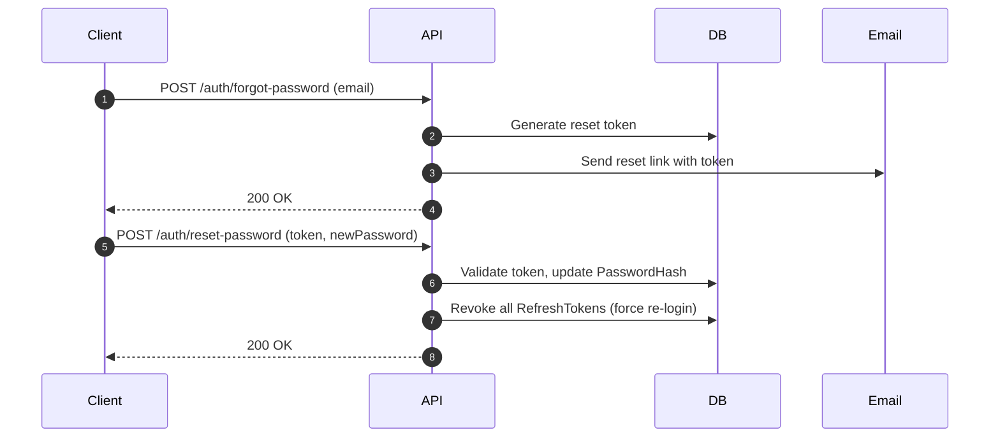

# Authentication Flow

## Registration and Login Sequence

```mermaid
sequenceDiagram
    autonumber
    participant Client
    participant API
    participant DB
    participant Email
    participant Redis

    rect rgb(230, 245, 255)
        Note over Client,Email: Registration
        Client->>API: POST /auth/register (email, password)
        API->>DB: Create User (status=Active) + Wallet + Profile
        API->>Email: Send verification email (token)
        API-->>Client: 200 OK {message: "Check email"}
    end

    rect rgb(230, 255, 230)
        Note over Client,DB: Email Confirmation
        Client->>API: POST /auth/confirm-email (token)
        API->>DB: Set EmailConfirmed = true
        API-->>Client: 200 OK
    end

    rect rgb(255, 245, 230)
        Note over Client,Redis: Login (no 2FA)
        Client->>API: POST /auth/login (email, password)
        API->>DB: Validate credentials
        API->>DB: Create UserSession + RefreshToken
        API->>DB: Record UserLoginHistory (Success)
        API-->>Client: 200 {accessToken, refreshToken, session}
    end

    rect rgb(255, 230, 230)
        Note over Client,Redis: Login (with TOTP 2FA)
        Client->>API: POST /auth/login (email, password)
        API->>DB: Validate credentials, detect TwoFactorEnabled
        API-->>Client: 200 {requiresTwoFactor: true, limitedToken}
        Client->>API: POST /auth/two-factor/verify (limitedToken, totpCode)
        API->>DB: Verify TOTP against TotpSecretKey
        API->>DB: Create UserSession + RefreshToken
        API-->>Client: 200 {accessToken, refreshToken, session}
    end

    rect rgb(245, 230, 255)
        Note over Client,Redis: Token Refresh
        Client->>API: POST /auth/refresh-token (refreshToken)
        API->>DB: Validate + rotate RefreshToken
        API-->>Client: 200 {accessToken, newRefreshToken}
    end

    rect rgb(240, 240, 240)
        Note over Client,DB: Logout
        Client->>API: POST /auth/logout
        API->>DB: Revoke RefreshToken, end Session
        API-->>Client: 200 OK
    end
```

## TOTP Setup Sequence

```mermaid
sequenceDiagram
    autonumber
    participant Client
    participant API
    participant DB

    Client->>API: POST /me/two-factor/setup-totp
    API->>DB: Generate TotpSecretKey for user
    API-->>Client: {secretKey, qrCodeUri}

    Note over Client: User scans QR with authenticator app

    Client->>API: POST /me/two-factor/confirm-totp-setup (totpCode)
    API->>DB: Verify code, set TwoFactorEnabled = true
    API->>DB: Generate RecoveryCodes
    API-->>Client: {recoveryCodes[]}

    Note over Client: User stores recovery codes safely
```

## Password Reset Sequence

```mermaid
sequenceDiagram
    autonumber
    participant Client
    participant API
    participant DB
    participant Email

    Client->>API: POST /auth/forgot-password (email)
    API->>DB: Generate reset token
    API->>Email: Send reset link with token
    API-->>Client: 200 OK

    Client->>API: POST /auth/reset-password (token, newPassword)
    API->>DB: Validate token, update PasswordHash
    API->>DB: Revoke all RefreshTokens (force re-login)
    API-->>Client: 200 OK
```
