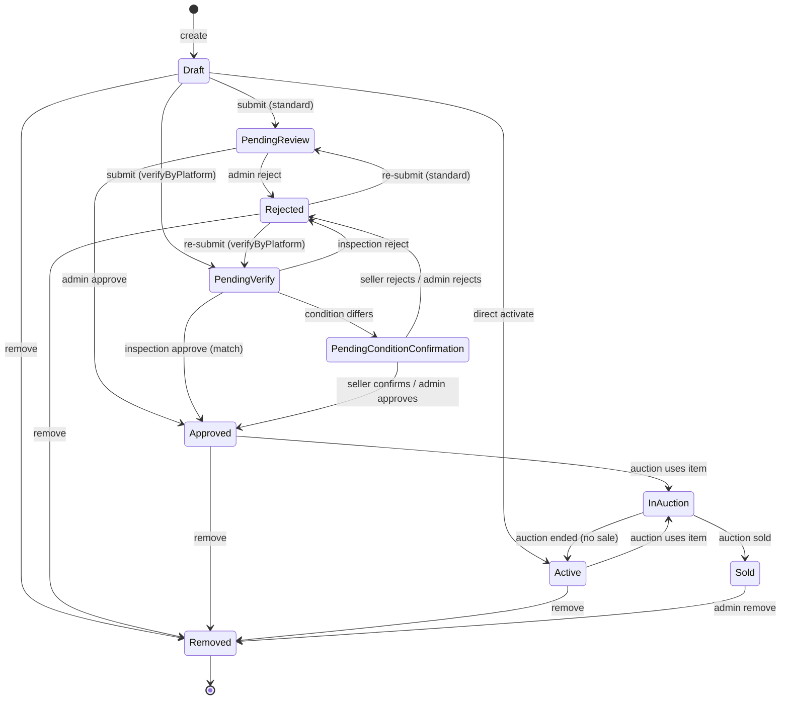
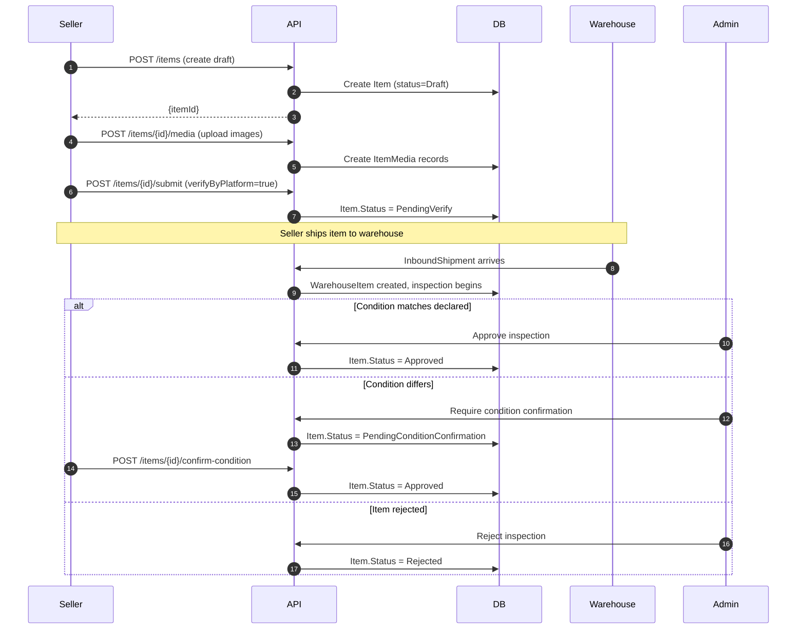

# Item Lifecycle

## Item Status State Machine

Derived from `ItemStatus.CanTransitionTo()` in the domain.

```mermaid
stateDiagram-v2
    [*] --> Draft: create

    Draft --> PendingReview: submit (standard)
    Draft --> PendingVerify: submit (verifyByPlatform)
    Draft --> Active: direct activate
    Draft --> Removed: remove

    PendingReview --> Approved: admin approve
    PendingReview --> Rejected: admin reject

    PendingVerify --> Approved: inspection approve (match)
    PendingVerify --> Rejected: inspection reject
    PendingVerify --> PendingConditionConfirmation: condition differs

    PendingConditionConfirmation --> Approved: seller confirms / admin approves
    PendingConditionConfirmation --> Rejected: seller rejects / admin rejects

    Rejected --> PendingVerify: re-submit (verifyByPlatform)
    Rejected --> PendingReview: re-submit (standard)
    Rejected --> Removed: remove

    Approved --> InAuction: auction uses item
    Approved --> Removed: remove

    Active --> InAuction: auction uses item
    Active --> Removed: remove

    InAuction --> Sold: auction sold
    InAuction --> Active: auction ended (no sale)

    Sold --> Removed: admin remove

    Removed --> [*]
```

## Item Submission Sequence (with Platform Verification)

```mermaid
sequenceDiagram
    autonumber
    participant Seller
    participant API
    participant DB
    participant Warehouse
    participant Admin

    Seller->>API: POST /items (create draft)
    API->>DB: Create Item (status=Draft)
    API-->>Seller: {itemId}

    Seller->>API: POST /items/{id}/media (upload images)
    API->>DB: Create ItemMedia records

    Seller->>API: POST /items/{id}/submit (verifyByPlatform=true)
    API->>DB: Item.Status = PendingVerify

    Note over Seller,Warehouse: Seller ships item to warehouse

    Warehouse->>API: InboundShipment arrives
    API->>DB: WarehouseItem created, inspection begins

    alt Condition matches declared
        Admin->>API: Approve inspection
        API->>DB: Item.Status = Approved
    else Condition differs
        Admin->>API: Require condition confirmation
        API->>DB: Item.Status = PendingConditionConfirmation
        Seller->>API: POST /items/{id}/confirm-condition
        API->>DB: Item.Status = Approved
    else Item rejected
        Admin->>API: Reject inspection
        API->>DB: Item.Status = Rejected
    end
```
