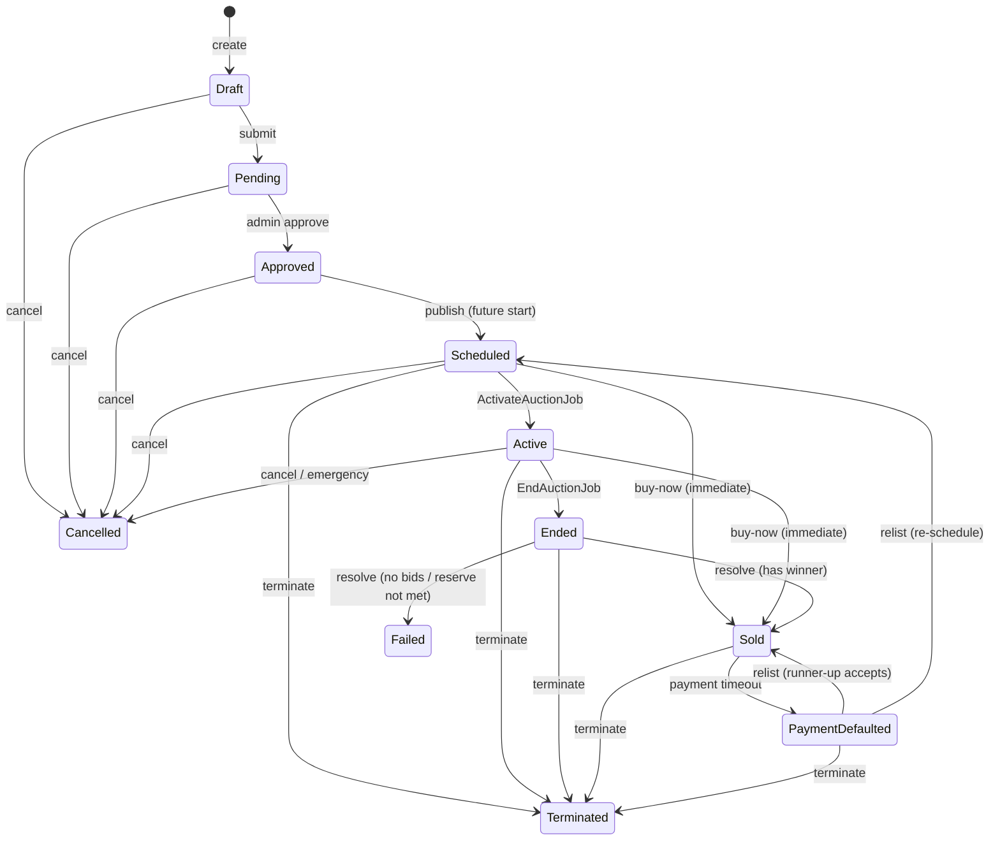
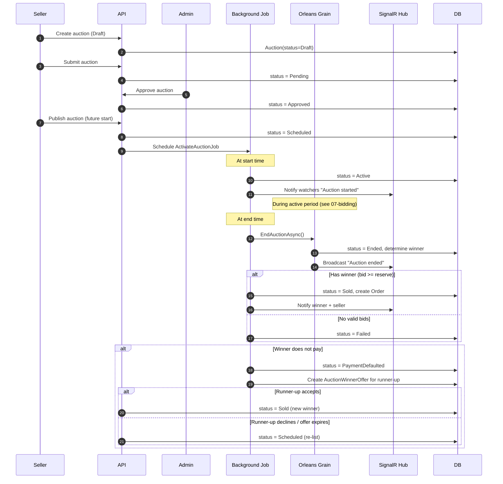

# Auction Lifecycle

## Auction Status State Machine

Derived directly from `AuctionStatus.CanTransitionTo()` in the domain.

### Transition Matrix (from code)

| From | To | Trigger |
|------|-----|---------|
| draft | pending | Submit auction |
| draft | cancelled | Seller cancels |
| pending | approved | Admin approves |
| pending | cancelled | Seller/admin cancels |
| approved | scheduled | Publish with future start time |
| approved | cancelled | Cancel before publish |
| scheduled | active | ActivateAuctionJob fires at start time |
| scheduled | cancelled | Cancel before activation |
| scheduled | sold | Buy-now completes |
| scheduled | terminated | Admin terminates |
| active | ended | EndAuctionJob fires at end time |
| active | cancelled | Cancel / emergency stop |
| active | terminated | Admin terminates |
| active | sold | Buy-now completes |
| ended | sold | Winner determined (highest bid >= reserve) |
| ended | failed | No bids or reserve not met |
| ended | terminated | Admin terminates |
| sold | payment_defaulted | Winner fails to pay within deadline |
| sold | terminated | Admin terminates |
| payment_defaulted | sold | Runner-up accepts offer |
| payment_defaulted | scheduled | Re-list for new auction |
| payment_defaulted | terminated | Admin terminates |

## Auction Lifecycle Sequence

