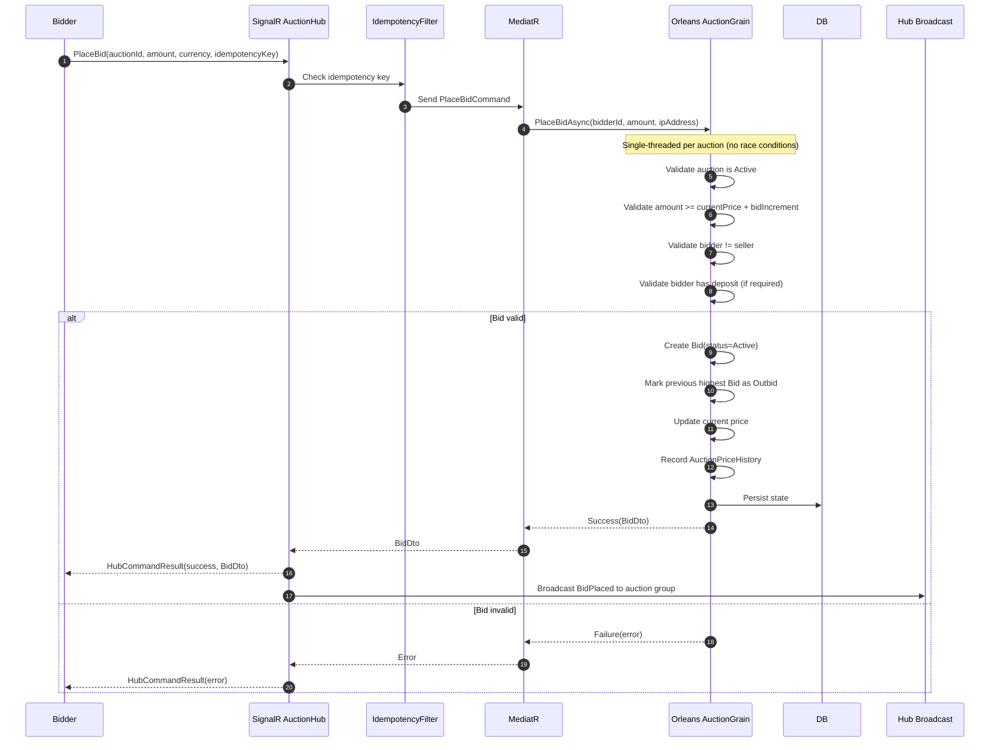
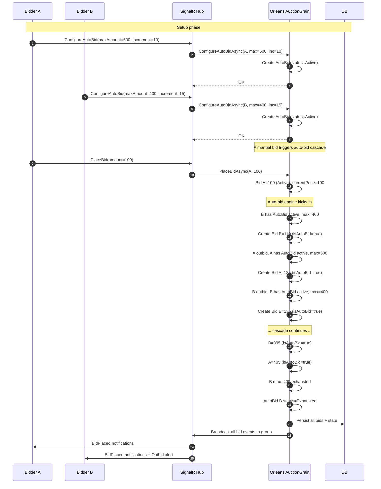
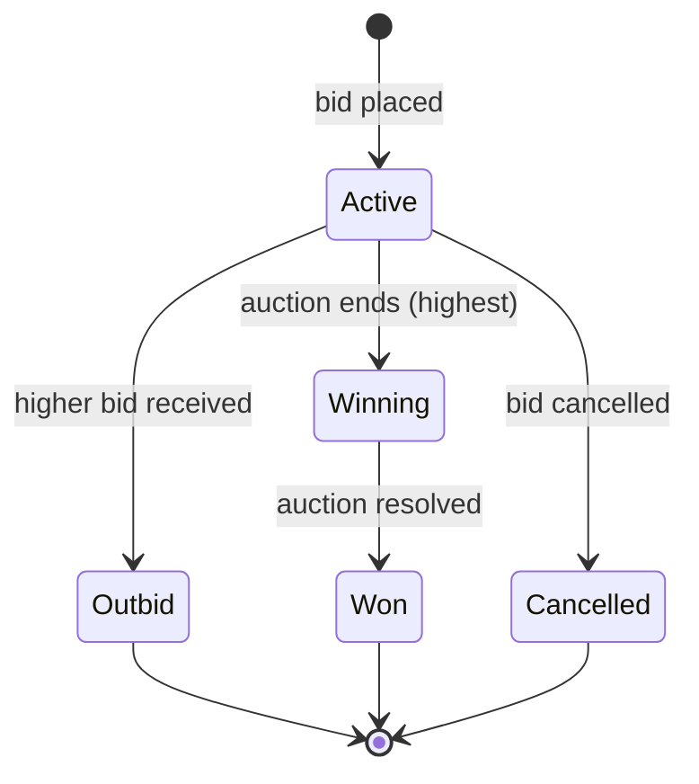
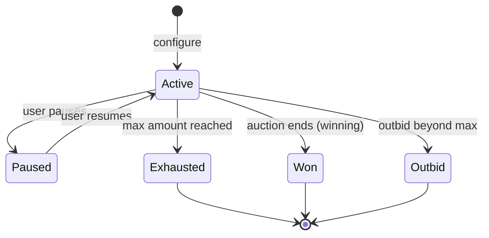
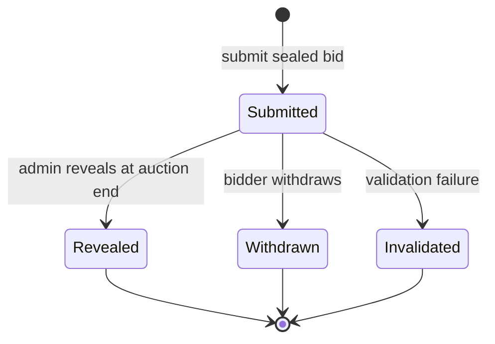
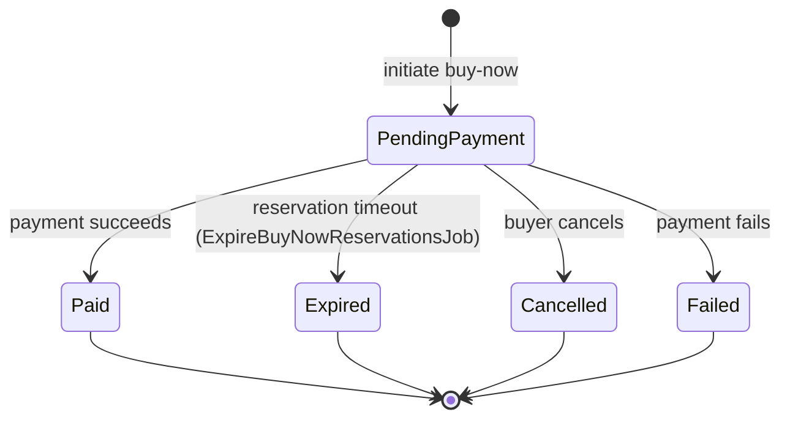

# Bidding Flow

## Manual Bid Sequence

## Auto-Bid Battle Sequence

## Bid Status State Machine

## Auto-Bid Status State Machine

## Sealed Bid Status State Machine

## Buy-Now Reservation Flow

