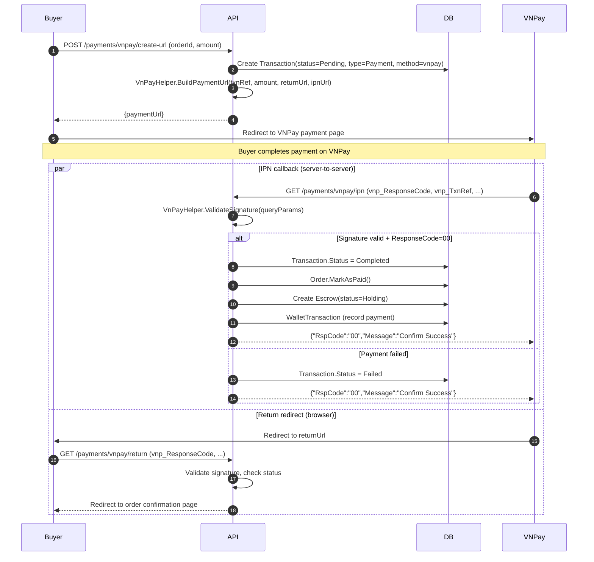
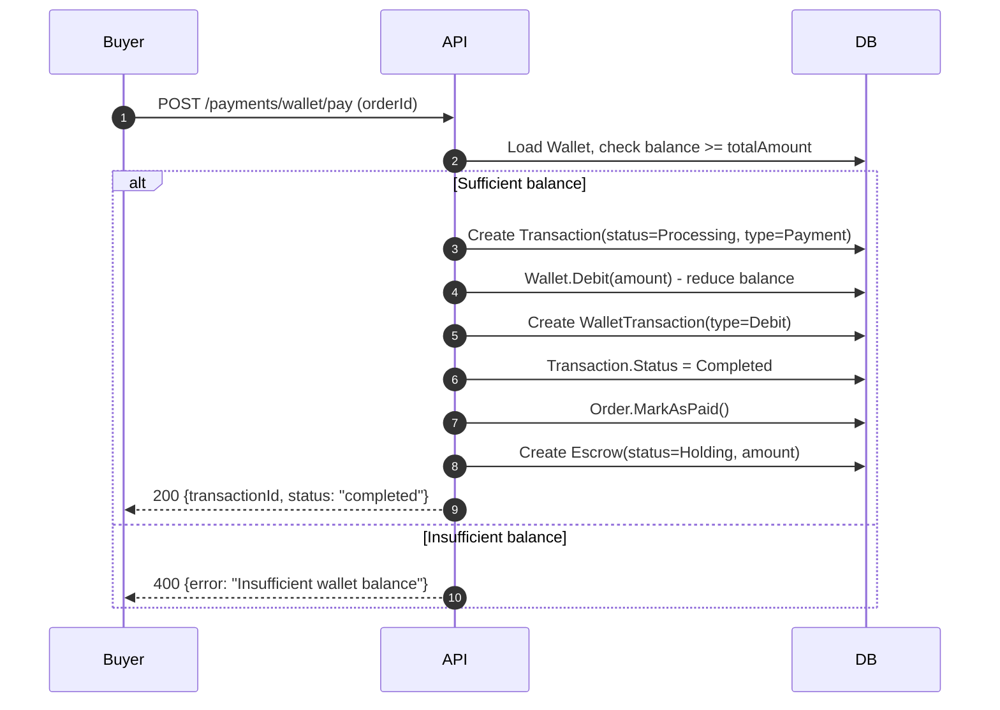
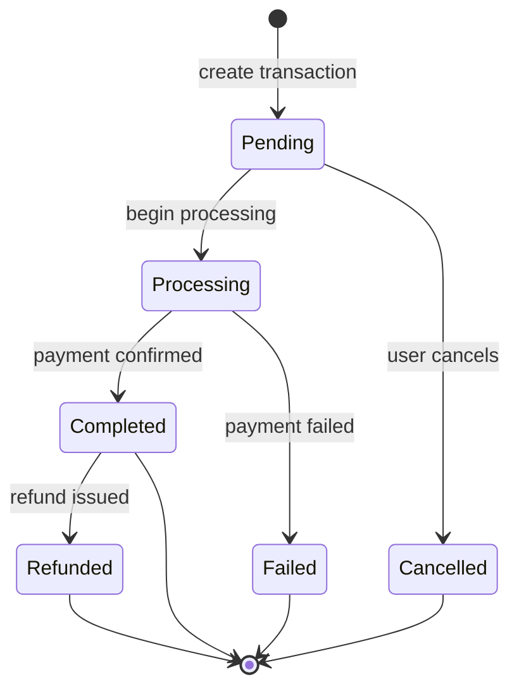
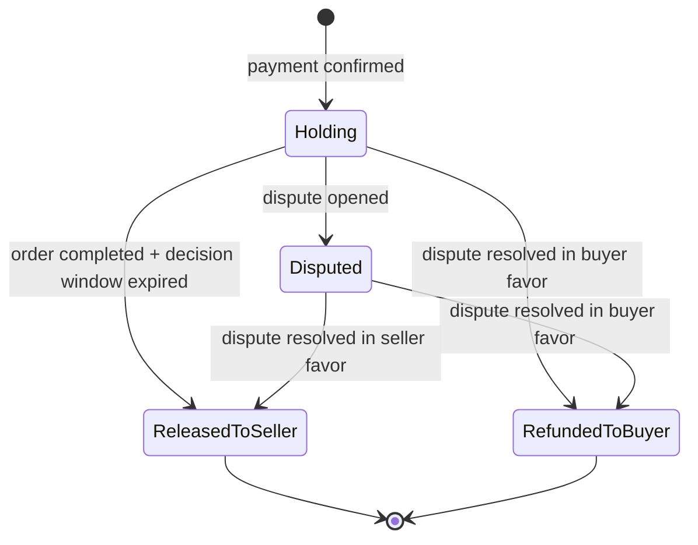
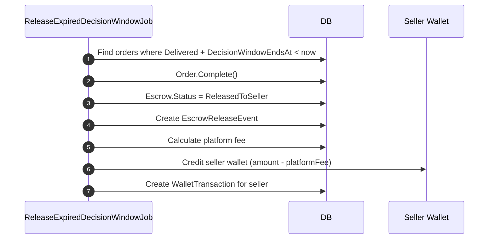
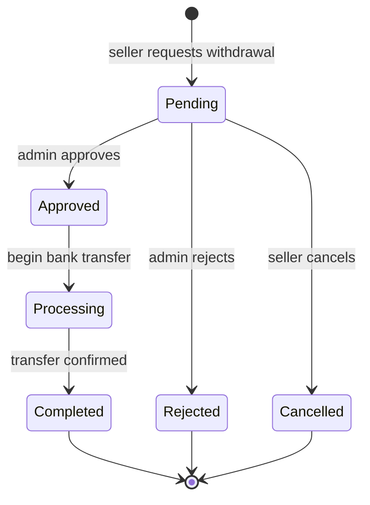

# Payment Flow

## VNPay Payment Sequence

## Wallet Payment Sequence

## Transaction Status State Machine

## Escrow Lifecycle

## Escrow Release Sequence

## Withdrawal Status State Machine

