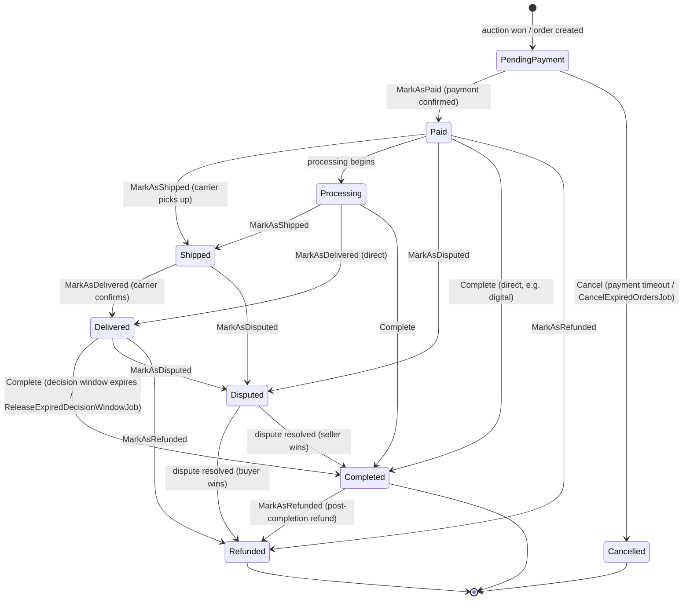
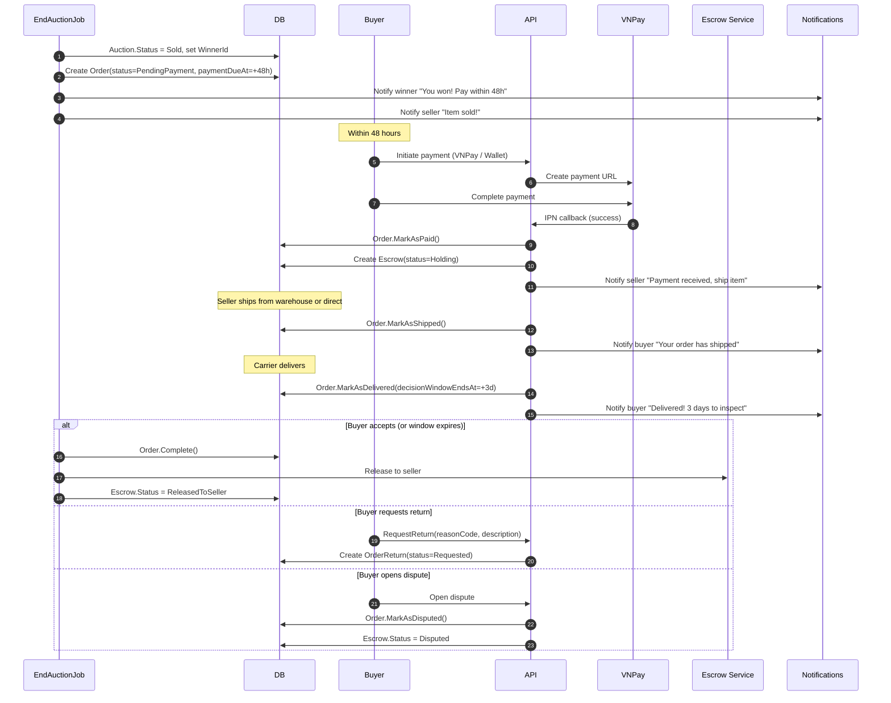
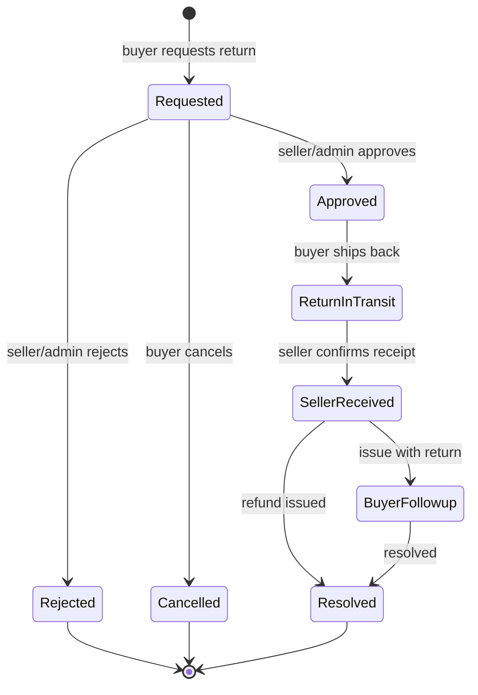

# Order Lifecycle

## Order Status State Machine

Derived from `Order.cs` transition methods (`MarkAsPaid`, `MarkAsShipped`, `MarkAsDelivered`, `Complete`, `Cancel`, `MarkAsDisputed`, `MarkAsRefunded`).

### Transition Rules (from code)

| Method | Valid Source States | Target |
|--------|-------------------|--------|
| `MarkAsPaid` | PendingPayment | Paid |
| `MarkAsShipped` | Paid, Processing | Shipped |
| `MarkAsDelivered` | Shipped, Processing | Delivered |
| `Complete` | Delivered, Processing, Paid | Completed |
| `Cancel` | PendingPayment | Cancelled |
| `MarkAsDisputed` | Delivered, Paid, Shipped | Disputed |
| `MarkAsRefunded` | Delivered, Disputed, Completed, Paid | Refunded |

## Order Creation Sequence (after auction ends)

## Order Return Status State Machine

