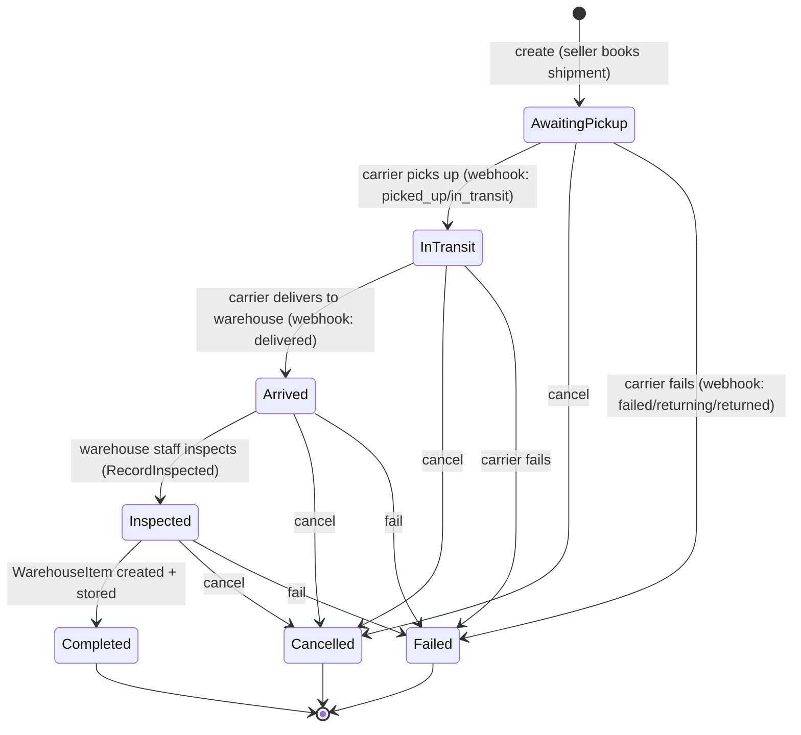
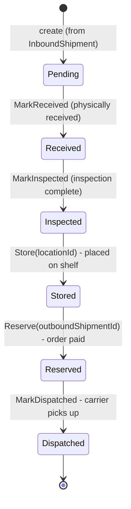
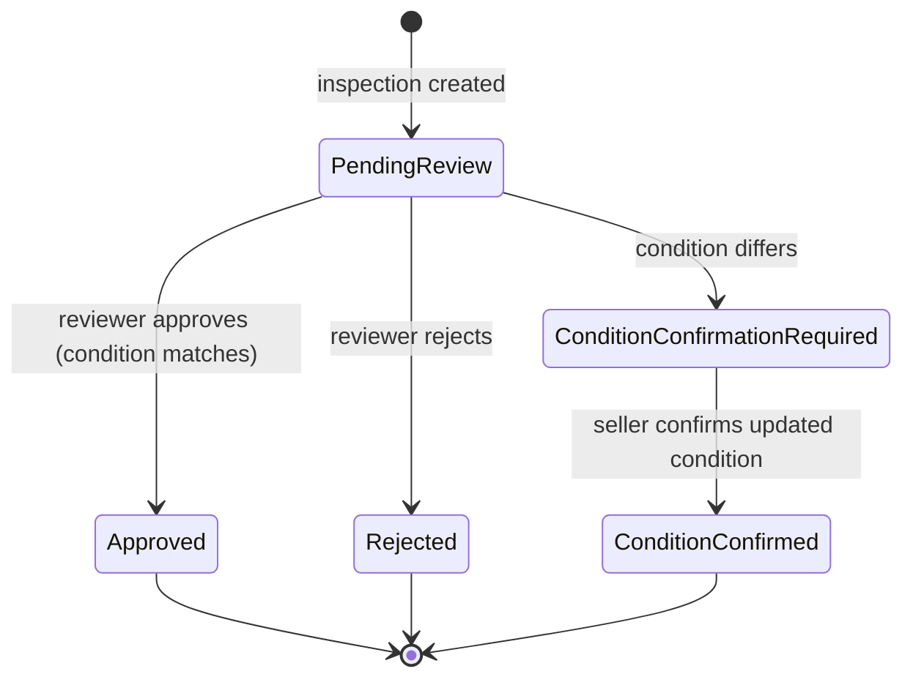
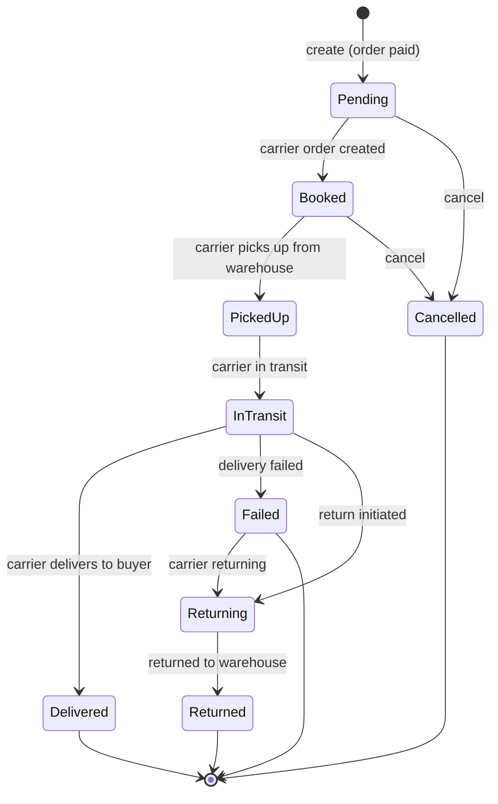
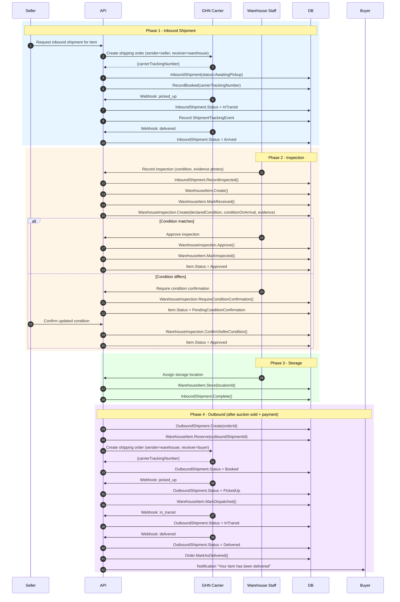

# Warehouse Flow

## Inbound Shipment Status State Machine

Derived from `InboundShipment.cs` lifecycle methods.

## Warehouse Item Status State Machine

Derived from `WarehouseItem.cs` transition methods.

## Warehouse Inspection Decision Status

## Outbound Shipment Status State Machine

## Full Warehouse Sequence (Inbound to Outbound)

