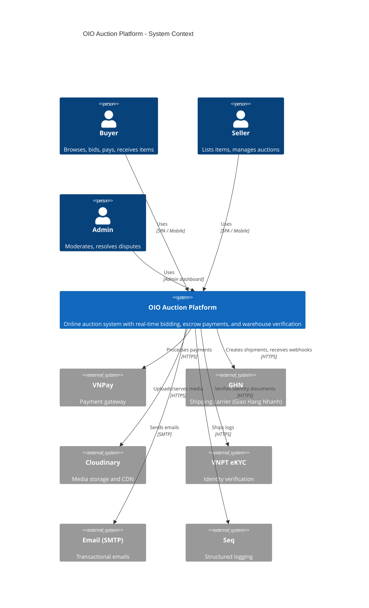
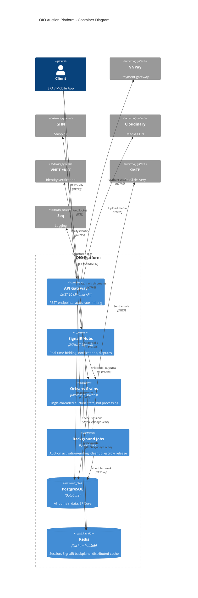
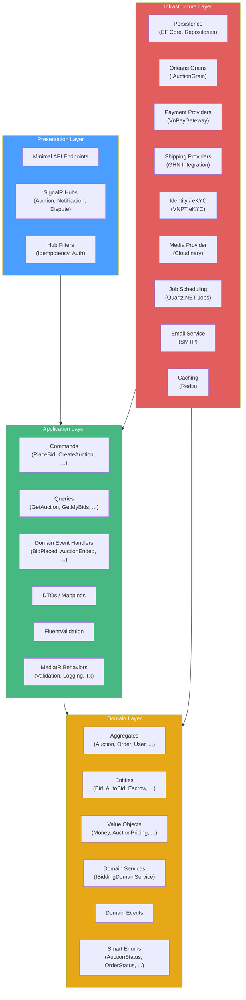

# System Architecture

## C4 Context Diagram

```mermaid
C4Context
    title OIO Auction Platform - System Context

    Person(buyer, "Buyer", "Browses, bids, pays, receives items")
    Person(seller, "Seller", "Lists items, manages auctions")
    Person(admin, "Admin", "Moderates, resolves disputes")

    System(oio, "OIO Auction Platform", "Online auction system with real-time bidding, escrow payments, and warehouse verification")

    System_Ext(vnpay, "VNPay", "Payment gateway")
    System_Ext(ghn, "GHN", "Shipping carrier (Giao Hang Nhanh)")
    System_Ext(cloudinary, "Cloudinary", "Media storage and CDN")
    System_Ext(ekyc, "VNPT eKYC", "Identity verification")
    System_Ext(smtp, "Email (SMTP)", "Transactional emails")
    System_Ext(seq, "Seq", "Structured logging")

    Rel(buyer, oio, "Uses", "SPA / Mobile")
    Rel(seller, oio, "Uses", "SPA / Mobile")
    Rel(admin, oio, "Uses", "Admin dashboard")
    Rel(oio, vnpay, "Processes payments", "HTTPS")
    Rel(oio, ghn, "Creates shipments, receives webhooks", "HTTPS")
    Rel(oio, cloudinary, "Uploads/serves media", "HTTPS")
    Rel(oio, ekyc, "Verifies identity documents", "HTTPS")
    Rel(oio, smtp, "Sends emails", "SMTP")
    Rel(oio, seq, "Ships logs", "HTTPS")
```

## Container Diagram

```mermaid
C4Container
    title OIO Auction Platform - Container Diagram

    Person(client, "Client", "SPA / Mobile App")

    Container_Boundary(platform, "OIO Platform") {
        Container(api, "API Gateway", ".NET 10 Minimal API", "REST endpoints, auth, rate limiting")
        Container(signalr, "SignalR Hubs", "ASP.NET SignalR", "Real-time bidding, notifications, disputes")
        Container(orleans, "Orleans Grains", "Microsoft Orleans", "Single-threaded auction state, bid processing")
        Container(jobs, "Background Jobs", "Quartz.NET", "Auction activation/ending, cleanup, escrow release")
        ContainerDb(db, "PostgreSQL", "Database", "All domain data, EF Core")
        ContainerDb(redis, "Redis", "Cache + PubSub", "Session, SignalR backplane, distributed cache")
    }

    System_Ext(vnpay, "VNPay", "Payment gateway")
    System_Ext(ghn, "GHN", "Shipping")
    System_Ext(cloudinary, "Cloudinary", "Media CDN")
    System_Ext(ekyc, "VNPT eKYC", "Identity verification")
    System_Ext(smtp, "SMTP", "Email delivery")
    System_Ext(seq, "Seq", "Logging")

    Rel(client, api, "REST calls", "HTTPS")
    Rel(client, signalr, "WebSocket", "WSS")
    Rel(api, orleans, "Grain calls", "In-process")
    Rel(signalr, orleans, "PlaceBid, BuyNow", "In-process")
    Rel(api, db, "Reads/Writes", "EF Core")
    Rel(orleans, db, "Persist state", "EF Core")
    Rel(jobs, db, "Scheduled work", "EF Core")
    Rel(api, redis, "Cache, sessions", "StackExchange.Redis")
    Rel(signalr, redis, "Backplane", "StackExchange.Redis")
    Rel(api, vnpay, "Payment URLs, IPN", "HTTPS")
    Rel(jobs, ghn, "Create/track shipments", "HTTPS")
    Rel(api, cloudinary, "Upload media", "HTTPS")
    Rel(api, ekyc, "Verify identity", "HTTPS")
    Rel(jobs, smtp, "Send emails", "SMTP")
    Rel(api, seq, "Structured logs", "Serilog")
```

## Component Diagram (Clean Architecture Layers)

```mermaid
graph TB
    subgraph Presentation ["Presentation Layer"]
        API["Minimal API Endpoints"]
        Hubs["SignalR Hubs<br/>(Auction, Notification, Dispute)"]
        Filters["Hub Filters<br/>(Idempotency, Auth)"]
    end

    subgraph Application ["Application Layer"]
        Commands["Commands<br/>(PlaceBid, CreateAuction, ...)"]
        Queries["Queries<br/>(GetAuction, GetMyBids, ...)"]
        Events["Domain Event Handlers<br/>(BidPlaced, AuctionEnded, ...)"]
        DTOs["DTOs / Mappings"]
        Validators["FluentValidation"]
        Behaviors["MediatR Behaviors<br/>(Validation, Logging, Tx)"]
    end

    subgraph Domain ["Domain Layer"]
        Aggregates["Aggregates<br/>(Auction, Order, User, ...)"]
        Entities["Entities<br/>(Bid, AutoBid, Escrow, ...)"]
        ValueObjects["Value Objects<br/>(Money, AuctionPricing, ...)"]
        DomainServices["Domain Services<br/>(IBiddingDomainService)"]
        DomainEvents["Domain Events"]
        Enums["Smart Enums<br/>(AuctionStatus, OrderStatus, ...)"]
    end

    subgraph Infrastructure ["Infrastructure Layer"]
        Persistence["Persistence<br/>(EF Core, Repositories)"]
        Grains["Orleans Grains<br/>(IAuctionGrain)"]
        Payment["Payment Providers<br/>(VnPayGateway)"]
        Shipping["Shipping Providers<br/>(GHN Integration)"]
        Identity["Identity / eKYC<br/>(VNPT eKYC)"]
        Media["Media Provider<br/>(Cloudinary)"]
        Scheduling["Job Scheduling<br/>(Quartz.NET Jobs)"]
        Email["Email Service<br/>(SMTP)"]
        Caching["Caching<br/>(Redis)"]
    end

    Presentation --> Application
    Application --> Domain
    Infrastructure --> Domain
    Infrastructure --> Application

    style Presentation fill:#4a9eff,color:#fff
    style Application fill:#47b881,color:#fff
    style Domain fill:#e6a817,color:#fff
    style Infrastructure fill:#e25d5d,color:#fff
```
