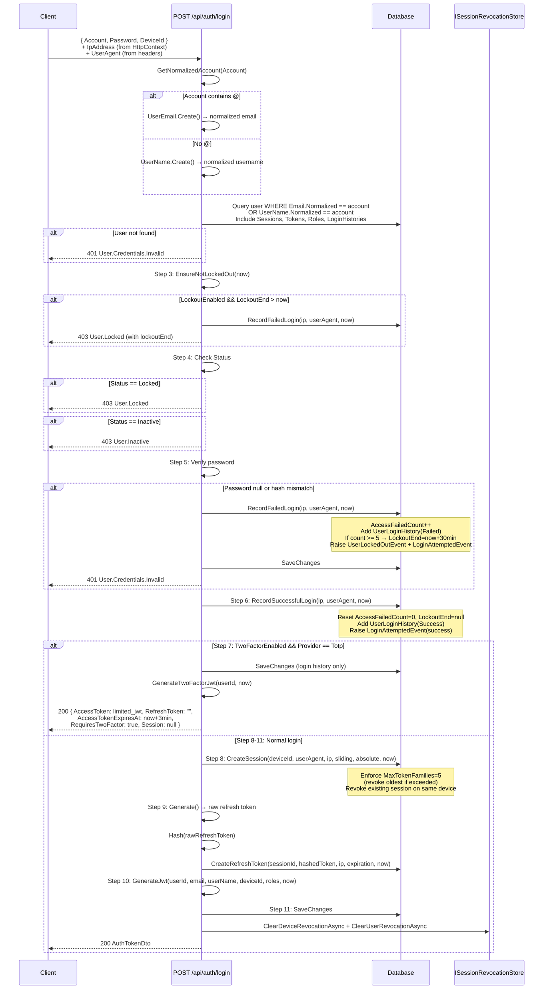
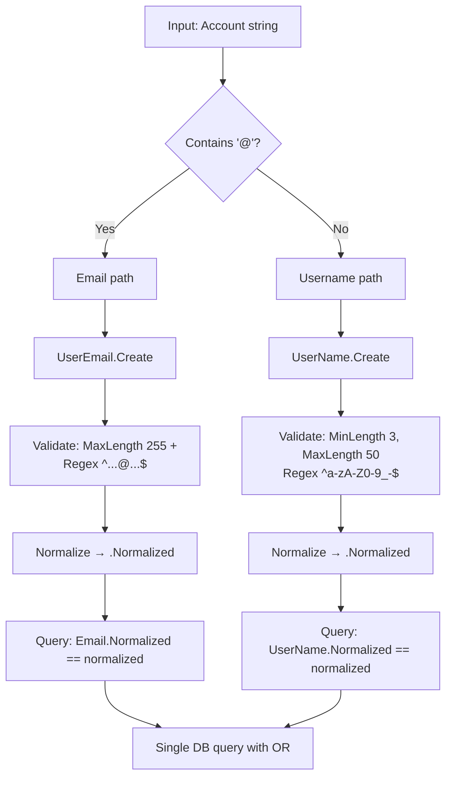

# 03 - Login (Dang nhap)

## Endpoint

| Thuoc tinh | Gia tri |
|-----------|---------|
| Method | `POST` |
| Route | `/api/auth/login` |
| Auth | Anonymous (`.AllowAnonymous()`) |
| Success Response | `200 OK` |
| Response Body | `AuthTokenDto` |
| Command | `LoginUserCommand` |
| Handler | `LoginUserCommandHandler` |

---

## Diagrams

### Full Login Flow (Client - API - DB - Cache)



### Account Resolution Decision Tree



---

## Request Schema

```json
{
  "account": "string",
  "password": "string",
  "deviceId": "guid"
}
```

| Field | Type | Required | Validation |
|-------|------|----------|------------|
| `Account` | `string` | Yes | NotWhiteSpace. Neu chua `@`: email validation (MaxLength 255, email regex). Neu khong chua `@`: username validation (MinLength 3, MaxLength 50, regex `^[a-zA-Z0-9_-]+$`) |
| `Password` | `string` | Yes | NotWhiteSpace |
| `DeviceId` | `Guid` | Yes | (no additional validation — Guid type) |

**Hidden fields** (tu HttpContext):
- `IpAddress` (`IPAddress`): `ctx.GetIpAddress()` — tu request headers
- `UserAgent` (`string`): `httpRequest.GetUserAgent()` — tu `User-Agent` header, validated NotWhiteSpace

---

## Response Schema

### Variant 1: Normal Login (AuthTokenDto)

```json
{
  "accessToken": "eyJhbGciOiJIUz...",
  "refreshToken": "random_base64_string",
  "accessTokenExpiresAt": "2024-01-01T01:00:00Z",
  "refreshTokenExpiresAt": "2024-01-08T00:00:00Z",
  "session": {
    "sessionId": "guid",
    "deviceId": "guid",
    "slidingExpiresAt": "2024-01-08T00:00:00Z",
    "absoluteExpiresAt": "2024-07-01T00:00:00Z",
    "isNearingAbsoluteExpiration": false,
    "remainingAbsoluteTime": "179.23:59:59"
  },
  "requiresTwoFactor": false
}
```

### Variant 2: 2FA Required (Limited AuthTokenDto)

```json
{
  "accessToken": "eyJhbGciOiJIUz...",
  "refreshToken": "",
  "accessTokenExpiresAt": "2024-01-01T00:03:00Z",
  "refreshTokenExpiresAt": "0001-01-01T00:00:00",
  "session": null,
  "requiresTwoFactor": true
}
```

**Limited JWT** (2FA):
- Thoi gian song: **3 phut** (`nowUtc.AddMinutes(3)`)
- Khong co refresh token (empty string)
- Khong co session info (null)
- Purpose: `2fa_verification` — duoc su dung de goi `POST /api/auth/two-factor/verify`
- Duoc tao boi `IJwtTokenProvider.GenerateTwoFactorJwt(userId, now)`

---

## Business Logic - 11 Steps Chi Tiet

### Step 1: Account Resolution
- Goi `GetNormalizedAccount(request.Account)`:
  - Neu `account.Contains('@')` → `UserEmail.Create(account)` → tra ve `emailR.Value.Normalized`
  - Neu khong → `UserName.Create(account)` → tra ve `userNameR.Value.Normalized`
  - Neu Create that bai → tra ve error tuong ung

### Step 2: Load User
- Query: `WHERE Email.Normalized == account OR UserName.Normalized == account`
- Include: `Sessions` → `Tokens`, `Roles` → `Role`, `LoginHistories`
- Neu `user is null` → `401 User.Credentials.Invalid`

### Step 3: Lockout Check
- `user.EnsureNotLockedOut(now)`: kiem tra `LockoutEnabled && LockoutEnd > now`
- Neu locked → `RecordFailedLogin()` + return error `User.Locked` voi thong tin `LockoutEnd`

### Step 4: Status Check
- `Status == Locked` → `403 User.Locked` ("The user is locked due to suspension")
- `Status == Inactive` → `403 User.Inactive` ("The user is not active")

### Step 5: Password Verification
- `user.Password is null` → `401 User.Credentials.Invalid`
- `!user.Password.Verify(request.Password, _passwordHasher)` → call `FailLogin()`
  - `FailLogin()` goi `user.RecordFailedLogin(ip, userAgent, now)`:
    - `AccessFailedCount++`
    - Them `UserLoginHistory(userId, ip, userAgent, LoginStatus.Failed, now)`
    - Neu `LockoutEnabled && AccessFailedCount >= 5` → `LockoutEnd = now.AddMinutes(30)` + Raise `UserLockedOutEvent`
    - Raise `LoginAttemptedEvent(userId, ip, userAgent, isSuccess: false, now)`
  - `SaveChangesAsync()` (luu failed attempt truoc khi return error)
  - Return `401 User.Credentials.Invalid`

### Step 6: Record Successful Login
- `user.RecordSuccessfulLogin(ip, userAgent, now)`:
  - `EnsureNotDeleted()` + `EnsureNotLockedOut(now)`
  - Reset `AccessFailedCount = 0`, `LockoutEnd = null`
  - Them `UserLoginHistory(userId, ip, userAgent, LoginStatus.Success, now)`
  - Raise `LoginAttemptedEvent(userId, ip, userAgent, isSuccess: true, now)`

### Step 7: 2FA Check
- Dieu kien: `user.TwoFactorEnabled && user.TwoFactorProvider == TwoFactorProvider.Totp`
- Neu true:
  - `SaveChangesAsync()` (luu login history)
  - Tao limited JWT: `_tokenProvider.GenerateTwoFactorJwt(user.Id, now)`
  - Return `AuthTokenDto` voi `RequiresTwoFactor = true`
  - **Khong tao session hoac refresh token**

### Step 8: Create Session
- `user.CreateSession(deviceId, userAgent, ip, slidingExpiration, absoluteExpiration, now)`:
  - Kiem tra active sessions count >= `MaxTokenFamilies` (5) → revoke oldest + raise `SessionRevokedEvent`
  - Revoke existing session on same `deviceId` ("New session started on same device")
  - Tao `UserSession.Create(...)`:
    - `ExpiresAt = now + slidingExpiration`
    - `AbsoluteExpiresAt = now + absoluteExpiration`
    - Clamp: `ExpiresAt = min(ExpiresAt, AbsoluteExpiresAt)`

### Step 9: Create Refresh Token
- `_tokenProvider.Generate()` → raw random token
- `_tokenHasher.Hash(rawRefreshToken)` → SHA hash
- `user.CreateRefreshToken(sessionId, hashedToken, ip, refreshTokenExpiration, now)`:
  - Kiem tra session active + not expired
  - Tao `UserRefreshToken` voi `parentTokenId: null`, `rotationCounter: 0`

### Step 10: Create Access JWT
- `_tokenProvider.GenerateJwt(userId, email, userName, deviceId, roles, now)`
- **JWT Claims** (tu `IJwtTokenProvider` interface):
  - `sub`: userId
  - `email`: user email
  - `name`: username
  - `deviceId`: device identifier
  - `roles`: list of role names (e.g., `["bidder", "user"]`)
  - `iat`: issued at timestamp
  - `jti`: unique token ID
- `accessTokenExpiresAt = now + _expirationSettings.AccessTokenExpiration`

### Step 11: Persist & Clear Cache
- `SaveChangesAsync()` → luu session + refresh token + login history + dispatch events
- `_revocationStore.ClearDeviceRevocationAsync(userId)` → xoa blacklist device
- `_revocationStore.ClearUserRevocationAsync(userId)` → xoa blacklist user

---

## Lockout Mechanism

| Thong so | Gia tri | Source |
|---------|---------|--------|
| Max failed attempts | **5** | `User.MaxFailedAccessAttempts = 5` |
| Lockout duration | **30 phut** | `User.DefaultLockoutMinutes = 30` |
| Lockout enabled by default | **true** | Set trong `User` constructor |
| Counter field | `AccessFailedCount` (`short`) | Increment moi lan failed login |
| Reset condition | Successful login | `RecordSuccessfulLogin` → `AccessFailedCount = 0` |

---

## Session Constraints

| Thong so | Gia tri | Source |
|---------|---------|--------|
| Max active sessions | **5** | `User.MaxTokenFamilies = 5` |
| Sliding expiration | Configurable | `ITokenExpirationSettings.FamilySlidingExpiration` |
| Absolute expiration | Configurable | `ITokenExpirationSettings.FamilyAbsoluteExpiration` |
| Same device behavior | Revoke existing | `existingForDevice.Revoke("New session started on same device")` |
| Oldest session behavior | Revoke when max exceeded | `oldest.Revoke("Max active families exceeded")` |

---

## 2FA Branch - Verify TOTP Login

Sau khi client nhan `RequiresTwoFactor: true`, client goi:

| Thuoc tinh | Gia tri |
|-----------|---------|
| Method | `POST` |
| Route | `/api/auth/two-factor/verify` |
| Auth | RequireAuthorization (limited JWT) |
| Command | `VerifyTotpLoginCommand` |

### Request

```json
{
  "code": "string",
  "deviceId": "guid"
}
```

**Hidden fields**: `IpAddress` (tu HttpContext), `UserAgent` (tu headers)

### Logic
1. Load user by `currentUser.UserId` (tu limited JWT)
2. Kiem tra `TwoFactorSecret` ton tai
3. **TOTP verification**: `_totpService.VerifyCode(secret, code, out timeStep)`
   - Neu hop le: kiem tra replay attack (`LastUsedTotpTimeStep >= timeStep` → `User.Totp.ReplayDetected`)
   - Ghi nhan `RecordTotpTimeStep(timeStep)`
4. **Recovery code fallback**: neu TOTP invalid → try recovery codes (hash compare, mark as used)
5. Tao session + refresh token + access JWT (giong step 8-11 o tren)
6. Clear revocation cache

### Response
Giong `AuthTokenDto` variant 1 (full tokens + session info)

---

## Error Codes

| HTTP Status | Error Code | Mo ta | Khi nao |
|------------|------------|-------|---------|
| 422 | `ViolationsError` | Validation that bai | Account/Password/UserAgent empty |
| 401 | `User.Credentials.Invalid` | Sai email/password | User khong tim thay hoac password mismatch |
| 403 | `User.Locked` | Tai khoan bi khoa (admin) | `Status == Locked` |
| 403 | `User.Inactive` | Tai khoan chua active | `Status == Inactive` (chua confirm email) |
| 403 | `User.Locked` (with lockoutEnd) | Bi lock do failed attempts | `LockoutEnabled && LockoutEnd > now` |
| 403 | `User.Totp.NotConfigured` | 2FA chua cai dat | `TwoFactorSecret` is null (verify endpoint) |
| 401 | `User.Totp.InvalidCode` | Ma TOTP sai | `VerifyCode` tra ve false va khong co recovery code hop le |
| 401 | `User.Totp.ReplayDetected` | Ma TOTP da su dung | `LastUsedTotpTimeStep >= timeStep` |
| 403 | `User.Deleted` | User da bi xoa | `IsDeleted == true` (trong RecordSuccessfulLogin) |

---

## Source Files

| Layer | File |
|-------|------|
| Command | `src/core/OIO.Application/Context/UserContext/Commands/LoginUser/LoginUserCommand.cs` |
| Handler | `src/core/OIO.Application/Context/UserContext/Commands/LoginUser/LoginUserCommandHandler.cs` |
| TOTP Verify Command | `src/core/OIO.Application/Context/UserContext/Commands/VerifyTotpLogin/VerifyTotpLoginCommand.cs` |
| Domain | `src/core/OIO.Domain/Context/UserContext/Aggregates/Users/User.cs` |
| Session Entity | `src/core/OIO.Domain/Context/UserContext/Aggregates/Users/UserSession.cs` |
| Endpoint (Login) | `src/presentation/OIO.Api/Endpoints/UserContext/Auth/LoginUserEndpoint.cs` |
| Endpoint (TOTP) | `src/presentation/OIO.Api/Endpoints/UserContext/Auth/VerifyTotpLoginEndpoint.cs` |
| JWT Provider | `src/core/OIO.Application/Context/UserContext/Services/IJwtTokenProvider.cs` |
| Expiration Settings | `src/core/OIO.Application/Context/UserContext/Services/ITokenExpirationSettings.cs` |
| Errors | `src/core/OIO.Domain/Context/UserContext/Errors/UserErrors.cs` |
