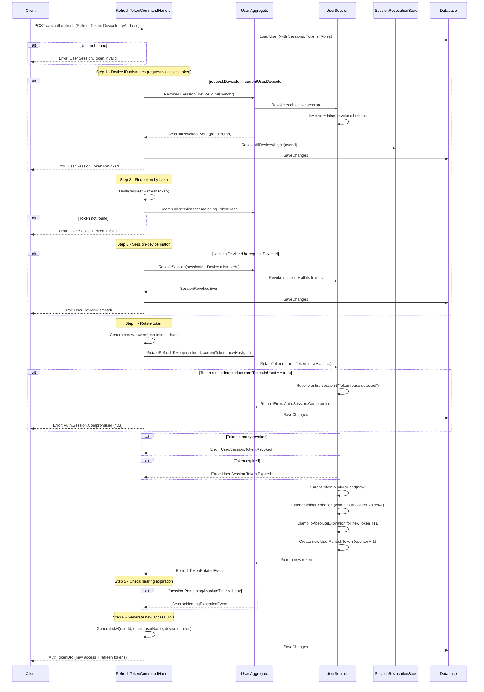
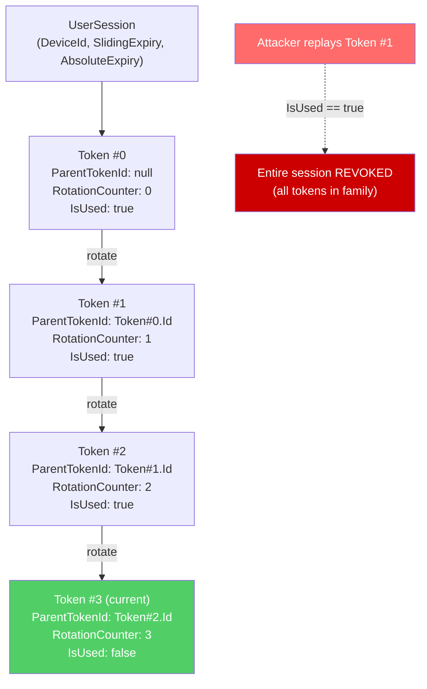

# 04 - Refresh Token Rotation

## Endpoint

| Method | Path | Auth |
|--------|------|------|
| `POST` | `/api/auth/refresh` | Requires valid access token (JWT) |

## Request

```json
{
  "refreshToken": "string",
  "deviceId": "guid",
  "ipAddress": "string (IPAddress)"
}
```

**Validation** (`IHasValidate`):
- `RefreshToken` - must not be whitespace
- `DeviceId` - must not be an empty GUID

## Response (`AuthTokenDto`)

```json
{
  "accessToken": "string",
  "refreshToken": "string (new rotated token)",
  "accessTokenExpiresAt": "datetime",
  "refreshTokenExpiresAt": "datetime",
  "session": {
    "sessionId": "guid",
    "deviceId": "guid",
    "slidingExpiresAt": "datetime",
    "absoluteExpiresAt": "datetime",
    "isNearingAbsoluteExpiration": "boolean",
    "remainingAbsoluteTime": "timespan"
  }
}
```

## Token Rotation Sequence Diagram



## Token Family Chain



## Full Flow (7 Steps)

| Step | Action | Details |
|------|--------|---------|
| 1 | **Get user** | Load `User` with `Sessions` (including `Tokens`) and `Roles`. Return `User.Session.Token.Invalid` if not found. |
| 2 | **Device mismatch check (access token)** | Compare `request.DeviceId` with `ICurrentUser.DeviceId` (from JWT). If different, revoke ALL sessions via `RevokeAllSession()`, blacklist all devices in `ISessionRevocationStore`, return `User.Session.Token.Revoked`. |
| 3 | **Find token** | Hash the incoming refresh token via `ITokenHasher.Hash()`. Iterate all sessions and their tokens looking for a matching `TokenHash`. Return `User.Session.Token.Invalid` if not found. |
| 4 | **Session-device match** | Compare `session.DeviceId` with `request.DeviceId`. If different, revoke that single session via `RevokeSession()`, return `User.DeviceMismatch`. |
| 5 | **Rotation** | Call `User.RotateRefreshToken()` which delegates to `UserSession.RotateToken()`. Inside rotation: **(a)** reuse check -- if `currentToken.IsUsed`, revoke entire session and return `Auth.Session.Compromised`; **(b)** check revoked/expired; **(c)** mark old token as used (`MarkAsUsed`); **(d)** extend sliding expiration, clamped to `AbsoluteExpiresAt`; **(e)** clamp new token's TTL to not exceed `AbsoluteExpiresAt`; **(f)** create new `UserRefreshToken` with `RotationCounter + 1` and `ParentTokenId` pointing to old token. Raises `RefreshTokenRotatedEvent`. |
| 6 | **Nearing expiration check** | If `session.RemainingAbsoluteTime(now) < 1 day` and session is not already absolute-expired, raise `SessionNearingExpirationEvent` with `AbsoluteExpiresAt` and `RemainingTime`. |
| 7 | **New JWT** | Generate a new access token JWT with `userId`, `email`, `userName`, `deviceId`, and `roles`. Return `AuthTokenDto` with both new tokens and session metadata. |

## Anti-Theft Mechanisms

### 1. Device ID Binding (Two-Layer)

- **Layer 1 -- Access token device check**: The `DeviceId` in the request body is compared against `ICurrentUser.DeviceId` extracted from the JWT. A mismatch means the refresh token was sent with someone else's access token. **Action**: revoke ALL user sessions, blacklist via `ISessionRevocationStore.RevokeAllDevicesAsync()`.
- **Layer 2 -- Session device check**: The `DeviceId` in the request is compared against `session.DeviceId`. A mismatch means the token somehow ended up on a different device. **Action**: revoke that single session.

### 2. Token Reuse Detection

Each `UserRefreshToken` has an `IsUsed` flag. When a token is rotated, the old token is marked `IsUsed = true`. If a previously-used token is presented again:
- The entire session (token family) is revoked via `session.Revoke("Token reuse detected")`.
- All tokens in the session are revoked.
- Returns `Auth.Session.Compromised` (HTTP 403).

This catches the scenario where an attacker steals a refresh token but the legitimate user has already used it.

### 3. Session Expiration (Sliding + Absolute)

- **Sliding expiration**: Extended on each rotation by `FamilySlidingExpiration`, clamped to never exceed `AbsoluteExpiresAt`.
- **Absolute expiration**: Hard maximum session lifetime (`FamilyAbsoluteExpiration`). Once reached, session is revoked with reason "Absolute expiration reached -- re-authentication required".
- New refresh token TTL is also clamped: if `now + RefreshTokenExpiration > AbsoluteExpiresAt`, the token gets a shorter TTL.

### 4. Token Hashing

Refresh tokens are never stored in plaintext. `ITokenHasher.Hash()` is used before storage, and incoming tokens are hashed before comparison.

### 5. Session Revocation Store (Blacklist)

`ISessionRevocationStore` maintains a cache-based blacklist (keys like `revoked:device:{userId}:{deviceId}` and `revoked:user:{userId}`). When sessions are revoked during refresh, corresponding entries are added so that any outstanding access tokens for those devices are immediately rejected.

## SessionNearingExpirationEvent

Raised when `session.RemainingAbsoluteTime(now) < TimeSpan.FromDays(1)` and the session has not yet absolute-expired. Contains:

| Field | Type | Description |
|-------|------|-------------|
| `UserId` | `string` | The user's ID |
| `SessionId` | `string` | The session approaching expiration |
| `AbsoluteExpiresAt` | `DateTime` | When the session will hard-expire |
| `RemainingTime` | `TimeSpan` | Time remaining until absolute expiration |
| `OccurredAt` | `DateTime` | When the event was raised |

This event allows the system to notify the user that their session is about to expire and they will need to re-authenticate.

## Error Codes

| Code | HTTP | When |
|------|------|------|
| `User.Session.Token.Invalid` | 401 | User not found, or refresh token hash not found in any session |
| `User.Session.Token.Revoked` | 401 | Request DeviceId mismatches access token DeviceId (all sessions revoked); or token was already revoked |
| `User.DeviceMismatch` | 401 | Session's DeviceId mismatches request DeviceId (single session revoked) |
| `Auth.Session.Compromised` | 403 | Token reuse detected -- entire session revoked |
| `User.Session.Token.Expired` | 401 | Refresh token has expired |
| `User.Session.Token.NotIn` | 401 | Token does not belong to the session |
| `User.Session.Inactive` | 401 | Session is no longer active |
| `User.Session.Expired` | 403 | Session sliding or absolute expiration reached |
| `User.Deleted` | 403 | User has been soft-deleted |
| `User.Locked` | 403 | User account is locked out |

## Source Files

- `src/core/OIO.Application/Context/UserContext/Commands/RefreshToken/RefreshTokenCommand.cs`
- `src/core/OIO.Application/Context/UserContext/Commands/RefreshToken/RefreshTokenCommandHandler.cs`
- `src/core/OIO.Domain/Context/UserContext/Aggregates/Users/User.cs` (RotateRefreshToken, CreateRefreshToken)
- `src/core/OIO.Domain/Context/UserContext/Aggregates/Users/UserSession.cs` (RotateToken, ExtendSlidingExpiration, ClampToAbsoluteExpiration)
- `src/core/OIO.Domain/Context/UserContext/Aggregates/Users/UserRefreshToken.cs`
- `src/core/OIO.Domain/Context/UserContext/Errors/UserErrors.cs`
- `src/core/OIO.Application/Context/UserContext/Services/ISessionRevocationStore.cs`
- `src/core/OIO.Application/Context/UserContext/Services/ITokenExpirationSettings.cs`
