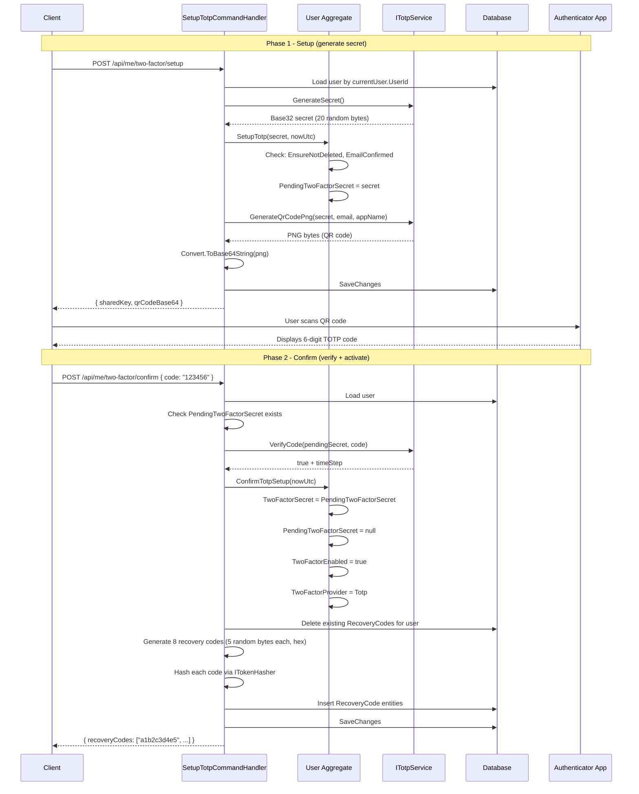
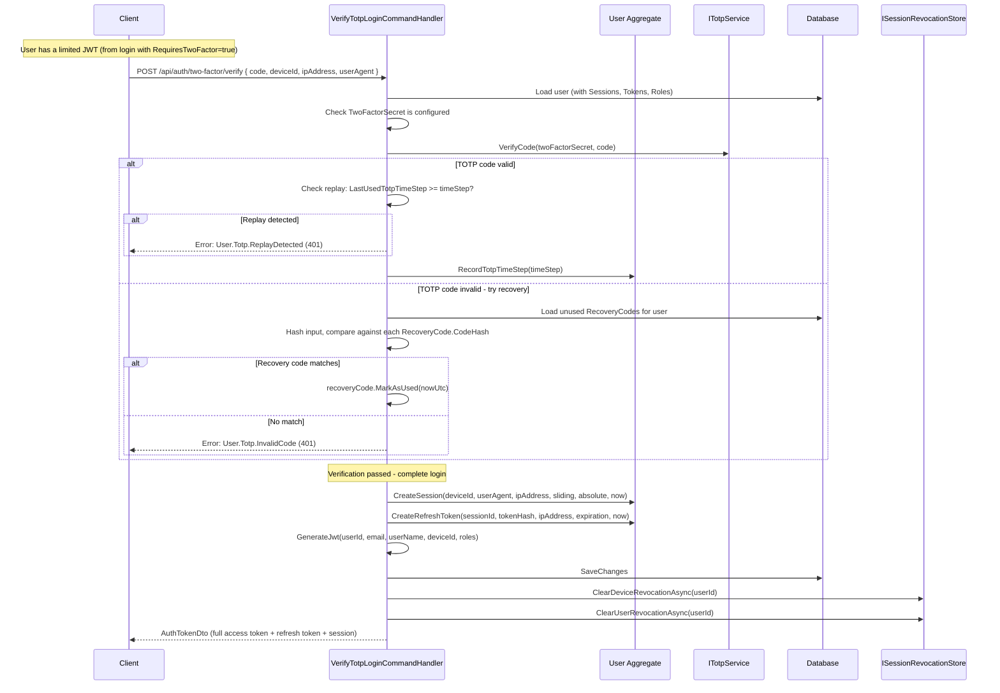
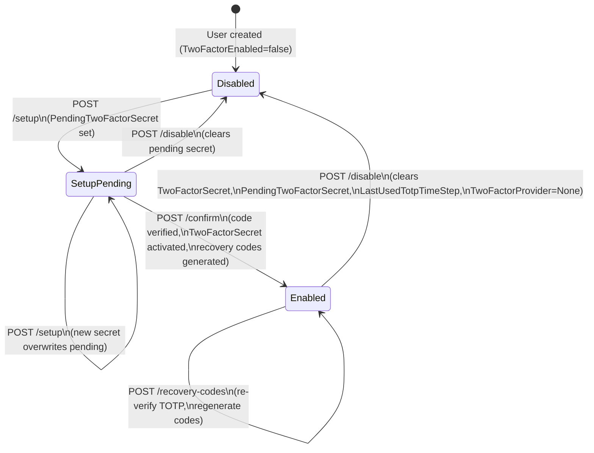

# 07 - TOTP Two-Factor Authentication

## Overview

OIO supports TOTP (Time-based One-Time Password) two-factor authentication with recovery codes. The implementation uses the **Otp.NET** library for TOTP generation/verification and **QRCoder** for QR code generation.

## Endpoints

| Method | Path | Auth | Description |
|--------|------|------|-------------|
| `POST` | `/api/me/two-factor/setup` | Requires auth | Generate TOTP secret + QR code |
| `POST` | `/api/me/two-factor/confirm` | Requires auth | Verify TOTP code + activate + return recovery codes |
| `POST` | `/api/auth/two-factor/verify` | Requires limited JWT | Verify TOTP/recovery code during login, return full JWT |
| `POST` | `/api/me/two-factor/recovery-codes` | Requires auth | Re-verify TOTP + regenerate recovery codes |
| `POST` | `/api/me/two-factor/disable` | Requires auth | Disable 2FA, clear all state |

---

## Setup Flow



## Login Verify Flow



## 2FA State Machine



---

## Endpoint Details

### 1. Setup TOTP

**`POST /api/me/two-factor/setup`** (Requires auth)

**Request**: No body required.

**Response** (`SetupTotpResponse`):
```json
{
  "sharedKey": "JBSWY3DPEHPK3PXP...",
  "qrCodeBase64": "iVBORw0KGgo..."
}
```

**Handler** (`SetupTotpCommandHandler`):
1. Load user by `ICurrentUser.UserId`.
2. Generate 20-byte random secret via `ITotpService.GenerateSecret()`, encoded as Base32.
3. Call `user.SetupTotp(secret, nowUtc)`:
   - `EnsureNotDeleted()`.
   - Check `EmailConfirmed` is true, otherwise return `User.Email.NotConfirmed`.
   - Set `PendingTwoFactorSecret = secret`.
4. Generate QR code PNG via `ITotpService.GenerateQrCodePng(secret, email, appName)`.
5. Convert PNG to Base64.
6. Save and return.

**Error codes**:
| Code | HTTP | When |
|------|------|------|
| `User.NotFound` | 404 | User not found |
| `User.Email.NotConfirmed` | 403 | Email not confirmed |
| `User.Deleted` | 403 | User soft-deleted |

---

### 2. Confirm TOTP Setup

**`POST /api/me/two-factor/confirm`** (Requires auth)

**Request**:
```json
{
  "code": "123456"
}
```

**Validation**: `Code` must not be whitespace.

**Response** (`ConfirmTotpSetupResponse`):
```json
{
  "recoveryCodes": [
    "a1b2c3d4e5",
    "f6g7h8i9j0",
    "..."
  ]
}
```

**Handler** (`ConfirmTotpSetupCommandHandler`):
1. Load user.
2. Check `PendingTwoFactorSecret` is not null/whitespace. If missing, return `User.Totp.NoPendingSecret`.
3. Verify the TOTP code against the pending secret via `ITotpService.VerifyCode()`. If invalid, return `User.Totp.InvalidCode`.
4. Call `user.ConfirmTotpSetup(nowUtc)`:
   - `TwoFactorSecret = PendingTwoFactorSecret`
   - `PendingTwoFactorSecret = null`
   - `TwoFactorEnabled = true`
   - `TwoFactorProvider = TwoFactorProvider.Totp`
5. Delete all existing `RecoveryCode` entities for the user.
6. Generate **8 recovery codes**: each is `RandomNumberGenerator.GetBytes(5)` (5 bytes = 10 hex characters), converted to lowercase hex string.
7. Hash each code via `ITokenHasher.Hash()` and create `RecoveryCode` entities.
8. Save and return the **plaintext** codes (shown once, never stored in plaintext).

**Error codes**:
| Code | HTTP | When |
|------|------|------|
| `User.NotFound` | 404 | User not found |
| `User.Totp.NoPendingSecret` | 403 | No pending TOTP setup (call setup first) |
| `User.Totp.InvalidCode` | 401 | TOTP code does not match pending secret |

---

### 3. Verify TOTP Login

**`POST /api/auth/two-factor/verify`** (Requires limited JWT from login)

**Request**:
```json
{
  "code": "123456 or recovery-code",
  "deviceId": "guid",
  "ipAddress": "string",
  "userAgent": "string"
}
```

**Validation**: `Code` and `UserAgent` must not be whitespace.

**Response** (`AuthTokenDto`):
```json
{
  "accessToken": "string (full JWT)",
  "refreshToken": "string",
  "accessTokenExpiresAt": "datetime",
  "refreshTokenExpiresAt": "datetime",
  "session": {
    "sessionId": "guid",
    "deviceId": "guid",
    "slidingExpiresAt": "datetime",
    "absoluteExpiresAt": "datetime",
    "isNearingAbsoluteExpiration": "boolean",
    "remainingAbsoluteTime": "timespan"
  }
}
```

**Handler** (`VerifyTotpLoginCommandHandler`):
1. Load user with Sessions, Tokens, and Roles.
2. Check `TwoFactorSecret` is configured. If not, return `User.Totp.NotConfigured`.
3. **Try TOTP verification**: `ITotpService.VerifyCode(secret, code, out timeStep)`.
   - If valid: check for **replay attack** -- if `LastUsedTotpTimeStep >= timeStep`, return `User.Totp.ReplayDetected`. Otherwise, call `user.RecordTotpTimeStep(timeStep)`.
   - If invalid: **try recovery codes**.
4. **Recovery code fallback**: Load all unused `RecoveryCode` entities for the user. For each, verify `ITokenHasher.Verify(code, recoveryCode.CodeHash)`. If a match is found, call `recoveryCode.MarkAsUsed(nowUtc)`. If no match, return `User.Totp.InvalidCode`.
5. **Complete login** (same as normal login):
   - `user.CreateSession(deviceId, userAgent, ipAddress, slidingExpiration, absoluteExpiration, now)`
   - Generate and hash refresh token, `user.CreateRefreshToken(...)`
   - Generate full JWT with all roles
6. Save changes.
7. Clear revocation entries: `ClearDeviceRevocationAsync` and `ClearUserRevocationAsync`.
8. Return `AuthTokenDto`.

**Error codes**:
| Code | HTTP | When |
|------|------|------|
| `User.NotFound` | 404 | User not found |
| `User.Totp.NotConfigured` | 403 | TwoFactorSecret is null/empty |
| `User.Totp.ReplayDetected` | 401 | TOTP code already used in this time step |
| `User.Totp.InvalidCode` | 401 | Neither TOTP nor recovery code matched |

---

### 4. Regenerate Recovery Codes

**`POST /api/me/two-factor/recovery-codes`** (Requires auth)

**Request**:
```json
{
  "code": "123456"
}
```

**Validation**: `Code` must not be whitespace.

**Response** (`RegenerateRecoveryCodesResponse`):
```json
{
  "recoveryCodes": [
    "a1b2c3d4e5",
    "f6g7h8i9j0",
    "..."
  ]
}
```

**Handler** (`RegenerateRecoveryCodesCommandHandler`):
1. Load user.
2. Check `TwoFactorEnabled == true` and `TwoFactorSecret` is not null. If not, return `User.Totp.NotEnabled`.
3. **Re-verify TOTP**: `ITotpService.VerifyCode(secret, code)`. If invalid, return `User.Totp.InvalidCode`.
4. Delete all existing `RecoveryCode` entities for the user.
5. Generate **8 new recovery codes** (same algorithm: 5 random bytes, hex, hashed).
6. Insert new `RecoveryCode` entities.
7. Save and return plaintext codes.

**Error codes**:
| Code | HTTP | When |
|------|------|------|
| `User.NotFound` | 404 | User not found |
| `User.Totp.NotEnabled` | 403 | 2FA not enabled or secret not configured |
| `User.Totp.InvalidCode` | 401 | TOTP code invalid |

---

### 5. Disable Two-Factor

**`POST /api/me/two-factor/disable`** (Requires auth)

**Request**: No body required.

**Response**: `204 No Content`.

**Handler** (`DisableTwoFactorCommandHandler`):
1. Load user.
2. Call `user.DisableTwoFactor(nowUtc)`:
   - `TwoFactorEnabled = false`
   - `TwoFactorProvider = TwoFactorProvider.None`
   - `TwoFactorSecret = null`
   - `PendingTwoFactorSecret = null`
   - `LastUsedTotpTimeStep = null`
   - `ModifiedAt = nowUtc`
3. Save changes.

Note: This does **not** delete `RecoveryCode` entities from the database. They become orphaned since 2FA is disabled.

**Error codes**:
| Code | HTTP | When |
|------|------|------|
| `User.NotFound` | 404 | User not found |
| `User.Deleted` | 403 | User soft-deleted |

---

## Technical Details

### TOTP Parameters

| Parameter | Value | Source |
|-----------|-------|--------|
| Algorithm | SHA-1 | Otp.NET default (`new Totp(key)`) |
| Digits | 6 | QR URI: `digits=6` |
| Period | 30 seconds | QR URI: `period=30` |
| Secret length | 20 bytes | `KeyGeneration.GenerateRandomKey(20)` |
| Secret encoding | Base32 | `Base32Encoding.ToString(key)` |
| Verification window | RFC specified network delay | `VerificationWindow.RfcSpecifiedNetworkDelay` |

### QR Code Format

The QR code encodes an `otpauth://` URI:

```
otpauth://totp/{issuer}:{userEmail}?secret={base32Secret}&issuer={issuer}&digits=6&period=30
```

- `issuer` and `userEmail` are URI-escaped via `Uri.EscapeDataString()`.
- Generated as PNG using `QRCoder.PngByteQRCode` with error correction level Q and pixel size 5.
- Returned as Base64-encoded string.

### Recovery Codes

| Property | Value | Source |
|----------|-------|--------|
| Count | 8 codes per generation | `RecoveryCodeCount = 8` |
| Length | 10 hex characters (lowercase) | `RecoveryCodeByteLength = 5` bytes -> `Convert.ToHexString().ToLower()` |
| Storage | Hashed via `ITokenHasher.Hash()` | Only hashed values stored in `RecoveryCode.CodeHash` |
| Usage | Single-use | `RecoveryCode.IsUsed` flag, `MarkAsUsed(nowUtc)` sets `IsUsed = true` and `UsedAt` |
| Generation | `RandomNumberGenerator.GetBytes(5)` | Cryptographically secure random |
| Regeneration | Old codes deleted, new codes created | All existing `RecoveryCode` entities removed before inserting new ones |

### Replay Prevention

The `User.LastUsedTotpTimeStep` field stores the TOTP time step of the last successfully verified code. During verification:

1. `ITotpService.VerifyCode()` returns the matching `timeStep` (a `long`).
2. If `user.LastUsedTotpTimeStep.HasValue && user.LastUsedTotpTimeStep.Value >= timeStep`, the code is rejected as a replay.
3. On success, `user.RecordTotpTimeStep(timeStep)` updates the stored value.

This prevents the same TOTP code from being used twice within the same 30-second window.

---

## Database Schema

### User TOTP Fields (on `User` entity)

| Field | Type | Description |
|-------|------|-------------|
| `TwoFactorEnabled` | `bool` | Whether 2FA is currently active |
| `TwoFactorProvider` | `TwoFactorProvider` (enum) | `None`, `Totp`, `Sms`, `Email` |
| `TwoFactorSecret` | `string?` | Active TOTP secret (Base32). Set when confirmed. |
| `PendingTwoFactorSecret` | `string?` | Pending TOTP secret during setup (before confirmation) |
| `LastUsedTotpTimeStep` | `long?` | Time step of last verified TOTP code (replay prevention) |

### RecoveryCode Entity

| Field | Type | Description |
|-------|------|-------------|
| `Id` | `RecoveryCodeId` | GUIDv7 primary key |
| `UserId` | `UserId` | Foreign key to User |
| `CodeHash` | `string` | Hashed recovery code |
| `IsUsed` | `bool` | Whether this code has been consumed |
| `CreatedAt` | `DateTime` | When the code was generated |
| `UsedAt` | `DateTime?` | When the code was consumed (null if unused) |

---

## Packages

| Package | Usage |
|---------|-------|
| **Otp.NET** (`OtpNet`) | `KeyGeneration.GenerateRandomKey()`, `Base32Encoding`, `Totp`, `VerificationWindow.RfcSpecifiedNetworkDelay` |
| **QRCoder** | `QRCodeGenerator`, `PngByteQRCode` for generating QR code PNG bytes |

---

## Source Files

- `src/core/OIO.Application/Context/UserContext/Commands/SetupTotp/SetupTotpCommand.cs`
- `src/core/OIO.Application/Context/UserContext/Commands/ConfirmTotpSetup/ConfirmTotpSetupCommand.cs`
- `src/core/OIO.Application/Context/UserContext/Commands/VerifyTotpLogin/VerifyTotpLoginCommand.cs`
- `src/core/OIO.Application/Context/UserContext/Commands/RegenerateRecoveryCodes/RegenerateRecoveryCodesCommand.cs`
- `src/core/OIO.Application/Context/UserContext/Commands/DisableTwoFactor/DisableTwoFactorCommand.cs`
- `src/core/OIO.Application/Context/UserContext/Commands/DisableTwoFactor/DisableTwoFactorCommandHandler.cs`
- `src/infrastructure/OIO.Infrastructure/Auth/TotpService.cs`
- `src/core/OIO.Application/Abstractions/Auth/ITotpService.cs`
- `src/core/OIO.Domain/Context/UserContext/Aggregates/Users/User.cs` (SetupTotp, ConfirmTotpSetup, RecordTotpTimeStep, DisableTwoFactor)
- `src/core/OIO.Domain/Context/UserContext/Aggregates/Users/RecoveryCode.cs`
- `src/presentation/OIO.Api/Common/ApiEndpoint.Url.cs`
