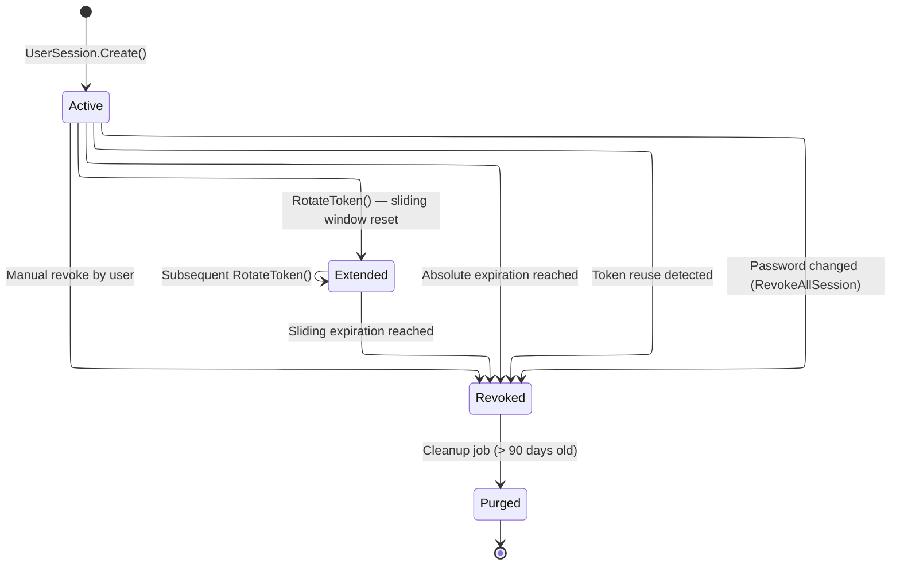
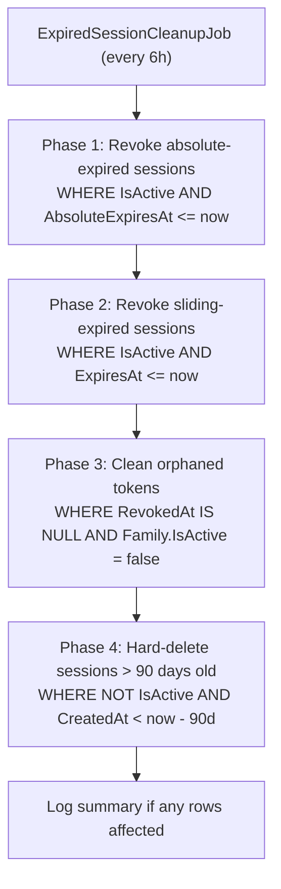

# 08 - Session Management

## Overview

OIO uses a **session-based refresh token family** model. Each login creates a `UserSession` that owns a chain of `UserRefreshToken` entries. Sessions track two independent expiration windows (sliding and absolute) and are cleaned up by a background job every 6 hours.

---

## Session Lifecycle

---

## Cleanup Job — 4 Phases

---

## Endpoints

### GET /api/me/sessions

Returns a paginated list of the authenticated user's active sessions.

- **Response:** `PagedList<UserSessionDto>`
- **Filters:** `IsActive == true` AND `UtcNow < ExpiresAt` (sliding window)
- **Sort:** `LastRotatedAt` descending (most recently used first)
- **Current device marking:** The caller passes `CurrentDeviceId`; sessions where `DeviceId == CurrentDeviceId` have `IsCurrentDevice = true`

**UserSessionDto fields:**

| Field | Type | Description |
|-------|------|-------------|
| `SessionId` | `Guid` | Primary key of the session |
| `DeviceId` | `Guid` | Device identifier bound to the session |
| `UserAgent` | `string` | Browser / client User-Agent string |
| `IpAddress` | `string` | IP address at session creation |
| `IsActive` | `bool` | Whether the session is still active |
| `IsCurrentDevice` | `bool` | `true` if `DeviceId` matches the request's `CurrentDeviceId` |
| `CreatedAt` | `DateTime` | When the session was created |
| `LastRotatedAt` | `DateTime` | When the last token rotation occurred |
| `SlidingExpiresAt` | `DateTime` | Current sliding expiration deadline |
| `AbsoluteExpiresAt` | `DateTime` | Hard lifetime deadline |
| `IsNearingAbsoluteExpiration` | `bool` | `true` if remaining absolute time < 1 day and not yet expired |
| `RemainingAbsoluteTime` | `TimeSpan` | Time left until absolute expiration (`TimeSpan.Zero` if past) |

### GET /api/me/login-history

Returns a paginated list of the authenticated user's login history entries.

- **Response:** `PagedList<LoginHistoryDto>`
- **Sort:** `LoginAt` descending (most recent first)
- **Pagination:** Applied via `PagedParameters` using the `.Page()` extension

**LoginHistoryDto fields:**

| Field | Type | Description |
|-------|------|-------------|
| `Id` | `Guid` | Primary key |
| `IpAddress` | `string` | IP address of the login attempt |
| `UserAgent` | `string` | Browser / client User-Agent string |
| `LoginAt` | `DateTime` | Timestamp of the login attempt |
| `Status` | `string` | Login status enum ID — `"success"` or `"failed"` |

---

## Domain Entities

### UserSession Entity

Defined in `OIO.Domain.Context.UserContext.Aggregates.Users.UserSession`.

| Property | Type | Description |
|----------|------|-------------|
| `Id` | `UserSessionId` | Strongly-typed ID (wraps `Guid`, created via `Guid.CreateVersion7()`) |
| `UserId` | `UserId` | Foreign key to the owning user |
| `DeviceId` | `Guid` | Device identifier (passed from client) |
| `UserAgent` | `string` | Client User-Agent at session creation |
| `IpAddress` | `IPAddress` | Client IP at session creation |
| `IsActive` | `bool` | `true` until revoked or expired |
| `ExpiresAt` | `DateTime` | Sliding expiration deadline (clamped to `AbsoluteExpiresAt`) |
| `AbsoluteExpiresAt` | `DateTime` | Hard lifetime deadline — never extended |
| `CreatedAt` | `DateTime` | Session creation time |
| `LastRotatedAt` | `DateTime` | Updated on every successful token rotation |
| `RevokedAt` | `DateTime?` | When the session was revoked (`null` while active) |
| `RevokedReason` | `string?` | Human-readable reason for revocation |
| `Tokens` | `IReadOnlyList<UserRefreshToken>` | Child refresh token chain |

**Key behaviors:**

- `Create(...)` — Static factory; sets `IsActive = true`, clamps `ExpiresAt` to `AbsoluteExpiresAt` if sliding > absolute.
- `RotateToken(...)` — Marks current token as used, creates new child token, extends sliding window, increments `RotationCounter`. If token reuse is detected, the entire session is revoked with reason `"Token reuse detected -- possible token theft"`.
- `Revoke(reason, now)` — Sets `IsActive = false`, records `RevokedAt`/`RevokedReason`, and revokes all child tokens that are not already revoked.
- `EnsureActive(now)` — Internal guard; returns specific errors for `SessionNoLongerActive`, `SessionAbsoluteExpired`, or `SessionSlidingExpired`.
- `ExtendSlidingExpiration(...)` — Recomputes `ExpiresAt = now + slidingDuration`, clamped to `AbsoluteExpiresAt`.
- `IsNearingAbsoluteExpiration(now)` — Returns `true` when remaining absolute time < 1 day and not yet expired.
- `RemainingAbsoluteTime(now)` — Returns `AbsoluteExpiresAt - now`, or `TimeSpan.Zero` if past.

### UserLoginHistory Entity

Defined in `OIO.Domain.Context.UserContext.Aggregates.Users.UserLoginHistory`.

| Property | Type | Description |
|----------|------|-------------|
| `Id` | `UserLoginHistoryId` | Strongly-typed ID (`Guid.CreateVersion7()`) |
| `UserId` | `UserId` | Foreign key to the user |
| `IpAddress` | `IPAddress` | IP address of the login attempt |
| `UserAgent` | `string` | Client User-Agent string |
| `LoginAt` | `DateTime` | Timestamp of the attempt |
| `Status` | `LoginStatus` | Enum value object — `"success"` or `"failed"` |

---

## Background Job: ExpiredSessionCleanupJob

**Source:** `OIO.Infrastructure.Scheduling.Jobs.ExpiredSessionCleanupJob`

| Setting | Value |
|---------|-------|
| Type | `BackgroundService` (hosted service) |
| Interval | 6 hours (`TimeSpan.FromHours(6)`) |
| Scoped services | `ApplicationDbContext`, `IClock` |

### Execution phases

| Phase | Action | SQL filter | Operation |
|-------|--------|------------|-----------|
| 1 | Revoke absolute-expired sessions | `IsActive AND AbsoluteExpiresAt <= now` | `ExecuteUpdateAsync` — sets `IsActive = false`, `RevokedAt = now`, `RevokedReason = "Absolute expiration reached (cleanup job)"` |
| 2 | Revoke sliding-expired sessions | `IsActive AND ExpiresAt <= now` | `ExecuteUpdateAsync` — sets `IsActive = false`, `RevokedAt = now`, `RevokedReason = "Sliding expiration reached (cleanup job)"` |
| 3 | Clean orphaned tokens | `RevokedAt IS NULL AND Family.IsActive = false` | `ExecuteUpdateAsync` — sets `RevokedAt = now`, `RevokedReason = "Family revoked (cleanup job)"` |
| 4 | Purge old inactive sessions | `NOT IsActive AND CreatedAt < now - 90 days` | `ExecuteDeleteAsync` — hard deletes rows |

The job logs a summary only when at least one row is affected across all four phases.

---

## Related Source Files

| File | Path |
|------|------|
| GetActiveSessionsQuery | `src/core/OIO.Application/Context/UserContext/Queries/GetActiveSessions/GetActiveSessionsQuery.cs` |
| GetActiveSessionsQueryHandler | `src/core/OIO.Application/Context/UserContext/Queries/GetActiveSessions/GetActiveSessionsQueryHandler.cs` |
| GetLoginHistoryQuery | `src/core/OIO.Application/Context/UserContext/Queries/GetLoginHistory/GetLoginHistoryQuery.cs` |
| GetLoginHistoryQueryHandler | `src/core/OIO.Application/Context/UserContext/Queries/GetLoginHistory/GetLoginHistoryQueryHandler.cs` |
| UserSession | `src/core/OIO.Domain/Context/UserContext/Aggregates/Users/UserSession.cs` |
| UserLoginHistory | `src/core/OIO.Domain/Context/UserContext/Aggregates/Users/UserLoginHistory.cs` |
| LoginStatus | `src/core/OIO.Domain/Context/UserContext/Enums/LoginStatus.cs` |
| UserSessionDto | `src/core/OIO.Application/Context/UserContext/DTOs/UserSessionDto.cs` |
| LoginHistoryDto | `src/core/OIO.Application/Context/UserContext/DTOs/LoginHistoryDto.cs` |
| ExpiredSessionCleanupJob | `src/infrastructure/OIO.Infrastructure/Scheduling/Jobs/ExpiredSessionCleanupJob.cs` |
