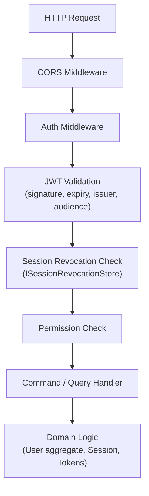
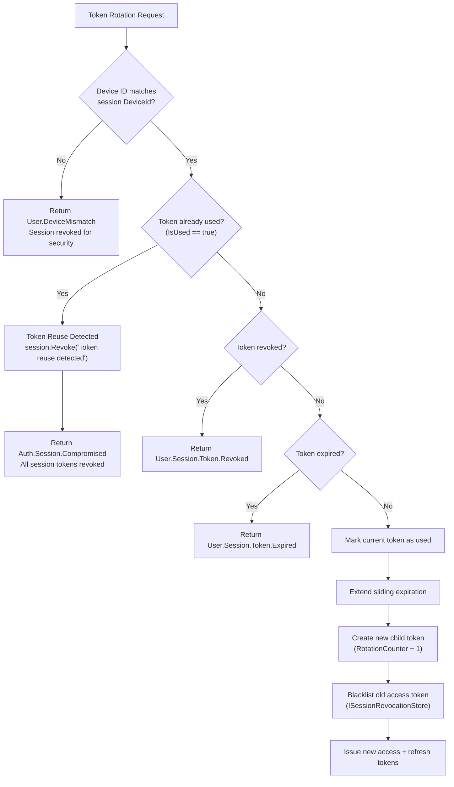

# 10 - Security Reference

## Overview

This document consolidates the security architecture of the OIO Auction Platform's authentication and session management system: middleware layers, anti-theft detection, error codes, configuration values, and integration points.

---

## Security Layers

---

## Anti-Theft Detection Chain

---

## Security Features

| # | Feature | Implementation |
|---|---------|---------------|
| 1 | **Password Hashing** | `IPasswordHasher.Hash()` / `Verify()` — domain service interface; concrete implementation in infrastructure |
| 2 | **Account Lockout** | `User.EnsureNotLockedOut(nowUtc)` — domain guard checks `LockoutEnd`; returns `User.Locked` error with lockout end time and reason |
| 3 | **Brute Force Detection** | `LoginAttemptedEventHandler.TrackFailedLoginRateAsync()` — tracks failed attempts per IP in `HybridCache` with 1-hour window; creates `MonitoringAlert` (severity `High`, type `login_brute_force`) when count reaches threshold of **5** |
| 4 | **Suspicious Login Detection** | `LoginAttemptedEventHandler.DetectSuspiciousLoginAsync()` — caches known IPs per user (`known_login_ips:{userId}`, 24h TTL); on new IP, creates `MonitoringAlert` (severity `Medium`, type `suspicious_login_new_ip`) and dispatches a high-priority `CreateNotificationCommand` |
| 5 | **Token Rotation** | `UserSession.RotateToken()` — marks current token as used, creates child token with `ParentTokenId` link and incremented `RotationCounter`, extends sliding expiration |
| 6 | **Device Binding** | Each session is bound to a `DeviceId` (Guid); token rotation verifies `DeviceId` match; mismatch returns `User.DeviceMismatch` |
| 7 | **Token Reuse Detection** | `UserSession.RotateToken()` checks `currentToken.IsUsed`; if `true`, revokes the entire session with reason `"Token reuse detected -- possible token theft"` and returns `Auth.Session.Compromised` |
| 8 | **TOTP Replay Prevention** | `VerifyTotpLoginCommandHandler` compares `timeStep` against `user.LastUsedTotpTimeStep`; if `>= timeStep`, returns `User.Totp.ReplayDetected`; otherwise records the new time step via `user.RecordTotpTimeStep(timeStep)` |
| 9 | **Dual Expiration Windows** | Sessions have both `ExpiresAt` (sliding, reset on rotation) and `AbsoluteExpiresAt` (hard limit, never extended); sliding is clamped to absolute |
| 10 | **Session Revocation** | `UserSession.Revoke(reason, now)` — sets `IsActive = false`, records reason, revokes all child tokens; `ISessionRevocationStore` provides cache-level JWT blacklisting |
| 11 | **Recovery Codes** | `RecoveryCode` entity with hashed codes (`ITokenHasher.Verify`); used as TOTP fallback; marked as used after single use via `MarkAsUsed(nowUtc)` |
| 12 | **Email Verification Tokens** | `ISecureTokenStore` with `TokenType.EmailVerification`; stores hashed token with TTL; validated and invalidated after use |
| 13 | **Password Reset Tokens** | `ISecureTokenStore` with `TokenType.PasswordReset`; rate-limited to `MaxPasswordResetAttemptsPerHour` (default 5); validated and invalidated after use |
| 14 | **Rate Limiting** | `ISecureTokenStore.HasActiveTokenAsync()` / `GetTokenTtlAsync()` for cooldown enforcement (e.g., `ResendEmailCooldown`); `HybridCache` for login attempt rate tracking |

---

## Error Codes

### Auth Errors

| Code | HTTP Status | Description |
|------|-------------|-------------|
| `Auth.Authentication.Required` | 401 | Authentication is required to access this resource |
| `Auth.Insufficient.Permissions` | 403 | You do not have permission to access this resource |
| `Auth.Token.Missing` | 401 | Access token is required |
| `Auth.Token.Invalid` | 401 | Access token is invalid |
| `Auth.Token.Revoked` | 401 | Access token is revoked |
| `Auth.Token.Expired` | 401 | Access token has expired |
| `Auth.User.NotLoggedIn` | 401 | User is not logged in |
| `Auth.Session.NotFound` | 404 | The specified session was not found |
| `Auth.Session.Compromised` | 403 | Token reuse detected. All sessions revoked for security |

### User Errors

| Code | HTTP Status | Description |
|------|-------------|-------------|
| `User.Credentials.Invalid` | 401 | The provided email or password is incorrect |
| `User.NotFound` | 404 | User with the given identifier was not found |
| `User.Locked` | 403 | The user is locked due to suspension |
| `User.Inactive` | 403 | The user is not active |
| `User.Deleted` | 403 | User has been deleted |
| `User.Email.AlreadyExists` | 409 | A user with this email already exists |
| `User.UserName.AlreadyExists` | 409 | A user with this username already exists |
| `User.ConfirmationToken.Invalid` | 401 | The confirmation token is invalid or expired |
| `User.ConfirmationCode.Invalid` | 401 | The confirmation code is invalid or expired |
| `User.Email.NotConfirmed` | 403 | The email address has not been confirmed |
| `User.Email.Confirmed` | 403 | The email address has been confirmed |
| `User.DeviceMismatch` | 401 | The request originated from a different device. Session revoked for security |
| `User.Session.Inactive` | 401 | Session is no longer active |
| `User.Session.Expired` | 403 | Session has reached its maximum lifetime or expired due to inactivity |
| `User.TwoFactorProvider.Invalid` | 400 | Two factor provider is invalid |
| `User.PhoneNumber.NotSet` | 403 | No phone number has been set for this user |
| `User.PhoneNumber.NotConfirmed` | 403 | Please confirm your phone number |

### Refresh Token Errors

| Code | HTTP Status | Description |
|------|-------------|-------------|
| `User.Session.Token.Revoked` | 401 | Token has been revoked |
| `User.Session.Token.Expired` | 401 | Token has expired |
| `User.Session.Token.Invalid` | 401 | The refresh token is invalid or expired |
| `User.Session.Token.NotIn` | 401 | Token does not belong to this session |

### TOTP Errors

| Code | HTTP Status | Description |
|------|-------------|-------------|
| `User.Totp.NotConfigured` | 403 | TOTP two-factor authentication is not configured for this user |
| `User.Totp.ReplayDetected` | 401 | This TOTP code has already been used. Please wait for a new code |
| `User.Totp.InvalidCode` | 401 | The provided TOTP code or recovery code is invalid |

---

## Configuration Reference

### JwtOptions (`Jwt` section)

Source: `OIO.Infrastructure.Settings.JwtOptions`

| Property | Type | Default | Production Value |
|----------|------|---------|-----------------|
| `SecretKey` | `string` | *(required)* | *(secret, not in config)* |
| `Issuer` | `string` | *(required)* | `"OIO"` |
| `Audience` | `string` | *(required)* | `"OIO"` |
| `AccessTokenExpiration` | `TimeSpan` | 15 minutes | `00:15:00` |
| `RefreshTokenExpiration` | `TimeSpan` | 7 days | `7.00:00:00` |
| `RefreshTokenFamilySlidingExpiration` | `TimeSpan` | 7 days | `7.00:00:00` |
| `RefreshTokenFamilyAbsoluteExpiration` | `TimeSpan` | 180 days | `180.00:00:00` |

### AuthOptions (`Auth` section)

Source: `OIO.Application.Abstractions.Commons.AuthOptions`

| Property | Type | Default | Production Value |
|----------|------|---------|-----------------|
| `PasswordResetTokenExpiration` | `TimeSpan` | 30 minutes | `00:30:00` |
| `ResendEmailCooldown` | `TimeSpan` | 60 seconds | `00:01:00` |
| `EmailVerificationTokenExpiration` | `TimeSpan` | 30 minutes | `00:30:00` |
| `TwoFactorSetupTokenExpiration` | `TimeSpan` | 30 minutes | `00:30:00` |
| `PhoneVerificationTokenExpiration` | `TimeSpan` | 30 minutes | `00:30:00` |
| `MaxPasswordResetAttemptsPerHour` | `int` | 5 | `5` |

---

## Integration Points

| Interface | Namespace | Purpose |
|-----------|-----------|---------|
| `IUserMailNotifier` | `OIO.Application.Abstractions.Mail` | Sends security alert emails (password changed, account locked, session revoked, welcome/verify, password reset) |
| `ISecureTokenStore` | `OIO.Application.Abstractions.Security` | Creates, validates, and invalidates hashed tokens with TTL (email verification, password reset, phone verification, 2FA setup, account deletion) |
| `IPasswordHasher` | `OIO.Domain.Context.UserContext.Services` | Hashes and verifies user passwords |
| `ITotpService` | `OIO.Application.Abstractions.Auth` | Generates TOTP secrets, QR code PNGs, and verifies TOTP codes with time step output |
| `ISessionRevocationStore` | `OIO.Application.Context.UserContext.Services` | Cache-level JWT blacklisting per device (`revoked:device:{userId}:{deviceId}`) or per user (`revoked:user:{userId}`); supports revoke, check, and clear operations |
| `ITokenHasher` | `OIO.Domain.Context.UserContext.Services` | Hashes and verifies refresh tokens and recovery codes |
| `IJwtTokenProvider` | `OIO.Application.Context.UserContext.Services` | Generates full JWT access tokens (with userId, email, userName, deviceId, roles), raw refresh tokens, and limited 2FA JWT tokens |
| `IClock` | `OIO.Application.Abstractions.Clock` | Provides `UtcNow` — single source of time for all auth operations |
| `HybridCache` | `Microsoft.Extensions.Caching.Hybrid` | Distributed + local cache used for known login IPs (`known_login_ips:{userId}`, 24h TTL), failed login rate tracking (`login_failed:{ip}`, 1h TTL), and session revocation flags |

---

## Related Source Files

| File | Path |
|------|------|
| JwtOptions | `src/infrastructure/OIO.Infrastructure/Settings/JwtOptions.cs` |
| AuthOptions | `src/core/OIO.Application/Abstractions/Commons/IAppConfig.cs` |
| UserErrors | `src/core/OIO.Domain/Context/UserContext/Errors/UserErrors.cs` |
| LoginAttemptedEventHandler | `src/core/OIO.Application/Context/UserContext/EventHandlers/LoginAttemptedEventHandler.cs` |
| VerifyTotpLoginCommandHandler | `src/core/OIO.Application/Context/UserContext/Commands/VerifyTotpLogin/VerifyTotpLoginCommand.cs` |
| UserSession | `src/core/OIO.Domain/Context/UserContext/Aggregates/Users/UserSession.cs` |
| IUserMailNotifier | `src/core/OIO.Application/Abstractions/Mail/IUserMailNotifier.cs` |
| ISecureTokenStore | `src/core/OIO.Application/Abstractions/Security/ISecureTokenStore.cs` |
| IPasswordHasher | `src/core/OIO.Domain/Context/UserContext/Services/IPasswordHasher.cs` |
| ITotpService | `src/core/OIO.Application/Abstractions/Auth/ITotpService.cs` |
| ISessionRevocationStore | `src/core/OIO.Application/Context/UserContext/Services/ISessionRevocationStore.cs` |
| ITokenHasher | `src/core/OIO.Domain/Context/UserContext/Services/ITokenHasher.cs` |
| IJwtTokenProvider | `src/core/OIO.Application/Context/UserContext/Services/IJwtTokenProvider.cs` |
| IClock | `src/core/OIO.Application/Abstractions/Clock/IClock.cs` |
| Production config | `config/appsettings.Production.json` |
