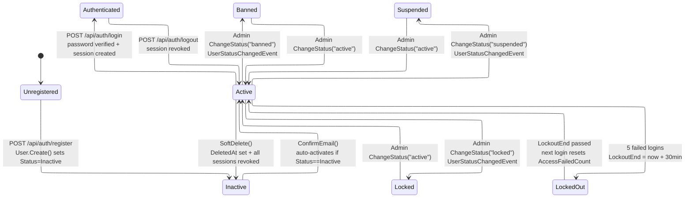
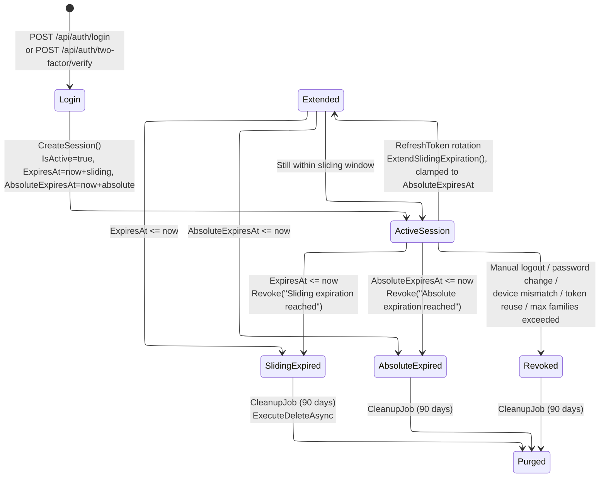
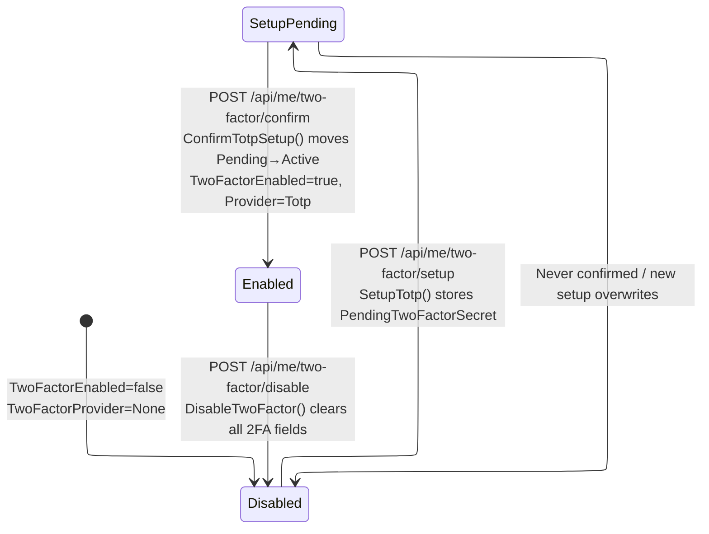
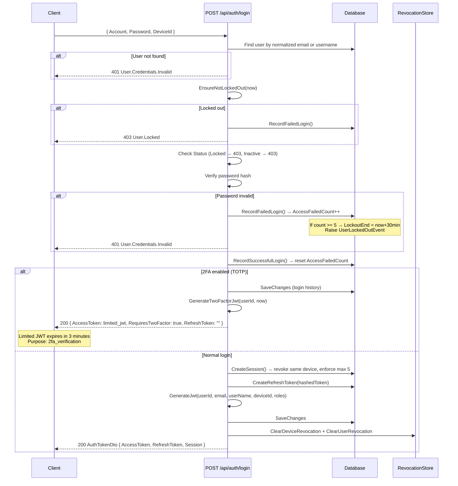
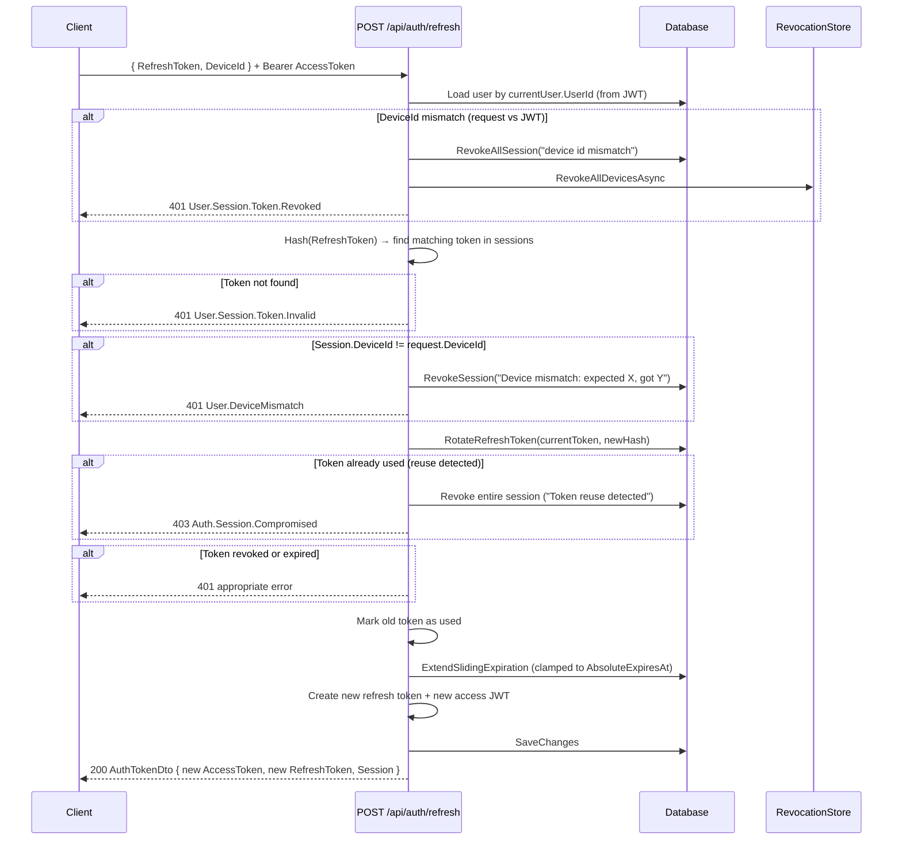
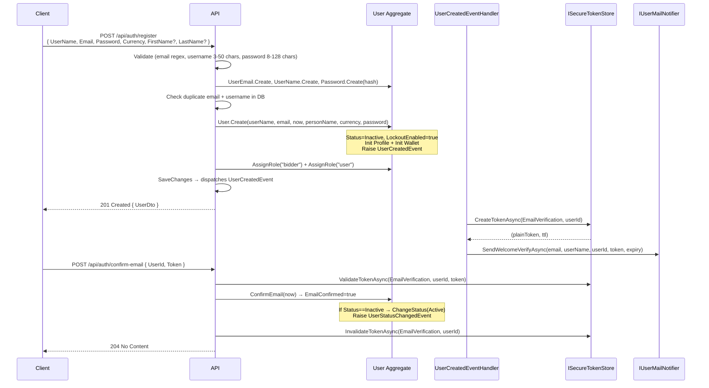
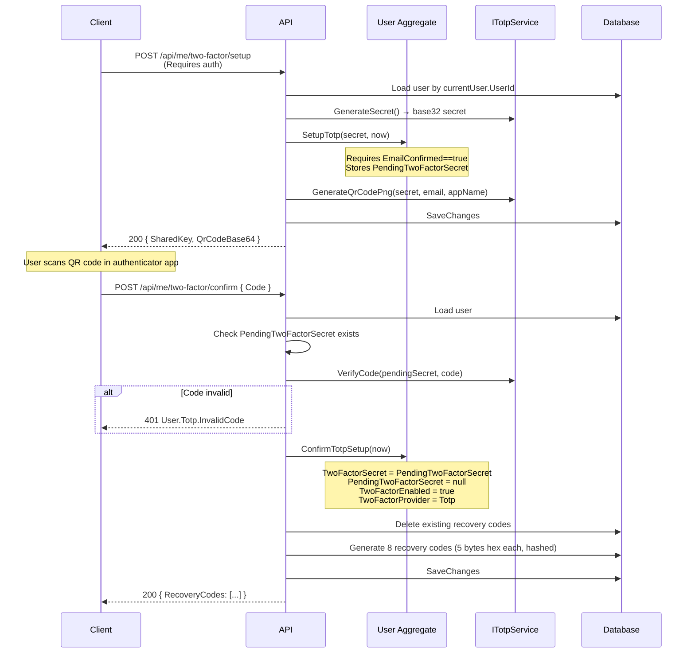

# Registration & Authentication Module

## Tong quan

Module Registration & Authentication cua OIO Auction Platform quan ly toan bo vong doi cua user tu luc dang ky den khi xac thuc, dang nhap, quan ly session, va bao mat 2FA. Module duoc xay dung theo kien truc Domain-Driven Design voi CQRS pattern (MediatR), su dung domain events de kich hoat cac side-effect nhu gui email, tao notification, va ghi audit log.

**Kien truc chinh:**
- **Domain Layer**: `User` aggregate root voi cac value objects (`UserEmail`, `UserName`, `Password`, `PersonName`) va entity con (`UserSession`, `UserRefreshToken`, `UserRole`, `UserLoginHistory`)
- **Application Layer**: Command handlers (CQRS), Event handlers (MediatR `INotificationHandler`)
- **Presentation Layer**: Minimal API endpoints (ASP.NET Core)
- **Infrastructure**: `ISecureTokenStore` (hash-based, TTL, one-time), `IJwtTokenProvider`, `IPasswordHasher`, `ISessionRevocationStore`

---

## 1. State Diagrams

### 1.1 User State Machine

**UserStatus enum values**: `active`, `inactive`, `locked`, `banned`, `suspended`

**RevokedStatus** (triggers session revocation via `UserStatusChangedEventHandler`): `banned`, `inactive`, `locked`, `suspended`

### 1.2 Session State Machine

**Key constants**:
- Max active sessions (families): `5` (MaxTokenFamilies)
- Sliding expiration: configurable via `ITokenExpirationSettings.FamilySlidingExpiration`
- Absolute expiration: configurable via `ITokenExpirationSettings.FamilyAbsoluteExpiration`
- Cleanup job interval: every 6 hours
- Purge threshold: 90 days after creation

### 1.3 2FA State Machine

**2FA providers** (TwoFactorProvider enum): `none`, `sms`, `email`, `totp`

### 1.4 Login Flow Overview (Normal + 2FA Branch)

### 1.5 Token Rotation Overview (Device Mismatch + Reuse Detection)

### 1.6 Registration + Email Verification

### 1.7 TOTP 2FA Setup Flow

---

## 2. Subflow Index

| # | File | Mo ta |
|---|------|-------|
| 01 | [01-registration.md](./01-registration.md) | Dang ky tai khoan moi |
| 02 | [02-email-verification.md](./02-email-verification.md) | Xac thuc email + gui lai email |
| 03 | [03-login.md](./03-login.md) | Dang nhap (normal + 2FA branch) |
| 04 | 04-token-refresh.md | Refresh token rotation |
| 05 | 05-logout.md | Dang xuat (single device / all) |
| 06 | 06-password-reset.md | Quen mat khau + reset |
| 07 | 07-change-password.md | Doi mat khau (authenticated) |
| 08 | 08-two-factor-setup.md | Cai dat TOTP 2FA |
| 09 | 09-session-management.md | Quan ly sessions |
| 10 | 10-security-reference.md | Tham khao bao mat |

---

## 3. Domain Events & Handlers

| Domain Event | Handler | Hanh dong |
|-------------|---------|-----------|
| `UserCreatedEvent` | `UserCreatedEventHandler` | Tao email verification token (ISecureTokenStore) + gui welcome email (SendWelcomeVerifyAsync) |
| `EmailVerificationRequestedEvent` | `EmailVerificationRequestedEventHandler` | Kiem tra cooldown (ResendEmailCooldown=60s) + tao token + gui email xac thuc (SendResendVerifyAsync) |
| `UserEmailConfirmedEvent` | `UserEmailConfirmedEventHandler` | Tao notification "Email da duoc xac thuc" + gui email xac nhan (SendEmailConfirmedAsync) |
| `UserStatusChangedEvent` | `UserStatusChangedEventHandler` | Ghi AuditLog + tao notification + gui email thong bao + revoke all sessions neu status la RevokedStatus |
| `LoginAttemptedEvent` | `LoginAttemptedEventHandler` | [Success] Detect suspicious login from new IP → MonitoringAlert + notification. [Failed] Track failed login rate per IP (cache 1h) → brute force alert at threshold 5 |
| `UserLockedOutEvent` | `UserLockedOutEventHandler` | Ghi AuditLog + tao notification "Tai khoan tam thoi bi khoa" (Urgent) + gui email alert |
| `SessionRevokedEvent` | `SessionRevokedEventHandler` | Ghi AuditLog + tao notification (High priority neu security-sensitive: reuse/mismatch/theft) + gui email alert |
| `SessionNearingExpirationEvent` | `SessionNearingExpirationEventHandler` | Tao notification "Phien dang nhap sap het han" |
| `UserPasswordChangedEvent` | `UserPasswordChangedEventHandler` | Gui email alert + revoke all sessions (ISessionRevocationStore.RevokeAllDevicesAsync) |
| `PasswordResetRequestedEvent` | `PasswordResetRequestedEventHandler` | Kiem tra cooldown + tao password reset token + gui email reset |
| `RefreshTokenRotatedEvent` | _(no dedicated handler)_ | Raised khi token rotation thanh cong |
| `VerificationSubmittedEvent` | `VerificationSubmittedEventHandler` | Xu ly eKYC verification (khong lien quan truc tiep den auth) |

---

## 4. Background Jobs

| Job | Class | Interval | Mo ta |
|-----|-------|----------|-------|
| Expired Session Cleanup | `ExpiredSessionCleanupJob` | 6 gio | 1. Revoke sessions qua absolute expiration 2. Revoke sessions qua sliding expiration 3. Revoke orphaned tokens trong revoked sessions 4. Hard delete sessions inactive > 90 ngay |

---

## 5. Tong hop Endpoints

### Auth Endpoints (`/api/auth/*`)

| # | Method | Route | Auth | Response | Mo ta |
|---|--------|-------|------|----------|-------|
| 1 | POST | `/api/auth/register` | Anonymous | 201 UserDto | Dang ky tai khoan |
| 2 | POST | `/api/auth/login` | Anonymous | 200 AuthTokenDto | Dang nhap |
| 3 | POST | `/api/auth/logout` | ExpiredTokenAllowed | 204 | Dang xuat (DeviceId? → single/all) |
| 4 | POST | `/api/auth/refresh` | ExpiredTokenAllowed | 200 AuthTokenDto | Refresh token rotation |
| 5 | POST | `/api/auth/confirm-email` | Anonymous | 204 | Xac thuc email |
| 6 | POST | `/api/auth/resend-confirm-email` | Anonymous | 204 | Gui lai email xac thuc |
| 7 | POST | `/api/auth/forgot-password` | Anonymous | 204 | Yeu cau reset mat khau |
| 8 | POST | `/api/auth/reset-password` | Anonymous | 204 | Reset mat khau bang token |
| 9 | POST | `/api/auth/two-factor/verify` | RequireAuthorization | 200 AuthTokenDto | Xac thuc TOTP khi dang nhap |

### Me Endpoints (`/api/me/*`) - Lien quan den Auth

| # | Method | Route | Auth | Response | Mo ta |
|---|--------|-------|------|----------|-------|
| 10 | PUT | `/api/me/password` | RequireAuthorization | 204 | Doi mat khau |
| 11 | POST | `/api/me/two-factor/enable` | RequireAuthorization | 204 | Bat 2FA (provider: sms/email/totp) |
| 12 | POST | `/api/me/two-factor/disable` | RequireAuthorization | 204 | Tat 2FA |
| 13 | POST | `/api/me/two-factor/setup` | RequireAuthorization | 200 SetupTotpResponse | Khoi tao TOTP (QR code) |
| 14 | POST | `/api/me/two-factor/confirm` | RequireAuthorization | 200 ConfirmTotpSetupResponse | Xac nhan TOTP setup + nhan recovery codes |
| 15 | GET | `/api/me/sessions` | RequireAuthorization | 200 List | Xem sessions dang hoat dong |
| 16 | GET | `/api/me/login-history` | RequireAuthorization | 200 List | Xem lich su dang nhap |
| 17 | POST | `/api/me/two-factor/recovery-codes` | RequireAuthorization | 200 | Tao lai recovery codes |
