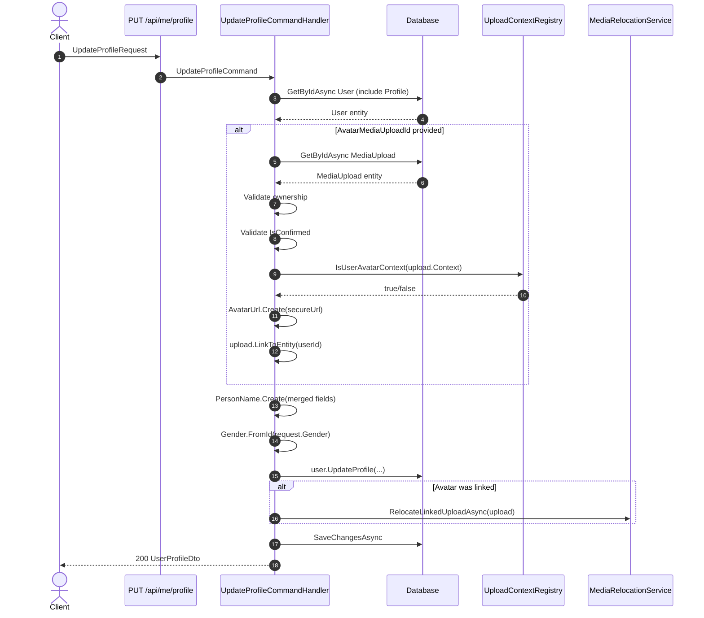

# 01 - View & Update Profile

## Overview

Three endpoints let the authenticated user retrieve their account data and update their personal profile. The update flow supports optional avatar upload through the platform's media pipeline.

---

## Endpoints

### 1. GET /api/me

| Property | Value |
|----------|-------|
| Permission | `Me.Read` |
| Handler | `GetCurrentUserQueryHandler` |
| Response | `UserDto` |

Loads the `User` aggregate with its `Profile` navigation (`Include(x => x.Profile)`) and returns a composite DTO.

**UserDto fields:**

| Field | Type | Description |
|-------|------|-------------|
| `Id` | `Guid` | User identifier |
| `UserName` | `string` | Unique username |
| `Email` | `string` | Email address |
| `EmailConfirmed` | `bool` | Whether email is confirmed |
| `PhoneNumber` | `string?` | E.164 formatted phone number |
| `CountryCode` | `string?` | ISO country code (e.g. VN, US) |
| `PhoneNumberConfirmed` | `bool` | Whether phone is confirmed |
| `TwoFactorEnabled` | `bool` | Whether 2FA is enabled |
| `TwoFactorProvider` | `string` | Current 2FA provider (None/Sms/Email/Totp) |
| `Status` | `string` | Account status (Inactive/Active) |
| `CreatedAt` | `DateTime` | Account creation timestamp |
| `Profile` | `UserProfileDto?` | Nested profile object (see below) |

---

### 2. GET /api/me/profile

| Property | Value |
|----------|-------|
| Permission | `Me.ReadProfile` |
| Handler | `GetUserProfileQueryHandler` |
| Response | `UserProfileDto` |

Loads only the `UserProfile` entity by the current user's ID.

**UserProfileDto fields:**

| Field | Type | Description |
|-------|------|-------------|
| `FirstName` | `string?` | First name |
| `LastName` | `string?` | Last name |
| `DisplayName` | `string?` | Display name |
| `FullName` | `string?` | Computed: `"{FirstName} {LastName}".Trim()` |
| `AvatarUrl` | `string?` | Secure URL to avatar image |
| `DateOfBirth` | `DateOnly?` | Date of birth |
| `Gender` | `string?` | One of: `male`, `female`, `other` |

---

### 3. PUT /api/me/profile

| Property | Value |
|----------|-------|
| Permission | `Me.UpdateProfile` |
| Handler | `UpdateProfileCommandHandler` |
| Response | `UserProfileDto` |

**Request body:**

| Field | Type | Required | Validation |
|-------|------|----------|------------|
| `FirstName` | `string?` | No | Not whitespace; min/max length per `App.Constraint.FirstName` |
| `LastName` | `string?` | No | Not whitespace; min/max length per `App.Constraint.LastName` |
| `DisplayName` | `string?` | No | Not whitespace; min/max length per `App.Constraint.DisplayName` |
| `AvatarMediaUploadId` | `Guid?` | No | Must not be empty GUID if provided |
| `DateOfBirth` | `DateOnly?` | No | Must not be default value |
| `Gender` | `string?` | No | Must be one of: `male`, `female`, `other` |

All fields are optional -- only provided fields are updated; omitted fields retain their current values.

---

## Update Profile Business Logic

The `UpdateProfileCommandHandler` executes the following steps:

1. **Load user** -- Fetch `User` aggregate with `Profile` included. Return `User.NotFound` if missing.
2. **Avatar processing** (only if `AvatarMediaUploadId` is provided):
   - Load `MediaUpload` by the given ID. Return `Media.NotFound` if missing.
   - Verify `MediaUpload.UserId` matches current user. Return `Media.NotOwnedByUser` if mismatch.
   - Verify `MediaUpload.IsConfirmed == true`. Return `Media.NotConfirm` if unconfirmed.
   - Verify upload context is `user_avatar` via `UploadContextRegistry.IsUserAvatarContext()`. Return `Media.WrongContext` if wrong.
   - Verify `MediaUpload.Info.SecureUrl` is not empty. Return `Media.Invalid` if missing.
   - Create `AvatarUrl` value object from the secure URL.
   - Call `avatarUpload.LinkToEntity(userId)` to bind the media to the user.
3. **Build value objects**:
   - `Gender.FromId(request.Gender)` -- returns `null` for unrecognized values.
   - `PersonName.Create(firstName, lastName, displayName)` -- merges request values with existing profile values for any `null` fields.
4. **Apply update** -- `user.UpdateProfile(name, avatarUrl, dateOfBirth, gender, now)` which delegates to `UserProfile.Update()`.
5. **Relocate avatar** (only if an avatar upload was linked) -- `IMediaRelocationService.RelocateLinkedUploadAsync()` moves the file to its permanent storage location.
6. **Persist** -- `SaveChangesAsync()`.
7. **Return** -- `UserProfileDto` with updated values.

---

## Sequence Diagram

---

## Error Codes

| Code | HTTP Status | Condition |
|------|-------------|-----------|
| `User.NotFound` | 404 | User with given ID does not exist |
| `User.Profile.NotFound` | 404 | Profile has not been initialized (GET /api/me/profile) |
| `User.Deleted` | 403 | User account has been soft-deleted |
| `Media.NotFound` | 404 | MediaUpload ID does not exist |
| `Media.NotOwnedByUser` | 403 | MediaUpload belongs to a different user |
| `Media.NotConfirm` | 409 | MediaUpload has not been confirmed yet |
| `Media.WrongContext` | 409 | MediaUpload context is not `user_avatar` |
| `Media.Invalid` | 409 | MediaUpload does not have a valid secure URL |
| `Media.AlreadyLinked` | 409 | MediaUpload is already linked to another entity |
