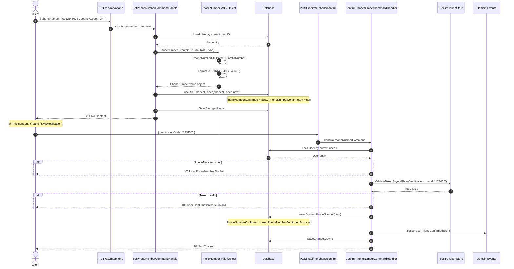

# 02 - Phone Verification

## Overview

Phone verification is a two-step process: the user sets (or changes) their phone number, then confirms ownership by submitting an OTP code. The phone number is validated using the `libphonenumber` library and stored in E.164 format. OTP tokens are managed through `ISecureTokenStore` with the `TokenType.PhoneVerification` type.

---

## Sequence Diagram

---

## Endpoints

### 1. PUT /api/me/phone

| Property | Value |
|----------|-------|
| Permission | `Me.ManagePhone` |
| Handler | `SetPhoneNumberCommandHandler` |
| Response | `204 No Content` |

**Request body:**

| Field | Type | Required | Default | Description |
|-------|------|----------|---------|-------------|
| `PhoneNumber` | `string` | Yes | -- | Phone number in local or international format |
| `CountryCode` | `string?` | No | `"VN"` | ISO country code for parsing (default region) |

**Command validation (`SetPhoneNumberCommand.Validate()`):**
- `PhoneNumber` -- must not be null or whitespace
- `CountryCode` -- when not null, must not be whitespace

**Handler steps:**
1. Load `User` by current user ID. Return `User.NotFound` if missing.
2. Create `PhoneNumber` value object via `PhoneNumber.Create(request.PhoneNumber, request.CountryCode)`:
   - Uses `PhoneNumberUtil.Parse()` with the provided `CountryCode` as default region
   - Validates with `PhoneNumberUtil.IsValidNumber()`
   - Formats to E.164 via `PhoneNumberUtil.Format(numberProto, PhoneNumberFormat.E164)`
   - Extracts the actual region code via `GetRegionCodeForNumber()`
3. Call `user.SetPhoneNumber(phoneNumber, now)`:
   - Sets `PhoneNumber` to the new value
   - Resets `PhoneNumberConfirmed = false`
   - Resets `PhoneNumberConfirmedAt = null`
4. Persist changes.

---

### 2. POST /api/me/phone/confirm

| Property | Value |
|----------|-------|
| Permission | `Me.ManagePhone` |
| Handler | `ConfirmPhoneNumberCommandHandler` |
| Response | `204 No Content` |

**Request body:**

| Field | Type | Required | Description |
|-------|------|----------|-------------|
| `VerificationCode` | `string` | Yes | OTP code received via SMS |

**Command validation (`ConfirmPhoneNumberCommand.Validate()`):**
- `VerificationCode` -- must not be whitespace

**Handler steps:**
1. Load `User` by current user ID. Return `User.NotFound` if missing.
2. Check `user.PhoneNumber is not null`. Return `User.PhoneNumber.NotSet` if null.
3. Validate the OTP via `ISecureTokenStore.ValidateTokenAsync(TokenType.PhoneVerification, userId, code)`. Return `User.ConfirmationCode.Invalid` if invalid.
4. Call `user.ConfirmPhoneNumber(now)`:
   - Sets `PhoneNumberConfirmed = true`
   - Sets `PhoneNumberConfirmedAt = now`
   - Raises `UserPhoneConfirmedEvent(UserId, PhoneNumber, OccurredAt)`
5. Persist changes.

---

## Phone Validation Details

The `PhoneNumber` value object (namespace `OIO.Domain.Context.UserContext.ValueObjects`) uses the `libphonenumber` library (`PhoneNumbers` NuGet package):

- **Default region:** `"VN"` (Vietnam) -- defined as `PhoneNumber.DefaultRegion`
- **Parsing:** `PhoneNumberUtil.Parse(value, defaultRegion)` handles both local (`0912345678`) and international (`+84912345678`) formats
- **Validation:** `PhoneNumberUtil.IsValidNumber(numberProto)` checks against the number plan for the detected region
- **Formatting:** Output is always in **E.164** format (e.g. `+84912345678`)
- **Region detection:** `GetRegionCodeForNumber()` stores the actual country code alongside the formatted number

---

## OTP Flow

The OTP lifecycle uses `ISecureTokenStore` with `TokenType.PhoneVerification`:

| Operation | Method | Description |
|-----------|--------|-------------|
| Create | `CreateTokenAsync(PhoneVerification, userId)` | Generates a token, stores its hash, returns plain token + TTL |
| Validate | `ValidateTokenAsync(PhoneVerification, userId, plainToken)` | Checks plain token against stored hash; returns bool |
| Invalidate | `InvalidateTokenAsync(PhoneVerification, userId)` | Deletes stored token after successful use |
| Rate limit | `HasActiveTokenAsync(PhoneVerification, userId)` | Checks if an unexpired token already exists |
| Cooldown | `GetTokenTtlAsync(PhoneVerification, userId)` | Returns remaining TTL for cooldown enforcement |

---

## Domain Event

### UserPhoneConfirmedEvent

| Field | Type | Description |
|-------|------|-------------|
| `UserId` | `string` | The user's ID |
| `PhoneNumber` | `string` | The confirmed E.164 phone number |
| `OccurredAt` | `DateTime` | Timestamp of confirmation |

Raised inside `User.ConfirmPhoneNumber()` after setting `PhoneNumberConfirmed = true`.

---

## Error Codes

| Code | HTTP Status | Condition |
|------|-------------|-----------|
| `User.NotFound` | 404 | Current user does not exist |
| `User.Deleted` | 403 | User account has been soft-deleted |
| `User.PhoneNumber.NotSet` | 403 | Attempting to confirm when no phone number is set |
| `User.ConfirmationCode.Invalid` | 401 | OTP code is invalid or expired |
| Format error (invariant) | 422 | Phone number fails `libphonenumber` parsing or validation |
