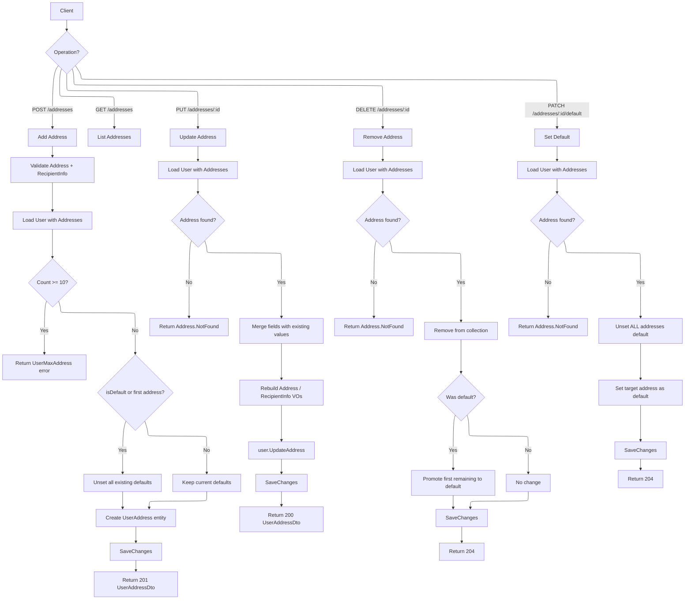

# 03 - Address Management

## Overview

Each user can maintain up to **10 addresses** in their address book. Addresses are typed (`home`, `work`, `other`), include recipient contact details (name + validated phone number), and support a single default address. The `UserAddress` entity is owned by the `User` aggregate root, and all mutations go through the aggregate's domain methods.

---

## Address Operations Flow

---

## Endpoints

### 1. POST /api/me/addresses

| Property | Value |
|----------|-------|
| Permission | `Me.ManageAddress` |
| Handler | `AddAddressCommandHandler` |
| Response | `201 Created` with `UserAddressDto` |

**Request body:**

| Field | Type | Required | Validation |
|-------|------|----------|------------|
| `Type` | `string` | Yes | One of: `home`, `work`, `other` |
| `RecipientName` | `string` | Yes | Not whitespace; max length per `App.Constraint.UserAddress.RecipientNameMaxLength` |
| `Street` | `string` | Yes | Not whitespace; max length per `App.Constraint.Address.StreetMaxLength` |
| `Ward` | `string` | Yes | Not whitespace; max length per `App.Constraint.Address.WardMaxLength` |
| `District` | `string` | Yes | Not whitespace; max length per `App.Constraint.Address.DistrictMaxLength` |
| `City` | `string` | Yes | Not whitespace; max length per `App.Constraint.Address.CityMaxLength` |
| `PostalCode` | `string?` | No | Max length per `App.Constraint.Address.PostalCodeMaxLenght` |
| `PhoneNumber` | `string` | Yes | Not whitespace; validated via `libphonenumber` |
| `CountryCode` | `string` | Yes | Default: `"VN"` |
| `IsDefault` | `bool` | Yes | Default: `false` |

**Handler logic:**
1. Create `Address` value object from street/ward/district/city/postalCode.
2. Create `RecipientInfo` value object from recipientName + phoneNumber + countryCode. The phone is validated via `PhoneNumber.Create()` (libphonenumber, E.164 format).
3. Load `User` with `Addresses` included.
4. Call `user.AddAddress(type, recipient, address, now, isDefault)`:
   - If `_addresses.Count >= 10` (MaxAddresses), return `UserMaxAddress` error.
   - If `isDefault == true` **or** this is the first address (`_addresses.Count == 0`), unset all existing defaults and force `isDefault = true`.
   - Create a new `UserAddress` entity with a `Guid.CreateVersion7()` ID.
5. Persist and return `UserAddressDto`.

---

### 2. GET /api/me/addresses

| Property | Value |
|----------|-------|
| Permission | `Me.ReadAddress` |
| Handler | `GetUserAddressesQueryHandler` |
| Response | `PagedList<UserAddressDto>` |

**Query parameters:** Standard pagination (`PagedParameters`).

**Handler logic:**
- Queries `UserAddress` entities filtered by `UserId == currentUserId`.
- Ordered by `CreatedAt` descending (newest first).
- Projected directly to `UserAddressDto` in the query.
- Returns total count for pagination metadata.

---

### 3. PUT /api/me/addresses/{addressId}

| Property | Value |
|----------|-------|
| Permission | `Me.ManageAddress` |
| Handler | `UpdateAddressCommandHandler` |
| Response | `200 OK` with `UserAddressDto` |

**Request body (all fields optional):**

| Field | Type | Validation |
|-------|------|------------|
| `Type` | `string?` | One of: `home`, `work`, `other` |
| `RecipientName` | `string?` | Not whitespace; max length |
| `Street` | `string?` | Not whitespace; max length |
| `Ward` | `string?` | Not whitespace; max length |
| `District` | `string?` | Not whitespace; max length |
| `City` | `string?` | Not whitespace; max length |
| `PhoneNumber` | `string?` | Not whitespace; validated via libphonenumber |
| `CountryCode` | `string?` | Not whitespace |
| `PostalCode` | `string?` | Max length |

**Handler logic:**
1. Load `User` with `Addresses` included. Return `User.NotFound` if missing.
2. Find the address by ID. Return `User.Address.NotFound` if missing.
3. **Merge fields** -- for each `null` request field, use the existing value:
   - If any address component (street/ward/district/city/postalCode) is provided, rebuild the `Address` value object with merged values.
   - If `PhoneNumber` is provided and differs from existing, create a new `PhoneNumber` value object.
   - `AddressType` falls back to existing type if not provided.
   - Rebuild `RecipientInfo` with merged name and phone.
4. Call `user.UpdateAddress(addressId, now, type, recipient, address)` which delegates to `UserAddress.Update()`.
5. Persist and return updated `UserAddressDto`.

---

### 4. DELETE /api/me/addresses/{addressId}

| Property | Value |
|----------|-------|
| Permission | `Me.ManageAddress` |
| Handler | `RemoveAddressCommandHandler` |
| Response | `204 No Content` |

**Handler logic:**
1. Load `User` with `Addresses` included.
2. Call `user.RemoveAddress(addressId, now)`:
   - Find address by ID. Return `User.Address.NotFound` if missing.
   - Record whether the removed address was default.
   - Remove from the `_addresses` collection.
   - **If the removed address was default and other addresses remain**, promote `_addresses[0]` (first remaining) to default.
3. Persist changes.

---

### 5. PATCH /api/me/addresses/{addressId}/default

| Property | Value |
|----------|-------|
| Permission | `Me.ManageAddress` |
| Handler | `SetDefaultAddressCommandHandler` |
| Response | `204 No Content` |

**Handler logic:**
1. Load `User` with `Addresses` included.
2. Call `user.SetDefaultAddress(addressId, now)`:
   - Find address by ID. Return `User.Address.NotFound` if missing.
   - **Unset ALL addresses** by calling `UnsetDefault()` on every address in the collection.
   - Call `SetAsDefault()` on the target address.
3. Explicitly call `_dbContext.Update(user)` to track changes.
4. Persist changes.

---

## UserAddress Entity

| Field | Type | Description |
|-------|------|-------------|
| `Id` | `UserAddressId` | Generated via `Guid.CreateVersion7()` |
| `UserId` | `UserId` | Owner reference |
| `Type` | `AddressType` | Enum: `home`, `work`, `other` |
| `Recipient` | `RecipientInfo` | Value object containing recipient name and phone |
| `Address` | `Address` | Value object containing street, ward, district, city, postalCode |
| `IsDefault` | `bool` | Whether this is the default address |
| `CreatedAt` | `DateTime` | Creation timestamp |
| `ModifiedAt` | `DateTime?` | Last modification timestamp |

### RecipientInfo Value Object

| Field | Type | Description |
|-------|------|-------------|
| `RecipientName` | `string` | Name of the recipient |
| `Phone` | `PhoneNumber` | Validated phone number (E.164 + country code) |

Created via `RecipientInfo.Create(name, phoneNumber, countryCode)`. Validates that `recipientName` is not empty and delegates phone validation to `PhoneNumber.Create()`.

### Address Value Object

| Field | Type | Description |
|-------|------|-------------|
| `Street` | `string` | Street address |
| `Ward` | `string` | Ward/commune |
| `District` | `string` | District |
| `City` | `string` | City/province |
| `PostalCode` | `string?` | Optional postal code |

All string fields are trimmed on creation. `FullAddress` is computed as `"{Street}, {Ward}, {District}, {City}"`.

---

## Response DTO

**UserAddressDto:**

| Field | Type |
|-------|------|
| `Id` | `Guid` |
| `Type` | `string` |
| `RecipientName` | `string` |
| `PhoneNumber` | `string` |
| `Street` | `string` |
| `Ward` | `string` |
| `District` | `string` |
| `City` | `string` |
| `PostalCode` | `string?` |
| `IsDefault` | `bool` |

---

## Error Codes

| Code | HTTP Status | Condition |
|------|-------------|-----------|
| `User.NotFound` | 404 | Current user does not exist |
| `User.Deleted` | 403 | User account has been soft-deleted |
| `User.Address.NotFound` | 404 | Address with the given ID not found for this user |
| `UserMaxAddress` | 422 | User already has 10 addresses (maximum reached) |
| `RecipientInfo.NameEmpty` | 422 | Recipient name is empty or whitespace |
| Format error (invariant) | 422 | Phone number fails libphonenumber validation |
| Address validation error | 422 | Street/ward/district/city fails not-null/max-length checks |
