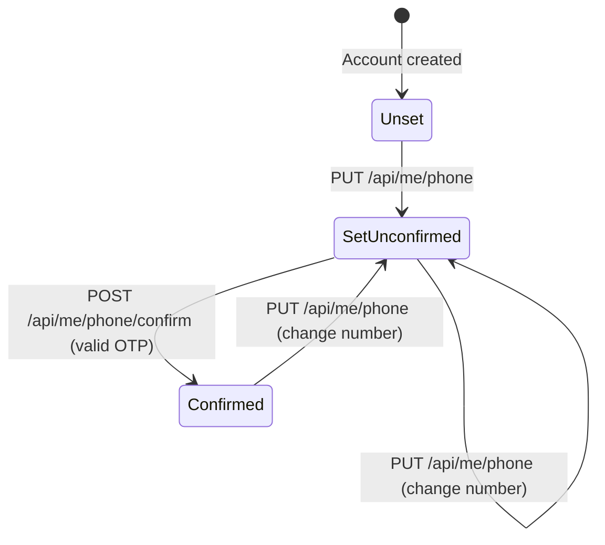
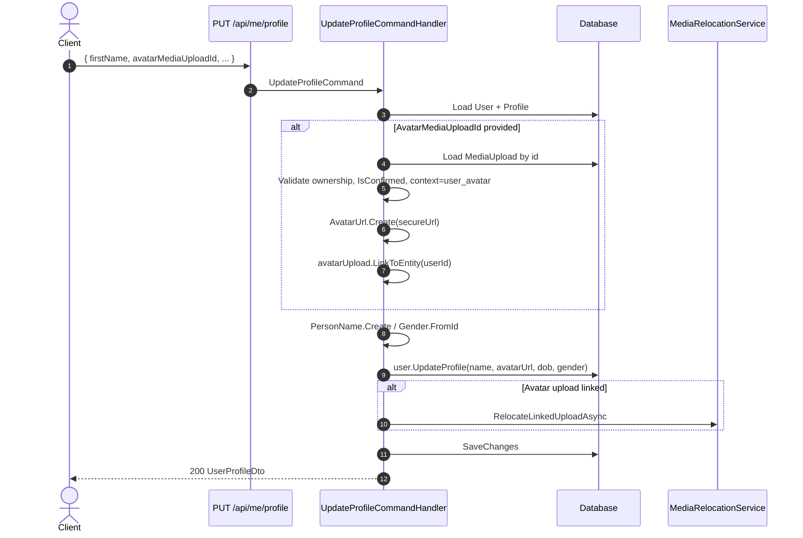

# 02 - User Profile Module

## Overview

The User Profile module manages the authenticated user's personal information, contact details, shipping addresses, and notification preferences. It is centered around the `User` aggregate root in the `UserContext` bounded context, which owns the `UserProfile` and `UserAddress` entities.

Key capabilities:
- **Profile management** -- view and update personal information (name, avatar, date of birth, gender)
- **Phone verification** -- set a phone number, receive an OTP, and confirm it
- **Address book** -- CRUD operations for shipping/billing addresses with a default-address mechanism (max 10 addresses)
- **Notification preferences** -- configure delivery channels and quiet hours

---

## State Diagrams

### Phone Number Verification

---

## Sequence Diagrams

### Profile Update with Avatar Upload

---

## Subflow Index

| # | File | Description |
|---|------|-------------|
| 01 | [01-view-update-profile.md](./01-view-update-profile.md) | View current user, view profile, update profile with avatar |
| 02 | [02-phone-verification.md](./02-phone-verification.md) | Set phone number and OTP confirmation |
| 03 | [03-address-management.md](./03-address-management.md) | Address CRUD and set-default operations |
| 04 | [04-notification-preferences.md](./04-notification-preferences.md) | View and update notification preferences |

---

## Endpoint Table

| # | Method | Route | Permission / Auth | Description |
|---|--------|-------|-------------------|-------------|
| 1 | GET | `/api/me` | `Me.Read` | Get current user with profile |
| 2 | GET | `/api/me/profile` | `Me.ReadProfile` | Get current user profile only |
| 3 | PUT | `/api/me/profile` | `Me.UpdateProfile` | Update profile (name, avatar, dob, gender) |
| 4 | PUT | `/api/me/phone` | `Me.ManagePhone` | Set or change phone number |
| 5 | POST | `/api/me/phone/confirm` | `Me.ManagePhone` | Confirm phone number with OTP |
| 6 | GET | `/api/me/addresses` | `Me.ReadAddress` | List addresses (paged) |
| 7 | POST | `/api/me/addresses` | `Me.ManageAddress` | Add a new address |
| 8 | PUT | `/api/me/addresses/{addressId}` | `Me.ManageAddress` | Update an existing address |
| 9 | DELETE | `/api/me/addresses/{addressId}` | `Me.ManageAddress` | Remove an address |
| 10 | PATCH | `/api/me/addresses/{addressId}/default` | `Me.ManageAddress` | Set address as default |
| 11 | GET | `/api/me/notification-preferences` | `Me.ReadNotificationPreferences` | Get notification preferences |
| 12 | PUT | `/api/me/notification-preferences` | `Me.ManageNotificationPreferences` | Update notification preferences |

---

## Domain Events

| Event | Raised When | Payload |
|-------|-------------|---------|
| `UserCreatedEvent` | User registered | UserId, UserName, Email, OccurredAt |
| `UserPhoneConfirmedEvent` | Phone OTP validated successfully | UserId, PhoneNumber, OccurredAt |
| `UserStatusChangedEvent` | User status transitions | UserId, OldStatus, NewStatus, OccurredAt |
| `UserPasswordChangedEvent` | Password changed | UserId, OccurredAt |
| `UserEmailConfirmedEvent` | Email confirmed | UserId, Email, OccurredAt |

---

## Entity Summary

| Entity | Key Fields | Notes |
|--------|------------|-------|
| `User` | Id (UserId), UserName, Email, EmailConfirmed, PhoneNumber, PhoneNumberConfirmed, TwoFactorEnabled, Status, LockoutEnd | Aggregate root; owns Profile, Addresses |
| `UserProfile` | Id (UserId), Name (PersonName: FirstName/LastName/DisplayName), AvatarUrl, DateOfBirth, Gender | 1:1 with User; created on registration |
| `UserAddress` | Id (UserAddressId), UserId, Type (home/work/other), Recipient (RecipientInfo: name + phone), Address (street/ward/district/city/postalCode), IsDefault | Max 10 per user; removing default auto-promotes first remaining |
| `PersonName` | FirstName?, LastName?, DisplayName? | Value object; FullName = "{FirstName} {LastName}".Trim() |
| `PhoneNumber` | Value (E.164), CountryCode | Value object; validated via libphonenumber; default region VN |
| `Address` | Street, Ward, District, City, PostalCode? | Value object; FullAddress = comma-separated components |
| `RecipientInfo` | RecipientName, Phone (PhoneNumber) | Value object; embedded in UserAddress |
