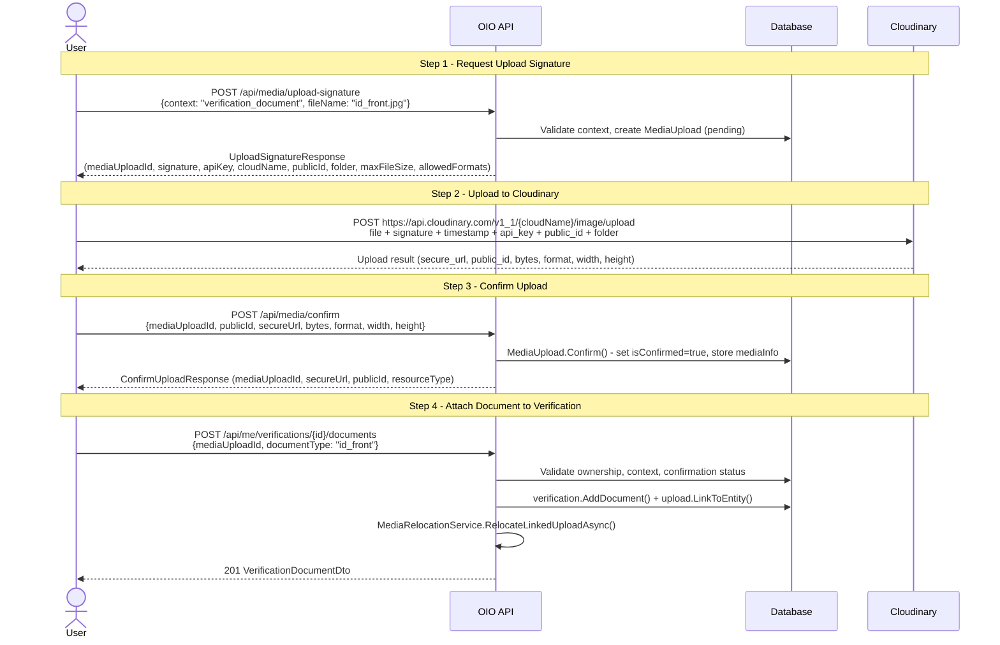

# 02 - Upload Verification Documents

This document covers the full document upload lifecycle: requesting a signed upload URL, uploading to Cloudinary, confirming the upload, attaching the document to a verification, and deleting documents.

---

## Upload Flow Sequence

Each document requires a 4-step process involving the Media and Verification endpoints.



---

## Endpoints

### POST /api/media/upload-signature

**Permission:** `Media.Upload`

Generates a signed upload URL for Cloudinary. The client uses the returned parameters to upload directly to Cloudinary without the file passing through the API server.

#### Request

```json
{
  "context": "verification_document",
  "fileName": "id_front.jpg"
}
```

#### Response: UploadSignatureResponse

```json
{
  "mediaUploadId": "019...",
  "uploadUrl": "https://api.cloudinary.com/v1_1/{cloudName}/image/upload",
  "signature": "abc123...",
  "timestamp": 1710936000,
  "apiKey": "123456789",
  "cloudName": "dt2b5qfoe",
  "publicId": "img_abc123def456",
  "storagePublicId": "verifications/pending/{userId}/img_abc123def456",
  "folder": "verifications/pending/{userId}",
  "eager": "w_1200,h_1200,c_limit",
  "resourceType": "image",
  "maxFileSize": 10485760,
  "allowedFormats": ["jpg", "jpeg", "png", "webp"]
}
```

#### Behavior

1. Validates the context name against the `UploadContextRegistry`.
2. Looks up the context configuration from `appsettings`.
3. Generates a unique `publicId` with pattern `img_{12-char-guid-suffix}`.
4. Sets folder to `{contextFolder}/pending/{userId}` (temporary location).
5. Generates a Cloudinary signature via `IMediaSignatureService`.
6. Creates a `MediaUpload` entity in `pending` state.
7. Returns all parameters the client needs to upload directly.

---

### POST /api/media/confirm

**Permission:** `Media.ConfirmUpload`

After the client uploads to Cloudinary, it confirms the upload by providing the actual file metadata returned by Cloudinary.

#### Request

```json
{
  "mediaUploadId": "019...",
  "publicId": "verifications/pending/{userId}/img_abc123def456",
  "secureUrl": "https://res.cloudinary.com/dt2b5qfoe/image/upload/v1234/verifications/pending/.../img_abc123def456.jpg",
  "bytes": 2048576,
  "format": "jpg",
  "fileName": "id_front.jpg",
  "width": 1200,
  "height": 800,
  "durationSeconds": null
}
```

#### Validation

| Field | Required | Rule |
|-------|----------|------|
| `mediaUploadId` | Yes | Non-empty GUID |
| `publicId` | Yes | Not whitespace, must match stored `publicId` (leaf match accepted) |
| `secureUrl` | Yes | Valid absolute URI |
| `bytes` | Yes | Greater than 0 |
| `format` | Yes | Not whitespace |
| `width` | No | - |
| `height` | No | - |
| `durationSeconds` | No | For video resources only |

#### Business Rules

- The `mediaUploadId` must exist and belong to the current user.
- The `publicId` must match the stored `StorageRef.PublicId` (full match or leaf-segment match).
- The upload must not already be confirmed.

---

### POST /api/me/verifications/{verificationId}/documents

**Permission:** `Me.ManageVerification`

Attaches a confirmed media upload to the verification as a specific document type.

#### Request

```json
{
  "mediaUploadId": "019...",
  "documentType": "id_front"
}
```

#### Document Type Enum

| Value | Description |
|-------|-------------|
| `id_front` | Front side of government ID |
| `id_back` | Back side of government ID |
| `selfie` | Selfie photo of the user |
| `selfie_with_id` | Selfie holding the ID document |
| `business_license` | Business license document |
| `bank_statement` | Bank statement document |
| `other` | Other supporting document |

#### Validation

| Field | Required | Rule |
|-------|----------|------|
| `verificationId` | Yes | Non-empty GUID (path) |
| `mediaUploadId` | Yes | Non-empty GUID |
| `documentType` | Yes | One of `VerificationDocumentType.All` |

#### Business Rules

1. **Ownership:** Both the verification and the media upload must belong to the current user.
2. **Status guard:** Verification must be in `pending` or `rejected` status. Otherwise returns `Verification.CannotUploadDoc` (403).
3. **Media confirmed:** The `MediaUpload` must have `isConfirmed = true`. Otherwise returns `Media.NotConfirm`.
4. **Not already linked:** The `MediaUpload` must not already be linked to another entity. Otherwise returns `Media.AlreadyLinked`.
5. **Context check:** The upload context must be a verification context (starts with `verification_`). Otherwise returns `Media.WrongContext`.
6. **Max documents:** Total document count must not exceed `MaxUploadsPerEntity` from context config (default 10). Otherwise returns `Verification.MaxDocuments`.
7. **Media URL required:** The confirmed upload must have a `secureUrl`. Otherwise returns `Media.NotContainUrl`.

#### Behavior

1. Loads verification with existing documents.
2. Loads the `MediaUpload` entity.
3. Validates all business rules.
4. Creates a `VerificationDocument` child entity with `verificationStatus = pending`.
5. Links the upload to the verification entity via `upload.LinkToEntity()`.
6. Triggers `MediaRelocationService.RelocateLinkedUploadAsync()` to move the file from `pending/` to its final storage location.
7. Records a `document_uploaded` history entry.
8. Returns `VerificationDocumentDto`.

#### Response: VerificationDocumentDto

```json
{
  "id": "019...",
  "documentType": "id_front",
  "resourceType": "image",
  "secureUrl": "https://res.cloudinary.com/...",
  "fileHash": null,
  "mimeType": null,
  "verificationStatus": "pending",
  "uploadedAt": "2026-03-20T10:05:00Z",
  "createdAt": "2026-03-20T10:05:00Z"
}
```

---

### DELETE /api/me/verifications/{verificationId}/documents/{docId}

**Permission:** `Me.ManageVerification`

Removes a document from the verification.

#### Path Parameters

| Parameter | Type |
|-----------|------|
| `verificationId` | GUID |
| `docId` | GUID |

#### Business Rules

1. **Ownership:** Verification must belong to the current user.
2. **Status guard:** Verification must be in `pending` or `rejected` status. Otherwise returns `Verification.CannotDeleteDoc` (403).
3. **Document exists:** The document with `docId` must exist in the verification's document collection. Otherwise returns `Verification.Document.NotFound` (404).

#### Behavior

1. Loads verification with documents.
2. Validates status and finds the document.
3. Removes the document from the collection.
4. Records a `document_deleted` history entry.
5. Returns `204 No Content`.

---

## Upload Contexts Configuration

From `appsettings.Production.json`, two upload contexts are defined for verification:

### verification_document

| Setting | Value |
|---------|-------|
| Name | `verification_document` |
| ResourceType | `image` |
| Folder | `verifications` |
| MaxFileSizeBytes | `10485760` (10 MB) |
| AllowedFormats | `jpg`, `jpeg`, `png`, `webp` |
| Eager | `w_1200,h_1200,c_limit` |
| MaxUploadsPerEntity | `10` |

### verification_image

| Setting | Value |
|---------|-------|
| Name | `verification_image` |
| ResourceType | `image` |
| Folder | `verifications` |
| MaxFileSizeBytes | `10485760` (10 MB) |
| AllowedFormats | `jpg`, `jpeg`, `png`, `webp` |
| Eager | `w_1600,h_1600,c_limit` |
| MaxUploadsPerEntity | `10` |

The `UploadContextRegistry.IsVerificationContext()` method checks if the context name starts with `verification_`, so both contexts are accepted when attaching documents.

---

## Error Codes

| Code | HTTP | Trigger |
|------|------|---------|
| `Verification.CannotUploadDoc` | 403 | Upload attempted in status other than `pending` or `rejected` |
| `Verification.CannotDeleteDoc` | 403 | Delete attempted in status other than `pending` or `rejected` |
| `Verification.MaxDocuments` | 403 | Maximum document count exceeded |
| `Verification.Document.NotFound` | 404 | Document ID not found in verification |
| `Verification.NotFound` | 404 | Verification not found or not owned by user |
| `Media.NotFound` | 404 | MediaUpload ID not found |
| `Media.NotOwnedByUser` | 403 | MediaUpload belongs to a different user |
| `Media.NotConfirm` | 400 | MediaUpload has not been confirmed |
| `Media.AlreadyLinked` | 400 | MediaUpload already linked to another entity |
| `Media.WrongContext` | 400 | MediaUpload context is not a verification context |
| `Media.NotContainUrl` | 400 | Confirmed upload is missing secure URL |
| `Media.PublicIdMismatch` | 400 | Confirm request publicId does not match stored publicId |
