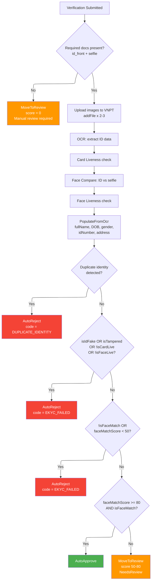
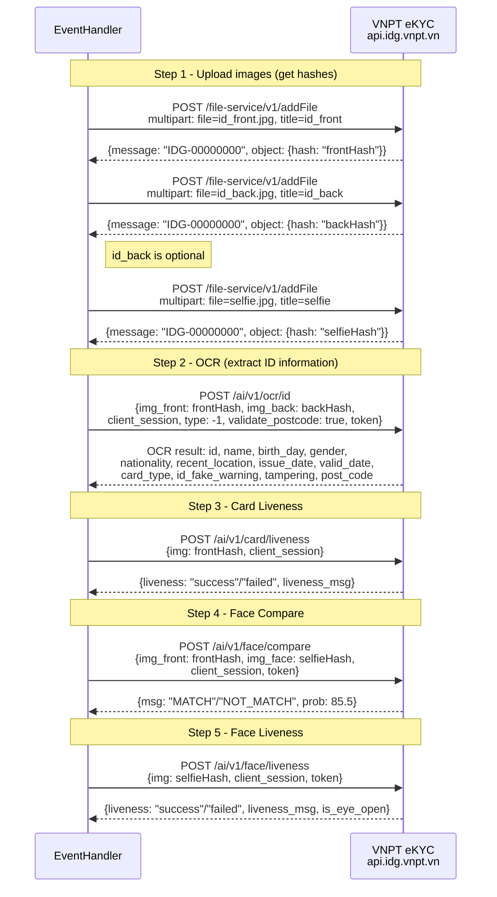

# 03 - Submit Verification & eKYC Processing

This document covers the verification submission endpoint and the asynchronous eKYC processing that follows, including the VNPT eKYC API integration, OCR data population, duplicate identity detection, and the auto-decision logic.

---

## eKYC Decision Tree



---

## VNPT eKYC API Call Sequence



---

## POST /api/me/verifications/{verificationId}/submit

**Permission:** `Me.ManageVerification`

### Path Parameters

| Parameter | Type | Description |
|-----------|------|-------------|
| `verificationId` | GUID | The verification to submit |

### Business Rules

1. **Ownership:** Verification must belong to the current user.
2. **Status guard:** Status must be `pending`. Otherwise returns `Verification.CannotSubmit` (403).
3. **Documents required:** At least one document must be attached. Otherwise returns `Verification.NoDocuments` (403).
4. **Duplicate identity check (pre-submit):** Runs `VerificationDuplicateIdentityService.FindDuplicateAsync()` before submission. If a duplicate is found, returns `Verification.DuplicateIdentity` (409).

### Behavior

1. Loads verification with documents.
2. Validates ownership and runs duplicate check.
3. Calls `verification.Submit()`:
   - Sets `status = submitted`
   - Sets `submittedAt = now`
   - Increments `attemptCount`
   - Records history entry: action=`submitted`, performerType=`buyer`
   - Raises `VerificationSubmittedEvent(verificationId, userId, occurredAt)`
4. Persists changes.
5. Returns `204 No Content`.

### Domain Event

```csharp
public sealed record VerificationSubmittedEvent(
    Guid VerificationId,
    Guid UserId,
    DateTime OccurredAt) : DomainEvent(OccurredAt);
```

This event is consumed by `VerificationSubmittedEventHandler` which triggers the asynchronous eKYC processing.

---

## VerificationSubmittedEventHandler

The handler implements `INotificationHandler<VerificationSubmittedEvent>` and orchestrates the full eKYC flow.

### Dependencies

| Service | Purpose |
|---------|---------|
| `IEkycProvider` | VNPT eKYC API integration |
| `VerificationDuplicateIdentityService` | Post-OCR duplicate detection |
| `IClock` | UTC timestamp generation |
| `ISender` | Send notification commands |

### Processing Flow

1. **Load verification:** Fetch with documents. Skip if not found or not in `submitted` status.
2. **Extract documents:** Find `id_front`, `id_back` (optional), and `selfie` from the document collection by `DocumentType`.
3. **Missing documents fallback:** If `id_front` or `selfie` is missing (no `secureUrl`), move to manual review with score=0.
4. **Build eKYC request:**
   ```
   EkycVerificationRequest(
     IdFrontImage: (secureUrl, publicId),
     IdBackImage: (secureUrl, publicId) | null,
     SelfieImage: (secureUrl, publicId)
   )
   ```
5. **Call eKYC provider:** `_ekycProvider.VerifyIdentityAsync(request)`.
6. **On provider failure:** Move to manual review (eKYC error is non-fatal, becomes manual review).
7. **On success:**
   - Populate OCR data into the verification entity.
   - Run duplicate identity detection.
   - Apply decision based on `EkycDecision`.
8. **Send notification:** Dispatch outcome notification to the user.
9. **Exception handling:** Unhandled exceptions also trigger manual review fallback (if status is still `submitted`).

---

## VNPT eKYC Provider

**Implementation:** `VnptEkycProvider` (`IEkycProvider`)

**Provider name:** `VNPT_EKYC`

### Configuration: VnptEkycOptions

From `appsettings.Production.json`, section `VnptEkyc`:

| Setting | Default Value | Description |
|---------|---------------|-------------|
| `BaseUrl` | `https://api.idg.vnpt.vn` | VNPT eKYC API base URL |
| `AccessToken` | (secret) | Bearer token for authentication |
| `TokenId` | (secret) | Additional auth header `Token-id` |
| `TokenKey` | (secret) | Additional auth header `Token-key` |
| `MacAddress` | `OIO_SERVER` | Device identifier header `mac-address` |
| `ApproveThreshold` | `80.0` | Minimum face match score for auto-approval |
| `RejectThreshold` | `50.0` | Maximum face match score for auto-rejection |

### API Endpoints Called

| # | Method | Path | Purpose | Input | Key Output |
|---|--------|------|---------|-------|------------|
| 1 | `POST` | `/file-service/v1/addFile` | Upload image file | `multipart/form-data` (file, title, description) | `hash` (file reference) |
| 2 | `POST` | `/ai/v1/ocr/id` | OCR both sides of ID | `img_front`, `img_back`, `client_session`, `type=-1`, `validate_postcode=true`, `token` | Full OCR object |
| 2a | `POST` | `/ai/v1/ocr/id/front` | OCR front only (no back) | `img_front`, `client_session`, `type=-1`, `validate_postcode=true`, `token` | Full OCR object |
| 3 | `POST` | `/ai/v1/card/liveness` | Check if ID card is real | `img` (frontHash), `client_session` | `liveness` ("success"/"failed") |
| 4 | `POST` | `/ai/v1/face/compare` | Compare ID photo vs selfie | `img_front`, `img_face`, `client_session`, `token` | `msg` ("MATCH"/"NOT_MATCH"), `prob` (0-100) |
| 5 | `POST` | `/ai/v1/face/liveness` | Check if selfie is real person | `img` (selfieHash), `client_session`, `token` | `liveness` ("success"/"failed") |

### Image Upload Caching

The provider caches VNPT upload hashes by source key (`ekyc:vnpt:upload-hash:{sourceKey}`) with 24-hour expiration (1-hour local cache). This avoids re-uploading the same image if a verification is reprocessed.

### Authentication Headers

Every request to VNPT includes:
- `Authorization: Bearer {AccessToken}`
- `Token-id: {TokenId}`
- `Token-key: {TokenKey}`
- `mac-address: {MacAddress}`

---

## Decision Logic

The `EvaluateDecision()` method in `VnptEkycProvider` determines the outcome:

```
EvaluateDecision(faceMatchScore, isCardLive, isFaceLive, isIdFake, isTampered, isFaceMatch):

1. If isIdFake OR isTampered OR !isCardLive OR !isFaceLive:
   → Rejected

2. If !isFaceMatch OR faceMatchScore < RejectThreshold (50):
   → Rejected

3. If faceMatchScore >= ApproveThreshold (80) AND isFaceMatch:
   → Approved

4. Otherwise (score between 50-80):
   → NeedsReview
```

### Overall Score

The `overallScore` in the result is set to the `faceMatchScore` (the `prob` value from face comparison, range 0-100).

### Rejection Reasons

When the decision is `Rejected`, specific Vietnamese-language reasons are built:

| Condition | Rejection Reason |
|-----------|------------------|
| `!isCardLive` | "Giay to khong that" (Document is not real) |
| `!isFaceLive` | "Khuon mat khong that" (Face is not real) |
| `!isFaceMatch` | "Khuon mat khong khop ({score}%)" (Face does not match) |
| `isIdFake` | "So ID gia" (Fake ID number) |
| `isTampered` | "Giay to bi chinh sua" (Document was tampered) |

Multiple reasons are joined with `;`.

---

## OCR Data Population

After a successful eKYC call, the handler populates OCR data into the verification entity via `PopulateFromOcr()`:

| Verification Field | OCR Source | Processing |
|--------------------|-----------|------------|
| `fullName` | `ocr.FullName` (name) | Trimmed |
| `dateOfBirth` | `ocr.DateOfBirth` (birth_day) | Parsed with formats: `dd/MM/yyyy`, `yyyy-MM-dd`, `dd-MM-yyyy` |
| `gender` | `ocr.Gender` (gender) | Mapped: "nam"/"male" -> `Male`, "nu"/"female" -> `Female` |
| `nationality` | `ocr.Nationality` (nationality) | Trimmed |
| `document.idType` | `ocr.CardType` (card_type) | Mapped: "cccd" -> `Cccd`, "cmnd" -> `Cmnd`, "passport" -> `Passport`, default `Cccd` |
| `document.idNumber` | `ocr.IdNumber` (id) | Direct |
| `document.issuedDate` | `ocr.IssueDate` (issue_date) | Parsed as DateOnly |
| `document.expiredDate` | `ocr.ExpiryDate` (valid_date) | Parsed as DateOnly |
| `document.issuedPlace` | `ocr.IssuePlace` (issue_place) | Direct |
| `permanentAddress.fullAddress` | `ocr.Address` (recent_location) | Direct |
| `permanentAddress.province` | `ocr.PostCode.City` | Joined from `post_code` where `type="address"` |
| `permanentAddress.district` | `ocr.PostCode.District` | Joined from `post_code` where `type="address"` |
| `permanentAddress.ward` | `ocr.PostCode.Ward` | Joined from `post_code` where `type="address"` |

A `VerificationHistoryAction.InfoUpdated` entry is recorded with performerType=`system` and note "Populated from eKYC OCR".

---

## Duplicate Identity Detection (Post-eKYC)

After OCR data is populated, the handler runs `VerificationDuplicateIdentityService.FindDuplicateAsync()` again. If a duplicate is found:

1. The verification is auto-rejected with:
   - `reason`: "This identity document is already associated with another account."
   - `rejectionCode`: `DUPLICATE_IDENTITY`
   - `score`: the eKYC overall score
   - `provider`: eKYC provider name
2. A `verification_auto_rejected` notification is sent.
3. Processing stops (the normal decision logic is bypassed).

---

## State Transitions Applied by Handler

| Condition | Method Called | New Status | History Note |
|-----------|-------------|------------|-------------|
| Missing id_front or selfie | `MoveToReview(score=0)` | `under_review` | - |
| eKYC provider error | `MoveToReview(score=0)` | `under_review` | Error details in rawResponse |
| Duplicate identity | `AutoReject(DUPLICATE_IDENTITY)` | `rejected` | - |
| Decision = Approved | `AutoApprove(score, provider)` | `approved` | "Auto-approved by VNPT_EKYC (score: XX.XX)" |
| Decision = Rejected | `AutoReject(reason, EKYC_FAILED)` | `rejected` | "Auto-rejected by VNPT_EKYC (score: XX.XX): {reason}" |
| Decision = NeedsReview | `MoveToReview(score, provider)` | `under_review` | "Moved to manual review by VNPT_EKYC (score: XX.XX)" |
| Unhandled exception (not yet transitioned) | `MoveToReview(score=0)` | `under_review` | Exception details in rawResponse |

All auto-transitions set `autoVerified = true` (except `MoveToReview` which sets `autoVerified = false`), along with `autoVerifyScore`, `autoVerifyProvider`, and `autoVerifyResponse` (full JSON of all VNPT responses).

---

## Notifications Sent

| Decision | Event Type | Title | Message |
|----------|-----------|-------|---------|
| Approved | `verification_auto_approved` | KYC da duoc xac minh thanh cong | Xac minh danh tinh cua ban da duoc phe duyet tu dong. |
| Rejected | `verification_auto_rejected` | KYC khong duoc chap nhan | Xac minh danh tinh cua ban khong dat. Vui long xem chi tiet va gui lai neu can. |
| NeedsReview | `verification_manual_review_required` | KYC can duoc kiem tra thu cong | Xac minh danh tinh cua ban can duoc kiem tra thu cong. |

Notifications are sent via `NotificationDispatch.DispatchAsync()` with:
- `notificationType`: `"verification"`
- `priority`: `Normal`
- `entityType`: `"verification"`
- `entityId`: verification ID
- `metadata`: `{ verificationId, userId, provider, status, rejectionCode }`

---

## Error Codes

| Code | HTTP | Trigger |
|------|------|---------|
| `Verification.CannotSubmit` | 403 | Submission in status other than `pending` |
| `Verification.NoDocuments` | 403 | No documents attached to verification |
| `Verification.DuplicateIdentity` | 409 | Duplicate ID number found (pre-submit check) |
| `Verification.NotFound` | 404 | Verification not found or not owned by user |
| `Ekyc.HttpError` | 503 | VNPT API communication failure |
| `Ekyc.Timeout` | 504 | VNPT API request timed out |
| `Ekyc.UploadFailed` | 503 | Failed to upload image to VNPT |
| `Ekyc.DownloadFailed` | 503 | Failed to download image from Cloudinary for VNPT upload |
| `Ekyc.OcrFailed` | 503 | OCR API call failed |
| `Ekyc.CardLivenessFailed` | 503 | Card liveness API call failed |
| `Ekyc.FaceCompareFailed` | 503 | Face compare API call failed |
| `Ekyc.FaceLivenessFailed` | 503 | Face liveness API call failed |
