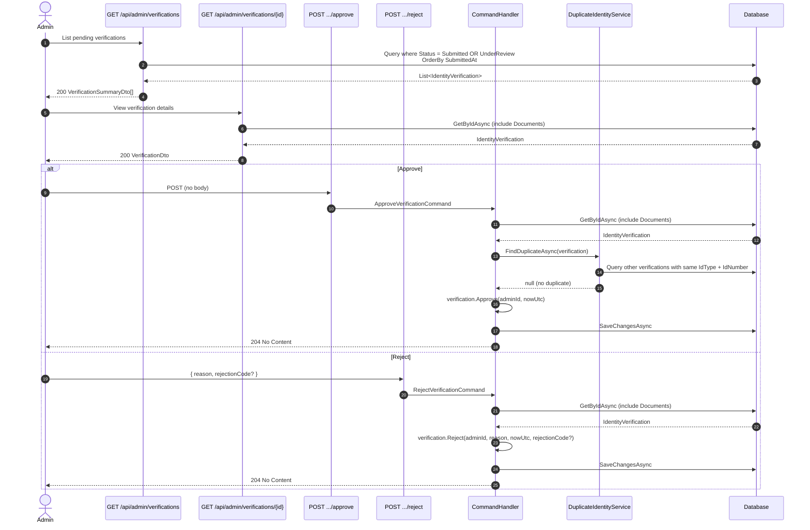

# 04 - Admin Identity Verification Review

## Overview

Admins review identity verifications that are in `submitted` or `under_review` status. The workflow consists of listing pending verifications, viewing details, and then either approving or rejecting. Approval checks for duplicate identity documents before proceeding, while rejection requires a reason and optionally a rejection code.

---

## Sequence Diagram

---

## Endpoints

### 1. GET /api/admin/verifications

| Property | Value |
|----------|-------|
| Permission | `Admin.ReadVerifications` |
| Handler | `GetPendingVerificationsQueryHandler` |
| Response | `IReadOnlyCollection<VerificationSummaryDto>` |

Returns all verifications with status `submitted` or `under_review`, ordered by `SubmittedAt` ascending (oldest first).

**VerificationSummaryDto fields:**

| Field | Type | Description |
|-------|------|-------------|
| `Id` | `Guid` | Verification identifier |
| `VerificationType` | `string` | Type of verification |
| `AutoVerified` | `bool` | Whether auto-verified by eKYC |
| `FullName` | `string?` | Applicant full name |
| `Status` | `string` | Current status (`submitted` or `under_review`) |
| `SubmittedAt` | `DateTime?` | When the verification was submitted |
| `AttemptCount` | `int` | Number of submission attempts |
| `CreatedAt` | `DateTime` | Creation timestamp |

---

### 2. GET /api/admin/verifications/{verificationId}

| Property | Value |
|----------|-------|
| Permission | `Admin.ReadVerifications` |
| Handler | `GetVerificationByIdQueryHandler` |
| Response | `VerificationDto` |

Loads a single verification by ID with its `Documents` collection included. Returns `Verification.NotFound` if the ID does not exist.

**VerificationDto fields:**

| Field | Type | Description |
|-------|------|-------------|
| `Id` | `Guid` | Verification identifier |
| `UserId` | `Guid` | Owner user ID |
| `VerificationType` | `string` | Type of verification |
| `AutoVerified` | `bool` | Whether auto-verified by eKYC |
| `FullName` | `string?` | Applicant full name |
| `DateOfBirth` | `DateOnly?` | Date of birth |
| `Gender` | `string?` | Gender |
| `Nationality` | `string?` | Nationality |
| `Document` | `VerificationDocumentInfoDto?` | ID document info (idType, idNumber, issuedDate, expiredDate, issuedPlace) |
| `PermanentAddress` | `VerificationAddressDto?` | Address (fullAddress, province, district, ward) |
| `Status` | `string` | Current status |
| `VerifiedAt` | `DateTime?` | When verified |
| `VerifiedBy` | `Guid?` | Admin who verified |
| `RejectionReason` | `string?` | Rejection reason if rejected |
| `RejectionCode` | `string?` | Machine-readable rejection code |
| `SubmittedAt` | `DateTime?` | Submission timestamp |
| `ExpiresAt` | `DateTime?` | Expiration timestamp |
| `AttemptCount` | `int` | Number of attempts |
| `CreatedAt` | `DateTime` | Creation timestamp |
| `ModifiedAt` | `DateTime?` | Last modification timestamp |
| `Documents` | `VerificationDocumentDto[]` | Uploaded document files |

---

### 3. POST /api/admin/verifications/{verificationId}/approve

| Property | Value |
|----------|-------|
| Permission | `Admin.ManageVerifications` |
| Handler | `ApproveVerificationCommandHandler` |
| Response | `204 No Content` |

**Request:** No body required. The `verificationId` is taken from the route.

**Approval logic (`IdentityVerification.Approve`):**

1. Validate status is `submitted` or `under_review` -- otherwise return `Verification.CannotApprove`.
2. Check for duplicate identity documents via `VerificationDuplicateIdentityService.FindDuplicateAsync()`:
   - Searches other verifications (different user) in `submitted`, `under_review`, or `approved` status.
   - Matches on same `IdType` and normalized `IdNumber` (whitespace stripped, uppercased).
   - Returns `Verification.DuplicateIdentity` if a match is found.
3. Set `Status` = `approved`.
4. Set `VerifiedAt` = current UTC time.
5. Set `VerifiedBy` = current admin's user ID.
6. Set `ExpiresAt` = optional (passed as `null` from the handler -- the domain method accepts `DateTime? expiresAt`).
7. Clear `RejectionReason` = `null`.
8. Clear `RejectionCode` = `null`.
9. Add history entry with action `Approved`, performer type `Admin`.

---

### 4. POST /api/admin/verifications/{verificationId}/reject

| Property | Value |
|----------|-------|
| Permission | `Admin.ManageVerifications` |
| Handler | `RejectVerificationCommandHandler` |
| Response | `204 No Content` |

**Request body:**

| Field | Type | Required | Validation |
|-------|------|----------|------------|
| `Reason` | `string` | Yes | Not whitespace; max 1000 chars |
| `RejectionCode` | `string?` | No | Not whitespace if provided; max 50 chars |

**Rejection logic (`IdentityVerification.Reject`):**

1. Validate status is `submitted` or `under_review` -- otherwise return `Verification.CannotReject`.
2. Set `Status` = `rejected`.
3. Set `RejectionReason` = provided reason.
4. Set `RejectionCode` = provided code (if any).
5. Set `VerifiedBy` = current admin's user ID.
6. Add history entry with action `Rejected`, performer type `Admin`, notes = reason.

---

## Status Constraint

Only verifications in the following statuses can be approved or rejected:

| Status | Can Approve | Can Reject |
|--------|-------------|------------|
| `pending` | No | No |
| `submitted` | Yes | Yes |
| `under_review` | Yes | Yes |
| `approved` | No | No |
| `rejected` | No | No |
| `expired` | No | No |
| `suspended` | No | No |

---

## Error Codes

| Code | HTTP Status | Condition |
|------|-------------|-----------|
| `Verification.NotFound` | 404 | Verification with the given ID does not exist |
| `Verification.CannotApprove` | 403 | Verification is not in `submitted` or `under_review` status |
| `Verification.CannotReject` | 403 | Verification is not in `submitted` or `under_review` status |
| `Verification.DuplicateIdentity` | 409 | Another user already has a verification with the same identity document |
