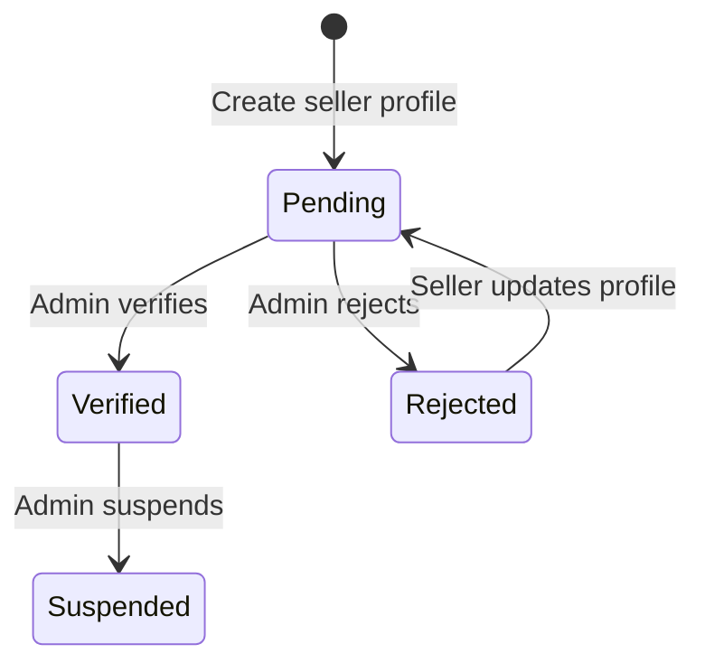

# 06 - Seller Profile

## Overview

Users with an approved identity verification can create a seller profile to begin listing items on the platform. The profile goes through an admin review cycle (Pending -> Verified or Rejected). Updating a rejected profile automatically resets it to Pending for re-review. A verified seller can be suspended.

---

## Seller Profile Status Lifecycle

**All statuses:**

| Status | Value | Description |
|--------|-------|-------------|
| Pending | `pending` | Awaiting admin review |
| Verified | `verified` | Approved by admin |
| Rejected | `rejected` | Rejected by admin |
| Suspended | `suspended` | Suspended by admin |

---

## Endpoints

### 1. POST /api/me/seller-profile

| Property | Value |
|----------|-------|
| Permission | `Me.ManageSellerProfile` |
| Handler | `CreateSellerProfileCommandHandler` |
| Response | `201 Created` with `SellerProfileDto` |

**Request body:**

| Field | Type | Required | Validation |
|-------|------|----------|------------|
| `StoreName` | `string` | Yes | Not whitespace; max 200 chars |
| `StoreDescription` | `string` | Yes | Not whitespace; max 2000 chars |

**Creation logic:**

1. Check if a seller profile already exists for the current user. Return `SellerProfile.AlreadyExists` if so.
2. Check that the user has at least one `IdentityVerification` in `approved` status. Return `SellerProfile.IdentityNotVerified` if not.
3. Create `SellerProfile` with:
   - `Id` = current user's `UserId` (the seller profile shares the user's ID)
   - `Status` = `pending`
   - `TotalSalesCount` = 0
   - `TotalSalesAmount` = 0
4. Insert and persist.

---

### 2. PUT /api/me/seller-profile

| Property | Value |
|----------|-------|
| Permission | `Me.ManageSellerProfile` |
| Handler | `UpdateSellerProfileCommandHandler` |
| Response | `200 OK` with `SellerProfileDto` |

**Request body:**

| Field | Type | Required | Validation |
|-------|------|----------|------------|
| `StoreName` | `string` | Yes | Not whitespace; max 200 chars |
| `StoreDescription` | `string` | Yes | Not whitespace; max 2000 chars |

**Update logic:**

1. Load seller profile by current user's ID. Return `SellerProfile.NotFound` if missing.
2. Call `profile.Update(storeName, storeDescription, nowUtc)`:
   - If current status is `rejected`, automatically reset status to `pending` (triggers re-review).
   - Update `StoreName` and `StoreDescription` (trimmed).
   - Set `ModifiedAt`.
3. Persist and return updated DTO.

---

### 3. GET /api/me/seller-profile

| Property | Value |
|----------|-------|
| Permission | `Me.ReadSellerProfile` |
| Handler | `GetMySellerProfileQueryHandler` |
| Response | `200 OK` with `SellerProfileDto` |

Returns the current user's full seller profile. Returns `SellerProfile.NotFound` if no profile exists.

**SellerProfileDto fields:**

| Field | Type | Description |
|-------|------|-------------|
| `Id` | `Guid` | Seller profile ID (same as user ID) |
| `StoreName` | `string` | Store name |
| `StoreDescription` | `string` | Store description |
| `Status` | `string` | Profile status |
| `VerifiedAt` | `DateTime?` | When admin verified the profile |
| `TotalSalesCount` | `int` | Cumulative number of completed sales |
| `TotalSalesAmount` | `decimal` | Cumulative revenue |
| `TrustScore` | `decimal` | Overall trust score (0-100, clamped) |
| `TrustScoreCalculatedAt` | `DateTime?` | When trust score was last calculated |
| `CreatedAt` | `DateTime` | Profile creation timestamp |
| `ModifiedAt` | `DateTime?` | Last modification timestamp |

---

### 4. GET /api/sellers/{sellerId}

| Property | Value |
|----------|-------|
| Permission | Anonymous (no auth required) |
| Handler | `GetPublicSellerProfileQueryHandler` |
| Response | `200 OK` with `PublicSellerProfileDto` |

Returns a public view of a seller's profile. Returns `SellerProfile.NotFound` if the profile does not exist.

**PublicSellerProfileDto fields:**

| Field | Type | Description |
|-------|------|-------------|
| `Id` | `Guid` | Seller profile ID |
| `StoreName` | `string` | Store name |
| `StoreDescription` | `string` | Store description |
| `Status` | `string` | Profile status |
| `TotalSalesCount` | `int` | Number of completed sales |
| `TrustScore` | `decimal` | Overall trust score (0-100) |
| `CreatedAt` | `DateTime` | Profile creation timestamp |

**Fields excluded from public DTO** (present in `SellerProfileDto` but not in `PublicSellerProfileDto`):

- `VerifiedAt`
- `TotalSalesAmount`
- `TrustScoreCalculatedAt`
- `ModifiedAt`

---

### 5. GET /api/sellers/{sellerId}/items

| Property | Value |
|----------|-------|
| Permission | Anonymous (no auth required) |
| Handler | `GetPublicSellerItemsQueryHandler` |
| Response | `200 OK` with `PagedList<PublicSellerItemDto>` |

Returns a paginated list of items belonging to the specified seller. Accepts standard paging parameters (`PagedParameters`).

**Validation:** `SellerId` must be a non-empty GUID.

---

## Trust Score

The `SellerProfile` domain entity tracks trust score via two fields:

| Field | Type | Description |
|-------|------|-------------|
| `TrustScoreOverall` | `decimal` | Overall score, clamped to 0-100 via `Math.Clamp(overallScore, 0m, 100m)` |
| `TrustScoreCalculatedAt` | `DateTime?` | Timestamp of last calculation |

The `UpdateTrustScore(decimal overallScore, DateTime now)` method is called by an external scoring process and updates both fields along with `ModifiedAt`.

---

## Error Codes

| Code | HTTP Status | Condition |
|------|-------------|-----------|
| `SellerProfile.AlreadyExists` | 409 | A seller profile already exists for this user |
| `SellerProfile.IdentityNotVerified` | 403 | No approved identity verification exists for the user |
| `SellerProfile.NotFound` | 404 | Seller profile does not exist (used for GET my profile, update, and public view) |
| `SellerProfile.CannotVerify` | 403 | Cannot verify profile in current status (only `pending` allowed) |
| `SellerProfile.CannotReject` | 403 | Cannot reject profile in current status (only `pending` allowed) |
