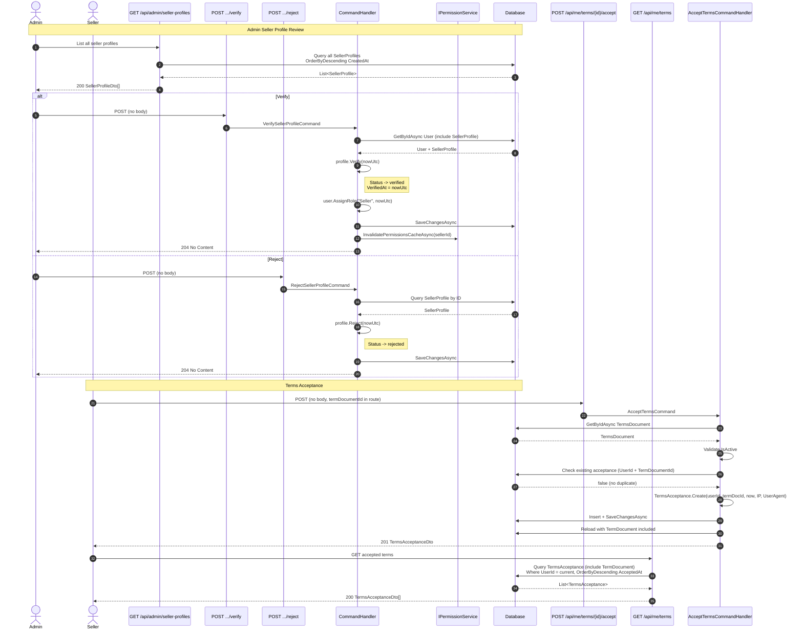

# 07 - Seller Profile Admin Review & Terms Acceptance

## Overview

Admins review pending seller profiles and either verify (granting the Seller role) or reject them. Separately, users must accept terms documents before participating on the platform. The terms acceptance flow captures the user's IP address and User-Agent for audit purposes.

---

## Sequence Diagram

---

## Admin Endpoints

### 1. GET /api/admin/seller-profiles

| Property | Value |
|----------|-------|
| Permission | `Admin.ReadSellerProfiles` |
| Handler | `GetSellerProfilesQueryHandler` |
| Response | `IReadOnlyCollection<SellerProfileDto>` |

Returns all seller profiles (all statuses), ordered by `CreatedAt` descending (newest first). Each item is mapped to `SellerProfileDto` which includes all fields (status, verifiedAt, trust score, sales counts, etc.).

---

### 2. POST /api/admin/seller-profiles/{id}/verify

| Property | Value |
|----------|-------|
| Permission | `Admin.ManageSellerProfiles` |
| Handler | `VerifySellerProfileCommandHandler` |
| Response | `204 No Content` |

**Request:** No body required. The seller ID is taken from the route.

**Verification logic:**

1. Load `User` aggregate with `SellerProfile` included. Return `User.NotFound` if user does not exist.
2. Return `SellerProfile.NotFound` if the user has no seller profile.
3. Call `profile.Verify(nowUtc)`:
   - Only `pending` status can be verified. Otherwise return `SellerProfile.CannotVerify`.
   - Set `Status` = `verified`.
   - Set `VerifiedAt` = current UTC time.
   - Set `ModifiedAt` = current UTC time.
4. Call `user.AssignRole("Seller", nowUtc)` -- grants the `Seller` role to the user.
5. Persist changes via `SaveChangesAsync`.
6. Call `IPermissionService.InvalidatePermissionsCacheAsync(sellerId)` -- invalidates the cached permissions so the new Seller role takes effect immediately.

---

### 3. POST /api/admin/seller-profiles/{id}/reject

| Property | Value |
|----------|-------|
| Permission | `Admin.ManageSellerProfiles` |
| Handler | `RejectSellerProfileCommandHandler` |
| Response | `204 No Content` |

**Request:** No body required. The seller ID is taken from the route.

**Rejection logic:**

1. Load `SellerProfile` by the given ID. Return `SellerProfile.NotFound` if missing.
2. Call `profile.Reject(nowUtc)`:
   - Only `pending` status can be rejected. Otherwise return `SellerProfile.CannotReject`.
   - Set `Status` = `rejected`.
   - Set `ModifiedAt` = current UTC time.
3. Persist changes.

---

## Status Constraint (Seller Profile)

| Status | Can Verify | Can Reject |
|--------|------------|------------|
| `pending` | Yes | Yes |
| `verified` | No | No |
| `rejected` | No | No |
| `suspended` | No | No |

---

## Terms Acceptance Endpoints

### 4. POST /api/me/terms/{termDocumentId}/accept

| Property | Value |
|----------|-------|
| Permission | `Me.AcceptTerms` |
| Handler | `AcceptTermsCommandHandler` |
| Response | `201 Created` with `TermsAcceptanceDto` |

**Request:** No body. The `termDocumentId` is taken from the route. The server automatically captures:
- `IpAddress` from `HttpContext.Connection.RemoteIpAddress`
- `UserAgent` from the `User-Agent` request header

**Acceptance logic:**

1. Load `TermsDocument` by ID. Return `Terms.Document.NotFound` if missing.
2. Validate `termDocument.IsActive == true`. Return `Terms.Accept.Inactive` if the document is not active.
3. Check if the current user has already accepted this specific terms document (unique constraint on `UserId + TermDocumentId`). Return `Terms.Accept.AlreadyAccepted` if duplicate.
4. Parse IP address from string (tolerates null/invalid).
5. Create `TermsAcceptance` entity:
   - `Id` = new GUID v7
   - `UserId` = current user
   - `TermDocumentId` = route parameter
   - `AcceptedAt` = current UTC time
   - `IpAddress` = parsed IP (nullable)
   - `UserAgent` = trimmed User-Agent string (nullable)
6. Insert and persist.
7. Reload the acceptance with `TermDocument` included for the response.

**TermsAcceptanceDto fields:**

| Field | Type | Description |
|-------|------|-------------|
| `Id` | `Guid` | Acceptance record ID |
| `AcceptedAt` | `DateTime` | When the terms were accepted |
| `IpAddress` | `string?` | Client IP address at time of acceptance |
| `UserAgent` | `string?` | Client User-Agent at time of acceptance |
| `Document` | `TermsDocumentDto` | The accepted terms document |

---

### 5. GET /api/me/terms

| Property | Value |
|----------|-------|
| Permission | `Me.ReadTerms` |
| Handler | `GetMyAcceptedTermsQueryHandler` |
| Response | `200 OK` with `IReadOnlyList<TermsAcceptanceDto>` |

Returns all terms acceptances for the current user, ordered by `AcceptedAt` descending (most recent first). Each acceptance includes its linked `TermDocument` via eager loading.

---

## Business Rules Summary

| Rule | Detail |
|------|--------|
| Only `pending` seller profiles can be verified or rejected | Attempting on other statuses returns `CannotVerify` / `CannotReject` |
| Verify grants the Seller role | `user.AssignRole("Seller")` is called as part of the verify flow |
| Permission cache is invalidated on verify | Ensures new role permissions are effective immediately |
| Only active terms can be accepted | Inactive terms return `Terms.Accept.Inactive` |
| No duplicate acceptance | A user cannot accept the same terms document twice |
| IP and UserAgent are captured server-side | Not sent by the client; extracted from `HttpContext` |

---

## Error Codes

| Code | HTTP Status | Condition |
|------|-------------|-----------|
| `User.NotFound` | 404 | User with given seller ID does not exist (verify flow) |
| `SellerProfile.NotFound` | 404 | Seller profile does not exist |
| `SellerProfile.CannotVerify` | 403 | Profile is not in `pending` status |
| `SellerProfile.CannotReject` | 403 | Profile is not in `pending` status |
| `Terms.Document.NotFound` | 404 | Terms document with given ID does not exist |
| `Terms.Accept.Inactive` | 403 | Terms document is not active |
| `Terms.Accept.AlreadyAccepted` | 409 | User has already accepted this terms document |
