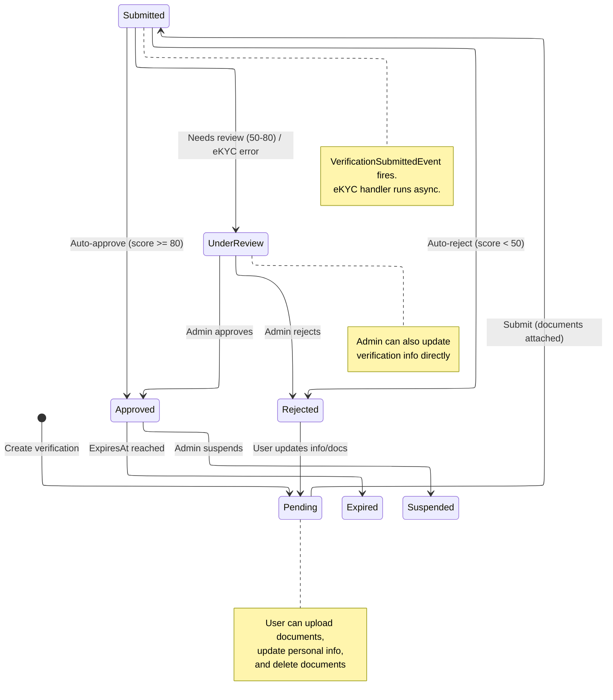
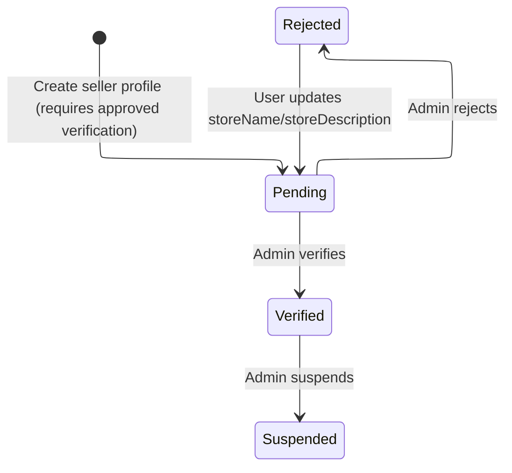
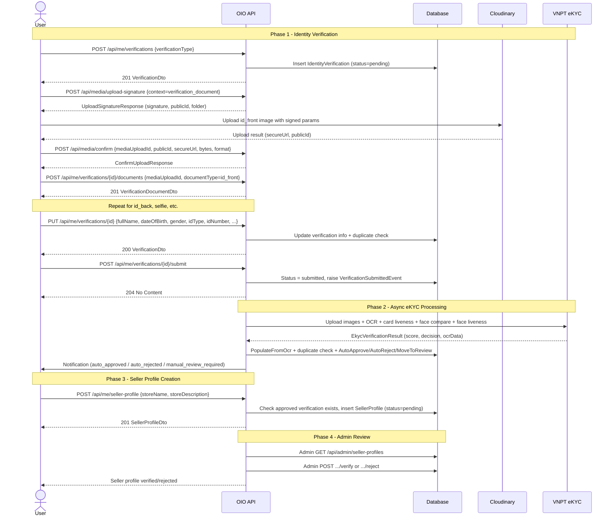
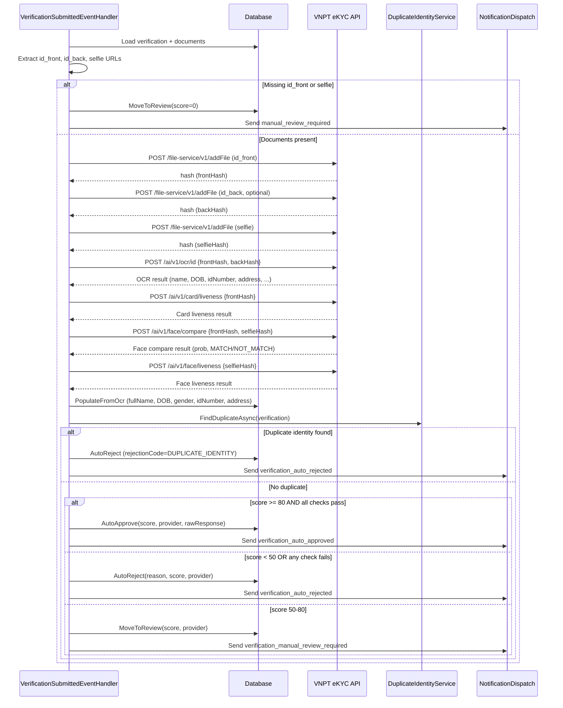

# Seller Verification & Onboarding

This module covers the full journey from identity verification to becoming an active seller on the OIO Auction Platform. A user must complete identity verification (eKYC) before they can create a seller profile, which then goes through its own approval workflow.

**Bounded contexts involved:** `UserContext` (identity verification, seller profiles), `MediaContext` (document uploads), `NotificationContext` (outcome alerts), `ModerationContext` (correction disputes).

---

## Verification Status Lifecycle

The `IdentityVerification` aggregate tracks status through seven states defined in `IdentityVerificationStatus`.

## Seller Profile Status Lifecycle

After identity verification is approved, users can create a `SellerProfile`. Its status is managed independently.

## End-to-End Seller Onboarding Sequence

## eKYC Processing Overview

---

## Subflow Index

| # | File | Description |
|---|------|-------------|
| 01 | [01-create-verification.md](./01-create-verification.md) | Create, update, and query verification requests |
| 02 | [02-upload-documents.md](./02-upload-documents.md) | Document upload flow (signature, Cloudinary, confirm, attach) |
| 03 | [03-submit-ekyc.md](./03-submit-ekyc.md) | Submit for eKYC, VNPT API processing, decision logic |
| 04 | 04-admin-review.md | Admin approve/reject verification (manual review) |
| 05 | 05-seller-profile.md | Create, update, and query seller profiles |
| 06 | 06-admin-seller-profile.md | Admin verify/reject seller profiles |
| 07 | 07-correction-dispute.md | Correction dispute for auto-approved verifications |

---

## Endpoint Reference

### User Verification Endpoints (authenticated user)

| Method | Path | Handler | Permission | Description |
|--------|------|---------|------------|-------------|
| `POST` | `/api/me/verifications` | `CreateVerificationCommand` | `Me.ManageVerification` | Create new verification request |
| `GET` | `/api/me/verifications` | `GetMyVerificationsQuery` | `Me.ReadVerification` | List all my verifications |
| `GET` | `/api/me/verifications/{verificationId}` | `GetMyVerificationByIdQuery` | `Me.ReadVerification` | Get single verification detail |
| `PUT` | `/api/me/verifications/{verificationId}` | `UpdateVerificationCommand` | `Me.ManageVerification` | Update personal info on verification |
| `POST` | `/api/me/verifications/{verificationId}/documents` | `UploadVerificationDocumentCommand` | `Me.ManageVerification` | Attach confirmed media upload as document |
| `DELETE` | `/api/me/verifications/{verificationId}/documents/{docId}` | `DeleteVerificationDocumentCommand` | `Me.ManageVerification` | Remove document from verification |
| `POST` | `/api/me/verifications/{verificationId}/submit` | `SubmitVerificationCommand` | `Me.ManageVerification` | Submit verification for eKYC processing |
| `POST` | `/api/me/verifications/{verificationId}/disputes` | `CreateVerificationCorrectionDisputeCommand` | `Me.ManageVerification` | Open correction dispute for auto-approved verification |

### Admin Verification Endpoints

| Method | Path | Handler | Permission | Description |
|--------|------|---------|------------|-------------|
| `GET` | `/api/admin/verifications` | `GetPendingVerificationsQuery` | `Admin.ReadVerifications` | List pending/under_review verifications |
| `GET` | `/api/admin/verifications/{verificationId}` | `GetVerificationByIdQuery` | `Admin.ReadVerifications` | Get verification detail (admin view) |
| `POST` | `/api/admin/verifications/{verificationId}/approve` | `ApproveVerificationCommand` | `Admin.ManageVerifications` | Approve submitted/under_review verification |
| `POST` | `/api/admin/verifications/{verificationId}/reject` | `RejectVerificationCommand` | `Admin.ManageVerifications` | Reject with reason and optional code |

### Seller Profile Endpoints

| Method | Path | Handler | Permission | Description |
|--------|------|---------|------------|-------------|
| `POST` | `/api/me/seller-profile` | `CreateSellerProfileCommand` | `Me.ManageSellerProfile` | Create seller profile (requires approved verification) |
| `GET` | `/api/me/seller-profile` | `GetMySellerProfileQuery` | `Me.ReadSellerProfile` | Get my seller profile |
| `PUT` | `/api/me/seller-profile` | `UpdateSellerProfileCommand` | `Me.ManageSellerProfile` | Update store name and description |
| `GET` | `/api/admin/seller-profiles` | `GetSellerProfilesQuery` | `Admin.ReadSellerProfiles` | List seller profiles for admin |
| `POST` | `/api/admin/seller-profiles/{id}/verify` | `VerifySellerProfileCommand` | `Admin.ManageSellerProfiles` | Verify (approve) seller profile |
| `POST` | `/api/admin/seller-profiles/{id}/reject` | `RejectSellerProfileCommand` | `Admin.ManageSellerProfiles` | Reject seller profile |

### Media Upload Endpoints (shared)

| Method | Path | Handler | Permission | Description |
|--------|------|---------|------------|-------------|
| `POST` | `/api/media/upload-signature` | `RequestUploadSignatureCommand` | `Media.Upload` | Get signed upload params for Cloudinary |
| `POST` | `/api/media/confirm` | `ConfirmUploadCommand` | `Media.ConfirmUpload` | Confirm upload completed with file metadata |

---

## Domain Events

| Event | Raised By | Consumers | Trigger |
|-------|-----------|-----------|---------|
| `VerificationSubmittedEvent` | `IdentityVerification.Submit()` | `VerificationSubmittedEventHandler` | User submits verification for eKYC |

The handler runs asynchronously via MediatR `INotificationHandler` and performs the full eKYC flow (VNPT API calls, OCR population, duplicate detection, auto-decision).

### Notification Event Types

| Event Type | Trigger | Priority |
|------------|---------|----------|
| `verification_auto_approved` | eKYC score >= 80, all checks pass | Normal |
| `verification_auto_rejected` | eKYC score < 50, check failure, or duplicate identity | Normal |
| `verification_manual_review_required` | Score 50-80, missing docs, or eKYC error | Normal |

---

## Entity & Enum Summary

### Aggregates

| Entity | Key | Description |
|--------|-----|-------------|
| `IdentityVerification` | `IdentityVerificationId` (UUIDv7) | Core verification aggregate with documents, history, and eKYC results |
| `SellerProfile` | `UserId` (same as User PK) | Seller store profile, created after verification approval |

### Child Entities

| Entity | Parent | Description |
|--------|--------|-------------|
| `VerificationDocument` | `IdentityVerification` | Uploaded document (image) linked via `MediaUpload` |
| `VerificationHistory` | `IdentityVerification` | Audit trail of every state change and action |

### Value Objects

| Value Object | Fields | Description |
|--------------|--------|-------------|
| `IdentityDocument` | `idType`, `idNumber`, `issuedDate`, `expiredDate`, `issuedPlace` | Government ID details |
| `PermanentAddress` | `fullAddress`, `province`, `district`, `ward` | Residential address from OCR or manual entry |

### Enums

| Enum | Values | Source File |
|------|--------|------------|
| `IdentityVerificationStatus` | `pending`, `submitted`, `under_review`, `approved`, `rejected`, `expired`, `suspended` | `IdentityVerificationStatus.cs` |
| `SellerProfileStatus` | `pending`, `verified`, `rejected`, `suspended` | `SellerProfileStatus.cs` |
| `VerificationType` | `government_id`, `passport`, `business_owner`, `manual` | `VerificationType.cs` |
| `VerificationDocumentType` | `id_front`, `id_back`, `selfie`, `selfie_with_id`, `business_license`, `bank_statement`, `other` | `VerificationDocumentType.cs` |
| `DocumentVerificationStatus` | `pending`, `valid`, `invalid`, `unclear` | `DocumentVerificationStatus.cs` |
| `VerificationHistoryAction` | `created`, `submitted`, `auto_verified`, `manual_review_started`, `approved`, `rejected`, `resubmitted`, `expired`, `suspended`, `document_uploaded`, `document_deleted`, `info_updated`, `moved_to_review` | `VerificationHistoryAction.cs` |
| `Gender` | `male`, `female`, `other` | `Gender.cs` |
| `IdType` | `cccd`, `cmnd`, `passport` | `IdType.cs` |
| `PerformerType` | `seller`, `buyer`, `admin`, `system` | `PerformerType.cs` |
| `EkycDecision` | `Approved`, `Rejected`, `NeedsReview` | `IEkycProvider.cs` |
