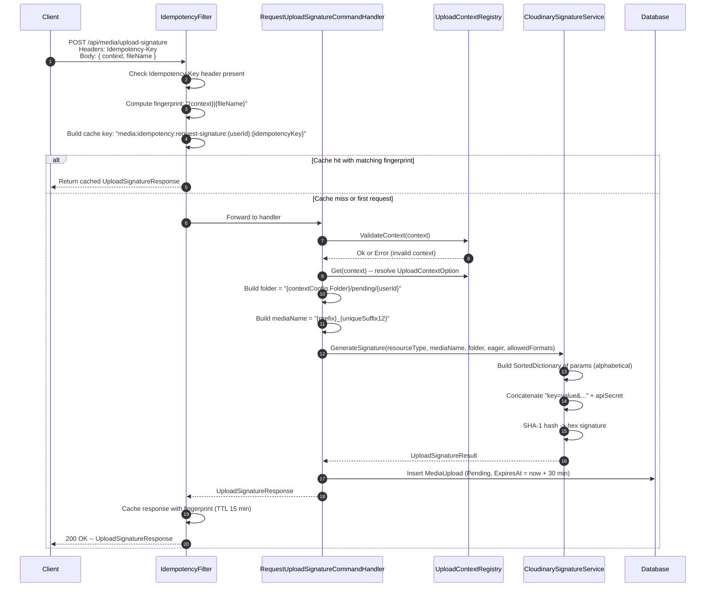

# 01 -- Request Upload Signature

## Overview

The client requests a signed parameter bundle that authorizes a direct upload to Cloudinary. The server validates the upload context, generates a SHA-1 signature, creates a `MediaUpload` entity in `Pending` state, and returns all the fields the client needs to construct the Cloudinary upload request.

---

## Sequence



---

## Endpoint

| | |
|---|---|
| **Method** | `POST` |
| **Path** | `/api/media/upload-signature` |
| **Permission** | `media:upload` |
| **Idempotency** | Required (`Idempotency-Key` header) |

---

## Request Body

```json
{
  "context": "item_image",
  "fileName": "photo.jpg"
}
```

| Field | Type | Required | Description |
|-------|------|----------|-------------|
| `context` | `string` | Yes | One of the 8 registered upload context names (e.g. `item_image`, `user_avatar`) |
| `fileName` | `string` | Yes | Original file name from the client (stored in `MediaInfo.FileName`) |

---

## Response Body

```json
{
  "mediaUploadId": "019...",
  "uploadUrl": "https://api.cloudinary.com/v1_1/dt2b5qfoe/image/upload",
  "signature": "a1b2c3d4e5f6...",
  "timestamp": 1700000000,
  "apiKey": "123456789",
  "cloudName": "dt2b5qfoe",
  "publicId": "img_abc123def456",
  "storagePublicId": "items/pending/userId123/img_abc123def456",
  "folder": "items/pending/userId123",
  "eager": "w_800,h_800,c_limit|w_400,h_400,c_fill",
  "resourceType": "image",
  "maxFileSize": 10485760,
  "allowedFormats": ["jpg", "jpeg", "png", "webp"]
}
```

| Field | Type | Description |
|-------|------|-------------|
| `mediaUploadId` | `Guid` | Server-generated ID (GUIDv7) for this `MediaUpload` record |
| `uploadUrl` | `string` | Cloudinary upload endpoint: `{baseUrl}/{cloudName}/{resourceType}/upload` |
| `signature` | `string` | SHA-1 hex digest of sorted params concatenated with the API secret |
| `timestamp` | `long` | Unix epoch seconds used in the signature |
| `apiKey` | `string` | Cloudinary API key (public, safe for client) |
| `cloudName` | `string` | Cloudinary cloud name |
| `publicId` | `string` | The leaf file name sent to Cloudinary as `public_id` field (e.g. `img_abc123def456`) |
| `storagePublicId` | `string` | Full path: `{folder}/{publicId}` -- used server-side to track the resource |
| `folder` | `string` | Temporary folder: `{contextConfig.Folder}/pending/{userId}` |
| `eager` | `string?` | Cloudinary eager transformation string (null if context has no eager) |
| `resourceType` | `string` | `"image"`, `"video"`, or `"raw"` |
| `maxFileSize` | `long` | Maximum allowed file size in bytes for this context |
| `allowedFormats` | `string[]` | Permitted file extensions |

---

## Idempotency Detail

The endpoint is wrapped with `IdempotencyFilter<UploadSignatureResponse>` using the `RequestUploadSignature()` policy.

| Aspect | Value |
|--------|-------|
| **Header** | `Idempotency-Key` (required, any unique string) |
| **Cache key** | `media:idempotency:request-signature:{userId}:{idempotencyKey}` |
| **Fingerprint** | `{context.Trim()}|{fileName.Trim()}` |
| **Cache TTL** | 15 minutes (via `HybridCache`) |
| **Tags** | `["media-idempotency:{userId}"]` |
| **Success result kind** | `Ok` (HTTP 200) |

If the same `Idempotency-Key` is sent with a different `context` or `fileName`, the server returns `409 Conflict` with error code `Media.IdempotencyPayloadMismatch`.

---

## Signature Generation

The `CloudinarySignatureService.GenerateSignature()` method:

1. Builds a `SortedDictionary<string, string>` with these keys (alphabetical order):
   - `allowed_formats` -- comma-separated (only if formats exist)
   - `eager` -- transformation string (only if present)
   - `eager_async` -- `"true"` (only for video resource type)
   - `folder` -- the temporary folder path
   - `public_id` -- the media name leaf (e.g. `img_abc123def456`)
   - `timestamp` -- Unix epoch seconds
2. Concatenates as `key1=value1&key2=value2&...`
3. Appends the Cloudinary `ApiSecret` directly (no separator)
4. Computes SHA-1 hash and converts to lowercase hex string

---

## MediaUpload Entity Created

When the handler succeeds, a new `MediaUpload` entity is persisted:

| Field | Value |
|-------|-------|
| `Id` | New `MediaUploadId` (GUIDv7) |
| `UserId` | Current authenticated user |
| `Context` | The validated context name |
| `ResourceType` | From context config (e.g. `"image"`) |
| `EntityId` | `null` (not yet linked) |
| `IdType` | `null` |
| `Info` | `MediaInfo` with `FileName` only |
| `StorageRef` | `PublicId` = `storagePublicId`, `Folder` = folder |
| `IsConfirmed` | `false` |
| `IsLinked` | `false` |
| `RelocationAttemptCount` | `0` |
| `CreatedAt` | `now` |
| `ExpiresAt` | `now + SignatureExpiration` (30 min) |

---

## Error Codes

| HTTP | Code | Condition |
|------|------|-----------|
| 400 | `Validation` | `context` or `fileName` is empty/whitespace |
| 400 | `Media.Context.NotInSet` | Context name is not one of the registered contexts |
| 409 | `Media.IdempotencyPayloadMismatch` | Idempotency key reused with different payload |
| 422 | `Idempotency.Required` | `Idempotency-Key` header missing |
