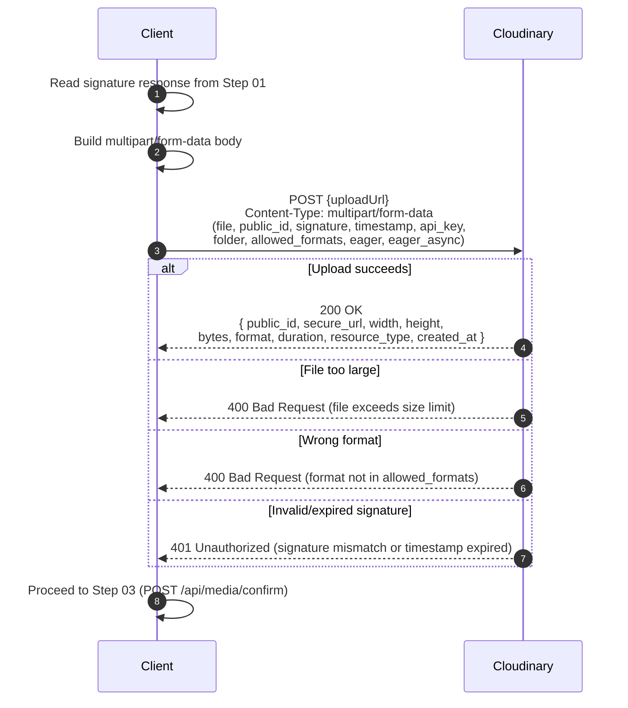

# 02 -- Client Upload to Cloudinary

## Overview

This step happens entirely **client-side**. There is no OIO server endpoint involved. The client takes the signed parameter bundle returned by `POST /api/media/upload-signature` and uses it to upload the file directly to Cloudinary via a multipart/form-data POST request.

---

## Sequence



---

## Upload URL

The URL comes directly from the `uploadUrl` field in the signature response:

```
https://api.cloudinary.com/v1_1/{cloudName}/{resourceType}/upload
```

For example:
- Image: `https://api.cloudinary.com/v1_1/dt2b5qfoe/image/upload`
- Video: `https://api.cloudinary.com/v1_1/dt2b5qfoe/video/upload`
- Document (raw): `https://api.cloudinary.com/v1_1/dt2b5qfoe/raw/upload`

---

## Multipart Form-Data Fields

The client must include these fields in the `multipart/form-data` POST body:

| Field | Source | Description |
|-------|--------|-------------|
| `file` | Client file picker | The binary file content |
| `public_id` | `response.publicId` | The leaf file name (e.g. `img_abc123def456`) |
| `signature` | `response.signature` | SHA-1 hex signature from the server |
| `timestamp` | `response.timestamp` | Unix epoch seconds matching the signature |
| `api_key` | `response.apiKey` | Cloudinary API key |
| `folder` | `response.folder` | Temporary folder path (e.g. `items/pending/{userId}`) |
| `allowed_formats` | `response.allowedFormats` joined with `,` | Comma-separated list (e.g. `jpg,jpeg,png,webp`) |
| `eager` | `response.eager` (if not null) | Transformation string (e.g. `w_800,h_800,c_limit\|w_400,h_400,c_fill`) |
| `eager_async` | `"true"` for video, omit for image | Whether eager transforms run asynchronously |

### Notes on `eager_async`

- **Image** contexts: `eager_async` is **not** included in the signed params. Eager transforms for images run synchronously, meaning the Cloudinary response will include transformed versions immediately.
- **Video** contexts: `eager_async` is set to `"true"` in the signed params. Video eager transforms are processed asynchronously; the Cloudinary response returns before transforms complete.

---

## Cloudinary Response

On success, Cloudinary returns a JSON response. The relevant fields the client needs for the confirm step:

```json
{
  "public_id": "items/pending/userId123/img_abc123def456",
  "secure_url": "https://res.cloudinary.com/dt2b5qfoe/image/upload/v1700000000/items/pending/userId123/img_abc123def456.jpg",
  "width": 1920,
  "height": 1080,
  "bytes": 524288,
  "format": "jpg",
  "duration": null,
  "resource_type": "image",
  "created_at": "2024-01-15T10:30:00Z"
}
```

| Field | Type | Description |
|-------|------|-------------|
| `public_id` | `string` | Full public ID including folder path |
| `secure_url` | `string` | HTTPS URL to the uploaded resource |
| `width` | `int?` | Image/video width in pixels |
| `height` | `int?` | Image/video height in pixels |
| `bytes` | `long` | File size in bytes |
| `format` | `string` | File format/extension |
| `duration` | `double?` | Video duration in seconds (null for images) |
| `resource_type` | `string` | `"image"`, `"video"`, or `"raw"` |
| `created_at` | `string` | ISO 8601 timestamp of upload |

---

## Error Scenarios

| Scenario | Cloudinary HTTP | Cause |
|----------|-----------------|-------|
| File too large | 400 | File exceeds the size indicated by `maxFileSize` from the signature response. Note: Cloudinary enforces its own plan limits; the OIO `maxFileSize` field is advisory for client-side validation. |
| Wrong format | 400 | File extension/MIME type not in the `allowed_formats` list signed in the params |
| Invalid signature | 401 | The `signature` does not match the hash of the provided params. Could happen if the client modifies any signed field. |
| Expired timestamp | 401 | The `timestamp` is too old. Cloudinary typically allows a window of ~1 hour from the timestamp value. The OIO `SignatureExpiration` of 30 min is within this window. |
| Network error | N/A | Client-side connectivity issue. The `MediaUpload` record remains in Pending state and will be cleaned up after `ExpiresAt`. |

---

## Client-Side Validation Recommendations

Before uploading, the client should validate:

1. **File size**: Check `file.size <= response.maxFileSize` to avoid wasting bandwidth
2. **File format**: Check file extension is in `response.allowedFormats`
3. **Upload promptly**: The signature expires after 30 minutes (`SignatureExpiration`); uploading should begin soon after receiving the signature
