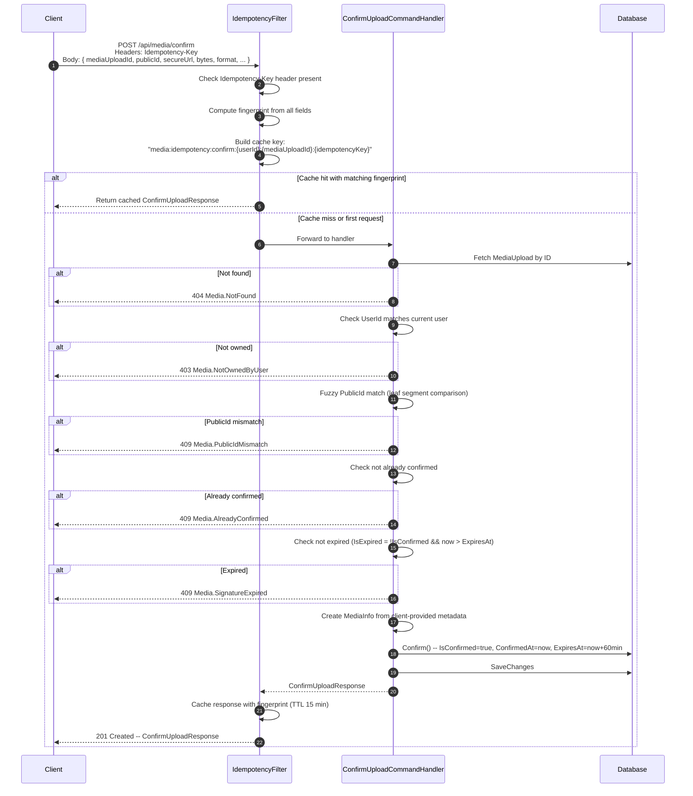

# 03 -- Confirm Upload

## Overview

After the client uploads a file directly to Cloudinary and receives Cloudinary's response, the client sends the returned metadata to the OIO API to confirm the upload. The server validates ownership and public ID match, transitions the `MediaUpload` from `Pending` to `Confirmed`, and extends the expiry to `OrphanExpiration` (60 min).

> **IMPORTANT**: The server trusts client-provided metadata (`secureUrl`, `bytes`, `width`, `height`, `durationSeconds`, `format`) without making a round-trip verification call to Cloudinary. This is a known integrity gap -- a malicious client could submit fabricated metadata.

---

## Sequence



---

## Endpoint

| | |
|---|---|
| **Method** | `POST` |
| **Path** | `/api/media/confirm` |
| **Permission** | `media:upload:confirm` |
| **Idempotency** | Required (`Idempotency-Key` header) |

---

## Request Body

```json
{
  "mediaUploadId": "019...",
  "publicId": "items/pending/userId123/img_abc123def456",
  "secureUrl": "https://res.cloudinary.com/dt2b5qfoe/image/upload/v.../img_abc123def456.jpg",
  "bytes": 524288,
  "format": "jpg",
  "fileName": "photo.jpg",
  "width": 1920,
  "height": 1080,
  "durationSeconds": null
}
```

| Field | Type | Required | Description |
|-------|------|----------|-------------|
| `mediaUploadId` | `Guid` | Yes | The ID returned by the signature endpoint |
| `publicId` | `string` | Yes | `public_id` from Cloudinary response |
| `secureUrl` | `string` | Yes | `secure_url` from Cloudinary response (must be a valid absolute URI) |
| `bytes` | `long` | Yes | File size in bytes (must be > 0) |
| `format` | `string` | Yes | File format/extension from Cloudinary |
| `fileName` | `string?` | No | Optional original file name |
| `width` | `int?` | No | Image/video pixel width |
| `height` | `int?` | No | Image/video pixel height |
| `durationSeconds` | `double?` | No | Video duration in seconds |

---

## Response Body

```json
{
  "mediaUploadId": "019...",
  "secureUrl": "https://res.cloudinary.com/dt2b5qfoe/image/upload/v.../img_abc123def456.jpg",
  "publicId": "items/pending/userId123/img_abc123def456",
  "resourceType": "image"
}
```

| Field | Type | Description |
|-------|------|-------------|
| `mediaUploadId` | `Guid` | The confirmed upload's ID |
| `secureUrl` | `string` | The secure URL echoed back |
| `publicId` | `string` | The public ID echoed back |
| `resourceType` | `string` | Resource type from the original `MediaUpload` record |

---

## Idempotency Detail

The endpoint is wrapped with `IdempotencyFilter<ConfirmUploadResponse>` using the `ConfirmUpload()` policy.

| Aspect | Value |
|--------|-------|
| **Header** | `Idempotency-Key` (required) |
| **Cache key** | `media:idempotency:confirm:{userId}:{mediaUploadId}:{idempotencyKey}` |
| **Fingerprint** | All fields concatenated with `\|` separator: `{mediaUploadId}\|{publicId}\|{secureUrl}\|{bytes}\|{format}\|{fileName}\|{width}\|{height}\|{durationSeconds}` |
| **Cache TTL** | 15 minutes |
| **Tags** | `["media-idempotency:{userId}"]` |
| **Success result kind** | `Created` (HTTP 201) |

---

## Validation Steps

The handler performs these checks in order:

| Step | Check | Error on Failure |
|------|-------|------------------|
| 1 | Fetch `MediaUpload` by `mediaUploadId` | `404 Media.NotFound` |
| 2 | `mediaUpload.UserId == currentUser.UserId` | `403 Media.NotOwnedByUser` |
| 3 | Fuzzy `PublicId` match (leaf segment) | `409 Media.PublicIdMismatch` |
| 4 | `IsConfirmed == false` | `409 Media.AlreadyConfirmed` |
| 5 | `!IsExpired(now)` (i.e. `now <= ExpiresAt`) | `409 Media.SignatureExpired` |

### Fuzzy PublicId Match

The `MatchesPublicId` method first checks for exact string equality. If that fails, it extracts the **leaf segment** (last `/`-separated part) from both the expected (`StorageRef.PublicId`) and actual (`request.PublicId`) values and compares them. This accommodates Cloudinary returning the full folder-prefixed `public_id` while the server stores the full `storagePublicId`.

```
Expected: "items/pending/userId123/img_abc123def456"
Actual:   "items/pending/userId123/img_abc123def456"
Leaf:     "img_abc123def456" == "img_abc123def456" -> Match
```

---

## Confirm Logic

When all validations pass, `MediaUpload.Confirm()` is called:

| Field | Before | After |
|-------|--------|-------|
| `Info` | `MediaInfo(FileName only)` | `MediaInfo(SecureUrl, FileName, Bytes, Format, Width, Height, DurationSeconds)` |
| `IsConfirmed` | `false` | `true` |
| `ConfirmedAt` | `null` | `now` |
| `ExpiresAt` | `now + SignatureExpiration (30 min)` | `now + OrphanExpiration (60 min)` |

The expiry extension gives the user time to complete the entity form (e.g., create/update an item) and link the media before the orphan cleanup job removes it.

---

## Error Codes

| HTTP | Code | Condition |
|------|------|-----------|
| 400 | `Validation` | Required fields missing or invalid (empty GUID, empty strings, Bytes <= 0, invalid URI) |
| 404 | `Media.NotFound` | No `MediaUpload` record with the given ID |
| 403 | `Media.NotOwnedByUser` | The `MediaUpload` belongs to a different user |
| 409 | `Media.PublicIdMismatch` | Neither exact nor leaf-segment match on public ID |
| 409 | `Media.AlreadyConfirmed` | The upload was already confirmed |
| 409 | `Media.SignatureExpired` | The upload's `ExpiresAt` has passed without confirmation |
| 409 | `Media.IdempotencyPayloadMismatch` | Same idempotency key used with different request fields |
| 422 | `Idempotency.Required` | `Idempotency-Key` header missing |
