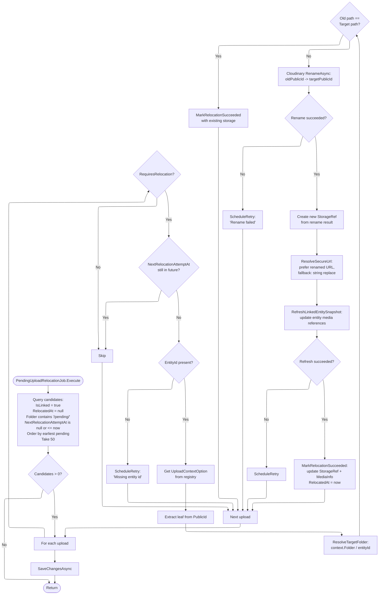
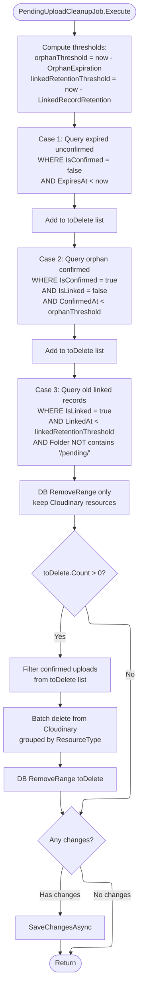

# 04 -- Background Jobs

## Overview

Two Quartz-scheduled background jobs manage the media lifecycle after upload and confirmation:

1. **PendingUploadRelocationJob** -- Moves linked uploads from their temporary `pending/` folder to the final Cloudinary path and refreshes the entity snapshot.
2. **PendingUploadCleanupJob** -- Removes expired, orphaned, and old linked upload records (and their Cloudinary resources where applicable).

Both jobs run every **15 minutes**, are marked `[DisallowConcurrentExecution]`, and use `WithMisfireHandlingInstructionFireNow()`.

---

## Relocation Job

### Flow

### Retry Backoff

When relocation fails, `ScheduleRetry` sets `NextRelocationAttemptAt` based on the current `RelocationAttemptCount`:

| Attempt | Delay | NextRelocationAttemptAt |
|---------|-------|------------------------|
| 0 | 1 minute | `now + 1 min` |
| 1 | 5 minutes | `now + 5 min` |
| 2 | 15 minutes | `now + 15 min` |
| >= 3 | Permanent failure | `null` (no more retries) |

After 3 failed attempts (`MaxRetries = 3`), `NextRelocationAttemptAt` is set to `null` and the upload will no longer be picked up. The `LastRelocationError` field stores the reason.

### Job Configuration

| Setting | Value |
|---------|-------|
| **Job key** | `pending-upload-relocation` (group: `system`) |
| **Trigger key** | `pending-upload-relocation-trigger` |
| **Interval** | Every 15 minutes |
| **Batch size** | 50 per execution |
| **Concurrency** | `[DisallowConcurrentExecution]` |
| **Misfire** | `WithMisfireHandlingInstructionFireNow()` |

### Target Folder Resolution

The target folder depends on the upload context:

| Context Prefix | Target Folder Pattern | Example |
|----------------|-----------------------|---------|
| `item_*` | `items/{entityId}` | `items/019abc...` |
| `user_avatar` | `avatars/{entityId}` | `avatars/019def...` |
| `verification_*` | `verifications/{entityId}` | `verifications/019ghi...` |
| `term_*` | `terms/{entityId}` | `terms/019jkl...` |
| `category_*` | `categories/{entityId}` | `categories/019mno...` |
| `warehouse_inspection_*` | `warehouse/inspections/{entityId}` | `warehouse/inspections/019pqr...` |
| `dispute_*` | `disputes/{disputeId}/messages/{messageId}` | `disputes/019abc.../messages/019def...` |

General formula: `{contextConfig.Folder}/{entityId}`, except for `dispute_attachment` which resolves through the `DisputeMessageAttachment` entity to build a nested path.

### Entity Snapshot Refresh

After renaming on Cloudinary, the service updates the media reference on the linked entity:

| Context | Entity | Method Called |
|---------|--------|-------------|
| `item_*` | `Item` (with `Media` included) | `RefreshMediaSnapshot(oldPublicId, storageRef, info, now)` |
| `verification_*` | `IdentityVerification` (with `Documents`) | `RefreshDocumentSnapshot(...)` |
| `user_avatar` | `User` (with `Profile`) | `RefreshAvatarSnapshot(oldPublicId, avatarUrl, now)` |
| `term_*` | `TermsDocument` | `RefreshMediaSnapshot(storageRef, info)` |
| `category_*` | `Category` | `RefreshIconMedia(storageRef, info, now)` |
| `warehouse_inspection_*` | `WarehouseInspection` | `RefreshEvidenceSnapshot(...)` |
| `dispute_*` | `DisputeMessageAttachment` | `RefreshMediaSnapshot(storageRef, info, now)` |

---

## Cleanup Job

### Flow

### Three Cleanup Cases

| Case | Condition | Cloudinary Action | DB Action |
|------|-----------|-------------------|-----------|
| **1. Expired unconfirmed** | `IsConfirmed = false` AND `ExpiresAt < now` | Delete (only if confirmed, so typically none) | Remove record |
| **2. Orphan confirmed** | `IsConfirmed = true` AND `IsLinked = false` AND `ConfirmedAt < orphanThreshold` (60 min) | Batch delete by resource type | Remove record |
| **3. Old linked** | `IsLinked = true` AND `LinkedAt < linkedRetentionThreshold` (7 days) AND folder does NOT contain `/pending/` | **No deletion** (resource is in its final folder and in use) | Remove record (audit trail cleanup) |

### Cloudinary Batch Deletion

For Cases 1 and 2, confirmed uploads are grouped by `ResourceType` (`image`, `video`, `raw`) and batch-deleted using `CloudinarySignatureService.DeleteResourcesAsync()`. Unconfirmed uploads in Case 1 do not have Cloudinary resources to delete (the upload may have never completed).

### Job Configuration

| Setting | Value |
|---------|-------|
| **Job key** | `pending-upload-cleanup` (group: `system`) |
| **Trigger key** | `pending-upload-cleanup-trigger` |
| **Interval** | Every 15 minutes |
| **Concurrency** | `[DisallowConcurrentExecution]` |
| **Misfire** | `WithMisfireHandlingInstructionFireNow()` |
