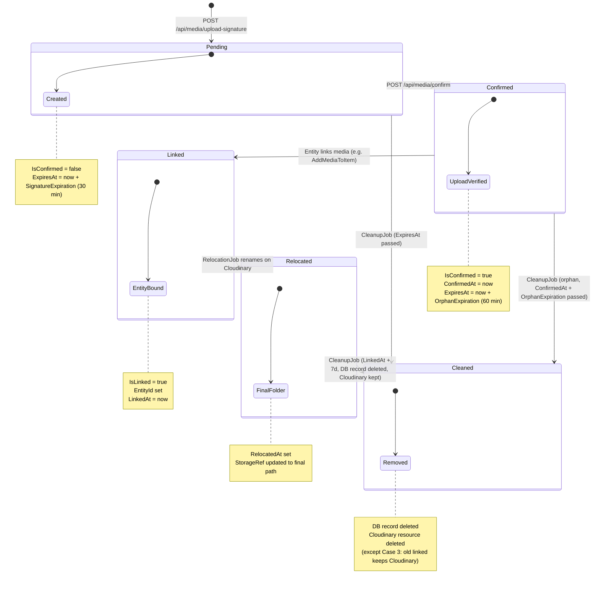
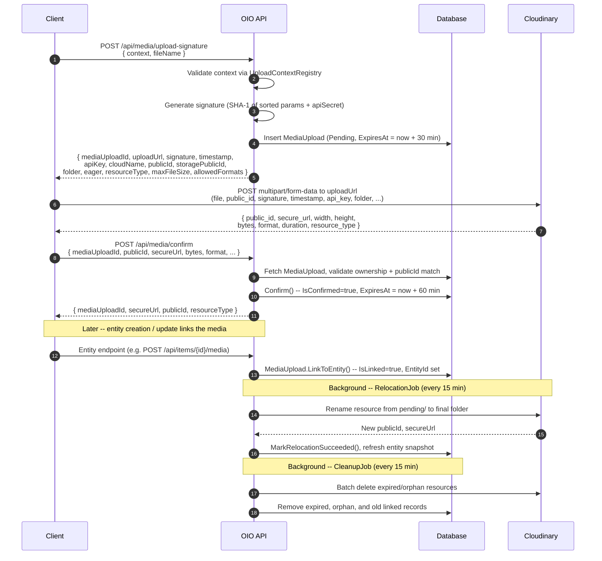

# Media Upload Flow

## Overview

The OIO platform uses a **Cloudinary signed direct upload** pattern. The server never receives file bytes; instead, it generates a signed parameter bundle that the client uses to upload directly to Cloudinary. After the client completes the upload and confirms it, the server tracks the media lifecycle through a series of states until a background job relocates the file from a temporary `pending` folder to its final storage path.

### Core entities

| Type | Location | Purpose |
|------|----------|---------|
| `MediaUpload` | Domain entity | Tracks each upload through its full lifecycle (pending -> confirmed -> linked -> relocated -> cleaned) |
| `StorageRef` | Value object | Holds `PublicId` and `Folder` -- the Cloudinary coordinate pair |
| `MediaInfo` | Value object | Client-reported metadata: `SecureUrl`, `FileName`, `Bytes`, `Format`, `Width`, `Height`, `DurationSeconds` |
| `UploadContextRegistry` | Application service | Validates context names, resolves per-context config, classifies contexts by entity prefix |
| `CloudinarySignatureService` | Infrastructure service | Generates SHA-1 signatures, renames/deletes resources on Cloudinary |

---

## MediaUpload State Machine

---

## End-to-End Upload Flow

---

## Endpoints

| Method | Path | Permission | Description |
|--------|------|------------|-------------|
| `POST` | `/api/media/upload-signature` | `media:upload` | Generate a signed upload bundle for Cloudinary direct upload |
| `POST` | `/api/media/confirm` | `media:upload:confirm` | Confirm a completed upload with Cloudinary-returned metadata |
| `GET` | `/api/media/contexts` | `media:contexts:read` | List all available upload contexts with their constraints |

---

## Subflow Index

| # | File | Topic |
|---|------|-------|
| 1 | [01-request-signature.md](./01-request-signature.md) | Request upload signature -- server generates Cloudinary signed params |
| 2 | [02-client-upload.md](./02-client-upload.md) | Client-side direct upload to Cloudinary |
| 3 | [03-confirm-upload.md](./03-confirm-upload.md) | Confirm upload -- server records client-reported metadata |
| 4 | [04-background-jobs.md](./04-background-jobs.md) | Background jobs -- relocation and cleanup |
| 5 | [05-upload-contexts-reference.md](./05-upload-contexts-reference.md) | Upload contexts reference -- all 8 contexts with constraints |

---

## Configuration

All values from `appsettings.Production.json` under the `Media` section:

| Key | Value | Description |
|-----|-------|-------------|
| `SignatureExpiration` | `00:30:00` (30 min) | Time before an unconfirmed `MediaUpload` expires |
| `OrphanExpiration` | `01:00:00` (60 min) | Time after confirmation before an unlinked upload is considered orphaned |
| `LinkedRecordRetention` | `7.00:00:00` (7 days) | How long DB records of linked + relocated uploads are kept before cleanup |
| `CleanupInterval` | `00:15:00` (15 min) | Interval at which the cleanup and relocation jobs run |

Cloudinary connection settings (`Cloudinary` section):

| Key | Value |
|-----|-------|
| `CloudName` | `dt2b5qfoe` |
| `BaseUrl` | `https://api.cloudinary.com/v1_1` |

---

## Key Concepts

### Idempotency

Both `upload-signature` and `confirm` endpoints require an `Idempotency-Key` HTTP header. The server caches results for 15 minutes using `HybridCache`. A fingerprint is computed from the request body fields; if the same idempotency key is reused with different field values, the server returns a `409 Conflict` (`PayloadMismatch`).

- **upload-signature** fingerprint: `{context}|{fileName}`
- **confirm** fingerprint: `{mediaUploadId}|{publicId}|{secureUrl}|{bytes}|{format}|{fileName}|{width}|{height}|{durationSeconds}`

### Orphan Cleanup

Uploads that are confirmed but never linked to an entity are cleaned up after `OrphanExpiration` (60 min). Expired unconfirmed uploads (past `SignatureExpiration` of 30 min) are also deleted. Both the Cloudinary resource and the DB record are removed.

### Relocation

Files are initially uploaded to a temporary folder: `{context.Folder}/pending/{userId}`. Once linked to an entity, the `PendingUploadRelocationJob` renames the Cloudinary resource to its final path (e.g., `items/{entityId}`) and refreshes the media snapshot on the linked entity. Retry backoff: attempt 0 = 1 min, attempt 1 = 5 min, attempt 2 = 15 min, then permanent failure after 3 attempts.

### Linked Record Retention

After relocation succeeds and 7 days pass, the DB `MediaUpload` record is deleted but the Cloudinary resource is **kept** in its final folder. The record served only as an audit trail at that point.
