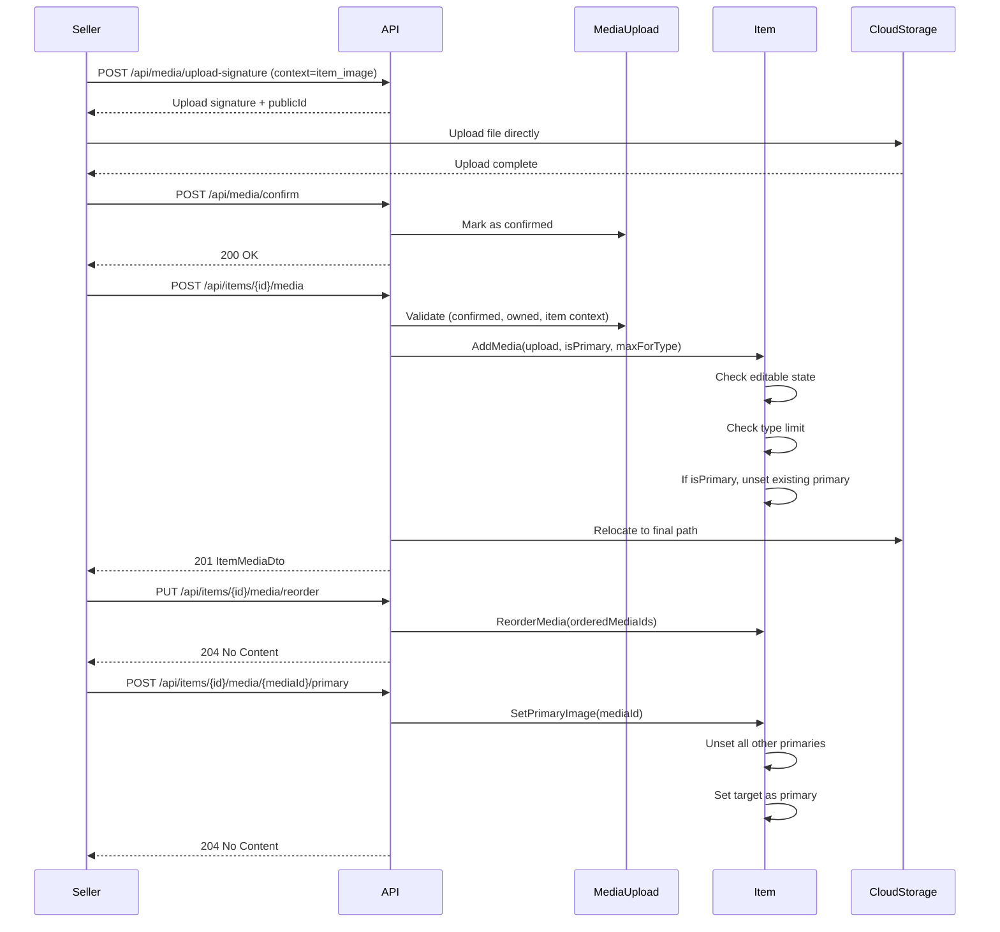

# 02 -- Manage Item Media

## Overview

After creating an item, sellers can attach, remove, reorder media files and designate a primary image. Media must be pre-uploaded and confirmed through the Media Upload flow (see `04-media-upload`) before it can be attached to an item. Items can only have media added/removed while in an **editable state** (`Draft` or `Rejected`).

---

## Media Upload and Attach Flow



---

## Endpoints

### 1. POST `/api/items/{itemId}/media` -- Add Media to Item

**Auth:** `items.manage_media`

Attaches a previously uploaded and confirmed media file to the item.

**Path parameters:**

| Parameter | Type | Description |
|-----------|------|-------------|
| `itemId` | `guid` | Target item |

**Request body:**

```json
{
  "mediaUploadId": "3fa85f64-...",
  "isPrimary": false,
  "sortOrder": null
}
```

| Field | Type | Required | Description |
|-------|------|----------|-------------|
| `mediaUploadId` | `guid` | Yes | Reference to a confirmed media upload |
| `isPrimary` | `bool` | Yes (default: false) | Whether this becomes the primary image |
| `sortOrder` | `int?` | No | Display order; defaults to current media count |

**Validation rules:**

1. Item must exist and be owned by the current user.
2. Item must be in an editable state (`Draft` or `Rejected`).
3. Media upload must exist, be confirmed, not already linked, and belong to the current user.
4. Media upload context must be an item context (e.g. `item_image`, `item_video`).
5. Per-type limit enforced via `UploadContextRegistry.GetMaxForEntityMedia("item", resourceType)`:
   - `item_image` (resource type `image`): max **10** per item
   - `item_video` (resource type `video`): max **3** per item

**Behavior:**
- If `isPrimary = true` and `resourceType = "image"`, all existing primary images are unset before setting the new one.
- After domain validation, the media upload is relocated to its final cloud storage path.

**Response:** `201 Created`

```json
{
  "id": "3fa85f64-...",
  "url": "https://res.cloudinary.com/...",
  "publicId": "items/abc123",
  "resourceType": "image",
  "isPrimary": true,
  "sortOrder": 0,
  "fileName": "product-photo.jpg",
  "bytes": 204800,
  "format": "jpg",
  "width": 800,
  "height": 600,
  "durationSeconds": null
}
```

---

### 2. DELETE `/api/items/{itemId}/media/{mediaId}` -- Remove Media

**Auth:** `items.manage_media`

Removes a media file from the item.

**Path parameters:**

| Parameter | Type | Description |
|-----------|------|-------------|
| `itemId` | `guid` | Target item |
| `mediaId` | `guid` | Media entry to remove |

**Behavior:**
- Item must be in an editable state.
- If the removed media was primary, the next media (by `SortOrder`) is automatically promoted to primary.
- Raises `MediaRemovedFromItemEvent` with the removed media's `PublicId` and `ResourceType` for cloud cleanup.

**Response:** `204 No Content`

---

### 3. POST `/api/items/{itemId}/media/{mediaId}/primary` -- Set Primary Image

**Auth:** `items.manage_media`

Designates the specified media as the primary image for the item.

**Path parameters:**

| Parameter | Type | Description |
|-----------|------|-------------|
| `itemId` | `guid` | Target item |
| `mediaId` | `guid` | Media to set as primary |

**Behavior:**
- All other media on the item have `IsPrimary` set to `false`.
- The target media has `IsPrimary` set to `true`.
- No editable-state check is enforced on this operation (only media existence is validated).

**Response:** `204 No Content`

---

### 4. PUT `/api/items/{itemId}/media/reorder` -- Reorder Item Media

**Auth:** `items.manage_media`

Updates the sort order of all media on the item. The request must include every media ID belonging to the item.

**Path parameters:**

| Parameter | Type | Description |
|-----------|------|-------------|
| `itemId` | `guid` | Target item |

**Request body:**

```json
{
  "orderedMediaIds": [
    "guid-first",
    "guid-second",
    "guid-third"
  ]
}
```

| Field | Type | Required | Description |
|-------|------|----------|-------------|
| `orderedMediaIds` | `guid[]` | Yes | All media IDs in desired display order |

**Behavior:**
- Each media ID in the array is matched against the item's media collection.
- `SortOrder` is set to the array index (0-based).
- Media IDs not found in the item's collection are silently skipped.

**Response:** `204 No Content`

---

## ItemMediaDto Response Fields

| Field | Type | Description |
|-------|------|-------------|
| `id` | `Guid` | Media entry ID |
| `url` | `string` | Public URL (from `MediaInfo.SecureUrl`) |
| `publicId` | `string` | Cloud storage public ID |
| `resourceType` | `string` | `"image"` or `"video"` |
| `isPrimary` | `bool` | Whether this is the primary display image |
| `sortOrder` | `int` | Display order |
| `fileName` | `string?` | Original file name |
| `bytes` | `long?` | File size in bytes |
| `format` | `string?` | File format (e.g. `jpg`, `png`, `mp4`) |
| `width` | `int?` | Image/video width in pixels |
| `height` | `int?` | Image/video height in pixels |
| `durationSeconds` | `double?` | Video duration (null for images) |

---

## Media Limits per Context

| Context | Resource Type | Max per Item |
|---------|--------------|--------------|
| `item_image` | `image` | 10 |
| `item_video` | `video` | 3 |

---

## Error Codes

| Code | Type | Condition |
|------|------|-----------|
| `Item.NotFound` | 404 | Item with given ID not found |
| `Item.NotOwnedByUser` | 403 | Current user does not own this item |
| `Item.InvalidState` | 409 | Item is not in an editable state (`Draft` or `Rejected`) |
| `Item.MediaNotFound` | 404 | Media entry with given ID not found on the item |
| `Media.NotFound` | 404 | Referenced media upload does not exist |
| `Media.NotOwnedByUser` | 403 | Media upload belongs to a different user |
| `Media.NotConfirm` | 409 | Media upload has not been confirmed |
| `Media.WrongContext` | 409 | Media upload context is not an item context |
| `Media.LimitReached` | 409 | Maximum count for this resource type exceeded |
| `Media.Invalid` | 409 | Media upload does not have a valid URL |

---

## Source Files

- Domain: `src/core/OIO.Domain/Context/CatalogContext/Aggregates/Items/Item.cs` (methods: `AddMedia`, `RemoveMedia`, `SetPrimaryImage`, `ReorderMedia`)
- Domain entity: `src/core/OIO.Domain/Context/CatalogContext/Aggregates/Items/ItemMedia.cs`
- Command (Add): `src/core/OIO.Application/Context/AuctionContext/Commands/AddMediaToItem/AddItemImageCommand.cs`
- Endpoints: `src/presentation/OIO.Api/Endpoints/AuctionContext/Items/AddItemImageEndpoint.cs`, `RemoveItemMediaEndpoint.cs`, `SetPrimaryImageEndpoint.cs`, `ReorderItemMediaEndpoint.cs`
