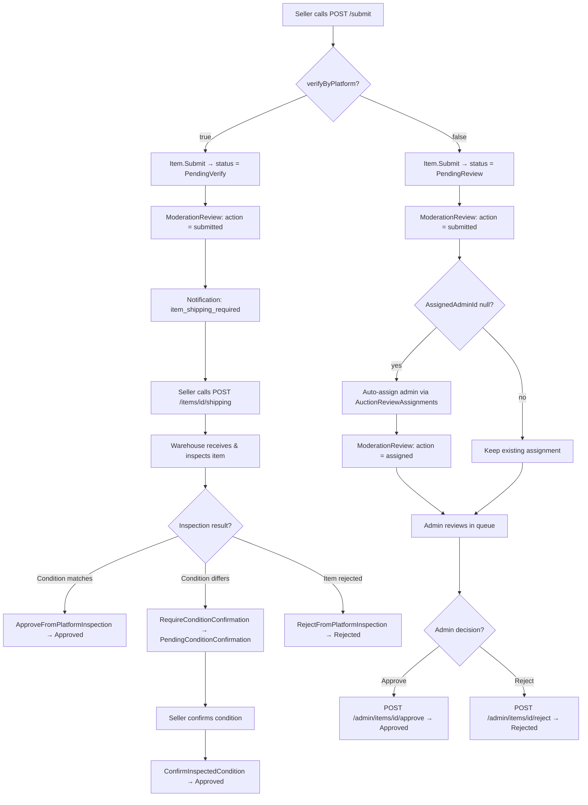

# 04 -- Submit & Resubmit for Review

## Overview

After a seller finishes preparing an item (adding title, description, media), they submit it for review. The submission path is determined by the `verifyByPlatform` flag:

- **`verifyByPlatform = true`** -- The item enters `PendingVerify` status and follows the warehouse inspection path. The seller must arrange shipping to the platform warehouse.
- **`verifyByPlatform = false`** -- The item enters `PendingReview` status and an admin reviewer is auto-assigned for remote review.

If the item is rejected, the seller can resubmit it (which increments `ResubmissionCount`) via the same two paths.

---

## Submit Decision Tree



---

## Endpoints

### 1. POST `/api/items/{itemId}/submit` -- Submit Item

**Auth:** `items.create`

Submits a draft item for review or platform verification.

**Path parameters:**

| Parameter | Type | Description |
|-----------|------|-------------|
| `itemId` | `guid` | Item to submit |

**Request body:**

```json
{
  "verifyByPlatform": false
}
```

| Field | Type | Required | Default | Description |
|-------|------|----------|---------|-------------|
| `verifyByPlatform` | `bool` | Yes | `false` | `true` = warehouse inspection path, `false` = admin review path |

**Preconditions:**

1. Item must exist.
2. Current user must be the item's seller.
3. Item status must be `Draft`.
4. Item must have at least **1 media** attachment (enforced in `Item.Submit()`).

**Handler flow:**

1. Load item with `Media`, `ModerationReviews`, and `Auctions` included.
2. Verify ownership and `Draft` status.
3. Call `item.Submit(verifyByPlatform, nowUtc)`:
   - Checks media count >= 1 (returns `Item.CannotActivate` error if empty).
   - Validates transition via `CanTransitionTo()`.
   - Sets `SubmittedAt = nowUtc`.
   - Changes status to `PendingVerify` or `PendingReview`.
   - Creates `ItemModerationReview` with `action = submitted`.
   - Raises `ItemStatusChangedEvent`.
4. **If `verifyByPlatform = false`** and no admin is assigned:
   - Auto-assigns a reviewer via `AuctionReviewAssignments.ResolveReviewerIdAsync()`.
   - Calls `item.AssignAdmin(adminId, nowUtc)` which creates `ItemModerationReview` with `action = assigned`.
5. Save changes.
6. **If `verifyByPlatform = true`**: dispatches notification with event type `item_shipping_required` and priority `High`, including an action link to `POST api/items/{id}/shipping`.
7. **If `verifyByPlatform = false`** (and auction exists): dispatches notification with event type `item_submitted_for_review` and priority `Normal`.

**Response:** `204 No Content`

---

### 2. POST `/api/items/{itemId}/resubmit` -- Resubmit Rejected Item

**Auth:** `items.resubmit`

Resubmits a previously rejected item for another round of review.

**Path parameters:**

| Parameter | Type | Description |
|-----------|------|-------------|
| `itemId` | `guid` | Item to resubmit |

**Request body:**

```json
{
  "verifyByPlatform": false
}
```

| Field | Type | Required | Default | Description |
|-------|------|----------|---------|-------------|
| `verifyByPlatform` | `bool` | Yes | `false` | Same routing as submit |

**Preconditions:**

1. Item must exist.
2. Current user must be the item's seller.
3. Item status must be `Rejected`.

**Handler flow:**

1. Load item with `ModerationReviews` and `Auctions` included.
2. Verify ownership and `Rejected` status.
3. Call `item.Resubmit(verifyByPlatform, nowUtc)`:
   - Validates transition via `CanTransitionTo()`.
   - **Increments `ResubmissionCount`.**
   - Sets `SubmittedAt = nowUtc`.
   - Clears `RejectionReason`.
   - Changes status to `PendingVerify` or `PendingReview`.
   - Creates `ItemModerationReview` with `action = resubmitted`.
   - Raises `ItemStatusChangedEvent`.
4. **If `verifyByPlatform = false`** and no admin is assigned: auto-assigns reviewer (same as submit).
5. Save changes.
6. **If `verifyByPlatform = true`**: dispatches notification `item_shipping_required` with `isResubmission = true` in metadata.
7. **If `verifyByPlatform = false`** (and auction exists): dispatches notification `item_resubmitted_for_review`.

**Response:** `204 No Content`

---

## ModerationReview Tracking

Every state transition and administrative action creates an `ItemModerationReview` record on the item aggregate. This provides a complete audit trail.

| Action | Trigger | Old Status | New Status |
|--------|---------|------------|------------|
| `submitted` | `Submit()` | `draft` | `pending_verify` or `pending_review` |
| `assigned` | `AssignAdmin()` | current | current (no status change) |
| `approved` | `Approve()` | `pending_review` | `approved` |
| `rejected` | `Reject()` | `pending_review` | `rejected` |
| `platform_verified` | `ApproveFromPlatformInspection()` | `pending_verify` | `approved` |
| `platform_rejected` | `RejectFromPlatformInspection()` | `pending_verify` or `pending_condition_confirmation` | `rejected` |
| `condition_confirmation_requested` | `RequireConditionConfirmation()` | `pending_verify` | `pending_condition_confirmation` |
| `condition_confirmed` | `ConfirmInspectedCondition()` | `pending_condition_confirmation` | `approved` |
| `resubmitted` | `Resubmit()` | `rejected` | `pending_verify` or `pending_review` |

**Admin assign rules:** `AssignAdmin()` is allowed when status is `Draft` or `PendingReview`.

---

## Error Codes

| Code | Type | Condition |
|------|------|-----------|
| `Item.NotFound` | 404 | Item with given ID not found |
| `Item.NotOwnedByUser` | 403 | Current user is not the item's seller |
| `Item.InvalidState` | 409 | Item is not in `Draft` (for submit) or `Rejected` (for resubmit) |
| `Item.CannotActivate` | 409 | Item has no media attachments |

---

## Source Files

- Domain: `src/core/OIO.Domain/Context/CatalogContext/Aggregates/Items/Item.cs` (methods: `Submit`, `Resubmit`, `AssignAdmin`)
- Domain entity: `src/core/OIO.Domain/Context/CatalogContext/Aggregates/Items/ItemModerationReview.cs`
- Enum: `src/core/OIO.Domain/Context/CatalogContext/Enums/ModerationAction.cs`
- Command (Submit): `src/core/OIO.Application/Context/AuctionContext/Commands/SubmitItem/SubmitItemCommand.cs`
- Command (Resubmit): `src/core/OIO.Application/Context/AuctionContext/Commands/ResubmitItem/ResubmitItemCommand.cs`
- Endpoints: `src/presentation/OIO.Api/Endpoints/AuctionContext/Items/SubmitItemEndpoint.cs`, `ResubmitItemEndpoint.cs`
