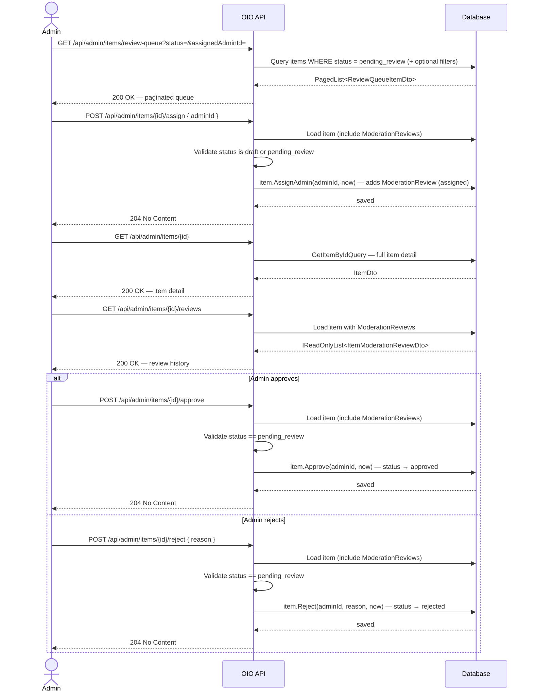

# 05 - Admin Review

## Overview

Admin review is the content-moderation gate for items submitted via the **PendingReview** path
(items where `verifyByPlatform = false`).
An admin browses the review queue, optionally assigns themselves (or another admin),
inspects the item detail, and either approves or rejects the listing.

Every action is recorded as an `ItemModerationReview` entry on the item aggregate.

---

## Sequence Diagram

---

## Endpoints

### 1. GET `/api/admin/items/review-queue`

Retrieve the paginated review queue. Only items in `pending_review` status appear by default.

| Parameter | Location | Type | Required | Notes |
|---|---|---|---|---|
| `status` | query | `string` | No | Filter by `ItemStatus.Id`. Validated against `ItemStatus.All`. |
| `assignedAdminId` | query | `Guid?` | No | Filter by assigned admin. Must be non-empty GUID when provided. |
| `page` | query | `int` | No | Page number (from `PagedParameters`). |
| `pageSize` | query | `int` | No | Page size (from `PagedParameters`). |

**Authorization:** `Catalogs.Admin.ReadItems`

**Response:** `200 OK` — `PagedList<ReviewQueueItemDto>`

Ordered by `SubmittedAt` ascending (oldest first).

---

### 2. GET `/api/admin/items/{itemId}`

Full item detail for admin review. Uses the same `GetItemByIdQuery` as the public item endpoint.

| Parameter | Location | Type | Required |
|---|---|---|---|
| `itemId` | path | `Guid` | Yes |

**Authorization:** `Catalogs.Admin.ReadItems`

**Response:** `200 OK` — `ItemDto`

---

### 3. POST `/api/admin/items/{itemId}/assign`

Assign an admin reviewer to an item. Valid only when item status is `draft` or `pending_review`.

| Parameter | Location | Type | Required | Notes |
|---|---|---|---|---|
| `itemId` | path | `Guid` | Yes | |
| `adminId` | body | `Guid` | Yes | Must be non-empty GUID. |

**Authorization:** `Catalogs.Admin.ManageItems`

**Response:** `204 No Content`

Side-effects:
- Sets `item.AssignedAdminId` to the provided admin.
- Creates a `ModerationReview` with action `assigned` (status does not change).

---

### 4. POST `/api/admin/items/{itemId}/approve`

Approve an item. Status must be `pending_review`.

| Parameter | Location | Type | Required |
|---|---|---|---|
| `itemId` | path | `Guid` | Yes |

No request body.

**Authorization:** `Catalogs.Admin.ManageItems`

**Response:** `204 No Content`

Side-effects:
- Status transitions: `pending_review` -> `approved`.
- Sets `ReviewedAt`, `ReviewedBy`, clears `RejectionReason`.
- Creates a `ModerationReview` with action `approved`.

---

### 5. POST `/api/admin/items/{itemId}/reject`

Reject an item. Status must be `pending_review`.

| Parameter | Location | Type | Required | Validation |
|---|---|---|---|---|
| `itemId` | path | `Guid` | Yes | Non-empty GUID |
| `reason` | body | `string` | Yes | Not whitespace, max 1000 characters |

**Authorization:** `Catalogs.Admin.ManageItems`

**Response:** `204 No Content`

Side-effects:
- Status transitions: `pending_review` -> `rejected`.
- Sets `ReviewedAt`, `ReviewedBy`, `RejectionReason`.
- Creates a `ModerationReview` with action `rejected` (includes reason).

---

### 6. GET `/api/admin/items/{itemId}/reviews`

Retrieve the moderation review history for an item.

| Parameter | Location | Type | Required |
|---|---|---|---|
| `itemId` | path | `Guid` | Yes |

**Authorization:** `Catalogs.Admin.ReadItems`

**Response:** `200 OK` — `IReadOnlyList<ItemModerationReviewDto>`

Reviews are ordered by `CreatedAt` descending (newest first).

---

## DTOs

### ReviewQueueItemDto

| Field | Type | Description |
|---|---|---|
| `itemId` | `Guid` | Item identifier |
| `auctionId` | `Guid` | Most recent auction ID (default GUID if none) |
| `title` | `string` | Item title |
| `status` | `string` | Current `ItemStatus.Id` |
| `condition` | `string` | `ItemCondition.Id` (e.g. `new`, `like_new`) |
| `sellerId` | `Guid` | Seller user ID |
| `assignedAdminId` | `Guid?` | Assigned reviewer admin ID, if any |
| `resubmissionCount` | `int` | Number of times the item was resubmitted |
| `mediaCount` | `int` | Number of media attachments |
| `submittedAt` | `DateTime?` | When the item was submitted for review |
| `createdAt` | `DateTime` | Item creation timestamp |

### ItemModerationReviewDto

| Field | Type | Description |
|---|---|---|
| `id` | `Guid` | Review record identifier |
| `action` | `string` | `ModerationAction.Id` (e.g. `submitted`, `assigned`, `approved`, `rejected`) |
| `reviewerId` | `Guid` | User who performed the action |
| `reason` | `string?` | Rejection reason (null for non-rejection actions) |
| `oldStatus` | `string?` | Previous `ItemStatus.Id` |
| `newStatus` | `string?` | New `ItemStatus.Id` |
| `createdAt` | `DateTime` | When this review action occurred |

---

## Error Codes

| Code | HTTP | Trigger |
|---|---|---|
| `Item.NotFound` | 404 | Item with the given ID does not exist |
| `Item.InvalidState` | 409 | Item status does not allow the attempted action (e.g. approve when not `pending_review`) |
| `Item.NotOwnedByUser` | 403 | User does not own the item (used in seller-side operations) |
| `Item.MaxImagesReached` | 422 | Maximum of 10 images per item |
| `Item.InvalidCondition` | 422 | Condition value not in allowed set |
