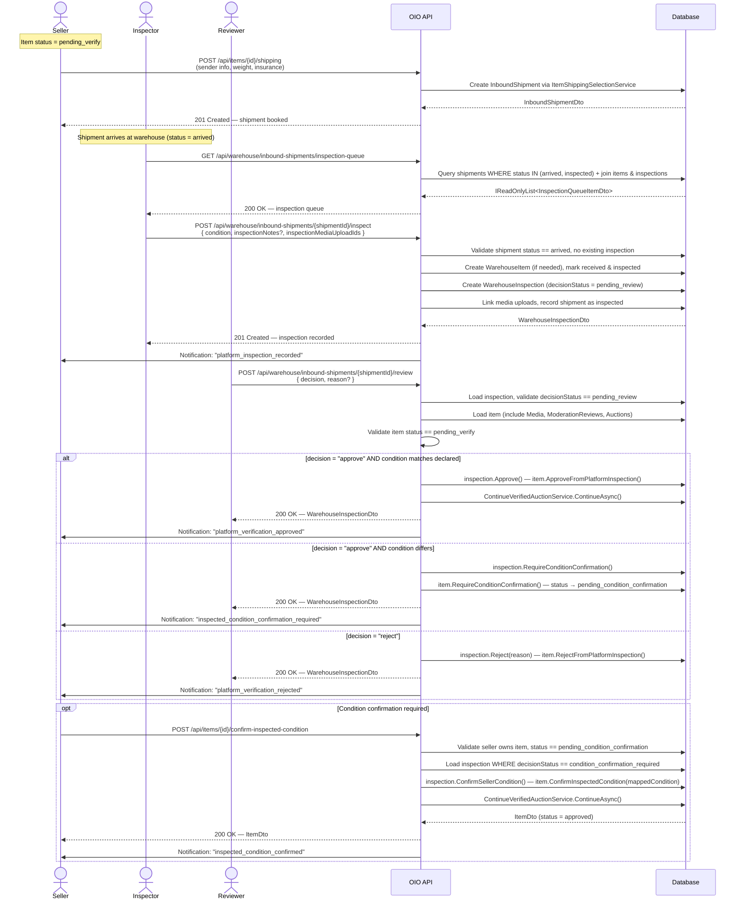
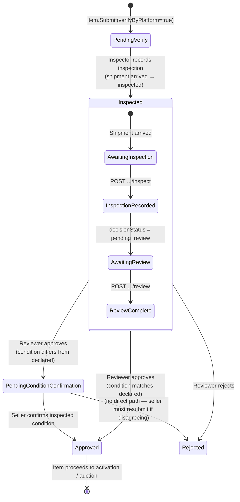

# 06 - Warehouse Inspection

## Overview

When an item is submitted with `verifyByPlatform = true`, it enters the **PendingVerify** path.
The seller ships the physical item to the OIO warehouse where it is inspected by platform staff.
An inspector records condition and evidence, a reviewer makes a decision (approve / reject / request condition confirmation),
and — if the inspected condition differs from the seller's declaration — the seller must confirm before the item can proceed.

---

## Sequence Diagram — Full Inspection Flow

---

## State Diagram — Inspection Sub-States

---

## Endpoints

### 1. POST `/api/items/{itemId}/shipping`

Seller chooses shipping to send the physical item to the warehouse. Creates an inbound shipment.

| Parameter | Location | Type | Required | Notes |
|---|---|---|---|---|
| `itemId` | path | `Guid` | Yes | |
| `senderName` | body | `string` | Yes | |
| `senderPhone` | body | `string` | Yes | |
| `senderAddress` | body | `string` | Yes | |
| `senderWard` | body | `string` | Yes | |
| `senderDistrict` | body | `string` | Yes | |
| `senderProvince` | body | `string` | Yes | |
| `weightGrams` | body | `int` | Yes | |
| `insuranceValue` | body | `decimal` | Yes | |
| `providerCode` | body | `string?` | No | e.g. `ghn`, `ghtk`, `external`. Defaults to system default provider. |
| `senderCarrierAddressDataJson` | body | `string?` | No | Carrier-specific address JSON |
| `lengthCm` | body | `int?` | No | Package dimensions |
| `widthCm` | body | `int?` | No | |
| `heightCm` | body | `int?` | No | |
| `externalTrackingNumber` | body | `string?` | No | For external/self-ship carriers |
| `externalCarrierName` | body | `string?` | No | |
| `notes` | body | `string?` | No | |

**Authorization:** `Catalogs.Items.Create`

**Response:** `201 Created` — `InboundShipmentDto`

#### InboundShipmentDto

| Field | Type | Description |
|---|---|---|
| `id` | `Guid` | Shipment identifier |
| `itemId` | `Guid` | Associated item |
| `sellerId` | `Guid` | Seller who booked the shipment |
| `providerCode` | `string` | Shipping provider code |
| `clientOrderCode` | `string` | Platform's internal order code for the carrier |
| `carrierTrackingNumber` | `string?` | Carrier-assigned tracking number |
| `senderName` | `string` | Sender name |
| `senderPhone` | `string` | Sender phone |
| `senderAddress` | `string` | Sender street address |
| `senderWard` | `string` | Ward |
| `senderDistrict` | `string` | District |
| `senderProvince` | `string` | Province |
| `weightGrams` | `int` | Package weight |
| `lengthCm` | `int?` | Package length |
| `widthCm` | `int?` | Package width |
| `heightCm` | `int?` | Package height |
| `shippingFee` | `decimal` | Calculated shipping fee |
| `insuranceValue` | `decimal` | Declared insurance value |
| `status` | `string` | Shipment status (e.g. `awaiting_pickup`) |
| `notes` | `string?` | Optional notes |
| `expectedArrivalAt` | `DateTime?` | Estimated arrival time |
| `arrivedAt` | `DateTime?` | Actual arrival time |
| `createdAt` | `DateTime` | Creation timestamp |
| `modifiedAt` | `DateTime?` | Last modification |
| `trackingEvents` | `ShipmentTrackingEventDto[]` | Carrier tracking events |

---

### 2. GET `/api/warehouse/inbound-shipments/inspection-queue`

Paginated inspection queue showing shipments ready for inspection or review.

| Parameter | Location | Type | Required | Default |
|---|---|---|---|---|
| `page` | query | `int` | No | 1 |
| `pageSize` | query | `int` | No | 20 |

**Authorization:** `Catalogs.Warehouse.ReadShipments`

**Response:** `200 OK` — `IReadOnlyList<InspectionQueueItemDto>`

Items are returned in two queue statuses:
- `awaiting_inspection` — shipment `arrived`, no inspection record yet.
- `awaiting_review` — shipment `inspected`, inspection `decisionStatus = pending_review`.

Ordered by `ArrivedAt` descending (most recent arrivals first).

#### InspectionQueueItemDto

| Field | Type | Description |
|---|---|---|
| `inboundShipmentId` | `Guid` | Shipment identifier |
| `itemId` | `Guid` | Associated item |
| `itemTitle` | `string` | Item title |
| `sellerId` | `Guid` | Seller user ID |
| `warehouseItemId` | `Guid?` | Warehouse item record (null if not yet inspected) |
| `inspectionId` | `Guid?` | Inspection record (null if awaiting inspection) |
| `shipmentStatus` | `string` | `InboundShipmentStatus.Id` (`arrived` or `inspected`) |
| `queueStatus` | `string` | `awaiting_inspection` or `awaiting_review` |
| `carrierTrackingNumber` | `string?` | Carrier tracking number |
| `arrivedAt` | `DateTime?` | When the shipment arrived |
| `declaredCondition` | `string` | Seller-declared `ItemCondition.Id` |
| `conditionOnArrival` | `string?` | Inspector-assessed `WarehouseItemCondition.Id` (null if not inspected) |
| `inspectedAt` | `DateTime?` | When the inspection was performed |

---

### 3. POST `/api/warehouse/inbound-shipments/{shipmentId}/inspect`

Inspector records the physical inspection of an arrived shipment.

| Parameter | Location | Type | Required | Notes |
|---|---|---|---|---|
| `shipmentId` | path | `Guid` | Yes | |
| `condition` | body | `string` | Yes | Must be a valid `WarehouseItemCondition.Id`: `new`, `like_new`, `very_good`, `good`, `acceptable`, `damaged` |
| `inspectionNotes` | body | `string?` | No | Free-text notes |
| `inspectionMediaUploadIds` | body | `Guid[]` | Yes | At least one confirmed media upload required. Must be owned by current user, in `warehouse inspection` context, not already linked. |

**Authorization:** `Catalogs.Warehouse.Inspect`

**Response:** `201 Created` — `WarehouseInspectionDto`

**Preconditions:**
- Shipment status must be `arrived`.
- No existing inspection for this shipment.

Side-effects:
- Creates `WarehouseItem` if it does not exist, marks it as `received` then `inspected`.
- Creates `WarehouseInspection` with `decisionStatus = pending_review`.
- Updates shipment status to `inspected`.
- Links media uploads to the inspection entity.
- Sends seller notification: `platform_inspection_recorded`.

---

### 4. POST `/api/warehouse/inbound-shipments/{shipmentId}/review`

Reviewer makes a decision on a pending inspection.

| Parameter | Location | Type | Required | Notes |
|---|---|---|---|---|
| `shipmentId` | path | `Guid` | Yes | |
| `decision` | body | `string` | Yes | One of: `approve`, `reject` |
| `reason` | body | `string?` | No | Required when `decision = reject` |

**Authorization:** `Catalogs.Warehouse.Inspect`

**Response:** `200 OK` — `WarehouseInspectionDto`

**Preconditions:**
- Inspection must exist with `decisionStatus = pending_review`.
- Item must be in `pending_verify` status.

**Decision logic:**

| Decision | Condition Match | Item Result | Inspection Result | ModerationAction |
|---|---|---|---|---|
| `approve` | Declared == Inspected | `approved` | `approved` | `platform_verified` |
| `approve` | Declared != Inspected | `pending_condition_confirmation` | `condition_confirmation_required` | `condition_confirmation_requested` |
| `reject` | n/a | `rejected` | `rejected` | `platform_rejected` |

When approved with matching condition, `ContinueVerifiedAuctionService` is called to auto-advance any associated auction (draft -> pending, or approved -> scheduled).

---

### 5. POST `/api/items/{itemId}/confirm-inspected-condition`

Seller confirms the inspected condition when it differs from the original declaration.

| Parameter | Location | Type | Required |
|---|---|---|---|
| `itemId` | path | `Guid` | Yes |

No request body.

**Authorization:** `Catalogs.Items.Resubmit`

**Response:** `200 OK` — `ItemDto`

**Preconditions:**
- Caller must be the item's seller (`item.SellerId == currentUser`).
- Item status must be `pending_condition_confirmation`.
- A `WarehouseInspection` with `decisionStatus = condition_confirmation_required` must exist for this item.

Side-effects:
- Updates item condition to the inspector-assessed condition (`WarehouseItemCondition` mapped to `ItemCondition`).
- Transitions item: `pending_condition_confirmation` -> `approved`.
- Creates `ModerationReview` with action `condition_confirmed`.
- Calls `ContinueVerifiedAuctionService.ContinueAsync()` to auto-advance any associated auction.
- Sends seller notification: `inspected_condition_confirmed` (or `auction_auto_continued_after_condition_confirmation` if auction was advanced).

#### WarehouseInspectionDto

| Field | Type | Description |
|---|---|---|
| `id` | `Guid` | Inspection identifier |
| `warehouseItemId` | `Guid` | Associated warehouse item |
| `inboundShipmentId` | `Guid` | Inbound shipment that was inspected |
| `itemId` | `Guid` | Catalog item ID |
| `declaredCondition` | `string` | Seller's original declared condition |
| `conditionOnArrival` | `string` | Inspector-assessed condition |
| `inspectionNotes` | `string?` | Inspector free-text notes |
| `decisionStatus` | `string` | `pending_review`, `approved`, `rejected`, `condition_confirmation_required`, `condition_confirmed` |
| `decisionReason` | `string?` | Rejection reason (null if not rejected) |
| `inspectedBy` | `Guid` | Inspector user ID |
| `inspectedAt` | `DateTime` | When inspection was performed |
| `reviewedBy` | `Guid?` | Reviewer user ID |
| `reviewedAt` | `DateTime?` | When review decision was made |
| `sellerConfirmedAt` | `DateTime?` | When seller confirmed condition |
| `createdAt` | `DateTime` | Record creation time |
| `modifiedAt` | `DateTime?` | Last modification time |
| `evidence` | `WarehouseInspectionEvidenceDto[]` | Inspection media evidence |

---

## Error Codes

| Code | HTTP | Trigger |
|---|---|---|
| `Item.NotFound` | 404 | Item does not exist |
| `Item.NotOwnedByUser` | 403 | Caller is not the item's seller (confirm-inspected-condition) |
| `Item.InvalidState` | 409 | Item status does not allow the action |
| `InboundShipment.NotFound` | 404 | Shipment does not exist |
| `InboundShipment.CannotInspect` | 409 | Shipment not in `arrived` status |
| `WarehouseInspection.AlreadyExists` | 409 | Inspection already recorded for this shipment |
| `WarehouseInspection.EvidenceRequired` | 422 | No media upload IDs provided |
| `WarehouseInspection.AlreadyReviewed` | 409 | Inspection already has a decision |
| `WarehouseInspection.ConditionConfirmationNotRequired` | 409 | No inspection requires seller confirmation |
| `WarehouseInspection.UnsupportedApprovalCondition` | 422 | Inspected condition cannot be mapped to an `ItemCondition` |
| `WarehouseInspection.InvalidItemState` | 409 | Item not in `pending_verify` during review |
| `WarehouseInspection.ReasonRequired` | 422 | Rejection decision without a reason |
