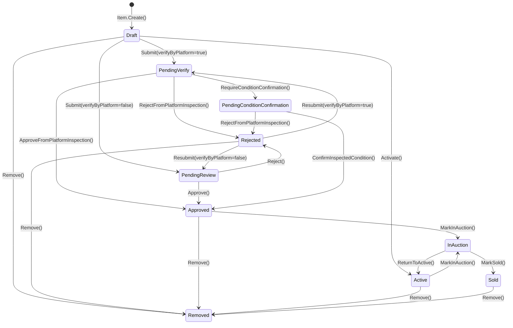
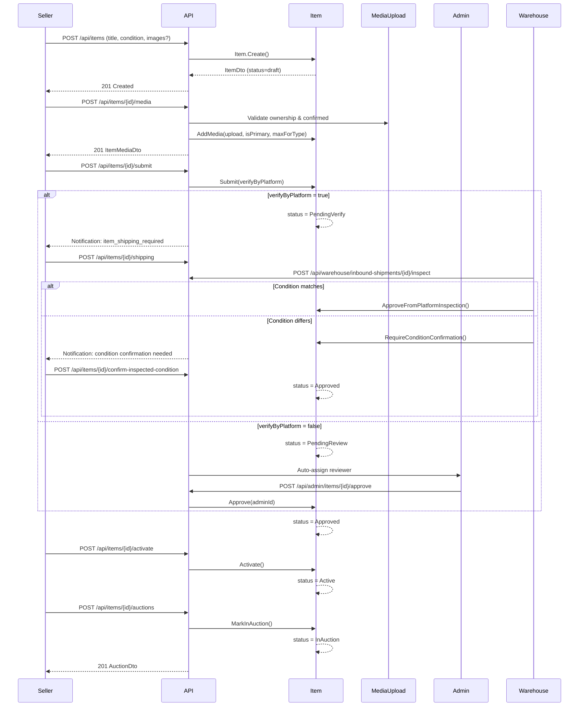

# Item Management

## Module Overview

The Item module manages the complete lifecycle of auction items -- from initial draft creation by a seller through verification/review, approval, activation, and ultimately into auction. Items are the core aggregate in the `CatalogContext` and serve as the foundation for the `AuctionContext`.

An `Item` can follow one of two review paths after submission:
- **Platform verification** (`verifyByPlatform = true`): the item is shipped to a warehouse for physical inspection before approval.
- **Admin review** (`verifyByPlatform = false`): an admin reviews the item listing remotely and approves or rejects it.

---

## Item Status State Machine

## End-to-End Item Flow

---

## Endpoints

### User Endpoints (16)

| # | Method | URL | Auth | Description |
|---|--------|-----|------|-------------|
| 1 | `POST` | `/api/items` | `items.create` | Create a new item (with optional inline images) |
| 2 | `GET` | `/api/items/{itemId}` | Anonymous | Get item by ID (public) |
| 3 | `GET` | `/api/items/my` | Authenticated | Get current seller's items (paginated, sortable) |
| 4 | `POST` | `/api/items/{itemId}/media` | `items.manage_media` | Add media to item |
| 5 | `DELETE` | `/api/items/{itemId}/media/{mediaId}` | `items.manage_media` | Remove media from item |
| 6 | `POST` | `/api/items/{itemId}/media/{mediaId}/primary` | `items.manage_media` | Set media as primary image |
| 7 | `PUT` | `/api/items/{itemId}/media/reorder` | `items.manage_media` | Reorder item media |
| 8 | `POST` | `/api/items/{itemId}/questions` | `items.ask_question` | Ask a question on an item |
| 9 | `POST` | `/api/items/{itemId}/questions/{questionId}/answer` | Authenticated | Answer a question (seller only) |
| 10 | `GET` | `/api/items/{itemId}/questions` | Authenticated | Get public questions for an item (paginated) |
| 11 | `POST` | `/api/items/{itemId}/submit` | `items.create` | Submit item for review |
| 12 | `POST` | `/api/items/{itemId}/resubmit` | `items.resubmit` | Resubmit a rejected item |
| 13 | `POST` | `/api/items/{itemId}/activate` | `items.activate` | Activate an approved item |
| 14 | `POST` | `/api/items/{itemId}/confirm-inspected-condition` | `items.resubmit` | Confirm inspected condition from warehouse |
| 15 | `POST` | `/api/items/{itemId}/shipping` | `items.create` | Choose shipping for platform verification |
| 16 | `POST` | `/api/items/{itemId}/auctions` | `auctions.create` | Create auction from an active/approved item |

### Admin Endpoints (6)

| # | Method | URL | Auth | Description |
|---|--------|-----|------|-------------|
| 1 | `GET` | `/api/admin/items/review-queue` | `admin.read_items` | Get items pending review (paginated) |
| 2 | `GET` | `/api/admin/items/{itemId}` | `admin.read_items` | Get admin item detail |
| 3 | `POST` | `/api/admin/items/{itemId}/approve` | `admin.manage_items` | Approve an item |
| 4 | `POST` | `/api/admin/items/{itemId}/reject` | `admin.manage_items` | Reject an item with reason |
| 5 | `POST` | `/api/admin/items/{itemId}/assign` | `admin.manage_items` | Assign reviewer to item |
| 6 | `GET` | `/api/admin/items/{itemId}/reviews` | `admin.read_items` | Get item review/moderation history |

### Warehouse Endpoints (3)

| # | Method | URL | Auth | Description |
|---|--------|-----|------|-------------|
| 1 | `GET` | `/api/warehouse/warehouse-items` | `warehouse.read_shipments` | Get warehouse items (filterable) |
| 2 | `POST` | `/api/warehouse/inbound-shipments/{shipmentId}/inspect` | `warehouse.inspect` | Inspect a warehouse item |
| 3 | `POST` | `/api/warehouse/warehouse-items/{warehouseItemId}/store` | `warehouse.store` | Store a warehouse item in a location |

---

## Subflow Index

| File | Topic |
|------|-------|
| [01-create-item.md](01-create-item.md) | Create item, get item by ID, get my items |
| [02-manage-media.md](02-manage-media.md) | Add, remove, reorder media and set primary image |
| [03-item-qa.md](03-item-qa.md) | Ask and answer item questions |
| [04-submit-review.md](04-submit-review.md) | Submit for review, resubmit after rejection |

---

## Domain Events

| Event | Raised By | Payload |
|-------|-----------|---------|
| `ItemCreatedEvent` | `Item.Create()` | `ItemId`, `SellerId`, `Title`, `OccurredAt` |
| `ItemStatusChangedEvent` | `Item.ChangeStatus()` (all transitions) | `ItemId`, `OldStatus`, `NewStatus`, `OccurredAt` |
| `ItemQuestionAskedEvent` | `Item.AskQuestion()` | `ItemId`, `QuestionId`, `AskerId`, `OccurredAt` |
| `ItemQuestionAnsweredEvent` | `Item.AnswerQuestion()` | `ItemId`, `QuestionId`, `AskerId`, `OccurredAt` |
| `MediaRemovedFromItemEvent` | `Item.RemoveMedia()` | `ItemId`, `MediaId`, `PublicId`, `ResourceType`, `OccurredAt` |
| `ItemSubmittedEvent` | Declared (handler-level) | `ItemId`, `AuctionId`, `VerifyByPlatform`, `OccurredAt` |
| `ItemApprovedEvent` | Declared (handler-level) | `ItemId`, `AuctionId`, `ReviewerId`, `OccurredAt` |
| `ItemRejectedEvent` | Declared (handler-level) | `ItemId`, `AuctionId`, `ReviewerId`, `Reason`, `OccurredAt` |

---

## Entity Summary

### Item (Aggregate Root)

| Property | Type | Notes |
|----------|------|-------|
| `Id` | `ItemId` (Guid v7) | Primary key |
| `SellerId` | `UserId` | Owner of the item |
| `CategoryId` | `CategoryId?` | Optional category reference |
| `Title` | `ItemTitle` | Value object, max 255 chars |
| `Description` | `string?` | Free-text description |
| `Condition` | `ItemCondition` | Enum: `new`, `like_new`, `very_good`, `good`, `acceptable` |
| `Status` | `ItemStatus` | Enum: `draft`, `pending_verify`, `pending_review`, `pending_condition_confirmation`, `approved`, `rejected`, `active`, `in_auction`, `sold`, `removed` |
| `Quantity` | `int` | Must be >= 1 |
| `Attributes` | `string?` | JSON blob |
| `SubmittedAt` | `DateTime?` | Set on submit/resubmit |
| `ReviewedAt` | `DateTime?` | Set on approve/reject |
| `ReviewedBy` | `UserId?` | Admin or inspector who reviewed |
| `RejectionReason` | `string?` | Set on reject, cleared on approve/resubmit |
| `ResubmissionCount` | `int` | Incremented on each resubmit |
| `AssignedAdminId` | `UserId?` | Auto or manually assigned reviewer |
| `CreatedAt` | `DateTime` | Set on creation |
| `ModifiedAt` | `DateTime?` | Updated on every mutation |

**Navigation collections:** `Media`, `Questions`, `ModerationReviews`, `Auctions`

**Editable states:** `Draft`, `Rejected` (checked via `Status.IsEditable`)

**Available for auction:** `(Active or Approved) && Media.Count > 0`

### ItemMedia (Entity)

| Property | Type | Notes |
|----------|------|-------|
| `Id` | `ItemMediaId` | Guid v7 |
| `ItemId` | `ItemId` | Parent item |
| `ResourceType` | `string` | `"image"` or `"video"` |
| `IsPrimary` | `bool` | Only one primary per item |
| `SortOrder` | `int` | Display order |
| `Info` | `MediaInfo` | URL, format, dimensions, file size, duration |
| `StorageRef` | `StorageRef` | Cloud storage public ID |
| `CreatedAt` | `DateTime` | |

### ItemQuestion (Entity)

| Property | Type | Notes |
|----------|------|-------|
| `Id` | `ItemQuestionId` | Guid v7 |
| `ItemId` | `ItemId` | Parent item |
| `AskerId` | `UserId` | Who asked |
| `Question` | `string` | Max 1000 chars |
| `Answer` | `string?` | Max 2000 chars, set by seller |
| `AnsweredAt` | `DateTime?` | Set when answered |
| `IsPublic` | `bool` | Default `true`, can be hidden/shown |
| `CreatedAt` | `DateTime` | |

### ItemModerationReview (Entity)

| Property | Type | Notes |
|----------|------|-------|
| `Id` | `ItemModerationReviewId` | Guid v7 |
| `ItemId` | `ItemId` | Parent item |
| `Action` | `ModerationAction` | Enum: `submitted`, `assigned`, `started_review`, `approved`, `rejected`, `platform_verified`, `platform_rejected`, `condition_confirmation_requested`, `condition_confirmed`, `resubmitted`, `removed` |
| `ReviewerId` | `UserId` | Actor who performed the action |
| `Reason` | `string?` | Rejection reason |
| `OldStatus` | `string?` | Status before transition |
| `NewStatus` | `string?` | Status after transition |
| `CreatedAt` | `DateTime` | |
