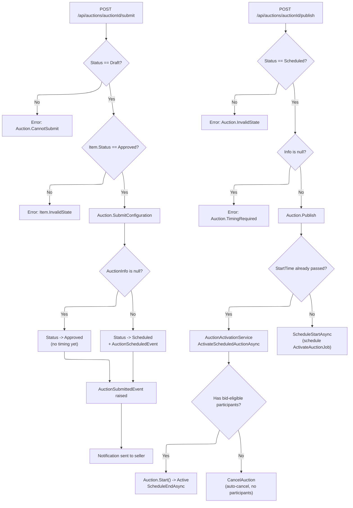

# 03 - Submit & Publish Auction

## Overview

After configuring pricing and (optionally) timing, the seller **submits** the auction configuration, then **publishes** it to make it live. These are two distinct steps with different preconditions and outcomes.

**Source files:**

| Concern | Path |
|---|---|
| SubmitAuctionCommand | `src/core/OIO.Application/Context/AuctionContext/Commands/SubmitAuction/SubmitAuctionCommand.cs` |
| PublishAuctionCommand | `src/core/OIO.Application/Context/AuctionContext/Commands/PublishAuction/PublishAuctionCommand.cs` |
| Auction.SubmitConfiguration() | `src/core/OIO.Domain/Context/AuctionContext/Aggregates/Auctions/Auction.cs` |
| Auction.Publish() | `src/core/OIO.Domain/Context/AuctionContext/Aggregates/Auctions/Auction.cs` |
| AuctionActivationService | `src/core/OIO.Application/Context/AuctionContext/Services/AuctionActivationService.cs` |
| AuctionSubmittedEventHandler | `src/core/OIO.Application/Context/AuctionContext/EventHandlers/AuctionSubmittedEventHandler.cs` |

---

## Submit Decision Tree

---

## Endpoint 1: POST `/api/auctions/{auctionId}/submit` -- Submit Configuration

**Permission:** `Catalogs.Auctions.Submit`
**Response:** `204 No Content`

### Handler Flow (`SubmitAuctionCommandHandler`)

1. Load auction with Item and Item.Media.
2. Verify current user is seller (owner of item).
3. **Status guard:** Must be `Draft`. Otherwise -> `Auction.CannotSubmit`.
4. **Item status guard:** `Item.Status` must be `Approved`. Otherwise -> `Item.InvalidState`.
5. Call `Auction.SubmitConfiguration(nowUtc)`:
   - Status must be `Draft` (double-checked in domain).
   - Raises `AuctionSubmittedEvent` with `VerifyByPlatform` flag.
   - **If `Info` is null** (no timing): transitions to `Approved`.
   - **If `Info` is not null** (timing set): transitions to `Scheduled` and raises `AuctionScheduledEvent`.
6. Save changes.

### VerifyByPlatform Flag

The `Auction.VerifyByPlatform` boolean affects the **item review path** (see [03a-auction-review.md](./03a-auction-review.md)):

- `false` -- Standard admin review: admin approves/rejects the item directly.
- `true` -- Platform verification: item goes through warehouse inspection, inspector review, and condition confirmation before the auction can proceed.

This flag is set on the Auction and included in the `AuctionSubmittedEvent`.

### AuctionSubmittedEventHandler

After submission, the handler sends a notification to the seller:
- Checks if auction is now `Approved` or `Scheduled` (ready for publish).
- Dispatches a `CreateNotificationCommand` with event type `auction_configuration_submitted`.

---

## Endpoint 2: POST `/api/auctions/{auctionId}/publish` -- Publish Auction

**Permission:** `Catalogs.Auctions.Publish`
**Response:** `204 No Content`

### Handler Flow (`PublishAuctionCommandHandler`)

1. Load auction with Item, Deposits, and Participants.
2. Verify current user is seller. Otherwise -> `Auction.OnlyOwnerCanPublish`.
3. Call `Auction.Publish(nowUtc)`:
   - **Status guard:** Must be `Scheduled`. Otherwise -> `Auction.InvalidState`.
   - **Timing guard:** `Info` must not be null. Otherwise -> `Auction.TimingRequired`.
   - Updates `ModifiedAt`.
4. **Immediate vs. deferred activation:**
   - If `Info.HasStarted(nowUtc)` is `true` (start time has passed):
     - Calls `AuctionActivationService.ActivateScheduledAuctionAsync()`.
     - This checks for bid-eligible participants and either activates or auto-cancels.
   - If start time is in the future:
     - Saves changes.
     - Calls `IAuctionScheduler.ScheduleStartAsync()` to schedule `ActivateAuctionJob` at `StartTime`.

---

## Error Codes

| Code | When |
|------|------|
| `Auction.NotFound` | Auction ID does not exist |
| `Auction.OnlyOwnerOfItem` | Current user is not the seller (submit) |
| `Auction.OnlyOwnerCanPublish` | Current user is not the seller (publish) |
| `Auction.CannotSubmit` | Auction is not in Draft status |
| `Item.InvalidState` | Item is not in Approved status at submit time |
| `Auction.InvalidState` | Auction is not in Scheduled status (publish) |
| `Auction.TimingRequired` | Auction has no timing info set |
| `Auction.QualificationWindowRequired` | Qualification window not defined (activation) |
