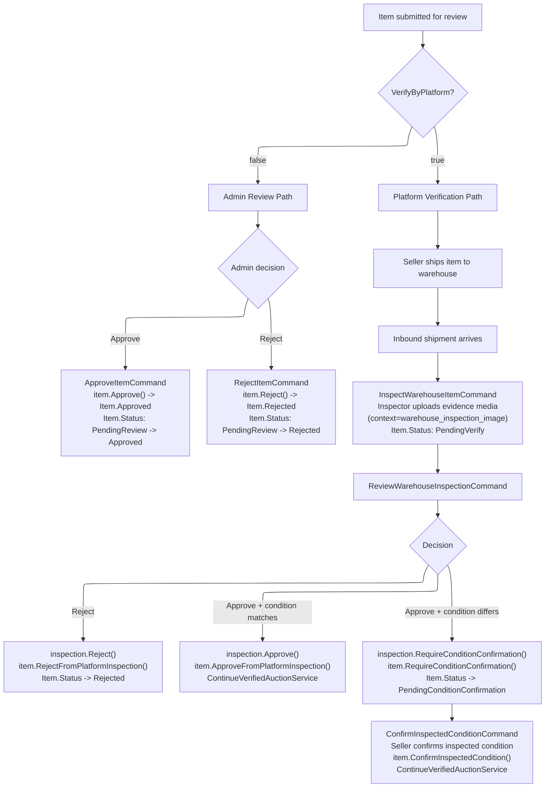
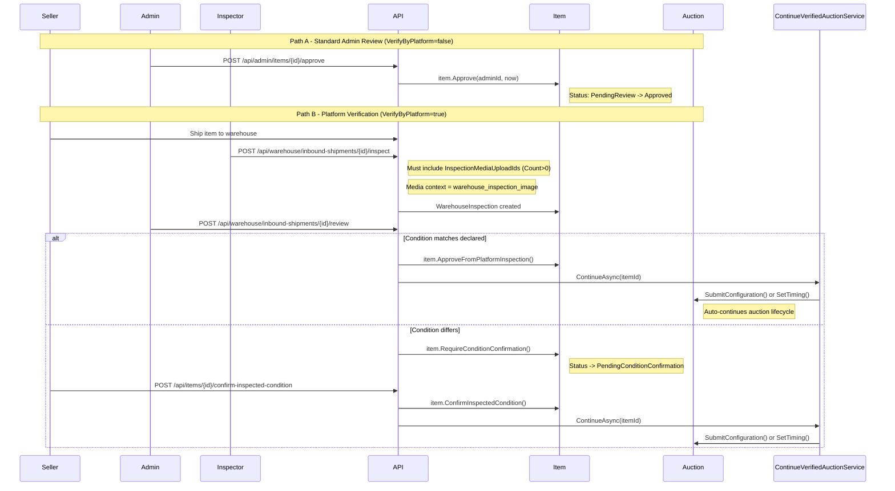

# 03a - Auction Review (Item Approval & Platform Inspection)

## Overview

Before an auction can proceed from Draft, the underlying **Item** must be approved. There are two review paths depending on the `VerifyByPlatform` flag:

1. **Standard admin review** (`VerifyByPlatform = false`): Admin reviews the item directly, approves or rejects. On approval, the associated auction's `MarkApproved()` is called.
2. **Platform verification** (`VerifyByPlatform = true`): Item is shipped to a warehouse, inspected by a warehouse inspector (who MUST upload evidence media), reviewed by admin, and -- if condition differs from declared -- requires seller condition confirmation.

**Source files:**

| Concern | Path |
|---|---|
| ApproveItemCommand | `src/core/OIO.Application/Context/AuctionContext/Commands/ApproveItem/ApproveItemCommand.cs` |
| RejectItemCommand | `src/core/OIO.Application/Context/AuctionContext/Commands/RejectItem/RejectItemCommand.cs` |
| InspectWarehouseItemCommand | `src/core/OIO.Application/Context/WarehouseContext/Commands/InspectWarehouseItem/InspectWarehouseItemCommand.cs` |
| ReviewWarehouseInspectionCommand | `src/core/OIO.Application/Context/WarehouseContext/Commands/ReviewWarehouseInspection/ReviewWarehouseInspectionCommand.cs` |
| ConfirmInspectedConditionCommand | `src/core/OIO.Application/Context/AuctionContext/Commands/ConfirmInspectedCondition/ConfirmInspectedConditionCommand.cs` |
| ContinueVerifiedAuctionService | `src/core/OIO.Application/Context/AuctionContext/Services/ContinueVerifiedAuctionService.cs` |
| Auction.MarkApproved() | `src/core/OIO.Domain/Context/AuctionContext/Aggregates/Auctions/Auction.cs` |
| Auction.MarkRejected() | `src/core/OIO.Domain/Context/AuctionContext/Aggregates/Auctions/Auction.cs` |

---

## Review Paths



---

## Item + Auction Dual Review Sequence



---

## Path A: Standard Admin Review

### ApproveItemCommand

**Endpoint:** `POST /api/admin/items/{itemId}/approve`
**Precondition:** `Item.Status == PendingReview`

Handler:
1. Load item with ModerationReviews.
2. Verify item status is `PendingReview`.
3. Call `item.Approve(adminId, nowUtc)`.
4. Save changes.

The `item.Approve()` domain method raises an `ItemApprovedEvent`. Note: the **auction's** `MarkApproved()` is triggered through the item approval flow -- when the item becomes `Approved`, the auction can proceed to submit.

### RejectItemCommand

**Endpoint:** `POST /api/admin/items/{itemId}/reject`
**Request:** `{ "reason": "string (required, max 1000 chars)" }`
**Precondition:** `Item.Status == PendingReview`

Handler:
1. Load item with ModerationReviews.
2. Verify item status is `PendingReview`.
3. Call `item.Reject(adminId, reason, nowUtc)`.
4. Save changes.

---

## Path B: Platform Verification

### Step 1: InspectWarehouseItemCommand

**Endpoint:** `POST /api/warehouse/inbound-shipments/{shipmentId}/inspect`

**Request:**
```json
{
  "inboundShipmentId": "guid",
  "condition": "string (one of WarehouseItemCondition.All)",
  "inspectionNotes": "string? (optional)",
  "inspectionMediaUploadIds": ["guid", "guid"]
}
```

**Critical requirements:**
- `InspectionMediaUploadIds.Count` **must be > 0** -- otherwise `WarehouseErrors.Inspection.EvidenceRequired` is returned.
- Each media upload must be **confirmed** and **not already linked**.
- Each media upload context must be `warehouse_inspection_image` -- verified via `contextRegistry.IsWarehouseInspectionContext()`. Otherwise `MediaErrors.WrongContext`.
- Each media upload must be **owned by the current user** (inspector).

Handler flow:
1. Validate `InspectionMediaUploadIds.Count > 0`.
2. Load inbound shipment. Must have status `Arrived`.
3. Verify no existing inspection for this shipment.
4. Load item.
5. Validate warehouse item condition.
6. Load and validate all media uploads (exist, owned, confirmed, correct context, not linked).
7. Create/update `WarehouseItem`, mark received, mark inspected.
8. Create `WarehouseInspection` with evidence (serialized media snapshots).
9. Mark shipment as inspected.
10. Link media uploads to inspection entity.
11. Save changes.
12. Send notification to seller: `platform_inspection_recorded`.

### Step 2: ReviewWarehouseInspectionCommand

**Endpoint:** `POST /api/warehouse/inbound-shipments/{shipmentId}/review`

**Request:**
```json
{
  "inboundShipmentId": "guid",
  "decision": "approve" | "reject",
  "reason": "string? (required when rejecting)"
}
```

**Precondition:** `inspection.DecisionStatus == PendingReview`, `item.Status == PendingVerify`

Handler logic by decision:

**Reject:**
1. Reason is required.
2. `inspection.Reject(reviewerId, reason, now)`.
3. `item.RejectFromPlatformInspection(reviewerId, reason, now)`.
4. Notification: `platform_verification_rejected` (High priority).

**Approve + condition matches declared:**
1. `inspection.Approve(reviewerId, now)`.
2. `item.ApproveFromPlatformInspection(reviewerId, now)`.
3. Call `ContinueVerifiedAuctionService.ContinueAsync()` -- auto-continues auction lifecycle.
4. Notification: `platform_verification_approved` or `auction_auto_continued_after_verification`.

**Approve + condition differs from declared:**
1. `inspection.RequireConditionConfirmation(reviewerId, now)`.
2. `item.RequireConditionConfirmation(reviewerId, now)`.
3. Item status -> `PendingConditionConfirmation`.
4. Notification: `inspected_condition_confirmation_required` (High priority).

### Step 3: ConfirmInspectedConditionCommand

**Endpoint:** `POST /api/items/{itemId}/confirm-inspected-condition`
**Precondition:** `item.Status == PendingConditionConfirmation`, seller only.

Handler:
1. Load item with Media, ModerationReviews, Auctions.
2. Verify seller ownership.
3. Load latest inspection with `DecisionStatus == ConditionConfirmationRequired`.
4. Map inspected condition to `ItemCondition`.
5. `inspection.ConfirmSellerCondition(now)`.
6. `item.ConfirmInspectedCondition(userId, mappedCondition, now)`.
7. Call `ContinueVerifiedAuctionService.ContinueAsync()`.
8. Save changes.
9. Notification: `auction_auto_continued_after_condition_confirmation` or `inspected_condition_confirmed`.

---

## ContinueVerifiedAuctionService

After platform verification completes (either direct approval or after condition confirmation), this service automatically continues the auction lifecycle:

1. Find the latest auction for the item.
2. If auction is `Draft` -> call `SubmitConfiguration()` (auto-transitions to Approved or Scheduled).
3. If auction is `Approved` with `Info` set -> call `SetTiming()` (auto-transitions to Scheduled).
4. Returns `VerifiedAuctionContinuationResult` indicating whether the auction status changed.

---

## Status Transitions Summary

### Admin Path (VerifyByPlatform=false)
| Item Status | Action | New Item Status | Auction Effect |
|---|---|---|---|
| `PendingReview` | Admin approves | `Approved` | Auction can be submitted |
| `PendingReview` | Admin rejects | `Rejected` | Auction blocked |

### Platform Path (VerifyByPlatform=true)
| Item Status | Action | New Item Status | Auction Effect |
|---|---|---|---|
| `PendingVerify` | Inspector inspects | `PendingVerify` (unchanged) | Inspection recorded |
| `PendingVerify` | Admin rejects inspection | `Rejected` | Auction blocked |
| `PendingVerify` | Admin approves (condition matches) | `Approved` | ContinuationService auto-continues |
| `PendingVerify` | Admin approves (condition differs) | `PendingConditionConfirmation` | Awaiting seller confirmation |
| `PendingConditionConfirmation` | Seller confirms | `Approved` | ContinuationService auto-continues |
