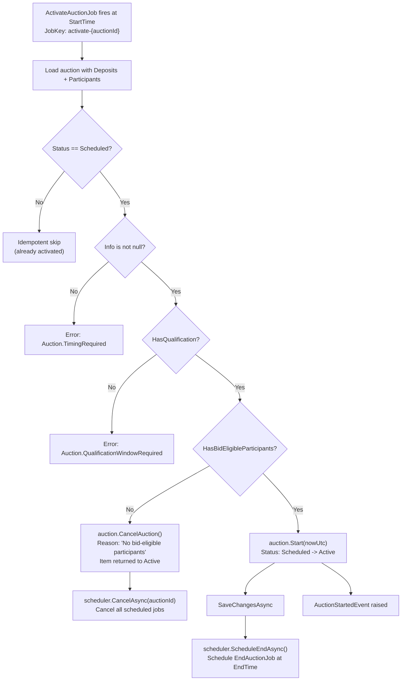

# 04 - Auction Activation

## Overview

Activation is the transition from `Scheduled` to `Active`. It happens either immediately (if start time has already passed at publish time) or via a scheduled Quartz job (`ActivateAuctionJob`) that fires at the auction's `StartTime`. The `AuctionActivationService` performs an eligibility check: if no bid-eligible participants exist, the auction is auto-cancelled instead of activated.

**Source files:**

| Concern | Path |
|---|---|
| ActivateAuctionJob | `src/infrastructure/OIO.Infrastructure/Scheduling/Jobs/Auctions/ActivateAuctionJob.cs` |
| ActivateAuctionCommand | `src/core/OIO.Application/Context/AuctionContext/Commands/ActivateAuction/ActivateAuctionCommand.cs` |
| AuctionActivationService | `src/core/OIO.Application/Context/AuctionContext/Services/AuctionActivationService.cs` |
| Auction.Start() | `src/core/OIO.Domain/Context/AuctionContext/Aggregates/Auctions/Auction.cs` |
| Auction.HasBidEligibleParticipants() | `src/core/OIO.Domain/Context/AuctionContext/Aggregates/Auctions/Auction.cs` |
| IAuctionScheduler | `src/core/OIO.Application/Abstractions/Scheduling/IAuctionScheduler.cs` |
| EndAuctionJob | `src/infrastructure/OIO.Infrastructure/Scheduling/Jobs/Auctions/EndAuctionJob.cs` |

---

## Activation Flow



---

## ActivateAuctionJob (Quartz)

**Class:** `ActivateAuctionJob` implements `IJob`
**Attribute:** `[DisallowConcurrentExecution]` -- prevents parallel execution for the same auction.

**Job and trigger keys:**
- JobKey: `activate-{auctionId}` in group `JobConstants.AuctionLifecycleGroup`
- TriggerKey: `activate-trigger-{auctionId}` in group `JobConstants.AuctionLifecycleGroup`

**Execution:**
1. Extract `AuctionId` from `MergedJobDataMap`.
2. Send `ActivateAuctionCommand(auctionId)` via MediatR.
3. Log error if result is failure.

---

## ActivateAuctionCommand Handler

1. Load auction by ID with `Deposits` and `Participants` (split query).
2. If auction not found -> `Auction.NotFound`.
3. If `Info` is null -> `Auction.TimingRequired`.
4. If `Info.HasQualification` is false -> `Auction.QualificationWindowRequired`.
5. **Idempotent:** If `Status != Scheduled`, return success (already activated).
6. Delegate to `AuctionActivationService.ActivateScheduledAuctionAsync()`.

---

## AuctionActivationService.ActivateScheduledAuctionAsync()

This is the core activation logic:

1. **Guard checks:**
   - `auction.Info` must not be null.
   - `auction.Info.HasQualification` must be true.
   - `auction.Status` must be `Scheduled` (returns success otherwise -- idempotent).

2. **Eligibility check:** `auction.HasBidEligibleParticipants(nowUtc)`
   - Iterates `_participants` and checks `IsBidEligibleParticipant()`.
   - If **no eligible participants**:
     - Calls `auction.CancelAuction()` with reason: `"Auction automatically cancelled because no bid-eligible participants were present at the scheduled start time."`
     - Loads the associated `Item` and calls `item.ReturnToActive(nowUtc)` to restore the item for future use.
     - Saves changes.
     - Calls `scheduler.CancelAsync(auctionId)` to remove all scheduled jobs.
     - Returns success.

3. **Activation:** If eligible participants exist:
   - Calls `auction.Start(nowUtc)`:
     - Verifies `CanTransitionTo(Active)`.
     - Sets `Status = Active`.
     - Sets `ModifiedAt`.
     - Raises `AuctionStartedEvent`.
   - Saves changes.
   - Calls `scheduler.ScheduleEndAsync(auctionId, endTime)` to schedule the `EndAuctionJob`.

---

## Auction.Start() Domain Method

```
Status guard:  Must be able to transition to Active (CanTransitionTo).
               Only Scheduled -> Active is valid.
Side effects:  Status = Active
               ModifiedAt = nowUtc
Event:         AuctionStartedEvent(AuctionId, OccurredAt)
```

---

## EndAuctionJob

Scheduled by `IAuctionScheduler.ScheduleEndAsync()` during activation.

**Job and trigger keys:**
- JobKey: `end-{auctionId}` in group `JobConstants.AuctionLifecycleGroup`
- TriggerKey: `end-trigger-{auctionId}` in group `JobConstants.AuctionLifecycleGroup`

**Execution:**
1. Extract `AuctionId` from `MergedJobDataMap`.
2. Send `EndAuctionCommand(auctionId)` via MediatR.
3. Log error if result is failure.

---

## IAuctionScheduler Interface

```csharp
public interface IAuctionScheduler
{
    Task ScheduleStartAsync(Guid auctionId, DateTime startTime, CancellationToken ct = default);
    Task ScheduleEndAsync(Guid auctionId, DateTime endTime, CancellationToken ct = default);
    Task RescheduleEndAsync(Guid auctionId, DateTime newEndTime, CancellationToken ct = default);
    Task CancelAsync(Guid auctionId, CancellationToken ct = default);
}
```

- `ScheduleStartAsync` -- schedules `ActivateAuctionJob` at `startTime`.
- `ScheduleEndAsync` -- schedules `EndAuctionJob` at `endTime`.
- `RescheduleEndAsync` -- updates the `EndAuctionJob` trigger to a new time (used by auto-extension).
- `CancelAsync` -- removes all scheduled jobs for the auction.

---

## Events

| Event | Raised By | Description |
|-------|-----------|-------------|
| `AuctionStartedEvent` | `Auction.Start()` | Auction is now Active |
| `AuctionCancelledEvent` | `Auction.CancelAuction()` | Auction auto-cancelled (no participants) |
