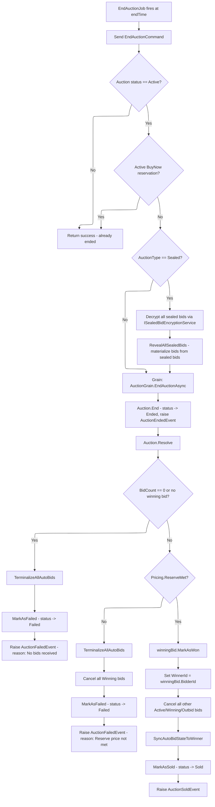

# 06 - Auction End & Resolution

## Overview

When an auction's `endTime` arrives, the system automatically ends the auction and resolves its final outcome. The process follows a three-step pipeline: **RevealAllSealedBids** (sealed auctions only) -> **End** -> **Resolve**. Resolution determines whether the auction is **Sold** (winner + reserve met), **Failed** (no bids), or **Failed** (reserve not met).

---

## End Resolution Flow



---

## EndAuctionJob (Quartz Scheduler)

| Property | Value |
|---|---|
| **Class** | `EndAuctionJob : IJob` |
| **Attribute** | `[DisallowConcurrentExecution]` |
| **Job key** | `end-{auctionId}` in group `JobConstants.AuctionLifecycleGroup` |
| **Trigger key** | `end-trigger-{auctionId}` in group `JobConstants.AuctionLifecycleGroup` |
| **Data** | `AuctionId` (Guid) from `MergedJobDataMap` |
| **Misfire** | `WithMisfireHandlingInstructionFireNow` (fire immediately if missed) |

The job is scheduled by `QuartzAuctionScheduler.ScheduleEndAsync()` when an auction is published/activated. If `endTime <= now`, it fires 1 second from now as a fallback.

**Source:** `src/infrastructure/OIO.Infrastructure/Scheduling/Jobs/Auctions/EndAuctionJob.cs`

---

## EndAuctionCommand Handler

The handler performs the following steps:

1. Load the auction aggregate with `Item`, `SealedBids` (split query).
2. **Authorization**: If the caller is authenticated, they must be the item seller or have `App.Roles.Catalogs.Admin`.
3. **Guard**: If `auction.Status != AuctionStatus.Active`, return success (idempotent).
4. **Sealed bid decryption** (if `AuctionType == Sealed`):
   - Iterate all `auction.SealedBids` and decrypt each `AmountEncrypted` via `ISealedBidEncryptionService.Decrypt()`.
   - Build a `List<RevealedSealedBidAmountGrain>` with decrypted `Money` values.
5. Get `IAuctionGrain` from Orleans `grainFactory` with the auction ID.
6. Call `grain.EndAuctionAsync(revealerId, revealedSealedBids, ct)`.

**Source:** `src/core/OIO.Application/Context/AuctionContext/Commands/EndAuction/EndAuctionCommand.cs`

---

## AuctionGrain.EndAuctionAsync()

The Orleans grain ensures single-threaded access per auction (no race conditions). Steps:

1. Load auction from DB (cached in memory after first load) with all related entities: `Item`, `Bids`, `AutoBids`, `Deposits`, `Participants`, `SealedBids`, `PriceHistories`, `BuyNowReservations`.
2. **Guard**: If `auction.Status != AuctionStatus.Active`, return success.
3. **Guard**: If an active BuyNow reservation exists (`GetActiveBuyNowReservation(nowUtc)`), return success (do not end while reservation is active).
4. **Sealed auction path**: If `AuctionType == Sealed`, require `revealedSealedBids` to be non-null, then call `auction.RevealAllSealedBids()`.
5. Call `auction.End(nowUtc)`.
6. Call `auction.Resolve(nowUtc)`.
7. Save via `_unitOfWork.SaveChangesAsync()` and discard cached grain state.

**Source:** `src/infrastructure/OIO.Infrastructure/Grains/AuctionGrain.cs` (lines 406-488)

---

## Auction.End() - Domain Method

Transitions the auction to `Ended` state. Does **not** determine the winner -- that is handled by `Resolve()`.

```
Status = AuctionStatus.Ended
ActualEndTime = nowUtc
```

Raises `AuctionEndedEvent` with:
- `AuctionId`, current winning bidder ID, `Pricing.CurrentAmount`, `BidCount`, `Pricing.ReserveMet`, timestamp.

**Source:** `src/core/OIO.Domain/Context/AuctionContext/Aggregates/Auctions/Auction.cs` (lines 352-372)

---

## Auction.Resolve() - Domain Method

Called after `End()` to determine the final outcome. Bid `Won`/`Outbid` marking happens here -- not in `End()` -- to avoid orphaned Won state on failed auctions.

### Case 1: No bids (`BidCount == 0` or no winning bid)
- `TerminalizeAllAutoBids(nowUtc)` -- set all auto-bids to terminal state.
- `MarkAsFailed(nowUtc)` -- status -> `Failed`.
- Raise `AuctionFailedEvent` with reason `"No bids received"`.

### Case 2: Bids exist but reserve not met (`!Pricing.ReserveMet`)
- `TerminalizeAllAutoBids(nowUtc)`.
- Cancel all bids with `BidStatus.Winning`.
- `MarkAsFailed(nowUtc)` -- status -> `Failed`.
- Raise `AuctionFailedEvent` with reason `"Reserve price not met"`.

### Case 3: Winner + reserve met
- `winningBid.MarkAsWon()`.
- `WinnerId = winningBid.BidderId`.
- Cancel all other bids that are `Active`, `Winning`, or `Outbid`.
- `SyncAutoBidStateToWinner(winningBid.BidderId, nowUtc)`.
- `MarkAsSold(nowUtc)` -- status -> `Sold`.
- Raise `AuctionSoldEvent` with `WinnerId`, `FinalPrice`, `Currency`, `TotalBids`.

**Source:** `src/core/OIO.Domain/Context/AuctionContext/Aggregates/Auctions/Auction.cs` (lines 378-456)

---

## Sealed Bid Reveal: RevealAllSealedBids()

For sealed auctions, all bids must be revealed before `End()` can determine a winner:

1. Validate `AuctionType == Sealed`.
2. Mark all `SealedBidStatus.Submitted` bids as `Revealed`.
3. Materialize sealed bids into actual `Bid` entities:
   - Filter bids where `Amount >= Pricing.StartingAmount`.
   - Sort descending by amount, then ascending by `CreatedAt` (first-bid-wins tie-breaking).
   - First bid gets `MarkAsWinning()`, all others get `MarkAsOutbid()`.
4. Update `Pricing` with the winning bid amount and increment `BidCount`.

**Source:** `src/core/OIO.Domain/Context/AuctionContext/Aggregates/Auctions/Auction.cs` (lines 1441-1529)

---

## Domain Events

| Event | When Raised |
|---|---|
| `AuctionEndedEvent` | `Auction.End()` -- auction transitions to Ended. Contains current winning bidder, final price, bid count, reserve met flag. |
| `AuctionSoldEvent` | `Auction.Resolve()` Case 3 -- winner confirmed. Contains `WinnerId`, `SellerId`, `FinalPrice`, `Currency`, `TotalBids`. |
| `AuctionFailedEvent` | `Auction.Resolve()` Cases 1 & 2 -- no bids or reserve not met. Contains `SellerId`, `Reason`, `FinalPrice`, `Currency`, `TotalBids`. |

---

## Key Source Files

| File | Path |
|---|---|
| EndAuctionJob | `src/infrastructure/OIO.Infrastructure/Scheduling/Jobs/Auctions/EndAuctionJob.cs` |
| EndAuctionCommand | `src/core/OIO.Application/Context/AuctionContext/Commands/EndAuction/EndAuctionCommand.cs` |
| AuctionGrain | `src/infrastructure/OIO.Infrastructure/Grains/AuctionGrain.cs` |
| Auction aggregate | `src/core/OIO.Domain/Context/AuctionContext/Aggregates/Auctions/Auction.cs` |
| QuartzAuctionScheduler | `src/infrastructure/OIO.Infrastructure/Scheduling/QuartzAuctionScheduler.cs` |
