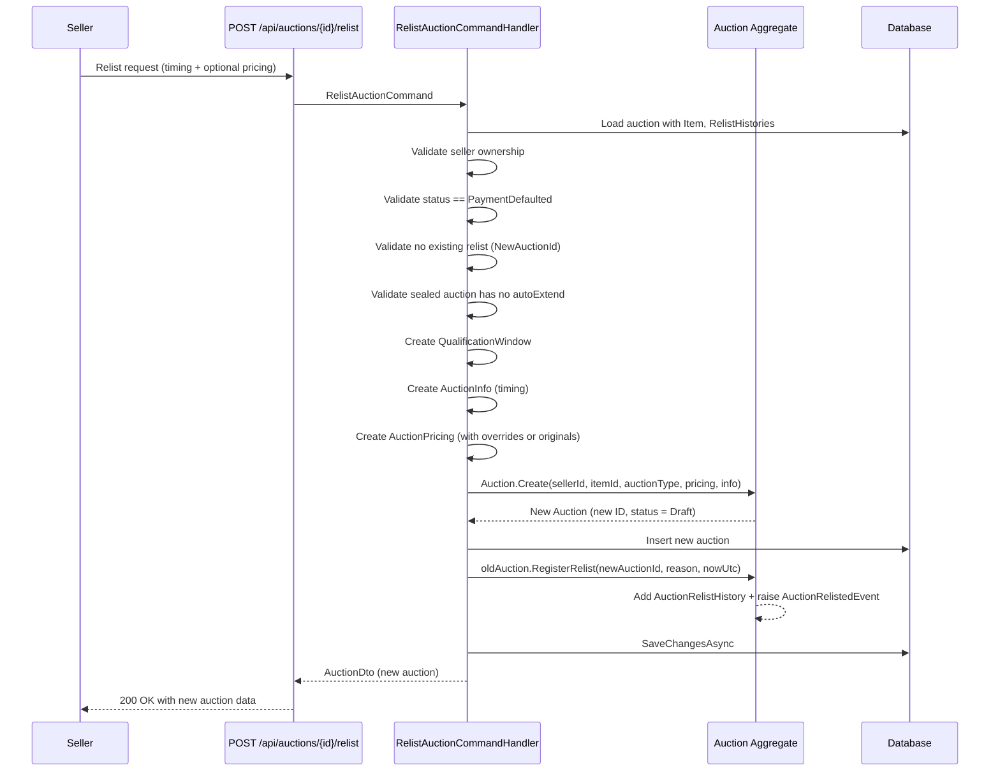

# 08 - Relist Auction

## Overview

When a winner defaults on payment, the seller can relist the auction. Relisting creates a **new auction** (with a new ID) linked to the original via `AuctionRelistHistory`. Only one relist is allowed per payment-defaulted auction.

---

## Relist Flow



---

## Endpoint

| Property | Value |
|---|---|
| **Method** | `POST` |
| **URL** | `api/auctions/{auctionId}/relist` |
| **Permission** | `Catalogs.Auctions.Submit` |
| **Success** | `200 OK` with `AuctionDto` |
| **Error responses** | `400`, `403`, `404`, `409`, `422` (validation) |

### Request Body

```json
{
  "qualificationStartAt": "2026-01-15T00:00:00Z",
  "qualificationEndAt": "2026-01-18T00:00:00Z",
  "startAt": "2026-01-18T00:00:00Z",
  "endAt": "2026-01-25T00:00:00Z",
  "startingPrice": 100.00,
  "bidIncrement": 10.00,
  "reservePrice": 500.00,
  "buyNowPrice": 1000.00,
  "currency": "VND",
  "reason": "Winner did not pay"
}
```

| Field | Required | Description |
|---|---|---|
| `qualificationStartAt` | Yes | Start of the qualification window for the new auction. |
| `qualificationEndAt` | Yes | End of the qualification window. |
| `startAt` | Yes | When bidding opens for the new auction. |
| `endAt` | Yes | When the new auction ends. |
| `startingPrice` | No | Overrides original. Defaults to original `Pricing.StartingAmount`. |
| `bidIncrement` | No | Overrides original. Defaults to original `Pricing.BidIncrementAmount`. |
| `reservePrice` | No | Overrides original. Defaults to original `Pricing.ReserveAmount`. |
| `buyNowPrice` | No | Overrides original. Defaults to original `Pricing.BuyNowAmount`. |
| `currency` | No | Overrides original. Defaults to original `Pricing.Currency`. Must be 3 chars. |
| `reason` | No | Free-text explanation for the relist. |

### Validation Rules

| Field | Rule |
|---|---|
| `AuctionId` | Non-empty GUID |
| `StartingPrice` | Non-negative (when provided) |
| `BidIncrement` | Positive (when provided) |
| `ReservePrice` | Non-negative (when provided) |
| `BuyNowPrice` | Positive (when provided) |
| `Currency` | Exactly 3 characters (when provided) |

---

## Handler Logic: RelistAuctionCommandHandler

1. Load auction with `Item` and `RelistHistories`.
2. **Authorization**: `auction.Item.SellerId == currentUser.UserId` -- only the seller can relist.
3. **Status guard**: `auction.Status != AuctionStatus.PaymentDefaulted` -> error.
4. **One-relist guard**: If any `RelistHistory` has `NewAuctionId.HasValue`, the auction was already relisted -> error.
5. **Sealed auto-extend guard**: If `AuctionType == Sealed` and `autoExtend == true`, return validation error `"Sealed auctions do not support auto-extend."`.
6. Create `QualificationWindow` from request dates.
7. Create `AuctionInfo` with timing, `autoExtend` (from original or `true`), `extensionMinutes` (from original or `5`).
8. Resolve `Currency` from request or original.
9. Create `AuctionPricing` using request overrides or falling back to original values.
10. Call `Auction.Create()` -- produces a new auction in `Draft` status with a new GUID v7 ID.
11. Insert the new auction into the DB.
12. Call `oldAuction.RegisterRelist(newAuctionId, reason, nowUtc)` on the original auction.
13. Save changes.

**Source:** `src/core/OIO.Application/Context/AuctionContext/Commands/RelistAuction/RelistAuctionCommand.cs`

---

## Domain Logic: RegisterRelist()

```csharp
public AuctionRelistHistory RegisterRelist(AuctionId newAuctionId, string? reason, DateTime nowUtc)
```

- Creates an `AuctionRelistHistory` record with `relistNo = _relistHistories.Count + 1`.
- Raises `AuctionRelistedEvent(SourceAuctionId, NewAuctionId, SellerId, Reason, OccurredAt)`.

**Source:** `src/core/OIO.Domain/Context/AuctionContext/Aggregates/Auctions/Auction.cs` (lines 2094-2114)

---

## Error Codes

| Code | Type | Message |
|---|---|---|
| `Auction.NotFound` | NotFound | Auction with Id '{id}' was not found. |
| `Auction.OnlyOwnerCanCancel` | Forbidden | Only the auction owner can cancel. |
| `Auction.InvalidState` | Conflict | Cannot perform 'relist' when auction status is '{currentState}'. |
| `Auction.AlreadyRelisted` | Conflict | This auction has already been relisted from the current payment-defaulted state. |
| `Auction.SealedAutoExtendNotSupported` | Validation | Sealed auctions do not support auto-extend. |

---

## Key Source Files

| File | Path |
|---|---|
| RelistAuctionCommand | `src/core/OIO.Application/Context/AuctionContext/Commands/RelistAuction/RelistAuctionCommand.cs` |
| RelistAuctionEndpoint | `src/presentation/OIO.Api/Endpoints/AuctionContext/Auctions/RelistAuctionEndpoint.cs` |
| Auction aggregate | `src/core/OIO.Domain/Context/AuctionContext/Aggregates/Auctions/Auction.cs` |
