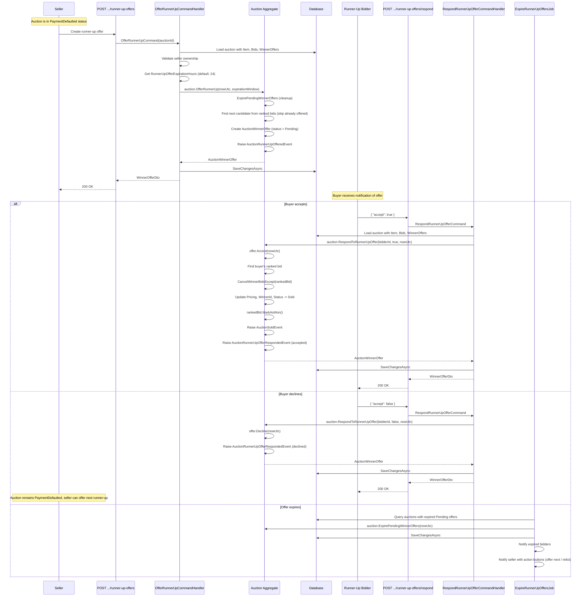

# 09 - Runner-Up Offer

## Overview

When the original winner defaults on payment, the seller can offer the item to the next-highest bidder (runner-up). The system supports sequential offers: if one runner-up declines or the offer expires, the seller can offer to the next candidate. Offers are time-limited (default: 24 hours) and automatically expired by a background service.

---

## Runner-Up Offer Flow



---

## Endpoints

| Operation | Method | URL | Permission | Response |
|---|---|---|---|---|
| Offer runner-up | `POST` | `api/auctions/{auctionId}/runner-up-offers` | `Catalogs.Auctions.Submit` | `200 OK` with `WinnerOfferDto` |
| Respond to offer | `POST` | `api/auctions/{auctionId}/runner-up-offers/respond` | `Catalogs.Auctions.Bid` | `200 OK` with `WinnerOfferDto` |

### Respond Request Body

```json
{
  "accept": true
}
```

---

## OfferRunnerUpCommand Handler

1. Load auction with `Item`, `Bids`, `WinnerOffers`.
2. **Authorization**: `auction.Item.SellerId == currentUser.UserId`.
3. Read `RunnerUpOfferExpirationHours` from `runtimeSettings.Auction` (default: **24 hours**).
4. Call `auction.OfferRunnerUp(DateTime.UtcNow, TimeSpan.FromHours(offerHours))`.
5. Save and return `WinnerOfferDto`.

**Source:** `src/core/OIO.Application/Context/AuctionContext/Commands/OfferRunnerUp/OfferRunnerUpCommand.cs`

---

## Domain Logic: OfferRunnerUp()

```csharp
public Result<AuctionWinnerOffer, Error> OfferRunnerUp(DateTime nowUtc, TimeSpan expirationWindow)
```

1. **Status guard**: Must be `AuctionStatus.PaymentDefaulted`.
2. **Cleanup**: Call `ExpirePendingWinnerOffers(nowUtc)` to expire any stale offers.
3. **Active offer guard**: If any offer `IsActiveAt(nowUtc)`, return `WinnerOfferAlreadyActive`.
4. **Find next candidate**:
   - Get ranked bids via `GetRankedBids()` (grouped by bidder, highest amount first, tie-break by earliest `CreatedAt`).
   - Collect all previously offered user IDs (excluding cancelled offers).
   - Find the first bidder who is not the original winner and has not been offered before.
5. If no candidate found, return `NoMoreRunnerUps`.
6. Create `AuctionWinnerOffer` with `Pending` status, `rankNo`, and `expiresAt = nowUtc + expirationWindow`.
7. Raise `AuctionRunnerUpOfferedEvent(AuctionId, SellerId, BidderId, RankNo, ExpiresAt)`.

**Source:** `src/core/OIO.Domain/Context/AuctionContext/Aggregates/Auctions/Auction.cs` (lines 1959-2004)

---

## RespondRunnerUpOfferCommand Handler

1. Load auction with `Item`, `Bids`, `WinnerOffers`.
2. Call `auction.RespondToRunnerUpOffer(currentUser.UserId, request.Accept, DateTime.UtcNow)`.
3. Save and return `WinnerOfferDto`.

**Source:** `src/core/OIO.Application/Context/AuctionContext/Commands/RespondRunnerUpOffer/RespondRunnerUpOfferCommand.cs`

---

## Domain Logic: RespondToRunnerUpOffer()

```csharp
public Result<AuctionWinnerOffer, Error> RespondToRunnerUpOffer(UserId bidderId, bool accept, DateTime nowUtc)
```

1. Find the latest offer for the bidder (ordered by `OfferedAt` descending).
2. **Guards**: Offer must exist and have `WinnerOfferStatus.Pending`.
3. **Expiry check**: If `offer.ExpiresAt < nowUtc`, expire the offer and return `WinnerOfferExpired`.
4. Call `offer.Accept(nowUtc)` or `offer.Decline(nowUtc)`.

**If accepted:**
- Find the bidder's ranked bid.
- `CancelWinnerBidsExcept(rankedBid)` -- cancel all other winning bids.
- Update `Pricing` with the runner-up's bid amount.
- Set `WinnerId = bidderId`.
- `rankedBid.MarkAsWon()`.
- `SyncAutoBidStateToWinner(bidderId, nowUtc)`.
- Set `Status = AuctionStatus.Sold`.
- Raise `AuctionSoldEvent`.

**Always:** Raise `AuctionRunnerUpOfferRespondedEvent(AuctionId, BidderId, "accepted"/"declined")`.

**Source:** `src/core/OIO.Domain/Context/AuctionContext/Aggregates/Auctions/Auction.cs` (lines 2007-2074)

---

## ExpireRunnerUpOffersJob (Background Service)

| Property | Value |
|---|---|
| **Class** | `ExpireRunnerUpOffersJob : BackgroundService` |
| **Polling interval** | Every **5 minutes** |
| **Batch size** | Up to **50 auctions** per cycle |

### Behavior

1. Query auctions where `Status == PaymentDefaulted` and any `WinnerOffer` has `OfferStatus == Pending` with `ExpiresAt < nowUtc`.
2. For each auction, call `auction.ExpirePendingWinnerOffers(nowUtc)`.
3. Save changes.
4. Send notifications:
   - **To expired bidders**: `"runner_up_offer_expired"` notification with normal priority.
   - **To seller**: `"runner_up_offer_expired"` notification with high priority, including action buttons for "Offer next runner-up" and "Relist".

### Domain Logic: ExpirePendingWinnerOffers()

Iterates all `WinnerOffers` with `Pending` status and `ExpiresAt < nowUtc`, calling `offer.Expire(nowUtc)` on each.

**Source:** `src/infrastructure/OIO.Infrastructure/Scheduling/Jobs/Auctions/ExpireRunnerUpOffersJob.cs`

---

## Error Codes

| Code | Type | Message |
|---|---|---|
| `Auction.NotFound` | NotFound | Auction with Id '{id}' was not found. |
| `Auction.OnlyOwnerCanCancel` | Forbidden | Only the auction owner can cancel. |
| `Auction.InvalidState` | Conflict | Cannot perform 'offer runner-up' when auction status is '{currentState}'. |
| `Auction.WinnerOfferAlreadyActive` | Conflict | An active runner-up offer already exists for this auction. |
| `Auction.NoMoreRunnerUps` | NotFound | No additional eligible runner-up bidder is available. |
| `Auction.NoRunnerUp` | NotFound | No eligible runner-up bidder found. |
| `Auction.InvalidWinnerOfferState` | Conflict | Runner-up offer is not in a state that allows this action. |
| `Auction.WinnerOfferExpired` | Conflict | Runner-up offer has already expired. |

---

## Key Source Files

| File | Path |
|---|---|
| OfferRunnerUpCommand | `src/core/OIO.Application/Context/AuctionContext/Commands/OfferRunnerUp/OfferRunnerUpCommand.cs` |
| RespondRunnerUpOfferCommand | `src/core/OIO.Application/Context/AuctionContext/Commands/RespondRunnerUpOffer/RespondRunnerUpOfferCommand.cs` |
| OfferRunnerUpEndpoint | `src/presentation/OIO.Api/Endpoints/AuctionContext/Auctions/OfferRunnerUpEndpoint.cs` |
| RespondRunnerUpOfferEndpoint | `src/presentation/OIO.Api/Endpoints/AuctionContext/Auctions/RespondRunnerUpOfferEndpoint.cs` |
| ExpireRunnerUpOffersJob | `src/infrastructure/OIO.Infrastructure/Scheduling/Jobs/Auctions/ExpireRunnerUpOffersJob.cs` |
| Auction aggregate | `src/core/OIO.Domain/Context/AuctionContext/Aggregates/Auctions/Auction.cs` |
| Runtime config | `RunnerUpOfferExpirationHours = 24` in `IAppConfig.AuctionConfig` |
