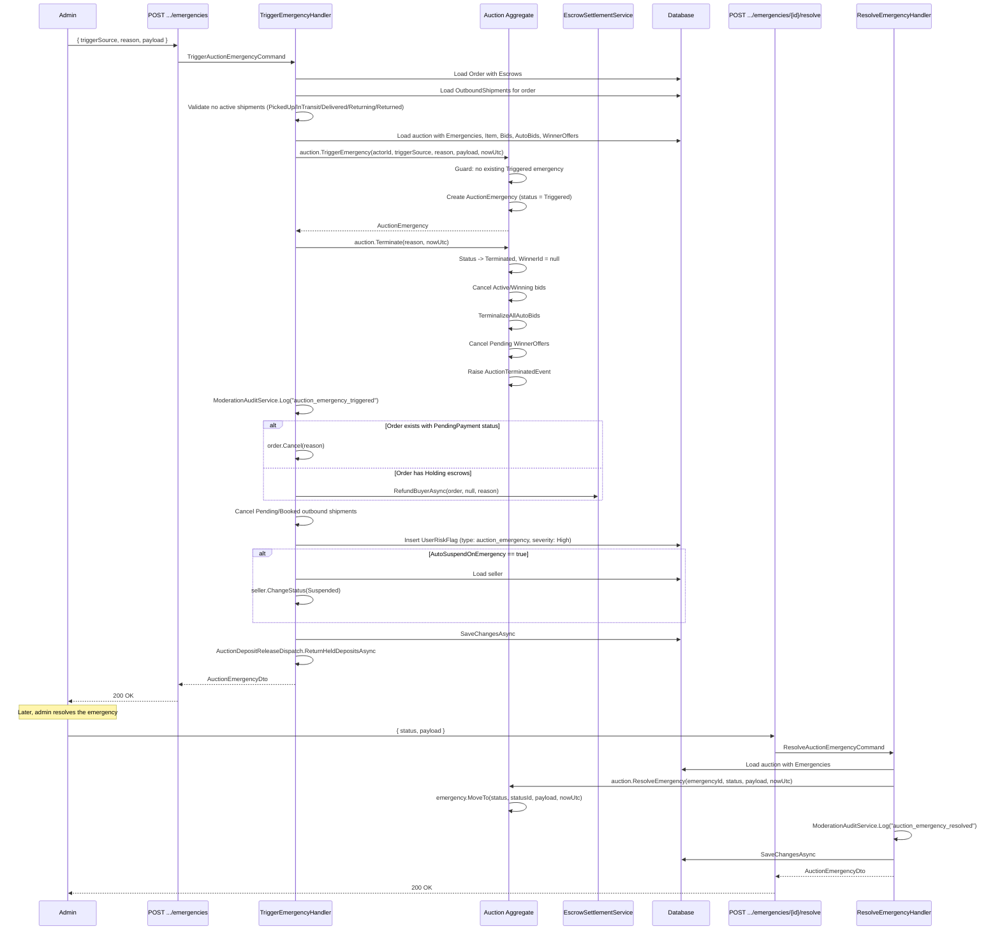

# 10 - Admin Operations

## Overview

Admins have four specialized operations on auctions:
1. **Set Curation** -- assign admin, adjust priority score, toggle featured status.
2. **Trigger Emergency** -- terminate auction, refund escrow, suspend seller, cancel pending shipments, create risk flag.
3. **Resolve Emergency** -- update the status of an existing emergency record.
4. **Reveal Sealed Bid** -- decrypt and reveal an individual sealed bid after auction ends.

---

## Emergency Flow



---

## Endpoints

| Operation | Method | URL | Permission | Response |
|---|---|---|---|---|
| Set Curation | `PUT` | `api/admin/auctions/{auctionId}/curation` | `Catalogs.Admin.ManageItems` | `200 OK` with `AuctionDto` |
| Trigger Emergency | `POST` | `api/admin/auctions/{auctionId}/emergencies` | `Catalogs.Admin.ManageItems` | `200 OK` with `AuctionEmergencyDto` |
| Resolve Emergency | `POST` | `api/admin/auctions/{auctionId}/emergencies/{emergencyId}/resolve` | `Catalogs.Admin.ManageItems` | `200 OK` with `AuctionEmergencyDto` |
| Reveal Sealed Bid | `POST` | `api/admin/auctions/{auctionId}/sealed-bids/{sealedBidId}/reveal` | `Catalogs.Admin.ManageItems` | `200 OK` with `SealedBidDto` |

---

## 1. Set Auction Curation

### Request Body

```json
{
  "assignedAdminId": "guid (optional)",
  "clearAssignedAdmin": false,
  "priority": 5.0,
  "priorityReason": "High-value item",
  "isFeatured": true
}
```

All fields are optional. Only provided fields are updated.

### Handler Logic

1. Load auction with `Item`.
2. Resolve `assignedAdminId`: if `ClearAssignedAdmin == true`, set to `null`; if `AssignedAdminId` provided, use it; otherwise keep existing.
3. Build `PriorityInfo` if `Priority` or `PriorityReason` is provided.
4. Call `auction.ApplyCuration(assignedAdminId, priority, isFeatured, nowUtc)`.

### Domain Logic: ApplyCuration()

**Blocked states:** `Failed`, `Sold`, `PaymentDefaulted`, `Cancelled`, `Terminated` -- returns `InvalidState` error.

Updates:
- `AssignedAdminId` and `AssignedAt` (set to `nowUtc` when assigning, `null` when clearing).
- `Priority` (PriorityInfo value object with `Score` and `Reason`).
- `IsFeatured` flag.

**Source:** `src/core/OIO.Application/Context/AuctionContext/Commands/SetAuctionCuration/SetAuctionCurationCommand.cs`

---

## 2. Trigger Auction Emergency

### Request Body

```json
{
  "triggerSource": "admin_panel",
  "reason": "Suspected counterfeit item",
  "payload": { "notes": "Buyer reported fake" }
}
```

### Handler Logic (TriggerAuctionEmergencyCommandHandler)

1. **Load related order** with `Escrows`.
2. **Load outbound shipments** for the order.
3. **Shipment guard**: If any shipment is `PickedUp`, `InTransit`, `Delivered`, `Returning`, or `Returned`, return `EmergencyBlockedByShipment` error. Use dispute flow instead.
4. **Load auction** with `Emergencies`, `Item`, `Bids`, `AutoBids`, `WinnerOffers`.
5. **Trigger emergency**: `auction.TriggerEmergency(currentUser.UserId, triggerSource, reason, payload, nowUtc)`.
   - Guard: No existing emergency with `Triggered` status.
   - Creates `AuctionEmergency` entity with `EmergencyStatus.Triggered`.
6. **Terminate auction**: `auction.Terminate(reason, nowUtc)`.
   - Status -> `Terminated`, `WinnerId = null`, `ActualEndTime = nowUtc`.
   - Cancel all `Active`/`Winning` bids.
   - Terminalize all auto-bids.
   - Cancel all `Pending` winner offers.
   - Raise `AuctionTerminatedEvent`.
7. **Audit log**: `ModerationAuditService.Log("auction_emergency_triggered")`.
8. **Handle order**:
   - If order status is `PendingPayment`: cancel the order.
   - If order has escrows with `Holding` status: refund buyer via `EscrowSettlementService.RefundBuyerAsync()`.
9. **Cancel shipments**: Cancel any `Pending` or `Booked` outbound shipments.
10. **Create risk flag**: Insert `UserRiskFlag` for the seller with `flagType = "auction_emergency"`, `severity = High`.
11. **Auto-suspend seller** (if `runtimeSettings.Ops.AutoSuspendOnEmergency == true`): Change seller status to `Suspended`.
12. **Save changes**.
13. **Release deposits**: `AuctionDepositReleaseDispatch.ReturnHeldDepositsAsync()` returns all held deposits for the auction.

**Source:** `src/core/OIO.Application/Context/AuctionContext/Commands/TriggerAuctionEmergency/TriggerAuctionEmergencyCommand.cs`

---

## 3. Resolve Auction Emergency

### Request Body

```json
{
  "status": "resolved",
  "payload": { "resolution": "Confirmed counterfeit, seller banned" }
}
```

### Valid Emergency Statuses

| Status | Description |
|---|---|
| `triggered` | Initial state when emergency is created. |
| `investigating` | Admin is investigating the issue. |
| `mitigated` | Temporary fix applied. |
| `resolved` | Emergency fully resolved. Sets `ResolvedAt`. |
| `dismissed` | Emergency dismissed (false alarm). Sets `ResolvedAt`. |

### Handler Logic

1. Load auction with `Emergencies`.
2. Parse and validate `status` against `EmergencyStatus.All`.
3. Call `auction.ResolveEmergency(emergencyId, status, payload, nowUtc)`.
   - Finds the emergency by ID.
   - Calls `emergency.MoveTo(status, statusId, payload, nowUtc)`.
   - Sets `ResolvedAt` if status is `Resolved` or `Dismissed`.
4. Audit log: `ModerationAuditService.Log("auction_emergency_resolved")`.
5. Save changes.

**Source:** `src/core/OIO.Application/Context/AuctionContext/Commands/ResolveAuctionEmergency/ResolveAuctionEmergencyCommand.cs`

---

## 4. Admin Reveal Sealed Bid

### Handler Logic (AdminRevealSealedBidCommandHandler)

1. Load auction with `SealedBids`.
2. Call `auction.RevealSealedBid(sealedBidId, currentUser.UserId, nowUtc)`.
   - Guard: `AuctionType == Sealed`.
   - Guard: Auction is not `Active` or has ended (`Info.HasEnded(nowUtc)`).
   - Find the sealed bid by ID.
   - Call `sealedBid.Reveal(actorId, nowUtc)`.
3. Save changes.
4. **At the endpoint level**: After saving, decrypt the `AmountEncrypted` field via `ISealedBidEncryptionService.Decrypt()` and attach `RevealedAmount` to the response DTO.

### Domain Logic: RevealSealedBid()

| Validation | Error |
|---|---|
| `AuctionType != Sealed` | `SealedBid.UnsupportedAuctionType` |
| Auction is still active and hasn't ended | `SealedBid.RevealNotAllowed` |
| Sealed bid not found | `SealedBid.NotFound` |

**Source:** `src/core/OIO.Application/Context/AuctionContext/Commands/AdminRevealSealedBid/AdminRevealSealedBidCommand.cs`
**Endpoint:** `src/presentation/OIO.Api/Endpoints/AuctionContext/Admins/RevealSealedBidEndpoint.cs`

---

## Error Codes

### Set Curation

| Code | Type | Message |
|---|---|---|
| `Auction.NotFound` | NotFound | Auction with Id '{id}' was not found. |
| `Auction.InvalidState` | Conflict | Cannot perform 'curate' when auction status is '{currentState}'. |

### Trigger Emergency

| Code | Type | Message |
|---|---|---|
| `Auction.NotFound` | NotFound | Auction with Id '{id}' was not found. |
| `Auction.EmergencyBlockedByShipment` | Conflict | Auction emergency cannot auto-terminate after shipment pickup. Use dispute flow instead. |
| `AuctionEmergency.AlreadyTriggered` | Conflict | Auction emergency is already active. |

### Resolve Emergency

| Code | Type | Message |
|---|---|---|
| `Auction.NotFound` | NotFound | Auction with Id '{id}' was not found. |
| `AuctionEmergency.NotFound` | NotFound | Auction emergency record was not found. |
| `AuctionEmergency.InvalidStatus` | Validation | Unsupported emergency status. |

### Reveal Sealed Bid

| Code | Type | Message |
|---|---|---|
| `Auction.NotFound` | NotFound | Auction with Id '{id}' was not found. |
| `SealedBid.UnsupportedAuctionType` | Conflict | Sealed bids are only supported for sealed-bid auctions. |
| `SealedBid.RevealNotAllowed` | Conflict | Sealed bid cannot be revealed before the auction has ended. |
| `SealedBid.NotFound` | NotFound | Sealed bid was not found. |

---

## Key Source Files

| File | Path |
|---|---|
| SetAuctionCurationCommand | `src/core/OIO.Application/Context/AuctionContext/Commands/SetAuctionCuration/SetAuctionCurationCommand.cs` |
| TriggerAuctionEmergencyCommand | `src/core/OIO.Application/Context/AuctionContext/Commands/TriggerAuctionEmergency/TriggerAuctionEmergencyCommand.cs` |
| ResolveAuctionEmergencyCommand | `src/core/OIO.Application/Context/AuctionContext/Commands/ResolveAuctionEmergency/ResolveAuctionEmergencyCommand.cs` |
| AdminRevealSealedBidCommand | `src/core/OIO.Application/Context/AuctionContext/Commands/AdminRevealSealedBid/AdminRevealSealedBidCommand.cs` |
| SetAuctionCurationEndpoint | `src/presentation/OIO.Api/Endpoints/AuctionContext/Admins/SetAuctionCurationEndpoint.cs` |
| TriggerAuctionEmergencyEndpoint | `src/presentation/OIO.Api/Endpoints/AuctionContext/Admins/TriggerAuctionEmergencyEndpoint.cs` |
| ResolveAuctionEmergencyEndpoint | `src/presentation/OIO.Api/Endpoints/AuctionContext/Admins/ResolveAuctionEmergencyEndpoint.cs` |
| RevealSealedBidEndpoint | `src/presentation/OIO.Api/Endpoints/AuctionContext/Admins/RevealSealedBidEndpoint.cs` |
| EmergencyStatus enum | `src/core/OIO.Domain/Context/AuctionContext/Enums/EmergencyStatus.cs` |
| Auction aggregate | `src/core/OIO.Domain/Context/AuctionContext/Aggregates/Auctions/Auction.cs` |
