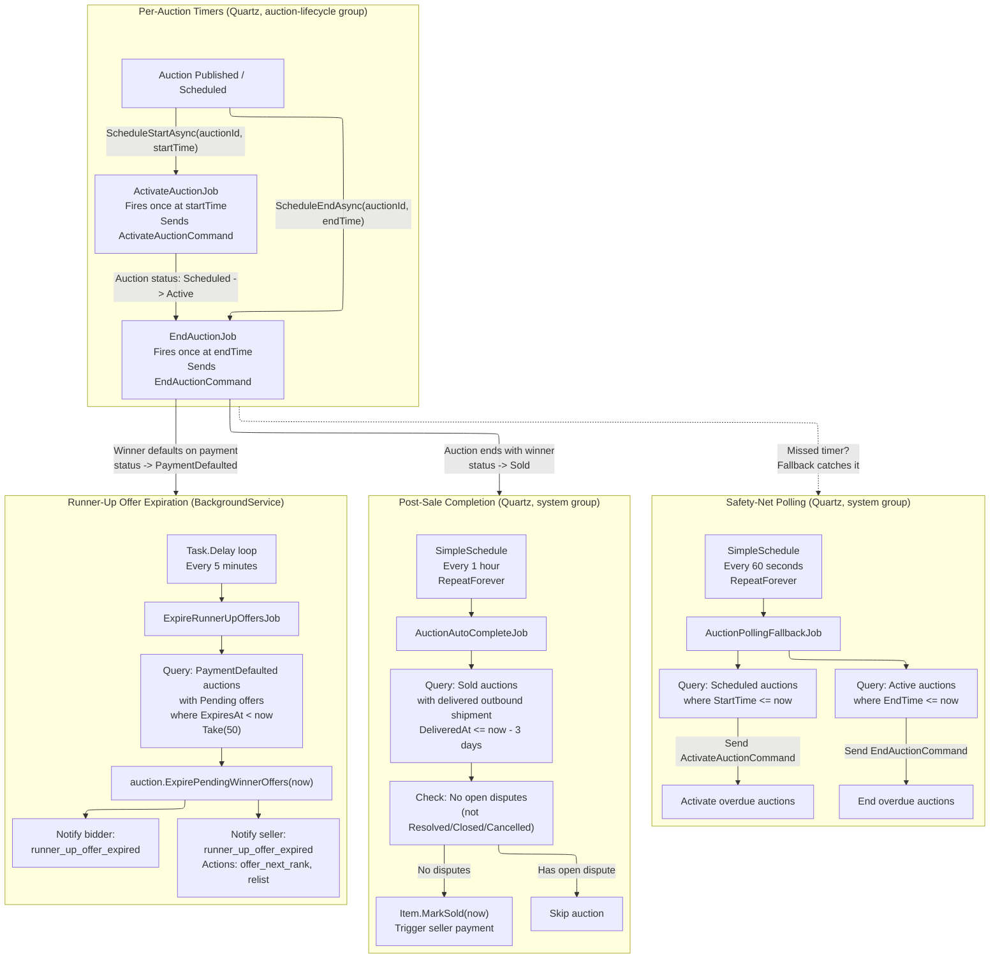

# 11 - Background Jobs

## Overview

The auction lifecycle relies on five background jobs that handle time-based state transitions,
safety-net polling, post-sale completion, and runner-up offer expiration.
Three are Quartz.NET scheduled jobs; one is a Quartz.NET polling job; one is a .NET `BackgroundService`.

---

## Job Summary

| Job | Type | Schedule | Group | Source |
|---|---|---|---|---|
| `ActivateAuctionJob` | Quartz per-auction timer | Fires once at `startTime` | `auction-lifecycle` | Scheduled by `QuartzAuctionScheduler.ScheduleStartAsync` |
| `EndAuctionJob` | Quartz per-auction timer | Fires once at `endTime` | `auction-lifecycle` | Scheduled by `QuartzAuctionScheduler.ScheduleEndAsync` |
| `AuctionPollingFallbackJob` | Quartz recurring | Every 60 seconds | `system` | Registered in `AuctionJobSetup` |
| `AuctionAutoCompleteJob` | Quartz recurring | Every 1 hour | `system` | Registered in `AuctionAutoCompleteJobSetup` |
| `ExpireRunnerUpOffersJob` | .NET `BackgroundService` | Every 5 minutes | N/A (hosted service) | Registered via `AddHostedService` |

---

## Flowchart

---

## Job Details

### 1. ActivateAuctionJob

- **File:** `src/infrastructure/OIO.Infrastructure/Scheduling/Jobs/Auctions/ActivateAuctionJob.cs`
- **Type:** Quartz `IJob`, `[DisallowConcurrentExecution]`
- **Group:** `auction-lifecycle`
- **Trigger:** One-shot timer scheduled by `QuartzAuctionScheduler.ScheduleStartAsync` when an auction is published/scheduled. Fires at the auction's `startTime`.
- **Behavior:** Reads `AuctionId` from `MergedJobDataMap`, sends `ActivateAuctionCommand` via MediatR. Logs error if the command fails.
- **Idempotent:** Yes -- if the auction is already active, the command is a no-op.
- **Misfire policy:** `WithMisfireHandlingInstructionFireNow` -- fires immediately if the scheduler was down at the scheduled time.

### 2. EndAuctionJob

- **File:** `src/infrastructure/OIO.Infrastructure/Scheduling/Jobs/Auctions/EndAuctionJob.cs`
- **Type:** Quartz `IJob`, `[DisallowConcurrentExecution]`
- **Group:** `auction-lifecycle`
- **Trigger:** One-shot timer scheduled by `QuartzAuctionScheduler.ScheduleEndAsync`. Fires at the auction's `endTime`. Can be rescheduled via `RescheduleEndAsync` (used by auto-extension / anti-sniping).
- **Behavior:** Reads `AuctionId` from `MergedJobDataMap`, sends `EndAuctionCommand` via MediatR.
- **Misfire policy:** `WithMisfireHandlingInstructionFireNow`.

### 3. AuctionPollingFallbackJob

- **File:** `src/infrastructure/OIO.Infrastructure/Scheduling/Jobs/Auctions/AuctionPollingFallbackJob.cs`
- **Type:** Quartz `IJob`, `[DisallowConcurrentExecution]`
- **Group:** `system`
- **Schedule:** `WithSimpleSchedule` every 60 seconds, `RepeatForever`, `WithMisfireHandlingInstructionFireNow`.
- **Purpose:** Safety net. In normal operation this job finds nothing to do. It catches auctions whose per-auction timers failed (timer loss, race condition, scheduler restart).
- **Behavior:**
  1. Queries `Scheduled` auctions where `StartTime <= now` and sends `ActivateAuctionCommand` for each.
  2. Queries `Active` auctions where `EndTime <= now` and sends `EndAuctionCommand` for each.
  3. Logs a warning with counts if any overdue auctions were processed.

### 4. AuctionAutoCompleteJob

- **File:** `src/infrastructure/OIO.Infrastructure/Scheduling/Jobs/AuctionAutoCompleteJob.cs`
- **Type:** Quartz `IJob`, `[DisallowConcurrentExecution]`
- **Group:** `system`
- **Schedule:** `WithSimpleSchedule` every 1 hour, `RepeatForever`, `WithMisfireHandlingInstructionFireNow`.
- **Purpose:** Automatically completes sold auctions after delivery confirmation + grace period.
- **Behavior:**
  1. Computes cutoff = `now - AutoCompleteDaysAfterDelivery` (3 days).
  2. Loads all `Sold` auctions (with `Item` included).
  3. For each, checks if an `OutboundShipment` exists with `Status == Delivered` and `DeliveredAt <= cutoff`.
  4. Checks no open `Dispute` exists (status not `Resolved`, `Closed`, or `Cancelled`).
  5. Calls `auction.Item.MarkSold(now)` and saves changes.

### 5. ExpireRunnerUpOffersJob

- **File:** `src/infrastructure/OIO.Infrastructure/Scheduling/Jobs/Auctions/ExpireRunnerUpOffersJob.cs`
- **Type:** .NET `BackgroundService` (hosted service)
- **Schedule:** `Task.Delay` loop every 5 minutes.
- **Purpose:** Expires pending runner-up winner offers that have passed their `ExpiresAt` deadline.
- **Behavior:**
  1. Queries up to 50 `PaymentDefaulted` auctions that have `Pending` winner offers with `ExpiresAt < now`.
  2. Calls `auction.ExpirePendingWinnerOffers(now)` on each.
  3. Sends `CreateNotificationCommand` to each expired bidder (`runner_up_offer_expired`).
  4. Sends `CreateNotificationCommand` to the seller with actionable buttons: "offer next rank" and "relist".

---

## Scheduling Infrastructure

### QuartzAuctionScheduler

- **File:** `src/infrastructure/OIO.Infrastructure/Scheduling/QuartzAuctionScheduler.cs`
- Implements `IAuctionScheduler` interface.
- Methods:
  - `ScheduleStartAsync(auctionId, startTime)` -- creates an `ActivateAuctionJob` one-shot trigger.
  - `ScheduleEndAsync(auctionId, endTime)` -- creates an `EndAuctionJob` one-shot trigger.
  - `RescheduleEndAsync(auctionId, newEndTime)` -- reschedules the end trigger (for auto-extension). Falls back to `ScheduleEndAsync` if the trigger does not exist.
  - `CancelAsync(auctionId)` -- deletes both start and end jobs (used on auction cancellation).
- All methods are idempotent: they delete existing jobs before re-scheduling.
- If `startTime` or `endTime` is in the past, the trigger fires 1 second from now.

### Job Constants

- **File:** `src/infrastructure/OIO.Infrastructure/Scheduling/JobConstants.cs`
- `SystemGroup = "system"` -- for recurring polling/batch jobs.
- `AuctionLifecycleGroup = "auction-lifecycle"` -- for per-auction one-shot timers.
