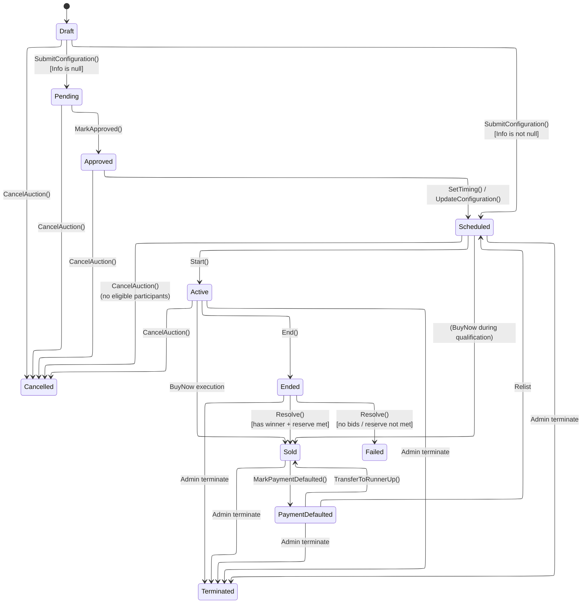
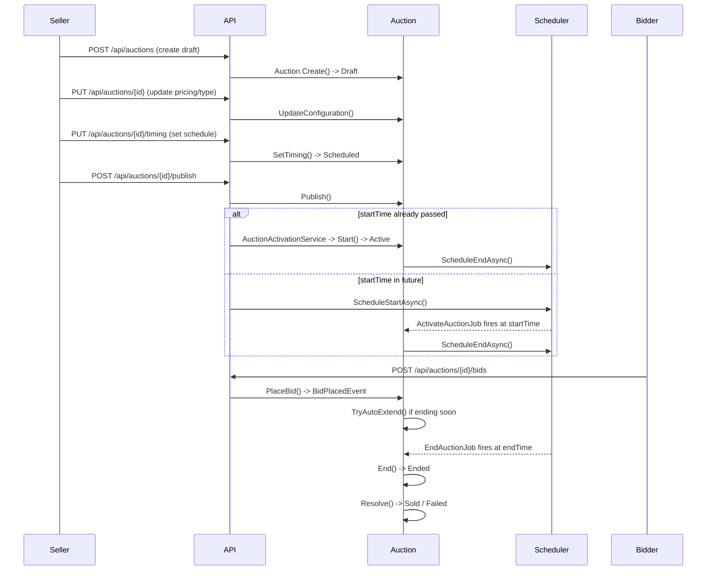

# 06 - Auction Lifecycle

## Module Overview

The Auction Lifecycle module governs every auction from initial **Draft** creation through to a terminal state (**Sold**, **Failed**, **PaymentDefaulted**, **Cancelled**, or **Terminated**). The `Auction` aggregate root (domain entity) encapsulates all state transitions, pricing, bidding, auto-extension, and resolution logic. Each status change is guarded by the `AuctionStatus.CanTransitionTo()` method.

**Source files:**

| Concern | Path |
|---|---|
| Aggregate root | `src/core/OIO.Domain/Context/AuctionContext/Aggregates/Auctions/Auction.cs` |
| Status enum | `src/core/OIO.Domain/Context/AuctionContext/Enums/AuctionStatus.cs` |
| Type enum | `src/core/OIO.Domain/Context/AuctionContext/Enums/AuctionType.cs` |
| Domain events | `src/core/OIO.Domain/Context/AuctionContext/Aggregates/Auctions/Events/AuctionEvents.cs` |
| Error catalog | `src/core/OIO.Domain/Context/AuctionContext/Errors/AuctionErrors.cs` |
| Config | `config/appsettings.Production.json` -- `Auction` section |

---

## Auction Status State Machine

Every legal transition is defined in `AuctionStatus.CanTransitionTo()`. The diagram below maps every `(source, target) => true` branch.

---

## End-to-End Lifecycle Sequence

---

## Endpoint Table

### Lifecycle Endpoints

| # | Method | URL | Command / Query | Description |
|---|--------|-----|-----------------|-------------|
| 1 | POST | `/api/auctions` | `CreateAuctionCommand` | Create auction + item in Draft |
| 2 | GET | `/api/auctions/{auctionId}` | `GetAuctionByIdQuery` | Get auction detail (public) |
| 3 | GET | `/api/auctions` | `GetAuctionsQuery` | List auctions (paginated, filterable) |
| 4 | GET | `/api/me/auctions` | `GetMyAuctionsQuery` | List seller's own auctions |
| 5 | PUT | `/api/auctions/{auctionId}` | `UpdateAuctionCommand` | Update pricing / type / timing (Draft/Scheduled) |
| 6 | PUT | `/api/auctions/{auctionId}/timing` | `SetAuctionTimingCommand` | Set timing on Approved auction -> Scheduled |
| 7 | POST | `/api/auctions/{auctionId}/submit` | `SubmitAuctionCommand` | Submit draft -> Approved or Scheduled |
| 8 | POST | `/api/auctions/{auctionId}/publish` | `PublishAuctionCommand` | Publish scheduled auction (schedule or immediate activate) |
| 9 | POST | `/api/auctions/{auctionId}/cancel` | `CancelAuctionCommand` | Cancel auction |
| 10 | POST | `/api/auctions/{auctionId}/close` | `EndAuctionCommand` | Manually close / end auction |
| 11 | POST | `/api/auctions/{auctionId}/relist` | `RelistAuctionCommand` | Relist from PaymentDefaulted |
| 12 | POST | `/api/auctions/{auctionId}/runner-up-offers` | `OfferRunnerUpCommand` | Offer to runner-up bidder |
| 13 | POST | `/api/auctions/{auctionId}/runner-up-offers/respond` | `RespondRunnerUpOfferCommand` | Accept/decline runner-up offer |
| 14 | PUT | `/api/auctions/{auctionId}/shipping` | `ChooseAuctionShippingCommand` | Choose shipping for auction |
| 15 | PUT | `/api/admin/auctions/{auctionId}/curation` | `SetAuctionCurationCommand` | Admin: assign admin, priority, featured |
| 16 | POST | `/api/admin/auctions/{auctionId}/emergencies` | `TriggerAuctionEmergencyCommand` | Admin: trigger emergency on auction |
| 17 | POST | `/api/admin/auctions/{auctionId}/emergencies/{emergencyId}/resolve` | `ResolveAuctionEmergencyCommand` | Admin: resolve emergency |

### Bidding Endpoints (reference)

| # | Method | URL | Command / Query | Description |
|---|--------|-----|-----------------|-------------|
| 18 | POST | `/api/auctions/{auctionId}/bids` | `PlaceBidCommand` | Place a bid (REST fallback; primary via SignalR) |
| 19 | POST | `/api/auctions/{auctionId}/buy-now` | `BuyNowCommand` | Buy-now reservation + purchase |
| 20 | POST | `/api/auctions/{auctionId}/sealed-bids` | `SubmitSealedBidCommand` | Submit sealed bid |
| 21 | PUT | `/api/auctions/{auctionId}/auto-bid` | `ConfigureAutoBidCommand` | Configure auto-bid |
| 22 | POST | `/api/auctions/{auctionId}/auto-bid/pause` | `PauseAutoBidCommand` | Pause auto-bid |
| 23 | POST | `/api/auctions/{auctionId}/auto-bid/resume` | `ResumeAutoBidCommand` | Resume auto-bid |
| 24 | GET | `/api/auctions/{auctionId}/auto-bid/my` | `GetMyAutoBidQuery` | Get my auto-bid config |
| 25 | GET | `/api/auctions/{auctionId}/bids` | `GetAuctionBidsQuery` | List bids for auction |
| 26 | POST | `/api/auctions/{auctionId}/watch` | `WatchAuctionCommand` | Watch auction |
| 27 | DELETE | `/api/auctions/{auctionId}/watch` | `UnwatchAuctionCommand` | Unwatch auction |

---

## Subflow Index

| # | File | Topic |
|---|------|-------|
| 0 | [README.md](./README.md) | This overview |
| 1 | [01-create-auction.md](./01-create-auction.md) | Create auction + read endpoints |
| 2 | [02-update-timing.md](./02-update-timing.md) | Update auction + set timing |
| 3 | [03-submit-publish.md](./03-submit-publish.md) | Submit + publish flow |
| 4 | [03a-auction-review.md](./03a-auction-review.md) | Item & auction review (admin + platform inspection) |
| 5 | [04-activation.md](./04-activation.md) | Scheduled -> Active activation |
| 6 | [05-auto-extension.md](./05-auto-extension.md) | Auto-extension on late bids |

---

## Configuration (`appsettings.Production.json` -> `Auction`)

| Key | Value | Description |
|-----|-------|-------------|
| `MaxExtensionsPerAuction` | `10` | Maximum number of auto-extensions per auction |
| `ExtensionThreshold` | `00:05:00` (5 min) | Bid placed within this window of EndTime triggers extension |
| `MaxDuration` | `30.00:00:00` (30 days) | Absolute maximum auction duration including extensions |
| `MinDuration` | `01:00:00` (1 hour) | Minimum allowed auction duration |
| `RunnerUpOfferExpirationHours` | `24` | Hours before a runner-up offer expires |

---

## Domain Events

All events are defined in `AuctionEvents.cs` as sealed records extending `DomainEvent`.

| Event | Raised When |
|-------|-------------|
| `AuctionCreatedEvent` | `Auction.Create()` -- new draft created |
| `AuctionSubmittedEvent` | `SubmitConfiguration()` -- draft submitted |
| `AuctionApprovedEvent` | `MarkApproved()` -- admin approves |
| `AuctionRejectedEvent` | `MarkRejected()` -- admin rejects |
| `AuctionScheduledEvent` | `SubmitConfiguration()` or `SetTiming()` -- timing set, status -> Scheduled |
| `AuctionStartedEvent` | `Start()` -- auction goes Active |
| `BidPlacedEvent` | `PlaceBid()` -- new bid recorded |
| `OutbidEvent` | `PlaceBid()` -- previous winning bidder is outbid |
| `AuctionExtendedEvent` | `TryAutoExtend()` -- auction end time extended |
| `AuctionEndedEvent` | `End()` -- auction transitions to Ended |
| `AuctionSoldEvent` | `Resolve()` or `TransferToRunnerUp()` -- auction sold |
| `AuctionFailedEvent` | `Resolve()` -- no bids or reserve not met |
| `AuctionCancelledEvent` | `CancelAuction()` -- seller or auto cancel |
| `AuctionTerminatedEvent` | Admin terminates auction |
| `AuctionPaymentDefaultedEvent` | Winner fails to pay |
| `AuctionRunnerUpOfferedEvent` | Runner-up offered win |
| `AuctionRunnerUpOfferRespondedEvent` | Runner-up accepts/declines |
| `AuctionRelistedEvent` | Relist from PaymentDefaulted |
| `BuyNowExecutedEvent` | Buy-now completed |
| `AuctionBuyNowReservedEvent` | Buy-now reservation created |
| `AuctionBuyNowReservationReleasedEvent` | Buy-now reservation released/expired |
| `AuctionAutoBidConfiguredEvent` | Auto-bid set up |
| `AuctionFeatureToggledEvent` | Featured flag toggled |
| `AuctionWatcherAddedEvent` | User watches auction |
| `AutoBidCascadeCappedEvent` | Auto-bid cascade hits safety cap |

---

## AuctionStatus Enum Values

Defined in `AuctionStatus.cs` as `EnumValueObject<AuctionStatus>`.

| Value | String ID | Description |
|-------|-----------|-------------|
| `Draft` | `draft` | Initial state after creation |
| `Pending` | `pending` | Submitted without timing (awaiting approval) |
| `Approved` | `approved` | Item/auction approved, awaiting timing |
| `Scheduled` | `scheduled` | Timing set, waiting for start time |
| `Active` | `active` | Auction is live, accepting bids |
| `Ended` | `ended` | Bidding closed, pending resolution |
| `Sold` | `sold` | Winner determined, payment expected |
| `Failed` | `failed` | No bids received or reserve not met |
| `PaymentDefaulted` | `payment_defaulted` | Winner failed to pay |
| `Cancelled` | `cancelled` | Cancelled by seller or system |
| `Terminated` | `terminated` | Admin-terminated |

**`AcceptsBids`**: Only `Active` status returns `true`.

---

## AuctionType Enum Values

Defined in `AuctionType.cs` as `EnumValueObject<AuctionType>`.

| Value | String ID | Description |
|-------|-----------|-------------|
| `Regular` | `regular` | Standard ascending-price auction with live bidding |
| `Sealed` | `sealed` | Sealed-bid auction -- no live bidding, no auto-extend |
