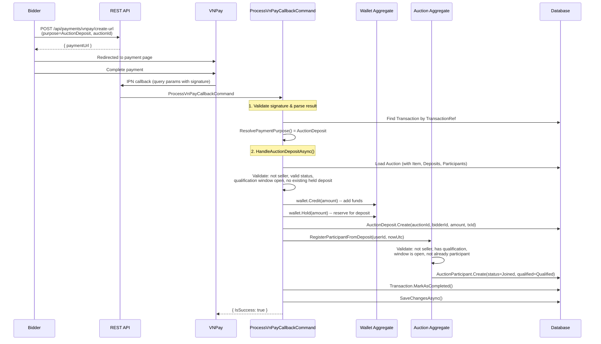

# 01 -- Deposit & Qualification

## Overview

Before a bidder can place bids on an auction, they must **qualify** by depositing funds during the **qualification window**. The deposit flow uses VNPay as the payment gateway, credits the user's wallet, places a hold on the deposited amount, and registers the user as a qualified participant.

## Qualification Window

Every auction with timing (`AuctionInfo`) has a mandatory `QualificationWindow` value object:

| Property | Type | Description |
|---|---|---|
| `QualificationWindow.StartTime` | `DateTime` | Earliest time deposits can be made |
| `QualificationWindow.EndTime` | `DateTime` | Latest time deposits can be made (must be before auction `StartTime`) |

**Constraints enforced by `AuctionInfo.Create()`:**

- `QualificationWindow` is required (returns `Auction.QualificationWindowRequired` if null)
- `Qualification.StartTime` must not be in the past
- `Qualification.StartTime` must be before auction `StartTime`
- `Qualification.EndTime` must not be in the past
- `Qualification.EndTime` must be before auction `StartTime`
- `Qualification.EndTime` must be after `Qualification.StartTime`

**Query helpers on `AuctionInfo`:**

- `HasQualification` -- returns `true` if `Qualification` is not null
- `IsQualificationOpen(nowUtc)` -- returns `true` when `nowUtc >= StartTime && nowUtc < EndTime`
- `IsQualificationClosed(nowUtc)` -- returns `true` when `nowUtc >= EndTime`

## VNPay Deposit Flow



## HandleAuctionDepositAsync -- Validation Steps

The `ProcessVnPayCallbackCommandHandler.HandleAuctionDepositAsync()` method performs these checks in order:

1. **AuctionId required** -- Transaction must have `AuctionId` set
2. **Auction exists** -- Loaded with `Item`, `Deposits`, `Participants` includes
3. **Not seller** -- `auction.Item.SellerId != transaction.UserId`
4. **Valid auction status** -- Must not be `Cancelled`, `Ended`, `Sold`, `Failed`, or `Terminated`
5. **Timing exists** -- `auction.Info` must not be null
6. **Has qualification** -- `auction.Info.HasQualification` must be true
7. **Window is open** -- `auction.Info.IsQualificationOpen(now)` must be true
8. **No duplicate deposit** -- No existing deposit with `BidderId == userId && IsHeld == true`

## RegisterParticipantFromDeposit

`Auction.RegisterParticipantFromDeposit(userId, nowUtc, roleInAuction)` in the domain:

1. Rejects if `userId == Item.SellerId` (error: `Auction.SelfBid`)
2. Rejects if `Info` is null (error: `Auction.TimingRequired`)
3. Rejects if qualification is not open (error: `Participant.JoinWindowClosed`)
4. Returns existing participant if already joined (not withdrawn)
5. Creates new `AuctionParticipant`:
   - `JoinStatus = Joined`
   - `QualificationStatus = Qualified`
   - `QualifiedAt = nowUtc`
   - `RoleInAuction = "bidder"`

## EnsureBidderEligible

When placing any bid (manual, auto-bid, or sealed), `Auction.EnsureBidderEligible(bidderId, nowUtc)` is called:

```
1. Find participant where UserId == bidderId
2. If participant is null OR not IsBidEligibleParticipant -> Participant.NotQualified
```

`IsBidEligibleParticipant(participant, nowUtc)` checks:

1. `participant.IsQualified` -- `JoinStatus == Joined && QualificationStatus == Qualified`
2. Has held deposit -- `_deposits.Any(d => d.BidderId == participant.UserId && d.IsHeld)`

Both conditions must be true. A bidder needs an active participant record **and** a held deposit.

## AuctionDeposit Entity

| Property | Type | Description |
|---|---|---|
| `AuctionId` | `AuctionId` | The auction this deposit is for |
| `BidderId` | `UserId` | The bidder who made the deposit |
| `Amount` | `Money` | Deposit amount |
| `TransactionId` | `TransactionId` | VNPay payment transaction reference |
| `IsHeld` | `bool` | Whether the deposit is currently active/held |

**Lifecycle:**

- **Created** -- `IsHeld = true` after successful VNPay callback
- **ConvertToPayment** -- When winner pays (deposit applied to order)
- **Released** -- When auction ends and bidder did not win (refunded to wallet)
- **Forfeited** -- When bidder violates rules (deposit confiscated)

## Error Codes

| Error Code | HTTP | Condition |
|---|---|---|
| `Auction.SelfBid` | 403 | Seller tried to deposit on own auction |
| `Auction.InvalidState` | 409 | Auction in terminal state |
| `Auction.TimingRequired` | 422 | Auction has no timing configuration |
| `Auction.QualificationWindowRequired` | 422 | No qualification window configured |
| `Participant.JoinWindowClosed` | 409 | Qualification window has ended |
| `AuctionDeposit.AlreadyHeld` | 409 | Bidder already has an active deposit |
| `Participant.NotQualified` | 403 | Bidder not qualified (no deposit or not joined) |
| `Wallet.NotFound` | 404 | User wallet does not exist |

## Cross-References

- **Flow 09 (Payment)** -- VNPay payment URL creation (`CreateVnPayPaymentUrlCommand`), callback processing (`ProcessVnPayCallbackCommand`)
- **Flow 06 (Auction Lifecycle)** -- Auction status transitions, qualification window validation during `AuctionInfo.Create()`
