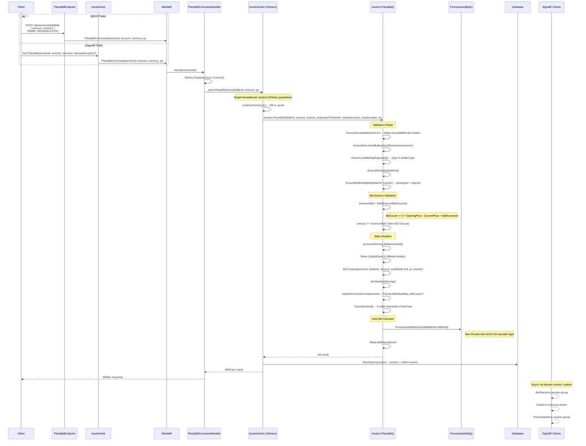

# 02 -- Manual Bid

## Overview

Manual bids can be placed through two paths: the **REST API** (`POST /api/auctions/{id}/bids`) and the **SignalR hub** (`hub.PlaceBid`). Both paths route through `PlaceBidCommand` which delegates to the Orleans `AuctionGrain.PlaceBidAsync()`. The grain loads the `Auction` aggregate and calls `Auction.PlaceBid()` which executes the full bidding cascade -- including auto-bid processing -- before persisting.

## PlaceBid Flow



## REST Endpoint

**`POST /api/auctions/{auctionId}/bids`**

- **Permission:** `auctions:bid`
- **Idempotency:** Requires `Idempotency-Key` header (`IdempotencyFilter<BidDto>`)
- **Request body:**

```json
{
  "amount": 5000000,
  "currency": "VND"
}
```

- **Response (201 Created):**

```json
{
  "id": "guid",
  "auctionId": "guid",
  "bidderId": "guid",
  "amount": { "amount": 5000000, "currency": "VND", "symbol": "..." },
  "isAutoBid": false,
  "status": "winning",
  "createdAt": "2026-03-20T10:00:00Z"
}
```

- **Error responses:** 400 (Bad Request), 409 (Conflict), 422 (Unprocessable Entity)

## SignalR Method

**`hub.PlaceBid(auctionId, amount, currency, idempotencyKey?)`**

- **Permission:** `auctions:bid` (via `[HasPermission]` attribute)
- **Returns:** `HubCommandResult<BidDto>` -- wraps the result or error for the caller

## Domain Logic: `Auction.PlaceBid()`

### Validation Checks (in order)

| # | Check | Error Code | Description |
|---|-------|------------|-------------|
| 1 | `EnsureAcceptsBids(nowUtc)` | `Auction.InvalidState` / `Auction.Expired` | Status must have `AcceptsBids = true`, auction must not have ended |
| 2 | `EnsureNotLockedByBuyNowReservation(nowUtc)` | `Auction.BuyNowReservationActive` | No active buy-now reservation can exist |
| 3 | `EnsureLiveBiddingSupported()` | `Bid.SealedAuctionOnly` | Sealed auctions reject live bids |
| 4 | `EnsureNotSeller(bidderId)` | `Auction.SelfBid` | Seller cannot bid on own auction |
| 5 | `EnsureBidderEligible(bidderId, nowUtc)` | `Participant.NotQualified` | Must have qualified participant record + held deposit |
| 6 | `amount >= GetMinimumBidAmount()` | `Bid.TooLow` | Bid must meet minimum |

### GetMinimumBidAmount()

```csharp
BidCount == 0
    ? Pricing.StartingPrice           // First bid: must be >= starting price
    : Pricing.NextMinimumBid          // CurrentPrice + BidIncrementAmount
```

### State Mutation Steps

1. **Mark previous winner as outbid** -- Find the current `Winning` bid, call `MarkAsOutbid()`, raise `OutbidEvent` if different bidder
2. **Create new bid** -- `Bid.Create(auctionId, bidderId, amount, autoBidId: null, ip, nowUtc)` with initial status `Active`, then `MarkAsWinning()`
3. **Update pricing** -- `UpdatePriceAndCount()` calls `Pricing.WithNewBid(amount)` to set `CurrentAmount`, increments `BidCount`, records `AuctionPriceHistory`
4. **Auto-extend check** -- `TryAutoExtend()` extends auction end time if:
   - `Info.AutoExtend` is true
   - `ExtensionCount < maxExtensions` (default: 10)
   - Remaining time is within `extensionThresholdMinutes` (default: 5 min)
   - New end time would not exceed `maxDuration`
   - Extension adds `ExtensionMinutes` (configured per auction) to `EndTime`
5. **Process auto-bids** -- `ProcessAutoBids(excludeBidderId)` triggers the auto-bid cascade (see [03-auto-bid.md](./03-auto-bid.md))
6. **Raise BidPlacedEvent** -- Contains `auctionId, bidId, bidderId, amount, previousHighestBid, isAutoBid=false, bidCount, bidTime`

## Bid Entity

| Property | Type | Description |
|---|---|---|
| `Id` | `BidId` | Unique identifier (Guid v7) |
| `AuctionId` | `AuctionId` | Parent auction |
| `BidderId` | `UserId` | User who placed the bid |
| `Amount` | `Money` | Bid amount + currency |
| `AutoBidId` | `AutoBidId?` | Null for manual bids, set for auto-bids |
| `IsAutoBid` | `bool` | `true` if placed by auto-bid system |
| `Status` | `BidStatus` | `active` / `winning` / `outbid` / `won` / `cancelled` |
| `IpAddress` | `IPAddress?` | Client IP for audit/fraud detection |
| `CreatedAt` | `DateTime` | Timestamp |

**Status transitions:**

- `Active` -> `Winning` (placed and leading)
- `Winning` -> `Outbid` (a higher bid was placed)
- `Winning` -> `Won` (auction resolved, this bid wins)
- `Winning` -> `Cancelled` (auction cancelled or bid cancelled by admin)
- `Active` -> `Cancelled` (auction cancelled)

## Invalid Bid Tracking

When a bid fails (validation error, business rule violation), `PlaceBidCommandHandler` tracks the attempt:

1. **Audit log** -- Creates `AuditLog` entry with action `"invalid_bid_attempt"` containing `auctionId, bidderId, ipAddress, amount, currency, errorCode, errorMessage`
2. **Burst detection** -- Checks if recent attempts within a **10-minute window** (`InvalidBidWindow`) exceed the configurable threshold:
   - Default threshold: **5** (`RuntimeSettings.Monitoring.InvalidBidBurstThreshold`)
   - Counts by `ActorUserId` OR matching `IpAddress` for the same `AuctionId`
3. **MonitoringAlert** -- If threshold exceeded and no open alert exists for this bidder/IP, creates a `MonitoringAlert` with:
   - `alertType = "invalid_bid_burst"`
   - `severity = High`
   - Payload includes `recentAttempts, threshold, windowMinutes, lastErrorCode`

## Error Codes

| Error Code | HTTP | Condition |
|---|---|---|
| `Auction.InvalidState` | 409 | Auction status does not accept bids |
| `Auction.Expired` | 422 | Auction period has ended |
| `Auction.BuyNowReservationActive` | 409 | Bidding blocked by active buy-now reservation |
| `Bid.SealedAuctionOnly` | 409 | Cannot place live bid on sealed auction |
| `Auction.SelfBid` | 403 | Seller attempted to bid on own auction |
| `Participant.NotQualified` | 403 | Bidder not qualified (no deposit or not joined) |
| `Bid.TooLow` | 422 | Bid amount below minimum required |

## Source Files

| File | Path |
|------|------|
| REST Endpoint | `src/presentation/OIO.Api/Endpoints/AuctionContext/Auctions/PlaceBidEndpoint.cs` |
| SignalR Hub | `src/presentation/OIO.Api/Hubs/AuctionHub.cs` |
| Command + Handler | `src/core/OIO.Application/Context/AuctionContext/Commands/PlaceBid/PlaceBidCommand.cs` |
| Orleans Grain | `src/infrastructure/OIO.Infrastructure/Grains/AuctionGrain.cs` |
| Domain Logic | `src/core/OIO.Domain/Context/AuctionContext/Aggregates/Auctions/Auction.cs` -- `PlaceBid()` |
| Bid Entity | `src/core/OIO.Domain/Context/AuctionContext/Aggregates/Auctions/Bid.cs` |
| BidDto | `src/core/OIO.Application/Context/AuctionContext/DTOs/BidDto.cs` |
