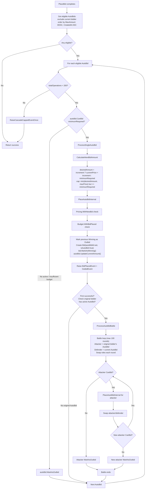
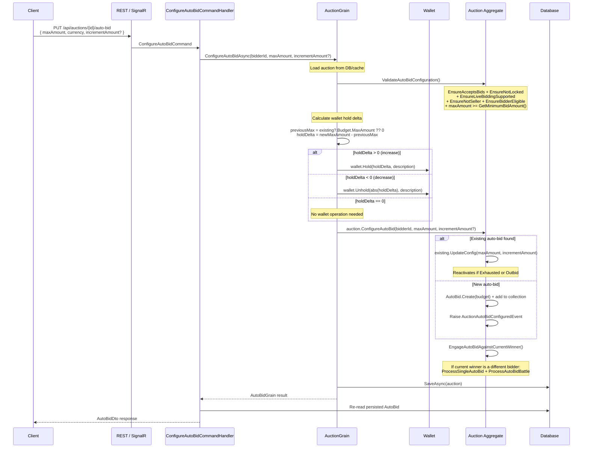

# 03 -- Auto-Bid

## Overview

Auto-bid allows a bidder to set a **maximum budget** and optionally an **increment preference**. The system automatically places bids on their behalf whenever they are outbid, up to their maximum amount. Auto-bids are configured per auction per bidder (unique constraint: `auction_id + bidder_id`).

Key wallet integration: when configuring an auto-bid, the **hold delta** (difference between new max and previous max) is applied to the bidder's wallet to reserve funds.

## Auto-Bid Cascade



## Configure Auto-Bid Flow



## REST Endpoints

### Configure Auto-Bid

**`PUT /api/auctions/{auctionId}/auto-bid`**

- **Permission:** `auctions:auto-bid`
- **Request:**

```json
{
  "maxAmount": 10000000,
  "currency": "VND",
  "incrementAmount": 500000
}
```

- **Response (200 OK):** `AutoBidDto`
- **Validation:** `maxAmount` > 0, `currency` in supported set, `incrementAmount` > 0 (if provided)

### Pause Auto-Bid

**`POST /api/auctions/{auctionId}/auto-bid/pause`**

- **Permission:** `auctions:auto-bid`
- **No request body**
- **Response:** 204 No Content
- **Domain behavior:** Sets `Status = Paused`, `IsEnabled = false`, `StopReason = "paused_by_user"`
- **Wallet hold is RETAINED** -- funds remain reserved so Resume can reactivate instantly

### Resume Auto-Bid

**`POST /api/auctions/{auctionId}/auto-bid/resume`**

- **Permission:** `auctions:auto-bid`
- **No request body**
- **Response:** 204 No Content
- **Domain behavior:**
  1. `EnsureAcceptsBids` + `EnsureNotLockedByBuyNowReservation` -- auction must still accept bids
  2. `autoBid.Resume()` -- Sets `Status = Active`, `IsEnabled = true`, clears stop reason
  3. `EngageAutoBidAgainstCurrentWinner()` -- Immediately competes against the current winning bid

### Get My Auto-Bid

**`GET /api/auctions/{auctionId}/auto-bid/my`**

- **Permission:** (authenticated)
- **Response (200 OK):** `AutoBidDto` or 404 if no auto-bid exists

## Wallet Hold Delta Calculation

The `AuctionGrain.ConfigureAutoBidAsync()` calculates the wallet hold delta before domain mutation:

```
previousMaxAmount = existing?.Budget.MaxAmount ?? 0
holdDelta = newMaxAmount - previousMaxAmount

if holdDelta > 0  -> wallet.Hold(holdDelta)       // reserve more funds
if holdDelta < 0  -> wallet.Unhold(abs(holdDelta)) // release excess
if holdDelta == 0 -> no wallet operation
```

**Error:** If `wallet.Hold()` fails (insufficient funds), returns `Wallet.HoldFailed` and the grain cache is discarded.

## AutoBid Entity

| Property | Type | Description |
|---|---|---|
| `Id` | `AutoBidId` | Unique identifier (Guid v7) |
| `AuctionId` | `AuctionId` | Parent auction |
| `BidderId` | `UserId` | Bidder who configured this auto-bid |
| `IsEnabled` | `bool` | Whether the auto-bid is currently active |
| `Budget` | `AutoBidBudget` | Encapsulates max, current, increment, reserved amounts |
| `Status` | `AutoBidStatus` | `active` / `paused` / `exhausted` / `won` / `outbid` |
| `TotalAutoBids` | `int` | Count of bids placed by this auto-bid |
| `LastAutoBidAt` | `DateTime?` | When the last auto-bid was placed |
| `StopReason` | `string?` | Why the auto-bid stopped (`paused_by_user`, `outbid`, `budget_exhausted`, `won`) |
| `StoppedAt` | `DateTime?` | When the auto-bid was stopped |
| `LastValidationAt` | `DateTime?` | Last time CanBid was evaluated |

## AutoBidBudget Value Object

| Property | Type | Description |
|---|---|---|
| `MaxAmount` | `decimal` | Maximum budget the bidder is willing to spend |
| `CurrentAmount` | `decimal` | Amount of the last bid placed by this auto-bid |
| `IncrementAmount` | `decimal?` | Preferred bid increment (null = use auction minimum) |
| `ReservedAmount` | `decimal` | Reserved for future use |
| `Currency` | `Currency` | Currency (inherited from auction) |

**Computed properties:**

- `Remaining` = `MaxAmount - CurrentAmount - ReservedAmount`
- `IsExhausted` = `CurrentAmount >= MaxAmount`

## CalculateNextBidAmount Logic

```
1. If increment preference is set:
     desiredAmount = currentPrice + incrementAmount
   Else:
     desiredAmount = minimumRequired (CurrentPrice + BidIncrement)

2. If desiredAmount < minimumRequired:
     desiredAmount = minimumRequired

3. If desiredAmount > maxPrice:
     desiredAmount = maxPrice  (cap to budget ceiling)

4. Return desiredAmount
```

## ProcessAutoBids Cascade

Called after every manual bid with `excludeBidderId` = the manual bidder:

1. **Get eligible auto-bids** -- Where `BidderId != excludeBidderId`, `IsEnabled = true`, `Status = Active`, ordered by `MaxAmount DESC`, then `CreatedAt ASC`
2. **For each eligible auto-bid:**
   - Check cascade cap (200 operations total)
   - Check `CanBid(minimumRequired)` -- if false, `MarkAsOutbid`
   - `ProcessSingleAutoBid()` -- calculate amount, `PlaceAutoBidInternal()`
   - If successful and first engagement, check if **original bidder** (the one who placed the manual bid) has an active auto-bid
   - If so, run `ProcessAutoBidBattle()` between the two auto-bids

## ProcessAutoBidBattle

Two auto-bids compete directly in alternating rounds (max 100 rounds per battle, overall cap 200 operations):

1. `autoBidB` (original bidder's auto-bid) starts as attacker
2. Attacker tries to outbid defender via `PlaceAutoBidInternal()`
3. Roles swap: defender becomes attacker
4. Continues until one auto-bid cannot meet `GetMinimumBidAmount()` -- that auto-bid is `MarkAsOutbid`

## AutoBidStatus Transitions

| From | To | Trigger |
|------|-----|---------|
| `active` | `paused` | `Pause()` by user |
| `active` | `exhausted` | `UpdateCurrentAmount()` when `Budget.IsExhausted` |
| `active` | `outbid` | `MarkAsOutbid()` -- cannot compete |
| `active` | `won` | `MarkAsWon()` -- auction resolved, this bidder wins |
| `paused` | `active` | `Resume()` by user |
| `exhausted` | `active` | `UpdateConfig()` with higher max |
| `outbid` | `active` | `UpdateConfig()` with higher max |

## AutoBidDto Response

```json
{
  "id": "guid",
  "auctionId": "guid",
  "bidderId": "guid",
  "isEnabled": true,
  "maxAmount": { "amount": 10000000, "currency": "VND", "symbol": "..." },
  "currentAmount": { "amount": 5500000, "currency": "VND", "symbol": "..." },
  "remainingBudget": { "amount": 4500000, "currency": "VND", "symbol": "..." },
  "incrementAmount": { "amount": 500000, "currency": "VND", "symbol": "..." },
  "status": "active",
  "totalAutoBids": 3,
  "lastAutoBidAt": "2026-03-20T10:05:00Z",
  "stopReason": null,
  "stoppedAt": null,
  "lastValidationAt": "2026-03-20T10:05:00Z",
  "createdAt": "2026-03-20T09:00:00Z"
}
```

## Error Codes

| Error Code | HTTP | Condition |
|---|---|---|
| `Auction.InvalidState` | 409 | Auction not in active state |
| `Auction.Expired` | 422 | Auction period ended |
| `Auction.BuyNowReservationActive` | 409 | Bidding blocked by buy-now reservation |
| `Bid.SealedAuctionOnly` | 409 | Cannot auto-bid on sealed auction |
| `Auction.SelfBid` | 403 | Seller attempted to auto-bid |
| `Participant.NotQualified` | 403 | Bidder not qualified |
| `AutoBid.IsDisabled` | 409 | Auto-bid is disabled (paused) and cannot be updated |
| `AutoBid.CannotModifyFinalStatus` | 409 | Auto-bid has Won status |
| `AutoBid.NewMaxLessThanCurrent` | 409 | New max is less than current spent amount |
| `AutoBid.CannotPause` | 422 | Auto-bid not in Active status |
| `AutoBid.CannotResume` | 422 | Auto-bid not in Paused status |
| `AutoBid.CannotBid` | 409 | Insufficient max amount or disabled |
| `Wallet.NotFound` | 404 | Wallet not found for hold operation |
| `Wallet.HoldFailed` | 409 | Insufficient wallet balance for hold |

## Source Files

| File | Path |
|------|------|
| REST Endpoint (Configure) | `src/presentation/OIO.Api/Endpoints/AuctionContext/Auctions/ConfigureAutoBidEndpoint.cs` |
| REST Endpoint (Pause) | `src/presentation/OIO.Api/Endpoints/AuctionContext/Auctions/PauseAutoBidEndpoint.cs` |
| REST Endpoint (Resume) | `src/presentation/OIO.Api/Endpoints/AuctionContext/Auctions/ResumeAutoBidEndpoint.cs` |
| REST Endpoint (Get My) | `src/presentation/OIO.Api/Endpoints/AuctionContext/Auctions/GetMyAutoBidEndpoint.cs` |
| Command + Handler | `src/core/OIO.Application/Context/AuctionContext/Commands/ConfigureAutoBid/ConfigureAutoBidCommand.cs` |
| Orleans Grain | `src/infrastructure/OIO.Infrastructure/Grains/AuctionGrain.cs` |
| Domain Logic | `src/core/OIO.Domain/Context/AuctionContext/Aggregates/Auctions/Auction.cs` -- `ConfigureAutoBid()`, `ProcessAutoBids()`, `ProcessAutoBidBattle()`, `PlaceAutoBidInternal()` |
| AutoBid Entity | `src/core/OIO.Domain/Context/AuctionContext/Aggregates/Auctions/AutoBid.cs` |
| AutoBidBudget VO | `src/core/OIO.Domain/Context/AuctionContext/ValueObjects/AutoBidBudget.cs` |
| AutoBidDto | `src/core/OIO.Application/Context/AuctionContext/DTOs/AutoBidDto.cs` |
