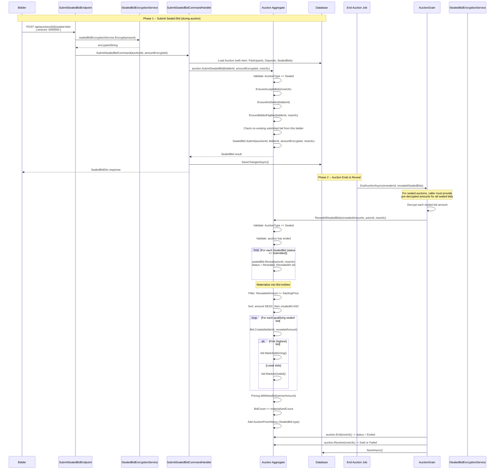

# 04 -- Sealed Bid

## Overview

Sealed-bid auctions (`AuctionType = "sealed"`) use an encrypted submission model: bidders submit their bids during the auction period without seeing other bids. When the auction ends, all sealed bids are revealed and decrypted, materialized into regular `Bid` entities, and the highest qualifying bid wins.

## Sealed Bid Lifecycle



## REST Endpoint

**`POST /api/auctions/{auctionId}/sealed-bids`**

- **Permission:** `auctions:bid`
- **Request body:**

```json
{
  "amount": 5000000
}
```

The endpoint encrypts the amount before passing it to the command:

```csharp
sealedBidEncryptionService.Encrypt(request.Amount)
```

- **Response (200 OK):**

```json
{
  "id": "guid",
  "auctionId": "guid",
  "bidderId": "guid",
  "amountEncrypted": "encrypted-string",
  "status": "submitted",
  "createdAt": "2026-03-20T10:00:00Z",
  "revealedAt": null,
  "revealedBy": null,
  "revealedAmount": null
}
```

## Domain Logic: `Auction.SubmitSealedBid()`

### Validation (in order)

| # | Check | Error Code | Description |
|---|-------|------------|-------------|
| 1 | `AuctionType == Sealed` | `SealedBid.UnsupportedAuctionType` | Only sealed auctions accept sealed bids |
| 2 | `EnsureAcceptsBids(nowUtc)` | `Auction.InvalidState` / `Auction.Expired` | Auction must be active and not ended |
| 3 | `EnsureNotSeller(bidderId)` | `Auction.SelfBid` | Seller cannot bid |
| 4 | `EnsureBidderEligible(bidderId, nowUtc)` | `Participant.NotQualified` | Must have deposit + qualified participant |
| 5 | No existing submitted bid | `SealedBid.AlreadySubmitted` | One sealed bid per bidder per auction |

### SealedBid Entity

| Property | Type | Description |
|---|---|---|
| `Id` | `SealedBidId` | Unique identifier (Guid v7) |
| `AuctionId` | `AuctionId` | Parent auction |
| `BidderId` | `UserId` | Bidder who submitted |
| `AmountEncrypted` | `string` | Encrypted bid amount |
| `Status` | `SealedBidStatus` | `submitted` / `revealed` / `invalidated` / `withdrawn` |
| `CreatedAt` | `DateTime` | Submission timestamp |
| `RevealedAt` | `DateTime?` | When the bid was revealed |
| `RevealedBy` | `UserId?` | Who triggered the reveal |

## Reveal at Auction End: `RevealAllSealedBids()`

When the auction ends, `AuctionGrain.EndAuctionAsync()` handles sealed auctions specially:

1. **Requires pre-decrypted amounts** -- The caller (background job) must decrypt all sealed bids using `ISealedBidEncryptionService.Decrypt()` and provide `RevealedSealedBidAmountGrain` collection
2. **Validation:** `AuctionType == Sealed`, auction must have ended
3. **Reveal all:** Each `SealedBid` with `Status == Submitted` gets `Reveal(actorId, nowUtc)` -> `Status = Revealed`
4. **Skip if bids already materialized** -- If `_bids.Count > 0`, returns early (idempotent)
5. **Materialize qualifying bids:**
   - Filter: `revealedAmount >= Pricing.StartingAmount` (bids below starting price are discarded)
   - Sort: `amount DESC`, then `createdAt ASC` (earliest bid wins ties)
   - Create `Bid` entity for each qualifying sealed bid
   - First (highest): `MarkAsWinning()`
   - Rest: `MarkAsOutbid()`
6. **Update pricing:** `Pricing.WithNewBid(winnerAmount)`, increment `BidCount`
7. **Record history:** `AuctionPriceHistory.CreateSealedBid()`

After reveal, the auction proceeds through the normal `End()` -> `Resolve()` flow.

## ISealedBidEncryptionService

```csharp
public interface ISealedBidEncryptionService
{
    string Encrypt(decimal amount);
    Result<decimal, Error> Decrypt(string encryptedAmount);
}
```

- **Encrypt** is called at the endpoint layer before the command is created -- the command only receives the encrypted string
- **Decrypt** is called by the end-auction background job to provide revealed amounts to `RevealAllSealedBids()`

## Comparison: Regular vs Sealed Auctions

| Feature | Regular (`regular`) | Sealed (`sealed`) |
|---------|--------------------|--------------------|
| **Live bids** | Yes -- `PlaceBid()` creates `Bid` immediately | No -- `EnsureLiveBiddingSupported()` rejects with `Bid.SealedAuctionOnly` |
| **Auto-bid** | Yes -- `ConfigureAutoBid()` + cascade | No -- `EnsureLiveBiddingSupported()` blocks during validation |
| **Bid visibility** | All bids visible in real-time | Bids hidden until auction ends |
| **Auto-extend** | Yes -- `TryAutoExtend()` triggered by late bids | No -- no live bids to trigger extension |
| **Bid submission** | `POST /api/auctions/{id}/bids` or SignalR `PlaceBid` | `POST /api/auctions/{id}/sealed-bids` (amount encrypted at endpoint) |
| **One bid per bidder** | No limit | One sealed bid per bidder (`AlreadySubmitted` error) |
| **Reveal timing** | Immediate (bids visible as placed) | At auction end only (`RevealAllSealedBids`) |
| **Winner determination** | Continuous -- current `Winning` bid | Batch -- highest revealed amount after end |
| **BuyNow** | Available if configured | Available if configured (qualification window, before auction starts) |

## SealedBidStatus Values

| Status | Description |
|--------|-------------|
| `submitted` | Bid submitted and encrypted, awaiting reveal |
| `revealed` | Bid revealed and amount decrypted after auction end |
| `invalidated` | Bid invalidated (admin action or decryption failure) |
| `withdrawn` | Bid withdrawn by bidder (if allowed) |

## SealedBidDto Response

```json
{
  "id": "guid",
  "auctionId": "guid",
  "bidderId": "guid",
  "amountEncrypted": "encrypted-string",
  "status": "submitted",
  "createdAt": "2026-03-20T10:00:00Z",
  "revealedAt": null,
  "revealedBy": null,
  "revealedAmount": null
}
```

After reveal:

```json
{
  "id": "guid",
  "auctionId": "guid",
  "bidderId": "guid",
  "amountEncrypted": "encrypted-string",
  "status": "revealed",
  "createdAt": "2026-03-20T10:00:00Z",
  "revealedAt": "2026-03-20T12:00:00Z",
  "revealedBy": "admin-guid-or-null",
  "revealedAmount": 5000000
}
```

## Error Codes

| Error Code | HTTP | Condition |
|---|---|---|
| `SealedBid.UnsupportedAuctionType` | 409 | Attempting sealed bid on non-sealed auction |
| `Auction.InvalidState` | 409 | Auction not in a state that accepts bids |
| `Auction.Expired` | 422 | Auction period has ended (cannot submit new sealed bids) |
| `Auction.SelfBid` | 403 | Seller attempted to submit sealed bid |
| `Participant.NotQualified` | 403 | Bidder not qualified (no deposit / not joined) |
| `SealedBid.AlreadySubmitted` | 409 | Bidder already has a submitted sealed bid |
| `SealedBid.RevealNotAllowed` | 409 | Attempted to reveal before auction has ended |
| `SealedBid.NotFound` | 404 | Sealed bid not found during reveal |
| `Bid.SealedAuctionOnly` | 409 | Attempted live bid on sealed auction |

## Source Files

| File | Path |
|------|------|
| REST Endpoint | `src/presentation/OIO.Api/Endpoints/AuctionContext/Auctions/SubmitSealedBidEndpoint.cs` |
| Command + Handler | `src/core/OIO.Application/Context/AuctionContext/Commands/SubmitSealedBid/SubmitSealedBidCommand.cs` |
| Encryption Service Interface | `src/core/OIO.Application/Context/AuctionContext/Services/ISealedBidEncryptionService.cs` |
| Domain Logic (Submit) | `src/core/OIO.Domain/Context/AuctionContext/Aggregates/Auctions/Auction.cs` -- `SubmitSealedBid()` |
| Domain Logic (Reveal) | `src/core/OIO.Domain/Context/AuctionContext/Aggregates/Auctions/Auction.cs` -- `RevealAllSealedBids()` |
| SealedBid Entity | `src/core/OIO.Domain/Context/AuctionContext/Aggregates/Auctions/SealedBid.cs` |
| SealedBidDto | `src/core/OIO.Application/Context/AuctionContext/DTOs/SealedBidDto.cs` |
| End Auction (Grain) | `src/infrastructure/OIO.Infrastructure/Grains/AuctionGrain.cs` -- `EndAuctionAsync()` |
