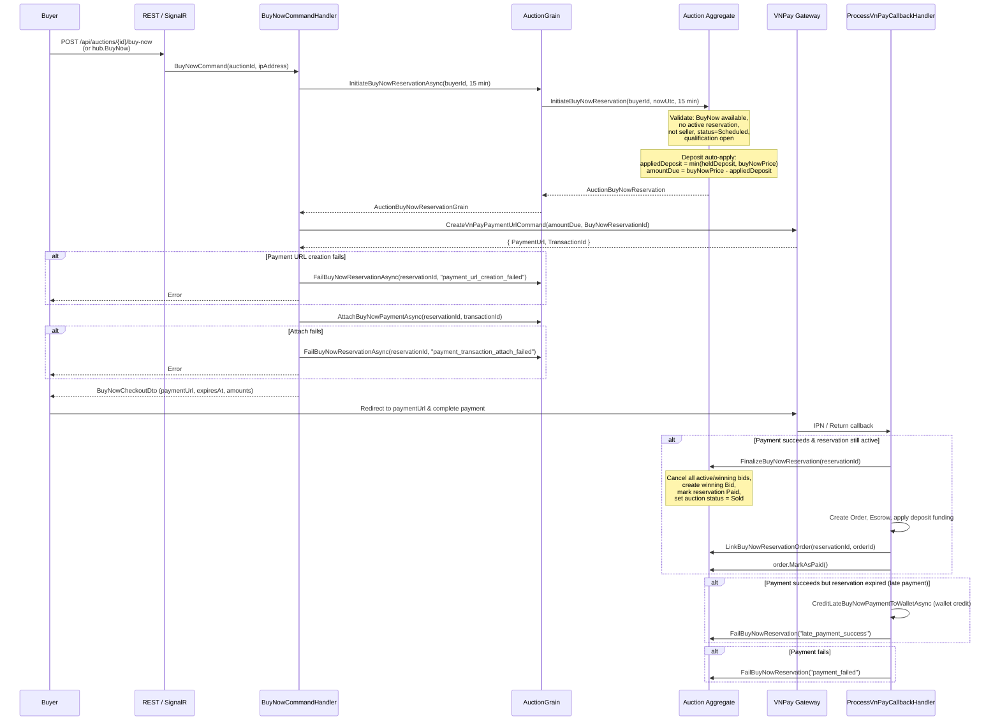
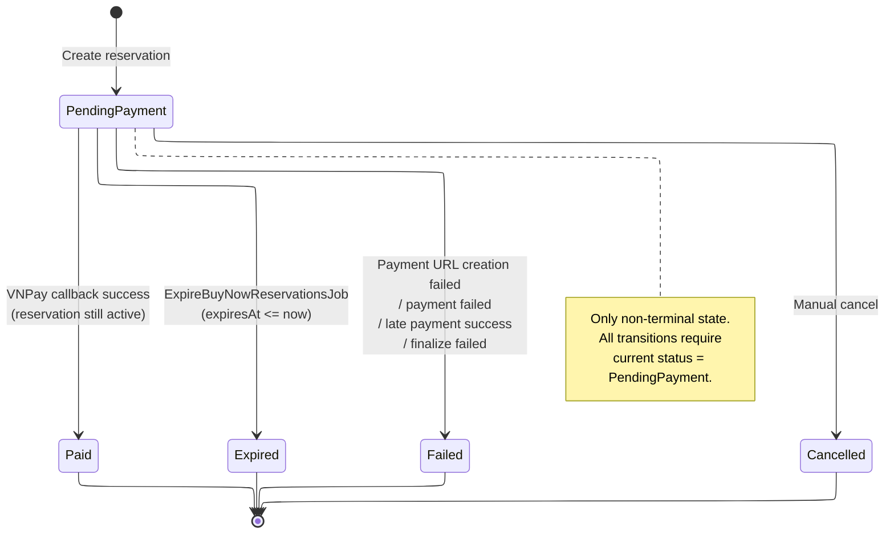

# Buy Now

## Overview

The Buy Now flow allows a qualified buyer to purchase an auction item immediately at a fixed
price, bypassing the competitive bidding process. It creates a time-limited **reservation**,
generates a VNPay payment URL, and -- upon successful payment callback -- finalises the
purchase by creating an order and marking the auction as **Sold**.

---

## Sequence: Reserve, Pay, Finalise



---

## BuyNowReservation State Machine



---

## Endpoints

### REST

| Method | Path | Auth | Idempotent | Success | Errors |
|--------|------|------|------------|---------|--------|
| `POST` | `/api/auctions/{auctionId}/buy-now` | `Auctions.BuyNow` permission | Yes (via `IdempotencyFilter`, cache key `buy-now:idempotency:{userId}:{auctionId}`) | `201 Created` | `400`, `409` |

### SignalR

| Method | Signature | Returns |
|--------|-----------|---------|
| `BuyNow` | `BuyNow(auctionId: Guid)` | `HubCommandResult<BuyNowCheckoutDto>` |

---

## Response: `BuyNowCheckoutDto`

```csharp
public sealed record BuyNowCheckoutDto(
    Guid ReservationId,
    string PaymentUrl,
    DateTime ExpiresAt,
    MoneyDto BuyNowPrice,
    MoneyDto DepositAppliedAmount,
    MoneyDto AmountDue);
```

| Field | Description |
|-------|-------------|
| `ReservationId` | Unique ID of the `AuctionBuyNowReservation` |
| `PaymentUrl` | VNPay redirect URL for the buyer |
| `ExpiresAt` | UTC timestamp when the reservation expires (now + 15 min) |
| `BuyNowPrice` | Full buy-now price of the auction |
| `DepositAppliedAmount` | Portion of the held deposit auto-applied: `min(heldDeposit, buyNowPrice)` |
| `AmountDue` | Amount the buyer must pay via VNPay gateway: `buyNowPrice - depositApplied` |

---

## 15-Minute Reservation Window

The `BuyNowCommandHandler` hard-codes the reservation window:

```csharp
private static readonly TimeSpan ReservationWindow = TimeSpan.FromMinutes(15);
```

The reservation is created with `ExpiresAt = nowUtc + 15 minutes`. During this window:

- **New bids are blocked.** `EnsureNotLockedByBuyNowReservation` returns
  `Auction.BuyNowReservationActive` if an active reservation exists.
- The buyer must complete VNPay payment before expiry.

---

## Deposit Auto-Apply

When initiating a buy-now reservation, the domain automatically applies the buyer's held
deposit toward the buy-now price:

```
heldDeposit   = deposits.FirstOrDefault(d => d.BidderId == buyerId && d.IsHeld)?.Amount ?? 0
appliedDeposit = min(heldDeposit.Amount, buyNowPrice.Amount)
amountDue      = buyNowPrice.Amount - appliedDeposit
```

The `AuctionBuyNowReservation.Create` factory validates:

```
depositAppliedAmount + gatewayAmountDue == buyNowPrice
```

If this invariant fails, the error `AuctionBuyNowReservation.InvalidFundingSplit` is returned.

---

## VNPay URL Creation

The handler sends a `CreateVnPayPaymentUrlCommand` with:

| Parameter | Value |
|-----------|-------|
| `Amount` | `reservation.GatewayAmountDue.Amount` |
| `Currency` | `reservation.GatewayAmountDue.Currency` |
| `Purpose` | `PaymentPurpose.AuctionBuyNow` |
| `IpAddress` | Caller IP from HTTP context |
| `Description` | `"AuctionBuyNow - Auction #{auctionId}"` |
| `AuctionId` | Auction ID |
| `BuyNowReservationId` | Reservation ID |

---

## Auction Lock During Reservation

While an `AuctionBuyNowReservation` with status `PendingPayment` and `ExpiresAt > now` exists,
the auction is **locked**:

- `PlaceBid` calls `EnsureNotLockedByBuyNowReservation` which checks
  `GetActiveBuyNowReservation(nowUtc)` and returns `Auction.BuyNowReservationActive` if a
  live reservation is found.
- `EndAuction` in the grain also checks `GetActiveBuyNowReservation` and skips ending if
  a reservation is active.

---

## ExpireBuyNowReservationsJob

| Property | Value |
|----------|-------|
| Type | `BackgroundService` |
| Interval | 1 minute (`TimeSpan.FromMinutes(1)`) |
| Batch size | 50 auctions per cycle (`.Take(50)`) |

**Logic per cycle:**

1. Query auctions with at least one `BuyNowReservation` where
   `Status == PendingPayment && ExpiresAt <= nowUtc`.
2. For each matching reservation, call `auction.ExpireBuyNowReservation(reservationId, nowUtc)`.
3. Save changes.
4. If the auction is still `Active`, its `EndTime` has passed, and no active reservation
   remains, send `EndAuctionCommand` to end the auction.

This ensures auctions whose end time elapsed during a reservation get properly closed once
the reservation expires.

---

## Late Payment Edge Case

If VNPay sends a success callback **after** the reservation has expired
(`!reservation.IsActive(now)`), the `ProcessVnPayCallbackHandler`:

1. **Credits** the payment amount to the buyer's wallet via
   `CreditLateBuyNowPaymentToWalletAsync`.
2. **Fails** the reservation with reason `"late_payment_success"`.
3. The auction remains unlocked and can proceed normally (e.g. end with a bidding winner).

The buyer receives a wallet credit instead of a completed purchase.

---

## Error Codes

| Code | HTTP | Description |
|------|------|-------------|
| `Auction.NotSupportBuyNow` | 409 | Auction does not have a buy-now price or it is unavailable |
| `Auction.BuyNowReservationActive` | 409 | Another buyer already has an active reservation |
| `Auction.SelfBid` | 403 | Seller cannot buy their own auction |
| `Auction.BuyNowUnavailableForScheduledAuction` | 409 | Buy now is only available during qualification window before auction starts |
| `Auction.TimingRequired` | 400 | Auction timing (start/end) not configured |
| `AuctionBuyNowReservation.InvalidFundingSplit` | 400 | Deposit + gateway amount does not equal buy-now price |
| `AuctionBuyNowReservation.InvalidExpiration` | 400 | Reservation expiration must be in the future |
| `AuctionBuyNowReservation.InvalidState` | 409 | Cannot perform action on reservation in current status |
| `AuctionBuyNowReservation.Expired` | 409 | Reservation has already expired |
| `AuctionBuyNowReservation.NotFound` | 404 | Reservation not found |
